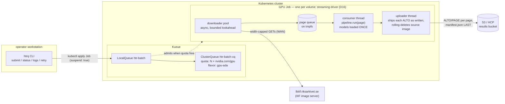
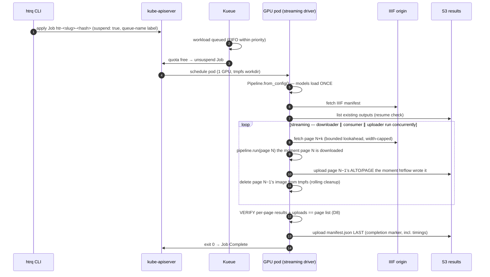
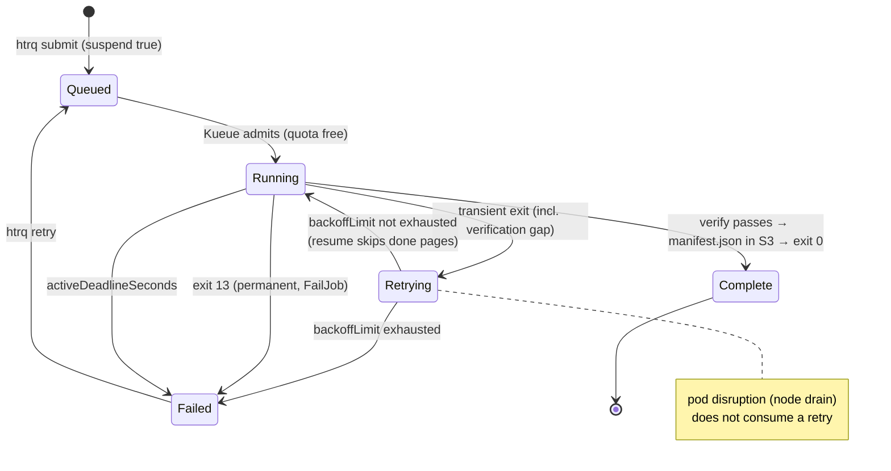
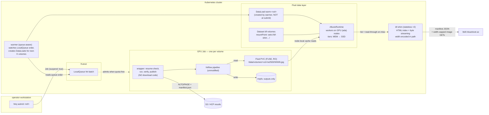
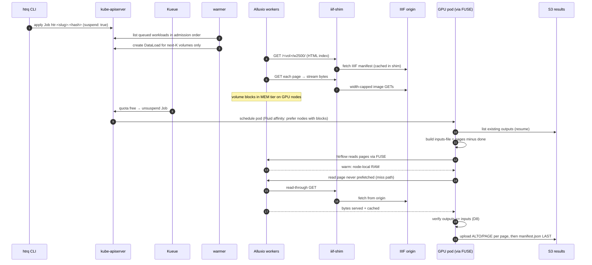

# HTRflow Kueue Batch System — Design (PoC)

**Status:** draft, under iteration
**Date:** 2026-07-27
**Structure:** two phases. **Phase 1 (the PoC): the simple design** — Kueue +
Jobs + a wrapper that fetches directly from IIIF. **Phase 2 (optimization,
evidence-gated): the cache/data layer** — built only if Phase 1's measurements
justify it (§11).

## Decision log

| # | Decision | Status |
|---|----------|--------|
| D1 | PoC to evaluate the approach (not yet a rask replacement) | settled |
| D2 | Approach A: thin `htrflow-batch` image + plain k8s Jobs + Kueue | settled |
| D3 | Work unit: **one archival volume = one Job** | settled |
| D4 | Phase 1 input: wrapper fetches **directly from IIIF** (async, width-capped) into a tmpfs workdir; instrumented so the idle numbers decide Phase 2 | settled |
| D4b | Cache/data layer (nginx proxy vs Fluid+shim) | **deferred to Phase 2**, evidence-gated (§11) |
| D5 | GPU pod workdir: tmpfs (`emptyDir: medium: Memory`), width cap + preflight guard | settled |
| D6 | Output: **S3 (HCP)** behind a swappable `publish()` seam; keys namespaced by pipeline id | recommended, confirm |
| D7 | Submission: **`htrq` CLI**, no in-cluster components | settled |
| D8 | Wrapper must **verify outputs against inputs** after htrflow runs — htrflow's exit code is not trustworthy (§2.1) | settled |
| D16 | Wrapper drives htrflow **as a library** — streaming producer–consumer: pages process as they download, ALTOs upload as they're written. Stock-CLI modes kept as fallbacks (§5.1) | settled |
| D17 | Pipelines are **immutable ConfigMaps, one per pipeline version** (`htr-pipeline-<id>`); a changed pipeline is a new id, enforced by the API server (§5.7) | settled |
| D18 | **No CRD, no controller, no API service in the PoC** — `htrq` CLI only. Frontend/API (§12.1) and campaign-CRD (§12.2) are designed evolution steps, not v1 | settled |
| D19 | Viewer = **Riksarkivet universalviewer4 fork** (already renders ALTO via canvas `seeAlso`); wrapper emits a per-volume IIIF P3 manifest `iiif.json` at publish; canvas dims = width-capped processing dims; results store serves CORS + correct content-types (§5.4, §12.1) | designed (separate session's recon), build pending |
| D9–D15 | Improvement items (resume, naming, provenance, …) | open — see §10 |

---

## 1. Goals and non-goals

### Goals

- Run HTRflow batch transcription of archival volumes on Kubernetes, using the
  **stock upstream htrflow image** as the base — upstream stays unmodified.
- **Kueue** owns queueing and GPU quota. No custom scheduler or orchestrator logic.
- Job status is the system of record. **No database.**
- Phase 1 measures its own overhead (fetch time vs GPU time) so Phase 2 is a
  data-driven decision, not an architectural enthusiasm.

### Non-goals (Phase 1)

- No cache/data layer (§11), no submitter API, no intra-volume sharding,
  no preemption/cohorts, no Prometheus metrics, no rask integration.

---

## 2. Context: what the htrflow image gives us

Analysis of `AI-Riksarkivet/htrflow` (v0.2.6):

- CUDA 12.1 runtime image (`docker/htrflow.dockerfile`, published to Docker Hub
  via manual workflow dispatch). Entry surface is the `htrflow` CLI — no server.
- One invocation = `htrflow pipeline <pipeline.yaml> <inputs...>` or
  `--inputs-file list.txt`. Strictly **file-in / file-out**: local image paths
  in, ALTO / PAGE XML / txt / JSON written to a local output dir. No S3/HTTP support.
- Pipeline YAML declares the steps: YOLO region segmentation → line
  segmentation → TrOCR recognition → reading order → export. Models are pulled
  from HF Hub at runtime (`HF_HOME`; private models need `HF_TOKEN`).
- Exports write **one output file per page**, and the Export step runs per
  document — ALTOs appear **incrementally during a run**, not in one dump at
  the end → per-page idempotency, resume, and streaming upload.
- `--inputs-file` lets the wrapper hand htrflow an explicit page list (resume).
- The **CLI** builds its full input list up front (every file must exist on
  disk before start) — but the underlying library loop consumes documents one
  by one. Only the CLI entry point blocks input streaming, which is what makes
  the D16 library driver possible without touching upstream.

### 2.1 Known upstream flaw the design must absorb

In `cli.py`, pages are submitted to a `ThreadPoolExecutor` and **the futures
are never collected** — a page that throws inside `pipeline.run` can vanish
without failing the process. **Exit 0 does not prove all pages were
transcribed.** Consequence (D8): the wrapper verifies per-page outputs against
the input list after every run, and only publishes the completion marker when
they match. Trusting the exit code could mark incomplete volumes Complete and
silently corrupt an archive-scale backfill.

The D16 library driver additionally fixes this **at the source**: the wrapper
calls `pipeline.run(document)` itself and holds each page's result/exception
directly instead of trusting a process exit code. The verification gate stays
anyway (belt and braces — it also catches upload gaps).

---

## 3. Phase 1 architecture



Four pieces, each boring on purpose:

| Piece | Owns | Explicitly does not own |
|---|---|---|
| **Kueue** | admission, GPU quota, queue order | anything about HTR or data |
| **k8s Job** | lifecycle: retries, deadlines, completion status | queueing (starts `suspend: true`) |
| **wrapper (streaming driver)** | I/O (IIIF in, S3 out), page queue, resume, **output verification**, provenance; drives htrflow in-process | HTR logic |
| **htrflow** | HTR | everything else — unmodified package, driven as a library |

---

## 4. Job lifecycle



---

## 5. Components

### 5.1 `htrflow-batch` image and wrapper

`FROM <registry>/htrflow:<tag>` (pinned by digest) + `batch_run.py`
(~250 lines) + `httpx`, `boto3`.

**The wrapper is a streaming driver (D16), not a CLI shell-out.** It imports
htrflow as a library — `Pipeline.from_config()` once at startup (models load
once) — then runs a producer–consumer pipeline with three concurrent roles:

| Role | What it does |
|---|---|
| **downloader pool** (async, 8–16 in flight, bounded lookahead ≤ `LOOKAHEAD_PAGES`) | fetches pages in manifest order into tmpfs; per-page retry with backoff; enqueues each page as it lands |
| **consumer** (single thread — the GPU serializes work anyway) | `pipeline.run(document)` per page, in order, the moment the page is available; holds each page's result/exception directly (fixes §2.1 at the source) |
| **uploader** | ships each ALTO/PAGE to S3 the moment htrflow writes it (deterministic keys, blind overwrite); rolling-deletes the source image once its page is done |

Net effect: GPU idle ≈ one page's download time; results stream into S3
progressively (a 6-hour volume shows live progress); tmpfs holds only the
lookahead window, never the whole volume.

Because the library API — unlike the CLI — is not a stability contract, the
image digest pin is load-bearing: the wrapper is validated against the exact
htrflow version in the image (§9 test 0). Fallback modes if the API proves
awkward at a version bump:

- **L1 — stock CLI + watcher-uploader:** download-all-then-run, uploader thread
  streams outputs as they're written. Streaming out only.
- **L2 — chunked CLI invocations:** ~100-page chunks, download chunk N+1 while
  chunk N processes; costs a model reload (~30–60 s GPU idle) per chunk.

Wrapper contract — env vars:

| Env | Meaning | Default |
|---|---|---|
| `VOLUME_REF` | archival reference code (S3 prefix, logging) | required |
| `IIIF_MANIFEST_URL` | manifest to process (resolved by CLI at submit time) | required |
| `PIPELINE_PATH` | pipeline YAML, mounted from the immutable per-version ConfigMap (§5.7) | required |
| `PIPELINE_ID` | short id namespacing the output keys (§5.4) | required |
| `S3_ENDPOINT` / `S3_BUCKET` / `S3_PREFIX` | result destination (creds from Secret) | required |
| `MAX_IMAGE_WIDTH` | IIIF size cap (`/full/{w},/`) — **enforced**, and part of the fetched URL, so cached/stored artifacts can never disagree with config (note: `!w,h` 501s on lbiiif) | 2500 |
| `RESUME` | skip pages whose outputs already exist | true |
| `LOOKAHEAD_PAGES` | max pages downloaded ahead of the consumer (bounds tmpfs) | 64 |
| `MAX_PAGES` | cap on pages processed, `0` = all (test knob) | 0 |
| `WORKDIR_PATH` | filesystem path for downloads + local pipeline outputs | /work |
| `DOWNLOAD_CONCURRENCY` | concurrent image downloads | 12 |
| `PUBLIC_RESULTS_BASE` | browser-reachable base URL for `iiif.json`/viewer links (≠ the in-cluster S3 endpoint) | required |
| `TERMINATION_LOG_PATH` | where the exit reason (stage, permanent/transient, error) is written | /dev/termination-log |

Stages around the streaming loop:

1. **setup** — fetch IIIF manifest, enumerate canvases → ordered page list,
   zero-padded filenames (empty/bad manifest → exit 13); start the downloader
   pool; **then** `Pipeline.from_config($PIPELINE_PATH)` — model load overlaps
   the first pages' downloads, so startup GPU-idle is
   `max(model_load, first_page_download)`, not the sum (§5.6).
2. **resume** — list existing per-page outputs in S3; drop done pages
   (`RESUME=false` forces full reprocessing). Skipped pages are never downloaded.
3. **streaming loop** — downloader ∥ consumer ∥ uploader as above; per-page
   failures (download after retries, or an exception from `pipeline.run`) are
   recorded, not fatal mid-loop — the loop drains what it can first.
4. **verify (D8)** — every page accounted for: a result held by the consumer
   AND its uploads confirmed. Any gap → transient exit (Job retry + resume
   converges); the missing-page list goes in the termination message.
5. **publish** — after a clean verify: `iiif.json` (viewer manifest, D19),
   then `manifest.json` **last** (still the sole completion marker). All
   uploads carry real content-types (`application/xml` for ALTO,
   `application/json` for manifests) — blind `put_object` defaults to
   octet-stream, which breaks browsers.

Exit codes:

| Code | Meaning | Job reaction |
|---|---|---|
| 0 | success (verified) | Complete |
| 13 | permanent (bad manifest URL, bad pipeline YAML, volume exceeds budget) | `FailJob` — no retry |
| other | transient (network, CUDA hiccup, verification gap) | retry within `backoffLimit` |

Failures write a structured reason to `/dev/termination-log`
(`{"stage": "fetch", "page": 412, "error": ...}`) so `htrq status` shows *why*
without log spelunking.

**Instrumentation for the Phase 2 gate:** `manifest.json` records `pages`,
`bytes_fetched`, `wall_seconds`, per-page timings, and — the key metric —
`gpu_stall_seconds`: total time the consumer sat waiting on an empty page
queue. Stall fraction = `gpu_stall_seconds / wall_seconds`, aggregated over
the first real campaign, decides whether Phase 2 exists (§11). With streaming,
expected stall ≈ first page's download + any moments IIIF falls behind the GPU.

### 5.2 Kueue topology

Namespace `htr-batch`. Standard three objects:

```yaml
apiVersion: kueue.x-k8s.io/v1beta2
kind: ResourceFlavor
metadata:
  name: gpu-ada
spec:
  nodeLabels:
    gpu-group: ada          # HTR owns ada; Gemma owns blackwell
---
apiVersion: kueue.x-k8s.io/v1beta2
kind: ClusterQueue
metadata:
  name: htr-batch-cq
spec:
  namespaceSelector: {}
  resourceGroups:
  - coveredResources: [cpu, memory, nvidia.com/gpu]
    flavors:
    - name: gpu-ada
      resources:
      - name: nvidia.com/gpu
        nominalQuota: 2       # tunable: max concurrent volumes
      - name: cpu
        nominalQuota: 8
      - name: memory
        nominalQuota: 32Gi    # 2 × 16 Gi pods — streaming keeps pods small
---
apiVersion: kueue.x-k8s.io/v1beta2
kind: LocalQueue
metadata:
  name: htr-batch
  namespace: htr-batch
spec:
  clusterQueue: htr-batch-cq
```

Jobs carry `kueue.x-k8s.io/queue-name: htr-batch`, start `suspend: true`;
Kueue unsuspends as quota frees. Submit 200 volumes → exactly N run, the rest
wait in FIFO order (`kubectl get workloads -n htr-batch`).

No preemption, no cohorts in Phase 1 — first knobs to turn when sharing with
other tenants.

### 5.3 Job template (one volume = one Job)

- Single container, `restartPolicy: Never`.
- Resources: 1 GPU, ~4 CPU, ~16 Gi memory (tmpfs counts against this — §6).
- `backoffLimit: 2`; `podFailurePolicy`: ignore pod **disruptions** (node drain
  doesn't burn a retry), `FailJob` on exit 13.
- `activeDeadlineSeconds: 21600` (6 h runaway guard),
  `ttlSecondsAfterFinished: 604800` (7 d — inspectable, then self-cleans).
- Labels `app=htrflow-batch`, `batch.htrflow/volume=<slug>`; full reference
  code in an annotation (reference codes aren't label-safe).
- Job name `htr-<slug>-<hash(ref + pipeline_id)>` — deterministic, so duplicate
  submission collides at the API server: **the cluster enforces idempotent
  submission, not CLI bookkeeping** (D10).
- Mounts: pipeline ConfigMap (immutable, per version — §5.7), S3 Secret,
  `HF_TOKEN` Secret, tmpfs workdir, model cache (§5.6).

### 5.4 Output store and completion contract

S3 (HCP) behind a one-function seam — `publish(volume, files)`:

- Key layout: `s3://$BUCKET/$PREFIX/<pipeline-id>/<volume-ref>/...` —
  **pipeline id in the key**, so reprocessing with a better model is a new
  namespace, never an overwrite of the previous campaign's results.
- Per-page keys, deterministic, blind overwrite → retries converge.
- `manifest.json` uploaded **last**; its presence *is* "volume complete"
  (for that pipeline id).
- Contents (D11): page count, canvas→page mapping with source IIIF URLs,
  pipeline YAML content + hash, htrflow version, batch image digest, HF model
  revisions resolved at runtime, `fetch_seconds`/`htr_seconds`/pages/sec.
  The pipeline YAML itself is uploaded alongside.
- NFS alternative: same contract via write-temp + atomic rename; swap the
  `publish()` implementation only.
- **Viewer manifest `iiif.json` (D19):** IIIF Presentation 3, one canvas per
  page — image service copied from the source lbiiif canvas (tiles keep coming
  from lbiiif; we serve no images), canvas width/height = the **width-capped
  dimensions actually processed** (read back from the ALTO `<Page>` — keeps
  the UV line overlays aligned without coordinate rewriting), and per-canvas
  `seeAlso: [{id: <public ALTO URL>, profile: ".../alto/ns-v4#"}]` — the exact
  shape the UV fork's TextRightPanel matches on. Needs env
  `PUBLIC_RESULTS_BASE` (browser-reachable URL base, ≠ the in-cluster S3
  endpoint). Written after verify, keyed under the same
  `<pipeline-id>/<volume-ref>/` prefix — reprocessed campaigns get their own
  viewer manifests.
- **Store requirements for the viewer:** anonymous read on the results
  prefix + CORS (GET from the viewer origin) — the browser fetches manifest
  and ALTO directly.
- The results bucket is the **only stateful dependency** in the system —
  and it should be the durable HCP, not the volatile `/tmp`-backed dev MinIO
  (viewer links must not die on reboot).
- Honest limit: with Job TTL at 7 d, long-term "what has been processed?" is
  answered by listing `manifest.json` keys in S3 — acceptable for the PoC,
  revisit if it becomes a frequent operational question.

### 5.5 `htrq` CLI

Small Python/Typer tool, no in-cluster components:

- `htrq submit <ref>...` — resolve reference code → IIIF manifest URL
  (Riksarkivet IIIF collection API), render Job from template, `kubectl apply`.
  Deterministic names make duplicates a clean API-server conflict; `--force` =
  delete-then-apply; `--priority` selects lane (D13); `--pipeline` selects the
  ConfigMap entry and sets `PIPELINE_ID`.
- `htrq submit --dry-run` — resolve manifest, print page count + estimated
  runtime + Job YAML without applying (D15).
- `htrq status [<ref>]` — queued (suspended) / running / succeeded / failed,
  with Kueue workload position and termination-log reasons.
- `htrq logs <ref>`, `htrq retry <ref>` — kubectl conveniences.
- `htrq report` — aggregate GPU stall fraction (`gpu_stall_seconds /
  wall_seconds`) and throughput across recent manifests: the Phase 2 evidence
  in one command.
- `htrq pipeline deploy <yaml>` — validate the pipeline (dry-run
  `Pipeline.from_config()` in the pinned image), create the immutable
  per-version ConfigMap (§5.7), and run the model warm-up Job (§5.6) — one
  command owns "a new pipeline exists".
- `htrq pipeline list` — the deployed pipeline ids (ConfigMap names).

### 5.6 Model handling

Two distinct per-Job costs — don't conflate them:

| Cost | When paid | Size |
|---|---|---|
| **download** (HF Hub → `HF_HOME`) | per Job **only if uncached** (`HF_HOME` is an emptyDir, dies with the pod) | ~2–4 GB, minutes of WAN while holding the GPU |
| **load** (`HF_HOME` → GPU) | per Job, always — `Pipeline.from_config()` instantiates step models eagerly (verified: `steps.py` builds models at construction; TrOCR `__init__` calls `from_pretrained`); every `pipeline.run(page)` reuses them | ~30–60 s, amortized to noise at volume granularity |

The streaming driver overlaps the load with the first pages' downloads (start
the downloader pool, *then* call `from_config()`), so startup GPU-idle is
`max(model_load, first_page_download)`, not the sum.

Cache options for the download cost:

1. **v1 (accepted):** no cache — every Job re-downloads. Fine for the
   acceptance tests; needs `HF_TOKEN` + HF egress in the NetworkPolicy.
2. **First optimization after v1, before any real campaign — pre-warmed PVC:**
   one-shot Job downloads the pipeline's models into a PVC; batch Jobs mount it
   read-only with `HF_HOME` pointed at it. Break-even math: 200 volumes × ~3 min
   GPU-held downloading ≈ 10 wasted GPU-hours per campaign vs a mount.
   Warm-up belongs to pipeline deployment (a future `htrq pipeline deploy`
   renders the ConfigMap *and* runs the warm-up Job).
3. **Bake into image (alternative):** hermetic, zero runtime HF dependency,
   image grows several GB. Reasonable if RWX/ROX PVCs are awkward.

(The container image itself — CUDA + torch, also multi-GB — is cached per node
by kubelet; only the first Job on a node pays that pull. It's specifically the
HF model cache that repeats per pod without a PVC.)

Wrapper only ever sees `HF_HOME`; the cache choice is a mount-point swap.

### 5.7 Pipeline configs (D17)

Pipeline YAMLs are upstream-format (any YAML the stock CLI accepts — steps,
model names, generation settings, Export steps pointing at `/work/outputs/…`).
How they travel from authoring to a result:

1. **Deploy:** one **immutable ConfigMap per pipeline version** —
   `htr-pipeline-trocr-base-hist-swe-v1` with `immutable: true`. The API server
   then *enforces* the rule that a changed pipeline is a new id: a deployed
   pipeline literally cannot be edited, only superseded by `-v2`. (Bonus:
   kubelet stops watching immutable ConfigMaps — cheaper at scale.)
2. **Select:** `htrq submit <ref> --pipeline trocr-base-hist-swe-v1` sets
   `PIPELINE_ID` (namespaces the S3 keys **and** is part of the Job-name hash,
   so the same volume under a different pipeline is a different Job, not a
   collision) and mounts that specific ConfigMap; `PIPELINE_PATH` points at the
   file inside it.
3. **Run:** wrapper calls `Pipeline.from_config($PIPELINE_PATH)` — to htrflow
   it's just a file.
4. **Provenance:** the wrapper embeds the YAML content + hash in
   `manifest.json` and uploads the YAML next to the results — every result
   stays explainable independent of cluster state.

**Deploy-time validation:** `htrq pipeline deploy <yaml>` (the same command
that runs the §5.6 model warm-up) first dry-runs `Pipeline.from_config()` in a
throwaway container of the pinned image — broken YAML or unresolvable models
fail at deploy time, not as exit-13 Jobs.

**Why not a `HtrPipeline` CRD:** the ConfigMap-per-version pattern is a
deliberate poor-man's CRD — it delivers the CR properties that matter here
(identity, API-server-enforced immutability, GitOps, kubectl UX) with zero
controllers. What it lacks vs a real CRD — admission-time schema validation,
a status subresource ("models warmed"), auto-warm-up on create — is covered
imperatively by `htrq pipeline deploy`. The maturity ladder: **v1** immutable
ConfigMaps + deploy-time validation → **v2** the API service (§12.1) lists and
validates pipelines, ConfigMaps still underneath → **v3** a real CRD only if
admission-time guarantees or a second machine consumer demand it (§12.2).

---

## 6. Memory budget (tmpfs is accounted memory)

tmpfs pages count against the container memory limit (cgroup), and overrun is
an **OOMKill**, not a polite eviction:

The D16 streaming loop makes the budget **independent of volume size**: tmpfs
holds at most the lookahead window (uploader rolling-deletes processed images).

| Item | Budget |
|---|---|
| torch + models resident | ~6–8 Gi |
| page images in flight (`LOOKAHEAD_PAGES=64` × ~2 MB @ width 2500) | ~128 Mi |
| outputs awaiting upload (XML) | noise |
| tmpfs `sizeLimit` | 2 Gi (generous) |
| pod memory request/limit | 16 Gi |

- Width capping is **mandatory, enforced by the wrapper** — uncapped 6000 px
  masters (~15–20 MB each) would still fit the window, but waste IIIF
  bandwidth and slow the fetch path for nothing HTR can use.
- A 1000-page volume can no longer OOMKill a pod — the old preflight
  size-guard reduces to sanity checks (non-empty manifest → else exit 13).
- `WORKDIR=disk` escape hatch retained but should never be needed now.

---

## 7. Failure handling and idempotency



Invariants:

- **Complete ⇔ verified ⇔ `manifest.json` exists** (per pipeline id). Exit code
  alone is never trusted (§2.1).
- Retries converge: per-page overwrite + resume → a retry of a long volume
  costs minutes, not hours.
- A page that can't be fetched or transcribed after retries **fails the whole
  Job** — archival completeness over partial results.
- Failed Jobs stay inspectable 7 days; reason surfaced via termination-log.

---

## 8. Security

- `runAsNonRoot`, `readOnlyRootFilesystem` (writes confined to workdir mounts).
- `automountServiceAccountToken: false` — job pods need zero k8s API access.
- NetworkPolicy: egress only to IIIF origin, S3 endpoint, HF Hub (drop HF if
  models are PVC'd/baked).
- Secrets: `htr-batch-s3`, `hf-token` — mounted, never in env dumps or logs.

---

## 9. Testing and acceptance

0. **Library-API pin test** — import `Pipeline.from_config` and run a 1-page
   fixture against the exact htrflow version in the pinned image; this is the
   canary that a version bump broke the D16 driver (fall back to L1/L2 if so).
1. **Wrapper unit tests** — manifest walking, filename ordering, resume-list
   diffing, **streaming loop** (consumer starvation accounting, per-page
   failure propagation, rolling delete, uploader ordering), **verification
   gate** (missing output ⇒ no manifest.json, transient exit), exit-code
   mapping; mocked HTTP + S3 (moto or throwaway MinIO).
2. **Container smoke** — `docker run` the batch image against a real 2-page
   manifest with a MinIO target; assert ALTO files + `manifest.json` land.
3. **Cluster acceptance** —
   a. 1 small volume end-to-end;
   b. ~10 volumes: never more than quota running, rest suspended, all
      eventually Complete, one `manifest.json` each;
   c. kill a running pod mid-volume: retry resumes, converges, no
      duplicate/corrupt outputs;
   d. `htrq report` produces the fetch-vs-HTR numbers (Phase 2 gate input).

---

## 10. Open items (discussion queue)

| # | Item | State |
|---|------|---|
| D6 | Output store: S3 (HCP) vs NFS | recommended S3, confirm |
| D9 | Resume-from-partial-results | designed into §5.1, confirm |
| D10 | Deterministic Job names as idempotency key | designed in, confirm |
| D11 | Provenance manifest contents | designed in, confirm |
| D12 | Structured failure via termination-log | designed in, confirm |
| D13 | Priority lanes (`htr-interactive` > `htr-bulk`) | proposed, confirm |
| D14 | Pod security + egress NetworkPolicy | proposed (§8), confirm |
| D15 | `htrq submit --dry-run` | proposed, confirm |
| — | Target cluster for the PoC | **unresolved** |
| — | Quota N, memory numbers, width default | placeholders, tune on cluster |

---

## 11. Phase 2 (optimization, evidence-gated): the cache/data layer

**Trigger:** build this only if Phase 1 numbers or operations demand it —
e.g. aggregate GPU stall fraction from `htrq report` exceeds ~10 %, or the IIIF
origin needs shielding from backfill load (repeat fetches on retries/re-runs).
Note that the D16 streaming driver already reduces expected stall to roughly
one page's download time per volume — so the remaining Phase 2 case rests
mostly on **IIIF shielding and repeat-fetch economics**, not GPU idle.
Until then it is documented, not built.

Two candidate shapes, both preserving the settled pattern (read-through, cache
never a correctness dependency):

### 11.1 Variant (a): nginx proxy_cache — minimal

One nginx Deployment, cache on a 24 Gi memory `emptyDir`, plus a warmer that
pre-GETs the next-K *queued* volumes (queue-aware by construction). Wrapper
change: `IIIF_BASE_URL` points at the proxy, direct-to-origin fallback kept.
Width stays in the URL → cache key and content can never disagree.

```nginx
proxy_cache_path /cache levels=1:2 keys_zone=iiif:64m
                 max_size=24g inactive=24h use_temp_path=off;
server {
  listen 8080;
  location / {
    proxy_pass https://lbiiif.riksarkivet.se;
    proxy_ssl_server_name on;
    proxy_cache iiif;
    proxy_cache_valid 200 7d;
    proxy_cache_lock on;            # collapses concurrent misses
    proxy_ignore_headers Cache-Control Expires;   # IIIF URLs immutable
    add_header X-Cache-Status $upstream_cache_status;
  }
}
```

### 11.2 Variant (c): Fluid + AlluxioRuntime + WebUFS index shim — maximal

The "GPU-pure" architecture. Detailed in full here (with the §11.2.6 critique
fixes already applied) so nothing is lost if Phase 2 lands on this variant.

#### 11.2.1 Verified facts this variant rests on

- Alluxio's **WebUFS** under-storage mounts plain HTTP/HTTPS sources; Fluid's
  own samples mount an HTTPS Apache mirror as a Dataset.
- WebUFS builds its namespace by **parsing Apache-style HTML directory index
  pages**: it recognizes directories via literal markers (page title starting
  `Index of ` / `Directory listing for `), skips `Parent Directory`/`..` links,
  and treats remaining links as files. Configurable knobs: connection timeout,
  `Last-Modified` date format, parent-link markers, directory-title markers.
  Read-only — which fits.
- IIIF exposes JSON manifests and parameterized image URLs
  (`/full/!2500,/0/default.jpg`) — no HTML index pages → **not directly
  mountable**. The gap is bridged by a small stateless **index shim** that
  makes IIIF look like an Apache directory server.

Sources: Fluid sample `accelerate_data_accessing.md` (WebUFS mount of an HTTPS
mirror), Alluxio WEB under-storage documentation, Fluid `data_warmup.md`
(DataLoad prefetch).

#### 11.2.2 Architecture



Ownership map:

| Piece | Owns | Explicitly does not own |
|---|---|---|
| **Kueue** | admission *when* (GPU quota, queue order) | data, placement details |
| **warmer** | queue-aware prefetch: DataLoads for next-K admissible volumes only | correctness (pure acceleration) |
| **Fluid/Alluxio** | data locality *where* (cache tiers, prefetch execution, placement affinity) | queueing, HTR |
| **index shim** | IIIF → filesystem translation (manifest → listing, URL → bytes, width cap) | caching (stateless), state |
| **k8s Job** | lifecycle: retries, deadlines, completion | queueing (starts suspended) |
| **wrapper** | resume-check, invoke htrflow, verify, publish | downloading (gone), HTR |
| **htrflow** | HTR | everything else — unmodified |

Kueue and Fluid compose without conflict: Kueue decides **when** a Job runs
(quota admission); Fluid's webhook injects node-affinity preferences deciding
**where** its pod lands (near cached blocks). Different layers.

**Read-through is the correctness backbone:** a page never prefetched is
fetched on first FUSE read via Alluxio → shim → IIIF. DataLoads are pure
acceleration; if the warmer never ran, Jobs are slower, not broken.

#### 11.2.3 Sequence (warm path + miss path)



#### 11.2.4 Component contracts

**Index shim** (stateless Deployment, 2 replicas behind a Service):

| Endpoint | Returns |
|---|---|
| `GET /<volume-ref>/w<width>/` | Apache-style HTML index built from the IIIF manifest: `<title>Index of /<volume-ref>/w<width>/</title>`, a `Parent Directory` link, one `<a href="NNNN.jpg">` per canvas in manifest order, zero-padded, `Last-Modified` in the date format WebUFS parses. **Width is in the path** so the Alluxio cache key can never disagree with the delivered resolution (fix #2) |
| `GET /<volume-ref>/w<width>/NNNN.jpg` | image bytes streamed from IIIF at `/full/!<width>,/0/default.jpg` |
| `HEAD /<volume-ref>/w<width>/NNNN.jpg` | file metadata for Alluxio — **the S2 spike question**, options below |
| `GET /_meta/<volume-ref>.json` | manifest-derived metadata (canvas→page mapping, source URLs) for the wrapper's provenance record; lives outside volume listings so htrflow never sees it as an input |
| `GET /` | minimal root listing. Preferred source: k8s API list of non-terminal `app=htrflow-batch` Jobs (requires RBAC + makes the shim less trivial — fix #5); alternative: lazy resolution of any `/<ref>/` path without a root index, if the spike shows Alluxio doesn't need root enumeration |

Shim behavior: IIIF manifests cached in-memory (LRU, minutes TTL) — hit once
per listing/warm, not per page. Proxies bytes itself rather than redirecting
(keeps WebUFS single-host, applies the width cap, controls headers). Config:
`IIIF_BASE`, allowed widths, manifest-resolution template. No disk, no state.

**The metadata problem (S2):** Alluxio wants file size and mtime at listing
time; IIIF derives images on demand (chunked responses, often no
`Content-Length` on HEAD). Options in order of preference:

1. **Stable fake sizes** — shim reports a constant plausible size; spike
   verifies Alluxio streams to actual EOF rather than truncating/padding.
2. **Size-on-first-touch** — shim fetches each derivative once and caches real
   sizes; per volume this is exactly the warm traffic, paid by the DataLoad,
   not the GPU.
3. Both fail → variant (c) falls; revert to (a).

**Fluid objects** (one Dataset + Runtime for the whole system; DataLoads per
volume, created by the warmer):

```yaml
apiVersion: data.fluid.io/v1alpha1
kind: Dataset
metadata:
  name: iiif-volumes
  namespace: htr-batch
spec:
  mounts:
    - name: volumes
      mountPoint: web://iiif-shim.htr-batch.svc:8080/
      # WebUFS parsing knobs (exact property keys pinned during the spike
      # against the deployed Alluxio version): connection timeout,
      # Last-Modified date format (must match shim output),
      # directory-title markers ("Index of "), parent-link markers
  accessModes: ["ReadOnlyMany"]
---
apiVersion: data.fluid.io/v1alpha1
kind: AlluxioRuntime
metadata:
  name: iiif-volumes
  namespace: htr-batch
spec:
  replicas: 2                    # workers co-located on the GPU (ada) nodes
  tieredstore:
    levels:
      - mediumtype: MEM
        path: /dev/shm
        quota: 12Gi              # per worker — same RAM the nginx variant
        high: "0.95"             # spends, relocated node-local to the GPUs
        low: "0.7"
      # optional SSD tier here is what makes cross-campaign reuse real (fix #7)
  properties:
    alluxio.user.file.metadata.sync.interval: "30s"   # late-submitted volumes
                                                      # appear without remount
---
# created by the WARMER for the next-K admissible volumes (fix #1 — never
# at submit time: 200 submits at once would thrash the LRU hours before
# their Jobs are admitted):
apiVersion: data.fluid.io/v1alpha1
kind: DataLoad
metadata:
  name: warm-<slug>
  namespace: htr-batch
  labels: { app: htrflow-batch, batch.htrflow/volume: <slug> }
spec:
  dataset: { name: iiif-volumes, namespace: htr-batch }
  target:
    - path: /volumes/<volume-ref>/w2500/
      replicas: 1
```

**Warmer** (small CPU Deployment, ~100 lines): lists suspended workloads in
LocalQueue admission order, maintains DataLoads for the next K≈3 volumes,
deletes DataLoads (and optionally frees cache paths) for Completed volumes.
Purely an accelerator: its death only makes Jobs colder.

**GPU Job changes vs Phase 1:** mounts the Dataset PVC read-only; wrapper input
dir = `/data/volumes/<vol>/w<width>/`; the fetch stage disappears (stages:
resume → run → verify → publish); resume uses htrflow's `--inputs-file` since
pages can't be deleted from a read-only PVC. Outputs still go to a small tmpfs.

#### 11.2.5 Memory relocation

| Item | Phase 1 (direct fetch) | Variant (c) |
|---|---|---|
| torch + models resident | ~6–8 Gi | ~6–8 Gi |
| page images | ~128 Mi tmpfs lookahead window (D16 streaming) | **0 — in Alluxio MEM tier on the node** |
| outputs (XML) | noise | noise (1 Gi tmpfs cap) |
| pod memory request | 16 Gi | **12 Gi** |
| node-level cache RAM | — | 2 × 12 Gi Alluxio workers |

Same total RAM, relocated: cache RAM serves FUSE reads at memory speed on the
GPU nodes, and pod OOM risk no longer scales with volume size — a giant volume
churns the LRU instead of OOMKilling a Job. Note: Alluxio worker RAM lives
**outside** the Kueue ClusterQueue quota (standing Deployment, not queued
workloads) — size node capacity accordingly.

#### 11.2.6 Failure modes and known issues (from design critique)

Additional failure rows vs Phase 1:

| Failure | Effect | Recovery |
|---|---|---|
| warmer down / behind | cold reads | read-through; slower, never broken |
| shim pod dies | cached pages still served; misses fail | 2 replicas; transient Job failures retry |
| FUSE mount wedges | reads hang/err in htrflow | Fluid FUSE auto-recovery; else pod fails → Job retry — see issue 4 |
| Alluxio evicts mid-job | next read is a miss | transparent read-through |
| Alluxio master down | ALL reads fail (cached or not) | issue 6 — single-master JVM SPOF; HA or accept |
| IIIF origin down | misses fail | Job retry; warm volumes unaffected |

Issues that remain open even with the fixes applied in this section:

1. ~~DataLoad-at-submit LRU thrash~~ → fixed: queue-aware warmer (11.2.4). Cost:
   the "Fluid deletes the warmer" claim was false — the warmer exists in both variants.
2. ~~Width missing from cache key~~ → fixed: width in the shim path.
3. **Content-Length behavior** — unresolved until the S2 spike runs.
4. **FUSE in the GPU critical path** — a stalled Alluxio read looks like a hung
   `imread`, and htrflow already has known thread-wedge failure modes; timeout
   ownership moves from wrapper (explicit, controlled) to a FUSE daemon (not
   ours). Mitigation to design if adopted: wrapper-side watchdog on output
   progress; `activeDeadlineSeconds` is a 6 h backstop, not an answer.
5. **Shim scope creep** — the k8s-API root listing needs RBAC/watches; "~100
   lines, stateless" is the floor, not the ceiling.
6. **Alluxio master SPOF** — single-master JVM; when down, every Job's reads
   fail. HA master or accepted risk.
7. **Cross-campaign reuse requires a persistent tier** — 24 Gi MEM cannot hold
   a corpus between campaigns months apart; repeat-read economics need an SSD
   tier sized to the corpus (or the staging-bucket variant (b)). Without it,
   variant (c)'s honest benefit is prefetch-ahead + node-locality only.

Security note: variant (c) tightens egress — GPU pods talk only to S3 (images
via local FUSE, models via PVC, zero WAN egress); the shim is the only
component talking to IIIF.

#### 11.2.7 Adoption spike (1–2 days, no GPU needed) — gates the variant

| # | Check | Pass criterion |
|---|---|---|
| S1 | WebUFS lists the shim's HTML index | `alluxio fs ls /volumes/<vol>/w2500/` shows all pages, correct names/order; exact WebUFS property keys pinned for the deployed Alluxio version |
| S2 | **Metadata/Content-Length behavior** | full read of every page byte-identical to direct IIIF fetch — fake-size tolerated, or size-on-first-touch implemented |
| S3 | DataLoad warm + read speed | DataLoad completes; test pod reads the volume from PVC at node-local speed (≥100 MB/s effective) |
| S4 | Late-submitted volume appears | new `/vol/` path visible via metadata sync within ~1 min, no remount |
| S5 | Failure sanity | kill shim mid-read: cached pages fine, misses surface as read errors (not hangs); FUSE recovers when shim returns |

Fail S2 → variant (c) falls; revert to (a) with no wrapper-design changes
(Phase 1 wrapper already has the download stage).

**Choosing between them:** (a) is ~1 % of the operational surface and solves
prefetch-ahead; (c) additionally gives node-local reads, declarative warming,
data-aware placement, and a reusable data layer for other pipelines — at the
cost of operating Fluid + Alluxio + shim. If Phase 1 shows idle is the problem,
start with (a); reach for (c) only if the data layer will be shared beyond this
system or IIIF load demands corpus-scale persistent caching.

## 12. Evolution path (beyond Phase 2)

### 12.1 Frontend + API (v2)

A frontend doesn't need a CRD — it needs an API backend. The natural stack:

```
frontend (submit + monitor UI)
        │ HTTP + auth (OIDC at the ingress)
htrq-api (thin, stateless — htrq's logic as a service)
        │                        │
   k8s API                      S3
   (create Jobs, read       (manifests = durable
   Job/Workload status)      history + live progress)
```

- **`htrq-api`** is `htrq` refactored, not replaced: render-and-apply becomes
  `POST /volumes`, status logic becomes `GET /volumes`. Stateless — cluster +
  S3 *are* the state, keeping the no-database principle.
- **Live per-volume progress is a free payoff of D16 streaming:** the uploader
  ships each ALTO as it's written, so `GET /volumes/{ref}` reports
  `pages_done / pages_total` by listing S3 keys — a progress bar per running
  volume with zero new plumbing.
- **History:** completed volumes survive Job TTL forever via `manifest.json`
  (per pipeline id). Gap: *failure* history past the 7-day TTL — v2 answer:
  lengthen TTL or have the API archive termination messages to S3; a real
  database only if failure analytics demand it.
- **Frontend v1 scope:** submit form (reference codes, pipeline dropdown =
  §5.7 ConfigMap list, priority), queue table (warming/queued/running/done/
  failed with termination-log reasons), volume detail with progress + links
  into the viewer (below). Before any of this exists, Kueue's dashboard
  (kueueviz) + `htrq` covers ops visibility.
- **Viewer (D19):** the Riksarkivet **universalviewer4 fork** is already an
  HTR viewer — TextRightPanel renders ALTO from canvas `seeAlso`, line
  overlays sync with the OpenSeadragon canvas, SearchLeftPanel auto-hides
  without a SearchService. Deploy = static build in an nginx pod (NodePort);
  one host page reads `#?manifest=<url>`, so one deployment serves every
  volume: `http://<node>:<port>/#?manifest=<PUBLIC_RESULTS_BASE>/<pipeline>/
  <volume>/iiif.json`. `htrq view <ref>` prints that URL. Optional later:
  IIIF Content Search 1.0 shim (could be backed by the rask lines FTS) to
  light up the search panel — 1–2 days, separate item.

### 12.2 CRD guidance (v3, only if demanded)

Decided **against** any CRD for the PoC (D18): everything a `Transcription` CR
would own is already owned by cheaper primitives (Kueue = queueing, Job =
lifecycle, deterministic names = idempotency, ConfigMaps = pipelines), and a
controller is a standing distributed-systems component added to a PoC.

If/when a second **machine** consumer (rask orchestrator, GitOps campaigns)
needs a declarative contract — the API service (§12.1) hides the switch:

- **CR per campaign, not per volume.** Archive scale means hundreds of
  thousands of volumes; that many CRs in etcd (~8 Gi practical ceiling,
  watch-cache pressure) is a known anti-pattern. The campaign CR's spec holds
  the volume list (or a pointer to it); status aggregates counts. Per-volume
  truth stays where it already is: `manifest.json` in S3.
- The reconciler creates exactly the Jobs specced in §5.3 — the Kueue layer
  and wrapper never change; `htrq`'s render logic becomes the controller's guts.
- Same ladder applies to pipelines (§5.7): a `HtrPipeline` CRD only for
  admission-time validation + auto-warm-up, and only at v3.

### 12.3 Other items

- **Intra-volume sharding** — Indexed Job / JobSet page ranges for
  latency-critical volumes; requires an assembly step (excluded now).
- **Small-volume batching** — the per-Job model load (~30–60 s) is noise for
  volumes of hundreds of pages but ~50 % overhead for a 10-page volume; if
  tiny volumes become common, `htrq` groups volumes under ~50 pages into one
  Job (one model load, N volumes through the resident pipeline, still one
  `manifest.json` each) — a relaxation of D3, not a redesign.
- **Cohorts/borrowing** — share idle blackwell capacity via Kueue cohorts once
  coordinated with the Gemma deployment.
- **rask integration** — the orchestrator submits via §12.1's API (or §12.2's
  campaign CR); wrapper and queueing unchanged.
- **Metrics** — Kueue ships Prometheus metrics; wrapper adds pages/sec to
  `manifest.json` today, a push gateway later if needed.
- **Upstream fix** — PR to htrflow collecting executor futures in `cli.py` so
  page failures propagate to the exit code (D16 sidesteps this in-process, but
  CLI-mode fallbacks L1/L2 and other users still benefit).

---

## 13. PoC test log — 2026-07-27, bare k3s on dmlpai01

Smoke test of the Phase 1 skeleton with a **miniature wrapper** (real page
downloads, simulated 20 s/page HTR, real S3). Manifests in `k8s/`
(`README.md` there has the replay steps).

**Environment:** bare k3s v1.36 (systemd), Kueue latest (note: `v1beta1`
deprecated → this doc's YAML updated to `v1beta2`), RustFS in-cluster as S3
(NodePort 30900 S3 / 30901 console), pages = Riksarkivet `htr_demo` HF-space
example images (IIIF ids guessed blind 400'd; real ids resolvable via the RA
API when needed — e.g. volume A0068065 verified working with `/full/300,/`;
`!w,h` size syntax returns 501 on lbiiif).

**Proven:**

| Design element | Result |
|---|---|
| Kueue gating (D2, §5.2) | 6 Jobs vs quota 2 → exactly 2 Running / 4 Suspended at all times; three clean FIFO waves; zero custom logic |
| Volume-per-Job lifecycle (D3, §5.3) | suspend→admit→Complete; Job status was the only tracking |
| Streaming per-page upload (D16) | ALTOs landed in S3 ~20 s apart *during* runs (object timestamps) |
| Resume after kill (§9.3c) | 4-page volume, pod force-killed after 2 pages: retry pod logged `resume: 2 pages already done`, processed only 3–4, manifest records `skipped/skipped/ok/ok` |
| Verify gate + completion contract (D8, §5.4) | `manifest.json` written last; no false-complete window across the kill; no duplicate/corrupt objects |
| Output layout (§5.4) | `demo-v0/<vol>/alto/NNNN.xml` + `manifest.json` with `wall_seconds`/`gpu_stall_seconds` |

**Follow-up same day — real htrflow image, CPU-only (`k8s/htr-real-test.yaml`):**
`airiksarkivet/htrflow:v0.2.6-35f48a7` pulled straight from Docker Hub by k3s
and ran **unmodified** under Kueue: models auto-downloaded from HF Hub into a
PVC (`HF_HOME` swap per §5.6), YOLO regions → lines → TrOCR
(`trocr-base-handwritten-hist-swe-2`) on 4 CPUs, 2 real pages (htr_demo
images) → valid ALTO 4.4, verify 2/2, Job Complete. Timing: 797 s HTR
(≈400 s/page on CPU — GPU expected ~2 orders faster), wall 13m22s incl. model
downloads. **Bonus finding for D11:** htrflow already embeds full provenance
in the ALTO `<Processing>` blocks — pipeline steps, model names AND resolved
HF model revisions (commit hashes) — so per-page provenance comes free; the
wrapper's `manifest.json` only needs the volume-level rollup.

**GPU rung (same day):** k3s auto-detected the NVIDIA runtime (RuntimeClass
`nvidia` pre-existing); device plugin v0.19.3 exposed `nvidia.com/gpu: 3`;
ClusterQueue gained a GPU quota. **Finding: the stock image cannot run on
Blackwell** — its torch supports ≤ sm_90, the RTX PRO 6000 is sm_120
(`cuda.is_available()` returns True, kernels then fail). Consequences:
(a) on dev-kuberay the stock image is ada-only, matching the gpu-ada flavor
assumption; (b) Blackwell support = the derived image's job — first real
content of the D2 `htrflow-batch` image is a torch/torchvision swap to cu128
wheels (`docker/htrflow-batch.dockerfile`).

**GPU end-to-end (same day): PASSED.** Derived image
(`docker/htrflow-batch.dockerfile` = stock + uv-installed torch 2.11 cu128)
served from an **in-cluster registry** (`k8s/registry.yaml`, NodePort 30500;
push via port-forward to 127.0.0.1:30500 — no docker daemon changes; pulls via
`/etc/rancher/k3s/registries.yaml` mirror mapping, one-time sudo). 7 GB image
pulled in ~40 s. All models on `cuda:0` (Blackwell sm_120): **2 pages in 19 s
(9.7 s/page) vs 399 s/page CPU — 41×**, whole run incl. model load 27 s,
verify 2/2. Image-iteration workflow from here: `docker build` + `docker push`
(only changed layers) — no sudo.

**D16 wrapper smoke — 2026-07-27 — PASSED on the third image (took 3
rounds).** Real `htrflow-batch` image against mocked IIIF (4 `htr_demo`
fixture pages served from a new anonymous-read `htr-fixtures` RustFS
bucket, no live lbiiif dependency — see `k8s/README.md`), Job
`htr-vol-301` (`k8s/job-real-wrapper.yaml` + `k8s/pipeline-demo-v1.yaml`).

- **Round 1 (`v1`) — blocked:** `driver.py::load_pipeline` called
  `Pipeline.from_config(pipeline_path)` with the raw path string instead
  of a parsed YAML dict → `TypeError: string indices must be integers`,
  exit 1. Fixed upstream as commit `7e7b30c` (version-tolerant
  `from_config` with a dict fallback).
- **Round 2 (`v2`) — blocked further in:** pipeline now loaded and GPU
  segmentation/TrOCR ran correctly, but `driver.py` appended the two
  `Export` steps onto `pipeline.steps` via `.append()` *after*
  `Pipeline.__init__` had already wired `parent_pipeline` on the
  constructor-supplied steps, so the appended `Export` steps kept the
  class-default `parent_pipeline = None` → `Export.run()`'s `metadata`
  came back `None` → `TypeError: 'NoneType' object is not iterable` in the
  ALTO/PAGE Jinja2 templates, verify gate correctly failed all 4 pages.
  Fixed upstream as commit `858b1d0` (Export steps now wired the same way
  YAML-built steps are).
- **Round 3 (`v3`) — PASSED end to end.** Job went `Running` → `Complete`
  in ~40s wall-clock (image already resident, no pull wait). Log:
  `4 pages in manifest` → `resume: 0 done, 4 to process` → YOLO
  regions/lines + TrOCR all on `cuda:0` → `COMPLETE 4 pages (4 processed)
  in 31.8s, viewer: http://10.16.51.53:30900/htr-results/demo-v1/mock-vol/iiif.json`.
  `manifest.json`: all 4 results `"status": "ok"` (per-page 2.45–14.4 s,
  the first page paying model-load cost), **`wall_seconds: 31.8`,
  `gpu_stall_seconds: 0.0`, `pages_per_second: 0.126`**,
  `bytes_fetched: 2953047`. `iiif.json` verified: `type: Manifest`, 4
  canvases, canvas 1 `seeAlso` ends `alto/0001.xml`, canvas 1 image body
  id starts with the `htr-fixtures` base (browser-viewable end to end, no
  image service → dims are the real fixture-image dims, 2864×2288 for
  page 1, not the 2000×3000 manifest placeholders or the 2500 width cap —
  confirming the no-image-service fallback path). `alto/0001.xml` served
  `200 application/xml`. **Resume-rerun:** deleted and reapplied the
  identical Job; logged `resume: 4 done, 0 to process`, completed in 8.3 s
  (`COMPLETE 4 pages (0 processed)`, dominated by model-import overhead
  since nothing was actually processed), `manifest.json` on the rerun
  shows all 4 pages `"status": "skipped"`, `bytes_fetched: 0` — idempotent
  re-run confirmed.

**Takeaway:** both round-1/2 bugs were in `driver.py`'s hand-rolled
pipeline construction (config parsing, then post-construction step
wiring) rather than in htrflow itself or in the mocked fixtures/pipeline
YAML — neither was caught by unit tests because `driver.py` keeps all
htrflow imports function-local so the wrapper can import cleanly without
torch, meaning `load_pipeline`'s actual behavior against the real
`htrflow.pipeline.pipeline.Pipeline` was previously untested. Both are now
fixed and this smoke test is the first real coverage of that path.

**Not yet tested:** the D16 library-driver wrapper's Kueue-contention
behavior under >1 concurrent Job on GPU (single-Job smoke only), the
`htrq` CLI, priority lanes (D13), NetworkPolicy (D14) — remain §10 opens.

**Host gotchas fixed en route** (persisted; also in memory notes):
`fs.inotify.max_user_instances=128` was exhausted by root's services → kubelet
silently never registered the node (`/etc/sysctl.d/99-k3s-inotify.conf` now
sets 1024/1048576); `dmlpai01` resolves IPv6-only → `node-ip: 10.16.51.53`
pinned in `/etc/rancher/k3s/config.yaml`.
