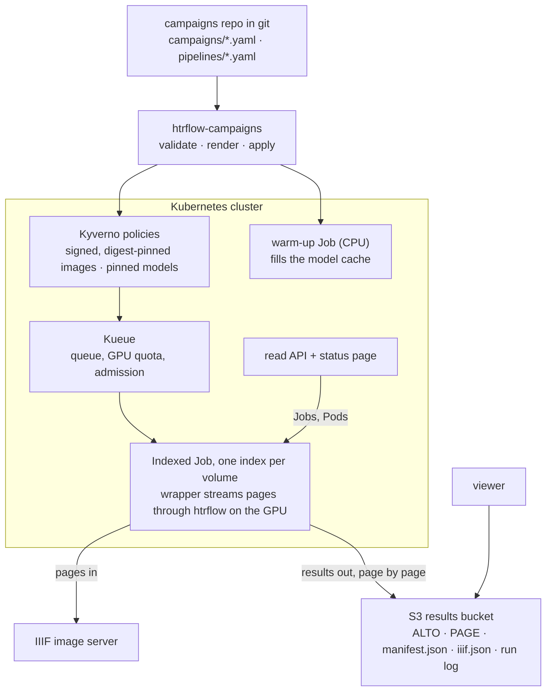
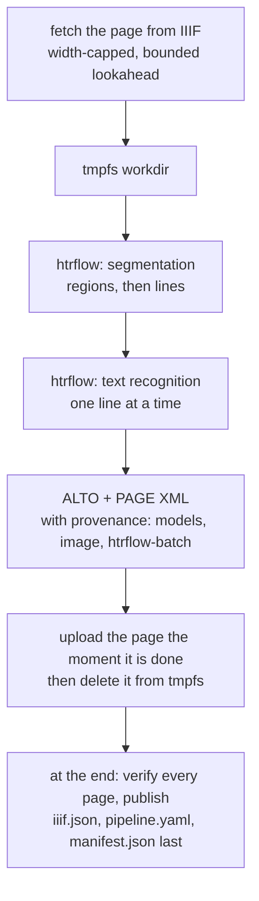

# htrflow-batch

[](https://github.com/AI-Riksarkivet/htrflow-batch/actions/workflows/ci.yml)
[](https://ai-riksarkivet.github.io/htrflow-batch/)
[](https://github.com/AI-Riksarkivet/htrflow-batch/actions/workflows/publish.yml)
[](https://hub.docker.com/r/riksarkivet/htrflow-batch)
[](pyproject.toml)
[](LICENSE)
[](https://github.com/astral-sh/ruff)
[](https://github.com/astral-sh/uv)
[](https://github.com/AI-Riksarkivet/htrflow)

[](.github/actions/sign-attest/action.yml)
[](.github/actions/sign-attest/action.yml)
[](.github/actions/sign-attest/action.yml)

> **Not for use yet.** This repository is under active development and is
> not ready for others to run: interfaces, chart values and the campaigns
> format still change without notice. Watch the releases. This notice goes
> when there is a release to stand behind.

Batch handwritten-text recognition for whole archive volumes on Kubernetes,
built around the stock [htrflow](https://github.com/AI-Riksarkivet/htrflow)
image.

- **A campaign is a YAML file** in a git repository that lists the volumes
  to transcribe.
- **A pure converter renders it** into one Kubernetes **Indexed Job** (one
  index per volume), plus a warm-up Job that caches the pipeline's models.
- **Kueue** owns queueing and GPU quota. **Kyverno** policies decide which
  images and model revisions may run.
- **In each index, a thin wrapper** streams the volume page by page from IIIF
  into htrflow. It uploads ALTO and PAGE XML the moment a page is done, stamps
  every ALTO with what produced it, and publishes a IIIF manifest so the
  result opens in the viewer.
- **A read-only status page** shows every campaign and volume live.

There is no CRD, no controller and no database.

## How it fits together



- [Architecture](https://ai-riksarkivet.github.io/htrflow-batch/how-it-works/architecture/): the map, and the components and their boundaries
- [Campaigns](https://ai-riksarkivet.github.io/htrflow-batch/how-it-works/campaigns/): the campaigns repo, the converter and what it renders
- [Queueing](https://ai-riksarkivet.github.io/htrflow-batch/how-it-works/queueing/): how a campaign is admitted, paused and shared
- [Events and signals](https://ai-riksarkivet.github.io/htrflow-batch/how-it-works/signals/): what the system emits and who reads it
- [Failure handling](https://ai-riksarkivet.github.io/htrflow-batch/how-it-works/failure-handling/): retries, exit codes, what a person is told



- [From image to transcription](https://ai-riksarkivet.github.io/htrflow-batch/how-it-works/page-flow/): this path in detail
- [The wrapper](https://ai-riksarkivet.github.io/htrflow-batch/how-it-works/wrapper/): stages, provenance, model cache, and why a long volume costs the same memory as a short one

## What is in the repository

| Path | What it is |
|---|---|
| `packages/wrapper` | The in-pod wrapper: IIIF fetch, streaming, resume, verify, publish, live run log, warm-up entrypoint, ALTO provenance |
| `packages/converter` | `htrflow-campaigns`: validate, render and apply a campaigns repo (Indexed Jobs, warm-up Jobs, ConfigMaps; pause via Kueue) |
| `packages/web` + `frontend` | The read API (`/api/v1/jobs`) and the SvelteKit status page, one image |
| `charts/htrflow-batch` | The Helm chart: Kueue queues, RBAC, NetworkPolicies, Kyverno policies, the status page |
| `charts/htrflow-devstack` | S3 (RustFS), an image registry and the NVIDIA device plugin for a disposable dev cluster |
| `examples/campaigns` | The shape of a campaigns repository, with the CI that renders, policy-checks and commits `rendered/` |
| `docs/` | The documentation site (getting started, how it works, reference, development, roadmap). `docs/features/` holds the product view: one story per deliverable, mirrored to Azure DevOps and kept out of the site |
| `scripts/` | The exact LOC budgets, the generated configuration reference, the docs lint, the stories ↔ Azure DevOps sync |

## From nothing to a first transcription

Two paths, both written out step by step in
[Try it](https://ai-riksarkivet.github.io/htrflow-batch/getting-started/try-it/):

- **Without a cluster.** `make compose-smoke` runs the wrapper on one page
  of a fixture volume against a local S3 server and checks the viewer. It
  needs only Docker.
- **On a cluster with one NVIDIA GPU node.** Install the prerequisites the
  chart does not carry, then install the chart itself. Then describe your
  volumes in a campaigns repo and apply it. The published, signed images are
  used, so nothing has to be built.

  ```bash
  make install && make install-kueue && make install-devstack
  helm upgrade --install htr charts/htrflow-batch -n <namespace> --set …   # values: see Try it
  uv run htrflow-campaigns init my-campaigns                              # add your volumes
  make campaigns-apply DIR=my-campaigns
  ```

The dev-cluster path runs with the security policies off, which is the right
default for a first look.
[Deploy](https://ai-riksarkivet.github.io/htrflow-batch/getting-started/deploy/)
is the production-shaped install, with your own S3 and the policies on.

## Developing

```bash
make install && make test              # uv workspace sync + wrapper, converter and web tests
make frontend-install && make frontend-test
make ci                                # everything CI runs: format, lint, typecheck, tests, chart, budgets
```

[Development](https://ai-riksarkivet.github.io/htrflow-batch/development/)
covers workspace setup, testing, CI and
[releasing](https://ai-riksarkivet.github.io/htrflow-batch/development/releasing/).
[Dev cluster](https://ai-riksarkivet.github.io/htrflow-batch/development/dev-cluster/)
is the loop of building images and applying campaigns on a single-node GPU
cluster.

## Where things stand

- **Images.** `docker.io/riksarkivet/htrflow-batch` (the wrapper) and
  `docker.io/riksarkivet/htrflow-web` (the web front) are signed with cosign
  and carry SLSA provenance and an SBOM. Pipeline files pin the wrapper by
  digest, and the chart's `web.image` pins the web front the same way.
- **Versions.** Each lives next to what it versions: the charts' `Chart.yaml`
  files, the packages' `pyproject.toml` files, and `KUEUE_VERSION` in the
  `Makefile`.
- **Plans.** What is open and what could come next is on the
  [Roadmap](https://ai-riksarkivet.github.io/htrflow-batch/roadmap/).

## Documentation

The site is at <https://ai-riksarkivet.github.io/htrflow-batch/>, built from
`docs/` on every merge to main. Locally:

```bash
make docs-serve
```

## License

htrflow-batch is licensed under the European Union Public Licence (EUPL-1.2),
the same licence as htrflow. See [`LICENSE`](LICENSE). The third-party
components the images ship are listed with their licences in
[Third-party licences](https://ai-riksarkivet.github.io/htrflow-batch/development/licenses/).
