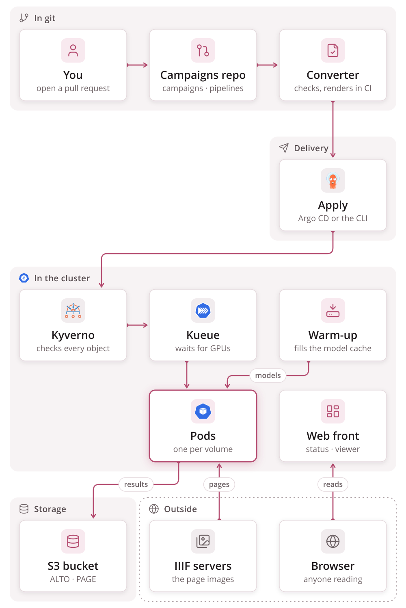

# htrflow-batch

[](https://github.com/AI-Riksarkivet/htrflow-batch/actions/workflows/ci.yml)
[](https://ai-riksarkivet.github.io/htrflow-batch/)
[](https://github.com/AI-Riksarkivet/htrflow-batch/actions/workflows/publish.yml)
[](https://hub.docker.com/r/riksarkivet/htrflow-batch)
[](pyproject.toml)
[](LICENSE)
[](https://github.com/astral-sh/ruff)
[](https://github.com/astral-sh/uv)
[](https://github.com/AI-Riksarkivet/htrflow)

[](https://github.com/AI-Riksarkivet/htrflow-batch/actions/workflows/security.yml)
[](https://github.com/AI-Riksarkivet/htrflow-batch/actions/workflows/codeql.yml)
[](https://github.com/AI-Riksarkivet/htrflow-batch/actions/workflows/trufflehog.yml)
[](https://scorecard.dev/viewer/?uri=github.com/AI-Riksarkivet/htrflow-batch)

[](.github/actions/sign-attest/action.yml)
[](.github/actions/sign-attest/action.yml)
[](.github/actions/sign-attest/action.yml)

> **Not for use yet.** This repository is under active development and is
> not ready for others to run: interfaces, chart values and the campaigns
> format still change without notice. The
> [releases](https://github.com/AI-Riksarkivet/htrflow-batch/releases) are
> pre-releases for trying it out, not for production.

Run an [htrflow](https://github.com/AI-Riksarkivet/htrflow) pipeline on whole
archival volumes, across a Kubernetes cluster of GPU nodes. Your pipeline
stays exactly as it is; htrflow-batch decides where each volume runs, streams
its pages in, and publishes ALTO and PAGE XML page by page. What to
transcribe is a file in git.



## Quickstart

One page of a sample volume, transcribed on your own machine and opened in
the viewer. You need `git`, `make` and Docker with Compose; no cluster, no
GPU.

```bash
git clone https://github.com/AI-Riksarkivet/htrflow-batch && cd htrflow-batch
make compose-up
docker compose -f .docker/docker-compose.yml logs -f wrapper    # wait for "COMPLETE 1 pages"
```

Then open
<http://localhost:8080/uv.html#?manifest=http://localhost:19000/htr-results/demo-v1/mock-vol/iiif.json>,
and `make compose-down` when you are done. Ports taken, or anything else
unexpected: [Quickstart](https://ai-riksarkivet.github.io/htrflow-batch/getting-started/try-it/).

## On a cluster

A campaign lists volumes and names a pipeline. You open a pull request, and
once it is merged an apply sends it to the cluster as one Kubernetes Indexed
Job, one pod per volume, queued by Kueue until its GPUs are free.

```yaml
# campaigns/kyrkobocker-1.yaml
pipeline: demo-v1
volumes:
  - id: loc-mal2459400
    manifest: https://…/manifest.json
  - id: loose-scans
    images:
      - https://…/scan-0001.jpg
```


A web front shows every campaign and volume live, with each volume's run
log and the transcription in the viewer:


- [Deploy](https://ai-riksarkivet.github.io/htrflow-batch/getting-started/deploy/): the production install.
- [Run a campaign](https://ai-riksarkivet.github.io/htrflow-batch/getting-started/campaigns/): your first campaigns repo.
- [How it works](https://ai-riksarkivet.github.io/htrflow-batch/how-it-works/architecture/), and the [slides](https://ai-riksarkivet.github.io/htrflow-batch/presentations/) that walk through it in pictures.

## Developing

```bash
make install && make test     # uv workspace sync + the Python tests
make ci                       # every gate CI runs, through dagger
```

[Development](https://ai-riksarkivet.github.io/htrflow-batch/development/)
covers the repository layout, testing, CI, releasing and a dev cluster. The
documentation site is built from `docs/` (`make docs-serve` locally).

## License

htrflow-batch is licensed under the European Union Public Licence (EUPL-1.2),
the same licence as htrflow. See [`LICENSE`](LICENSE). The third-party
components the images ship are listed in
[Third-party licences](https://ai-riksarkivet.github.io/htrflow-batch/development/licenses/).
