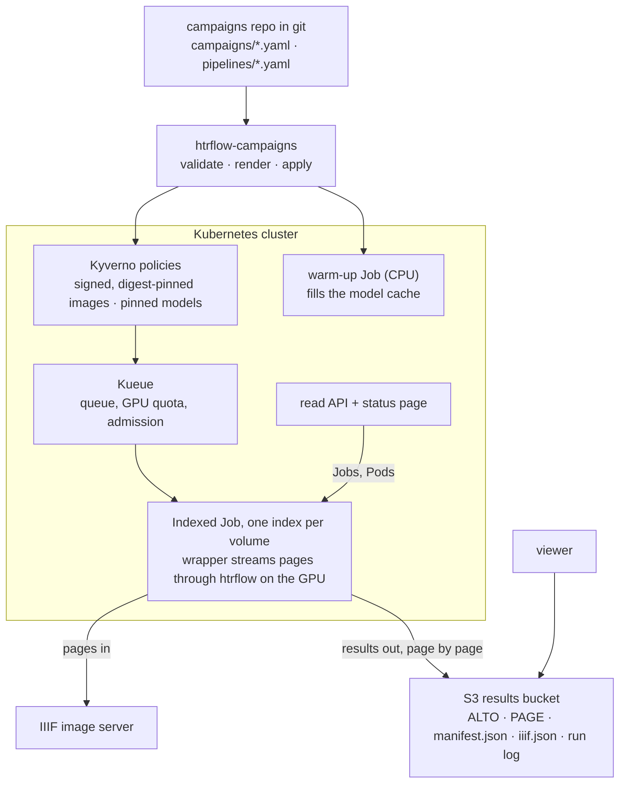
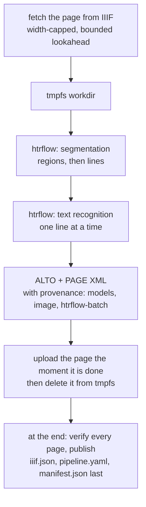

# htrflow-batch

> **Not for use yet.** This repository is under active development at
> Riksarkivet's AI lab and is not ready for others to run: interfaces,
> chart values and the campaigns format still change without notice, and
> the published images are for our own clusters. Watch the releases; this
> notice goes when there is a version we stand behind.

Batch handwritten-text recognition for whole archive volumes on Kubernetes,
built around the stock [htrflow](https://github.com/AI-Riksarkivet/htrflow)
image. A campaign is a YAML file in a git repository listing the volumes to
transcribe; a pure converter renders it into one Kubernetes **Indexed Job**
(one index per volume) plus a warm-up Job that caches the pipeline's models;
**Kueue** owns queueing and GPU quota; **Kyverno** policies decide which
images and model revisions may run. In each index a thin wrapper streams the
volume page by page from IIIF into htrflow, uploads ALTO and PAGE XML the
moment a page is done, stamps every ALTO with what produced it, and publishes
an IIIF manifest so the result opens in the viewer. A read-only status page
shows every campaign and volume live. No CRD, no controller, no database.

## How it fits together



- [Architecture](https://ai-riksarkivet.github.io/htrflow-batch/how-it-works/architecture/) — the map, and the components and their boundaries
- [Campaigns](https://ai-riksarkivet.github.io/htrflow-batch/how-it-works/campaigns/) — the campaigns repo, the converter and what it renders
- [Queueing](https://ai-riksarkivet.github.io/htrflow-batch/how-it-works/queueing/) and [Kueue in depth](https://ai-riksarkivet.github.io/htrflow-batch/how-it-works/kueue/) — how a campaign is admitted, paused and shared
- [Events and signals](https://ai-riksarkivet.github.io/htrflow-batch/how-it-works/signals/) — what the system emits and who reads it
- [Failure handling](https://ai-riksarkivet.github.io/htrflow-batch/how-it-works/failure-handling/) — retries, exit codes, what a person is told



- [From image to transcription](https://ai-riksarkivet.github.io/htrflow-batch/how-it-works/page-flow/) — this path in detail
- [The wrapper](https://ai-riksarkivet.github.io/htrflow-batch/how-it-works/wrapper/) — stages, provenance, exit codes
- [Memory budget](https://ai-riksarkivet.github.io/htrflow-batch/how-it-works/memory-budget/) — why a long volume costs the same as a short one

## What is in the repository

| Path | What it is |
|---|---|
| `packages/wrapper` | The in-pod wrapper: IIIF fetch, streaming, resume, verify, publish, live run log, warm-up entrypoint, ALTO provenance |
| `packages/converter` | `htrflow-campaigns`: validate, render and apply a campaigns repo (Indexed Jobs, warm-up Jobs, ConfigMaps; pause via Kueue) |
| `packages/web` + `frontend` | The read API (`/api/v1/jobs`) and the SvelteKit status page, one image |
| `charts/htrflow-batch` | The Helm chart: Kueue queues, RBAC, NetworkPolicies, Kyverno policies, the status page |
| `charts/htrflow-devstack` | S3 (RustFS), registry and fixtures for a single-node PoC |
| `examples/campaigns` | The shape of a campaigns repository, with the CI that renders, policy-checks and commits `rendered/` |
| `docs/` | The documentation site (getting started, how it works, reference, audits) plus `docs/features/`, the product view: one story per deliverable, mirrored to Azure DevOps, kept out of the site |
| `scripts/` | The exact LOC budgets, the generated configuration reference, the stories ↔ Azure DevOps sync |

## Quickstart

```bash
make install && make test              # uv workspace sync + wrapper, converter and web tests
make frontend-install && make frontend-test
make ci                                # everything CI runs: format, lint, typecheck, tests, chart, budgets
```

For a cluster, Kueue and Kyverno are prerequisites (`make install-kyverno`
installs the latter; the chart does not install either controller), plus an
S3 Secret with a `credentials` ini key:

```bash
helm install htr charts/htrflow-batch -n htr-batch --create-namespace \
  --set publicResultsBase=<browser-reachable results base URL> \
  --set web.image=<web image>@sha256:<digest> \
  --set security.policies.enabled=true
```

Then declare volumes in a campaigns repo shaped like
[`examples/campaigns/`](examples/campaigns/) and apply it:
`make campaigns-apply DIR=<repo>`, or let the campaigns repo's own CI do it on
merge. `docs/getting-started/` walks through prerequisites, deployment and a
first volume; `docs/development/local-k3s.md` is the single-node GPU PoC loop
(`make install-devstack`).

## Where things stand

- Images: `docker.io/riksarkivet/htrflow-batch` (amd64 and native arm64),
  signed with cosign, with SLSA provenance and SBOM; pinned by digest in
  every pipeline file. Chart 0.6.0, wrapper 0.2.0.
- The product view lives in [`docs/features/`](docs/features/index.md): one
  story per deliverable, mirrored one-to-one to Azure DevOps PBIs, with
  what is implemented, partly implemented and not started.
- The repository is audited from many angles at each milestone; the latest
  is [`docs/audits/2026-09-07-repo-audit.md`](docs/audits/2026-09-07-repo-audit.md)
  and its findings are stories.

## Documentation

The site is at <https://ai-riksarkivet.github.io/htrflow-batch/>, built from
`docs/` on every merge to main. Locally:

```bash
make docs-serve
```

## License

htrflow-batch is licensed under the European Union Public Licence v1.2
(EUPL-1.2), the same licence as htrflow. See [`LICENSE`](LICENSE). The
third-party components the images ship are listed with their licences in
`docs/development/licenses.md`.
