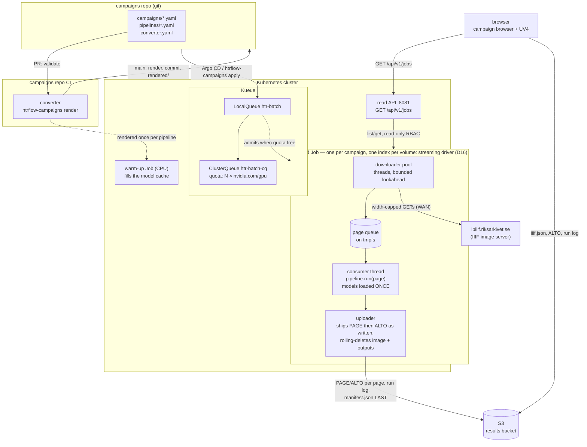
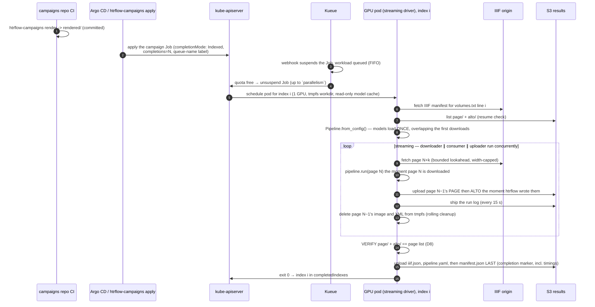

# Architecture

This page is the map: the two pictures of the system, the one-line job
description of each piece, and where to read the detail.

Five pieces, each boring on purpose:

| Piece | Owns | Explicitly does not own |
|---|---|---|
| **campaigns repo** | desired state: which volumes, which pipeline (image digest + steps) | anything that runs |
| **converter** | a pure function from campaign YAML to Kubernetes manifests (`packages/converter`), run in the campaigns repo's own CI | the cluster, S3, retries, anything at runtime |
| **Kueue** | admission, GPU quota, queue order | anything about HTR or data |
| **Indexed Job** | lifecycle for a whole campaign: per-index retries (`backoffLimitPerIndex`), disruption absorption, the exit-13 verdict per index, progress (`completedIndexes`/`failedIndexes`) | HTR, the results themselves |
| **wrapper (streaming driver)** | I/O (IIIF in, S3 out), page queue, resume, **output verification**, provenance, the live log; drives htrflow in-process | HTR logic |
| **htrflow** | HTR | everything else — unmodified package, driven as a library |

The web front (`packages/web`) is a sixth, passive piece: a read-only
projection of live Job/Pod/ConfigMap state that also serves the status page
and Universal Viewer, with no state of its own
([Campaigns](campaigns.md#the-web-front-and-status-page)).

## Components and their boundaries

The five-piece table above is the shape of the system. This one is the
contract: for every moving part, the fields and objects it **writes**, what
it reads, what it emits, and the line it does not cross. Read a row as "if
this field is wrong, this is who wrote it".

| Component | Owns (writes) | Inputs | Outputs and signals | Never does |
|---|---|---|---|---|
| **converter** — `htrflow-campaigns render`/`validate` (`render.py`, `models.py`) | every field of the rendered ConfigMaps, warm-up Jobs and campaign Jobs: `completions`, `parallelism` (clamped to `window`), `backoffLimitPerIndex`, `maxFailedIndexes`, `podFailurePolicy`, `ttlSecondsAfterFinished`, the pod's `activeDeadlineSeconds`, requests/limits, the `kueue.x-k8s.io/queue-name` label, `volumes.txt` | `campaigns/*.yaml`, `pipelines/*.yaml`, `converter.yaml` | `rendered/` YAML, one message per validation problem, an exit code | touch the cluster, S3 or the network — it is a pure function |
| **apply** — `cluster.py` | server-side apply under field manager `htrflow-campaigns`, the label-selected prune, and the pause patch on `workload.spec.active` | `rendered/`, a kubeconfig or the pod's own token | applied objects, `pruned: …` lines, one sentence per cluster problem | render anything, or expect `job.spec.suspend` to hold — [Kueue owns it](kueue.md#pause) |
| **Kueue** | `job.spec.suspend`, the whole `Workload`, quota accounting on the ClusterQueue and LocalQueue | the queue-name label, the pod template's resource **requests**, `nominalQuota` | Workload conditions (`QuotaReserved`, `Admitted`, `Finished`), events, `kueue_*` metrics | schedule pods, retry an index, or know anything about HTR, IIIF or S3 |
| **Kubernetes Job controller** | pods per index, retries under `backoffLimitPerIndex`, the `podFailurePolicy` verdicts, `status.completedIndexes`/`failedIndexes`/conditions, TTL deletion | the Job spec, once un-suspended | pods, Job status and events — the only progress the status page reads | ask Kueue again mid-Job, place pods, or read results |
| **kube-scheduler** | the node choice: `pod.spec.nodeName` | the pod spec (requests, `runtimeClassName: nvidia`, `nodeSelector`, `tolerations`) and node capacity | the `Scheduled` event, a bound pod | quota, fairness, or ordering between campaigns |
| **kubelet** | running the containers, the pod's `activeDeadlineSeconds`, SIGTERM at `terminationGracePeriodSeconds: 120`, the termination message | the bound pod, the image, the mounted PVC/ConfigMaps/Secret | pod phase, exit codes, `DeadlineExceeded`, pull events | retry an index, or decide an index has failed for good |
| **warm-up Job** | the model cache PVC, mounted read-write by this pod alone, and the marker `/data/warmup/<pipeline>.done` | the pipeline ConfigMap, the cache PVC | the marker file, a `{stage: warmup}` termination message on failure | carry the queue label (so it is not Kueue-gated), mount S3, or transcribe |
| **wrapper** | I/O in both directions, the page queue, resume, output verification, provenance, the live run log — htrflow driven in-process | its `volumes.txt` line at `JOB_COMPLETION_INDEX`, `pipeline.yaml`, the S3 secret | PAGE then ALTO per page, the run log every 15 s, `iiif.json`, `manifest.json` **last**, exit 0/13/143 | HTR logic, Kubernetes objects, or retrying its own volume |
| **S3 results bucket** | nothing of its own — it is the only durable record | the wrapper's PUTs | what the browser renders and what the next attempt resumes from | get written by the converter, the apply, Kueue or the read API |
| **read API** — `packages/web` | nothing in the cluster | get/list/watch on Jobs, Pods and ConfigMaps in one namespace (a Role, not a ClusterRole) | `GET /api/v1/jobs[/…]`: phase, counts, warm-up status, `resultsBase` | write to the cluster, keep state, or read S3 |
| **status page** — the SvelteKit front | what the browser shows | `/api/v1/jobs`, plus the run log and `manifest.json` straight from S3 | the campaign cards and per-volume state | write anything, anywhere |
| **viewer** — Universal Viewer at `/uv.html` | the rendering of one volume | `iiif.json` and ALTO from S3 | image plus text overlay | talk to the API server or the read API |
| **Kyverno** | admission verdicts in the namespace: digest-pinned images, allowed registries, cosign-keyless verification, 40-hex model revisions in `pipeline.yaml` | every Job and Pod CREATE/UPDATE, and the converter-labelled ConfigMaps | an `Enforce` rejection naming the offending images or models | mutate a pod spec (`mutateDigest: false`), queue anything, or know what a campaign is |

## Job lifecycle

## Read next

| Page | Answers |
|---|---|
| [Queueing (Kueue)](queueing.md) | When does a campaign actually run? What the chart renders, how admission works, why one campaign owns a one-GPU queue to the end |
| [Kueue in depth](kueue.md) | The mechanism: Kueue's objects, webhooks and reconcilers, the admission cycle field by field, pause, preemption, and how it all meets Kubernetes |
| [The Wrapper](wrapper.md) | The streaming driver, the Job template, the model cache and the pipeline configs |
| [From image to transcription](page-flow.md) | One page: the IIIF GET, the htrflow steps, the two XML files, the upload order |
| [Campaigns (Indexed Jobs)](campaigns.md) | The campaigns repo, what the converter renders, the bucket layout, the accepted trade-offs |
| [Events and signals](signals.md) | Everything the system emits, who reads it, and what survives the Job's TTL |
| [Failure Handling](failure-handling.md) | Exit codes, retries, the pod deadline, and what a person is told |
| [Memory Budget](memory-budget.md) | Why tmpfs is the limit that matters and what is bounded by what |
| [Live Run Log](live-run-log.md) | How the browser follows a running volume with nothing writing status |
| [Decision Log](decision-log.md) | Every decision, dated, with what superseded it |
