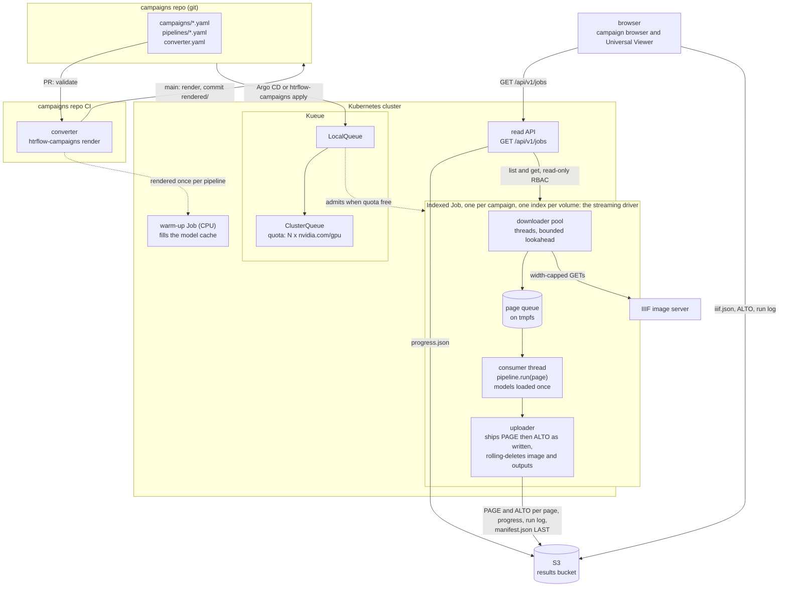
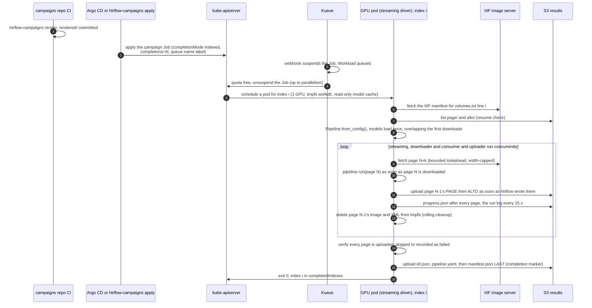

# Architecture

This page is the map. It shows the pictures of the system, the job of each
piece in a line, and where to read the detail.

Each piece is deliberately simple:

| Piece | Owns | Does not own |
|---|---|---|
| **campaigns repo** | Desired state: which volumes, and which pipeline (image digest plus steps) | Anything that runs |
| **converter** | A pure function from campaign YAML to Kubernetes manifests (`packages/converter`), run in the campaigns repo's own CI | The cluster, S3, retries, anything at runtime |
| **Kueue** | Admission, GPU quota, queue order | Anything about HTR or data |
| **Indexed Job** | The lifecycle of a whole campaign: per-index retries (`backoffLimitPerIndex`), absorbing disruptions, the exit-13 verdict per index, progress (`completedIndexes`/`failedIndexes`) | HTR, and the results themselves |
| **wrapper (streaming driver)** | I/O (IIIF in, S3 out), the page queue, resume, **output verification**, provenance, the live log. Drives htrflow in-process | HTR logic |
| **htrflow** | HTR | Everything else. It is the unmodified package, driven as a library |

The web front (`packages/web`) is a passive extra piece. It is a read-only
projection of live Job, Pod and ConfigMap state, plus each running volume's
`progress.json`. It also serves the status page and the Universal Viewer, and
holds no state of its own
([Campaigns](campaigns.md#the-web-front-and-status-page)).

## Components and their boundaries

The table above is the shape of the system. The table below is the contract.
For every moving part it lists what the part **writes**, what it reads, what
it emits, and the line it does not cross. To find who wrote a wrong field,
look for that field in the "Owns" column.

| Component | Owns (writes) | Inputs | Outputs and signals | Never does |
|---|---|---|---|---|
| **converter**: `htrflow-campaigns render`/`validate` (`render.py`, `models.py`) | Every field of the rendered ConfigMaps, warm-up Jobs and campaign Jobs: `completions`, `parallelism` (clamped to `window`), `backoffLimitPerIndex`, `maxFailedIndexes`, `podFailurePolicy`, `ttlSecondsAfterFinished`, the pod's `activeDeadlineSeconds`, requests and limits, the `kueue.x-k8s.io/queue-name` label (plus `kueue.x-k8s.io/priority-class` when the campaign sets `priority:`), `volumes.txt` | `campaigns/*.yaml`, `pipelines/*.yaml`, `converter.yaml` | `rendered/` YAML, one message per validation problem, an exit code | Touch the cluster, S3 or the network. It is a pure function |
| **apply**: `cluster.py` | Server-side apply under field manager `htrflow-campaigns`, the label-selected prune, and the pause patch on `workload.spec.active` | `rendered/`, plus a kubeconfig or the pod's own token | Applied objects, `pruned: …` lines, one sentence per cluster problem | Render anything, or expect `job.spec.suspend` to hold ([Kueue owns it](queueing.md#pause)) |
| **Kueue** | `job.spec.suspend`, the whole `Workload`, quota accounting on the ClusterQueue and LocalQueue | The queue-name label, the pod template's resource **requests**, `nominalQuota` | Workload conditions (`QuotaReserved`, `Admitted`, `Finished`), events, `kueue_*` metrics | Schedule pods, retry an index, or know anything about HTR, IIIF or S3 |
| **Kubernetes Job controller** | Pods per index, retries under `backoffLimitPerIndex`, the `podFailurePolicy` verdicts, `status.completedIndexes`/`failedIndexes`/conditions, TTL deletion | The Job spec, once unsuspended | Pods, Job status and events: the progress the status page reads | Ask Kueue again mid-Job, place pods, or read results |
| **kube-scheduler** | The node choice. It posts a `Binding`, and the API server writes `pod.spec.nodeName` | The pod spec (requests, `runtimeClassName`, `nodeSelector`, `tolerations`) and node capacity | The `Scheduled` event, a bound pod | Quota, fairness, or ordering between campaigns |
| **kubelet** | Running the containers, the pod's `activeDeadlineSeconds`, the stop sequence (SIGTERM at once, SIGKILL `terminationGracePeriodSeconds: 120` later), the termination message | The bound pod, the image, the mounted PVC, ConfigMaps and Secret | Pod phase, exit codes, `DeadlineExceeded`, pull events | Retry an index, or decide an index has failed for good |
| **warm-up Job** | The model cache PVC, mounted read-write by this pod alone, and the marker `/data/warmup/<pipeline>.done` | The pipeline ConfigMap, the cache PVC | The marker file, and a `{stage: warmup}` termination message on failure | Carry the queue label (so Kueue does not gate it), mount S3, or transcribe |
| **wrapper** | I/O in both directions, the page queue, resume, output verification, provenance, the live run log. Drives htrflow in-process | Its `volumes.txt` line at `JOB_COMPLETION_INDEX`, `pipeline.yaml`, the S3 secret | PAGE then ALTO per page, `progress.json` per page, the run log every 15 s, `iiif.json`, `manifest.json` **last**, exit 0/13/1/143 | HTR logic, Kubernetes objects, or retrying its own volume |
| **S3 results bucket** | Nothing of its own. It is the only durable record | The wrapper's PUTs | What the browser renders, what the read API reports as progress, and what the next attempt resumes from | Get written by the converter, the apply, Kueue or the read API |
| **read API**: `packages/web` | Nothing in the cluster | get/list/watch on Jobs, Pods and ConfigMaps in one namespace (a Role, not a ClusterRole), and anonymous GETs of `progress.json` | `GET /api/v1/jobs[/…]`: phase, counts, per-volume progress, warm-up status, `resultsBase` | Write to the cluster or the bucket, hold S3 credentials, or keep state beyond a few seconds' cache |
| **status page**: the SvelteKit front | What the browser shows | `/api/v1/jobs`, plus the run log and `manifest.json` straight from S3 | Campaign cards and per-volume state | Write anything, anywhere |
| **viewer**: Universal Viewer at `/uv.html` | Rendering one volume | `iiif.json` and ALTO from S3 | The image plus a text overlay | Talk to the API server or the read API |
| **Kyverno** | Admission verdicts in the namespace **when enabled**: digest-pinned images and allowed registries under `security.policies.enabled`, model revisions under `requireModelRevision`, signatures under `verifyImages.enabled`. All three are off by default | Every Job and Pod CREATE/UPDATE, and the converter-labelled ConfigMaps | An `Enforce` rejection naming the offending images or models | Mutate a pod spec, queue anything, or know what a campaign is ([Security](security.md#trust-boundary)) |

## Job lifecycle

## Read next

| Page | Answers |
|---|---|
| [Campaigns](campaigns.md) | The campaigns repo, what the converter renders (with a worked example), the web front, the bucket layout, the trade-offs |
| [Queueing](queueing.md) | When does a campaign run? Kueue's objects, the admission cycle field by field, pause, the window, preemption, and what an operator reads |
| [The Wrapper](wrapper.md) | The streaming driver and its stages, provenance, the model cache, pipeline configs, memory bounds |
| [From image to transcription](page-flow.md) | One page: the IIIF GET, the htrflow steps, the two XML files, the upload order |
| [Failure Handling](failure-handling.md) | Invariants, exit codes, retries, the pod deadline, warm-up failures, and what a person is told |
| [Events and signals](signals.md) | Everything the system emits, who reads it, what survives the Job's TTL, and the live run log |
| [Security](security.md) | The trust boundary, the bucket policy, pod posture, NetworkPolicies |
