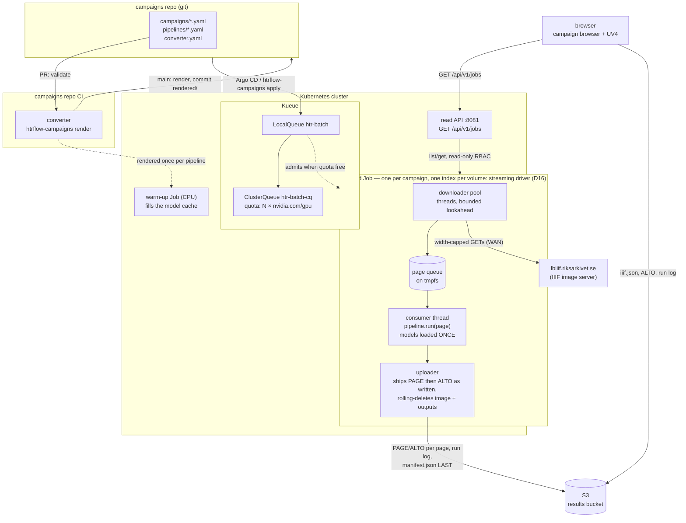
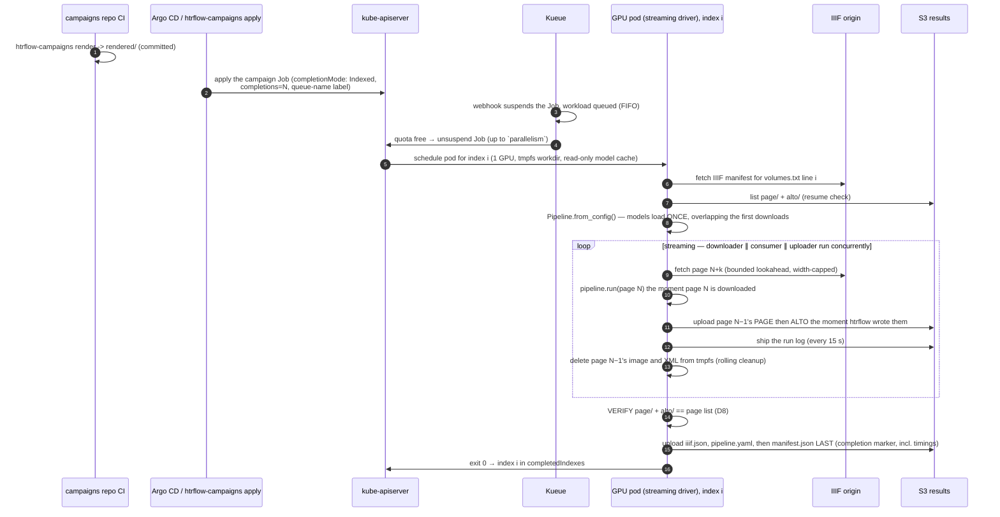

# Architecture

This page is the map: the two pictures of the system, the one-line job
description of each piece, and where to read the detail.

Five pieces, each boring on purpose:

| Piece | Owns | Explicitly does not own |
|---|---|---|
| **campaigns repo** | desired state: which volumes, which pipeline (image digest + steps) | anything that runs |
| **converter** | a pure function from campaign YAML to Kubernetes manifests (`packages/converter`), run in the campaigns repo's own CI | the cluster, S3, retries, anything at runtime |
| **Kueue** | admission, GPU quota, queue order | anything about HTR or data |
| **Indexed Job** | lifecycle for a whole campaign: per-index retries (`backoffLimitPerIndex`), disruption absorption, the exit-13 verdict per index, progress (`completedIndexes`/`failedIndexes`) | HTR, the results themselves |
| **wrapper (streaming driver)** | I/O (IIIF in, S3 out), page queue, resume, **output verification**, provenance, the live log; drives htrflow in-process | HTR logic |
| **htrflow** | HTR | everything else — unmodified package, driven as a library |

The web front (`packages/web`) is a sixth, passive piece: a read-only
projection of live Job/Pod/ConfigMap state that also serves the status page
and Universal Viewer, with no state of its own
([Campaigns](campaigns.md#the-web-front-and-status-page)).

## Job lifecycle

## Read next

| Page | Answers |
|---|---|
| [Queueing (Kueue)](queueing.md) | When does a campaign actually run? What the chart renders, how admission works, why one campaign owns a one-GPU queue to the end |
| [The Wrapper](wrapper.md) | The streaming driver, the Job template, the model cache and the pipeline configs |
| [From image to transcription](page-flow.md) | One page: the IIIF GET, the htrflow steps, the two XML files, the upload order |
| [Campaigns (Indexed Jobs)](campaigns.md) | The campaigns repo, what the converter renders, the bucket layout, the accepted trade-offs |
| [Events and signals](signals.md) | Everything the system emits, who reads it, and what survives the Job's TTL |
| [Failure Handling](failure-handling.md) | Exit codes, retries, the pod deadline, and what a person is told |
| [Memory Budget](memory-budget.md) | Why tmpfs is the limit that matters and what is bounded by what |
| [Live Run Log](live-run-log.md) | How the browser follows a running volume with nothing writing status |
| [Decision Log](decision-log.md) | Every decision, dated, with what superseded it |
