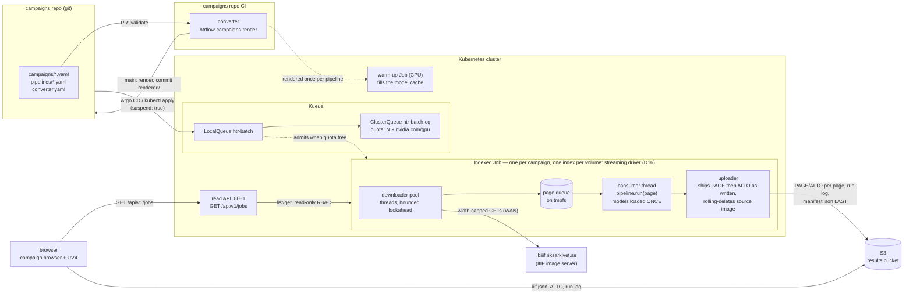
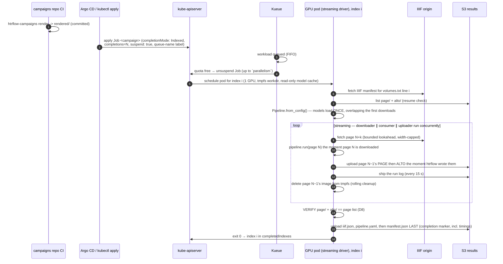

# Architecture

Five pieces, each boring on purpose:

| Piece | Owns | Explicitly does not own |
|---|---|---|
| **campaigns repo** | desired state: which volumes, which pipeline (image digest + steps) | anything that runs |
| **converter** | a pure function from campaign YAML to Kubernetes manifests (`packages/converter`), run in the campaigns repo's own CI | the cluster, S3, retries, anything at runtime |
| **Kueue** | admission, GPU quota, queue order | anything about HTR or data |
| **Indexed Job** | lifecycle for a whole campaign: per-index retries (`backoffLimitPerIndex`), disruption absorption, the exit-13 verdict per index, progress (`completedIndexes`/`failedIndexes`) | HTR, the results themselves |
| **wrapper (streaming driver)** | I/O (IIIF in, S3 out), page queue, resume, **output verification**, provenance, the live log; drives htrflow in-process | HTR logic |
| **htrflow** | HTR | everything else — unmodified package, driven as a library |

The read API (`packages/web`) is a sixth, passive piece: read-only RBAC on
Jobs/Pods/ConfigMaps, no state of its own, serving the status page's
`GET /api/v1/jobs` — it derives everything from the live Job, nothing is
cached ([Campaigns](campaigns.md#the-read-api-and-status-page)).

## Job lifecycle

See [The Wrapper](wrapper.md) for the streaming driver's downloader/consumer/
uploader roles and the `gpu_stall_seconds` instrumentation this diagram's
loop produces, [Campaigns (Indexed Jobs)](campaigns.md) for the render →
apply flow, and [Failure Handling](failure-handling.md) for what happens off
the happy path.
