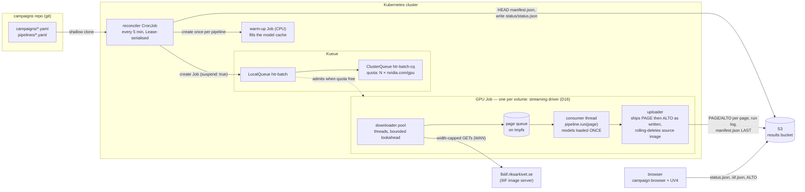

# Architecture



Five pieces, each boring on purpose:

| Piece | Owns | Explicitly does not own |
|---|---|---|
| **campaigns repo** | desired state: which volumes, which pipeline (image digest + steps) | anything that runs |
| **reconciler** | the three-way join git ↔ S3 ↔ Jobs, submission into a bounded window, retries and budgets, `status.json` | HTR, queueing, the results themselves |
| **Kueue** | admission, GPU quota, queue order | anything about HTR or data |
| **k8s Job** | lifecycle: one pod, deadline, disruption absorption, the exit-13 verdict | queueing (starts `suspend: true`), retries (the reconciler's) |
| **wrapper (streaming driver)** | I/O (IIIF in, S3 out), page queue, resume, **output verification**, provenance, the live log; drives htrflow in-process | HTR logic |
| **htrflow** | HTR | everything else — unmodified package, driven as a library |

The browser is a sixth, passive piece: it only ever reads S3
([Campaign Browser](../reference/frontend.md)).

## Job lifecycle

```mermaid
sequenceDiagram
    autonumber
    participant G as campaigns repo
    participant R as reconciler tick
    participant K8s as kube-apiserver
    participant Q as Kueue
    participant P as GPU pod (streaming driver)
    participant I as IIIF origin
    participant S3 as S3 results

    R->>G: shallow clone (dulwich)
    R->>S3: LIST <pipeline>/ + HEAD manifest.json (done set)
    R->>K8s: list managed Jobs
    R->>K8s: create Job htr-<pipeline>-<volume>-<hash> (suspend: true, queue-name label)
    Q->>Q: workload queued (FIFO)
    Q->>K8s: quota free → unsuspend Job
    K8s->>P: schedule pod (1 GPU, tmpfs workdir, read-only model cache)
    P->>I: fetch IIIF manifest
    P->>S3: list page/ + alto/ (resume check)
    P->>P: Pipeline.from_config() — models load ONCE, overlapping the first downloads
    loop streaming — downloader ∥ consumer ∥ uploader run concurrently
        P->>I: fetch page N+k (bounded lookahead, width-capped)
        P->>P: pipeline.run(page N) the moment page N is downloaded
        P->>S3: upload page N−1's PAGE then ALTO the moment htrflow wrote them
        P->>S3: ship the run log (every 15 s)
        P->>P: delete page N−1's image from tmpfs (rolling cleanup)
    end
    P->>P: VERIFY page/ + alto/ == page list (D8)
    P->>S3: upload iiif.json, pipeline.yaml, then manifest.json LAST (completion marker, incl. timings)
    P->>K8s: exit 0 → Job Complete
    R->>S3: next tick: HEAD manifest.json → done; write status/status.json
```

See [The Wrapper](wrapper.md) for the streaming driver's downloader/consumer/
uploader roles and the `gpu_stall_seconds` instrumentation this diagram's
loop produces, [Campaigns (GitOps)](campaigns.md) for the reconciler's tick,
and [Failure Handling](failure-handling.md) for what happens off the happy
path.
