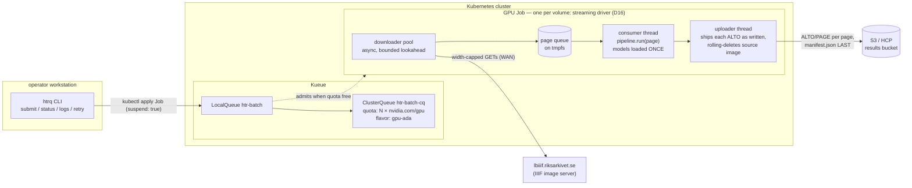
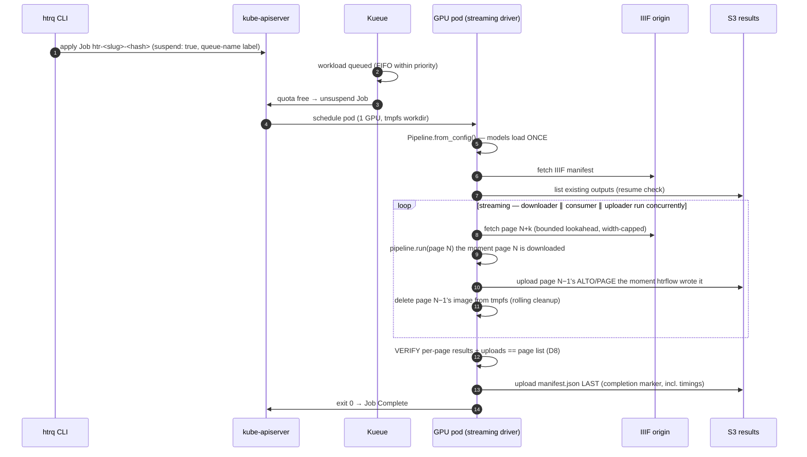

# Architecture

Four pieces, each boring on purpose:

| Piece | Owns | Explicitly does not own |
|---|---|---|
| **Kueue** | admission, GPU quota, queue order | anything about HTR or data |
| **k8s Job** | lifecycle: retries, deadlines, completion status | queueing (starts `suspend: true`) |
| **wrapper (streaming driver)** | I/O (IIIF in, S3 out), page queue, resume, **output verification**, provenance; drives htrflow in-process | HTR logic |
| **htrflow** | HTR | everything else — unmodified package, driven as a library |

## Job lifecycle

See [The Wrapper](wrapper.md) for the streaming driver's downloader/consumer/
uploader roles and the `gpu_stall_seconds` instrumentation this diagram's
loop produces, and [Failure Handling](failure-handling.md) for what happens
off the happy path.
