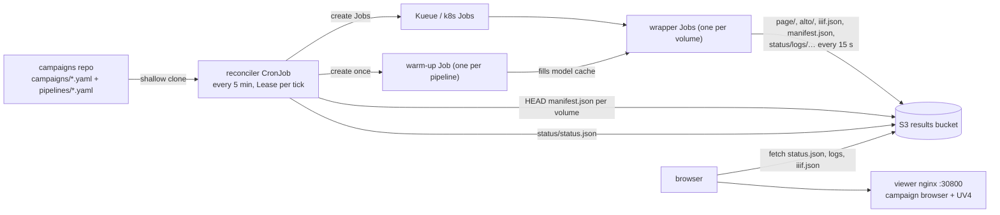

# Campaigns (GitOps)

A **campaign** is a list of volumes to transcribe with one pipeline, declared
in git. A reconciler CronJob submits the missing work every five minutes and
publishes a status document; a read-only browser page renders it.

Three properties hold the design together:

- **Desired state lives in git** (the campaigns repo). Adding work is a
  commit, so every change is reviewable and attributable.
- **Observed state is derived, never stored** — with one deliberate
  exception. `manifest.json` in S3 means done (the wrapper writes it last,
  after verification); a Job in the cluster means queued/running/failed; in
  git but neither means pending. The exception is `status/attempts.json`:
  retry budgets and the sticky `needs-attention` verdict must outlive the
  Job that produced them. There is still no database.
- **The page never writes.** The reconciler is the only component with
  cluster credentials, and it only ever reads git.

Full design rationale, alternatives and the trade-offs behind each of these:
[the campaign GitOps spec](../superpowers/specs/2026-07-29-campaign-gitops-design.md).

## Architecture



## The campaigns repo

A separate repo from `htrflow-batch`: operations and code change at different
rhythms, and PR review stays legible ("new campaign" vs "new feature").

```
campaigns/
  trolldomskommissionen.yaml
pipelines/
  demo-v1.yaml
```

### Campaign file

```yaml title="campaigns/trolldomskommissionen.yaml"
pipeline: demo-v1        # exactly one pipeline per campaign
volumes:
  - R0001203                       # shorthand: Riksarkivet ref ->
                                   #   https://lbiiif.riksarkivet.se/arkis!<ref>/manifest
  - id: dodsbok-1698               # any IIIF manifest on the web (P2 or P3), http(s) only
    manifest: https://iiif.example.org/xyz/manifest
  - id: loose-scans                # bare image URLs -> the reconciler generates
    images:                        #   a synthetic P3 manifest in the bucket
      - https://example.org/scan1.jpg
      - https://example.org/scan2.jpg
```

- A volume `id` (or the ref itself, for the shorthand form) becomes the S3
  prefix `<pipeline>/<id>/` and part of the Job name, so it must be
  label-safe (`[A-Za-z0-9._-]`, alphanumeric at both ends, ≤ 63 chars) and
  unique within the pipeline. The parser rejects anything else rather than
  letting an unsafe id reach the cluster
  ([rules](../reference/campaign-yaml.md)).
- No per-volume pipeline overrides. A volume needing different treatment goes
  in its own campaign file.
- Re-running with a changed recipe means a **new pipeline id** and a new
  campaign file. Old results stay untouched and comparable side by side
  (`demo-v1/R0001203` vs `demo-v2/R0001203` in the viewer).
- Editing an `images:` list takes effect: the synthetic manifest's key
  carries a hash of the list, so a changed list is a new manifest, and the
  wrapper's resume reprocesses pages whose source URL changed.

### Pipeline file

A pipeline id names the **full recipe**: the htrflow steps *and* the exact
wrapper image that runs them.

```yaml title="pipelines/demo-v1.yaml"
image: ghcr.io/riksarkivet/htrflow-batch@sha256:5d5c60...   # digest, REQUIRED
steps:
  - step: Segmentation
    ...
```

The reconciler sets the Job's container image from `image` and passes it as
`IMAGE_DIGEST`, which the wrapper stamps into every published
`manifest.json` — closing the provenance chain from git recipe to Job to
results. Tags are rejected: only `@sha256:` pins are accepted, and with
`security.allowedImageRepos` set only pins under those repositories
([Security → Trust boundary](../development/security.md#trust-boundary)).

Only the `steps:` document goes into the `htr-pipeline-<id>` ConfigMap (it is
what htrflow parses), so the wrapper's recorded `pipeline_sha256` covers the
steps and `image_digest` covers the image — the drift guards check both.

!!! warning "Pinning our code is not pinning the world"

    Model weights are pulled from Hugging Face at runtime by the warm-up.
    Unless each step pins a model `revision` (enforceable with
    `security.requireModelRevision`), an upstream model update can still
    change output under the same pipeline id (the read-only cache, filled
    once per pipeline, makes this stable in practice, not in principle).
    GPU nondeterminism means bit-identical reruns are out of scope regardless.

A pipeline's first appearance with volumes to run also creates its
**warm-up Job** (`htr-warmup-<id>`): the reconciler submits no volumes for
that pipeline until the Job completes, reports `warming model cache` in the
status warnings meanwhile, and gives warm-ups the same attempt budget as
volumes ([Model handling](wrapper.md#model-handling),
[Failure Handling](failure-handling.md#warm-ups-fail-the-same-way)).

## Immutability and the drift guards

Results are keyed by pipeline id, so `pipelines/<id>.yaml` is immutable once
any result exists under that id (D17, carried over from the chart's
`pipelines:` map). Three layered guards enforce it:

| # | Guard | Where | Fails how |
|---|---|---|---|
| 1 | PR check: existing `pipelines/*.yaml` must not be modified | campaigns repo CI (`scripts/check_immutable.sh`, `guard.yml`) | PR red. Only runs on `pull_request`, so **`main` must be protected** |
| 2 | Steps document compared as parsed content with the live `htr-pipeline-<id>` ConfigMap | reconciler, per tick | nothing submitted for that pipeline, loud warning on the page |
| 3 | Steps hash (canonical JSON, or the legacy text sha the wrapper publishes) **and** image digest vs one already-published `manifest.json` under the pipeline prefix | reconciler, per tick | same |

Guard 3 is the one that actually protects results: guard 2 fails open if the
ConfigMap was deleted (chart reinstall). The check runs *before* the ConfigMap
is applied — applying first would overwrite the very evidence it reads.

Results published before image pinning existed record `image_digest:
"unknown"`, and manifests without a `pipeline_sha256` cannot testify; both
are **grandfathered** with a warning rather than blocking.

## What one tick does

Detailed step list: [Reconciler → The tick](../reference/reconciler.md#the-tick).

1. Take the per-tick **Lease** (a second tick started by hand exits at once).
2. Shallow-clone the campaigns repo with dulwich — `https://` (anonymous or
   with a read-only token) or the in-cluster `git://` daemon. The image
   carries the stock public CAs, which is enough for github.com; on
   RA-intercepted egress the corp bundle has to be mounted in (see below).
3. Parse campaigns and pipelines. A malformed file is contained: it is
   reported as broken on the page, and every other campaign proceeds. A
   pipeline that fails the allow-list or revision rule blocks only itself.
4. Check drift for each pipeline, then ensure its `htr-pipeline-<id>`
   ConfigMap; gate each pipeline on its warm-up.
5. Pre-validate declared manifest URLs — a bounded batch per tick (50, eight
   at a time, 10 s and 16 MiB each): fetch and classify. P2 and P3 are both
   submittable — the wrapper reads both. A Collection, junk, a 4xx, or an
   unreachable host becomes status `unsupported` / `unreachable` and no Job
   is burned. The first canvas also yields the sized thumbnail (`full/200,`
   off the image service where there is one) and the page count.
6. For `images:` volumes, write the synthetic P3 manifest to
   `sources/<pipeline>/<id>/<hash>/manifest.json` when the list changed.
7. Derive each volume's status (table below); on `retry`, persist the
   attempt bump, copy the evidence to `status/failures/…`, delete the Job;
   on first-sight `needs-attention`, persist the verdict.
8. Submit pending volumes up to a bounded window (default 20 Jobs in flight),
   **round-robin across campaigns ordered by how many Jobs each already has
   in flight**, so a 4 000-volume campaign cannot starve a 10-volume one
   tick after tick. Each Job's deadline is derived from its page count.
9. Write `status/attempts.json`, `status/volumes.json` and
   `status/status.json` (with a `tick_summary`), and log one summary line.

!!! note "Caching, precisely"

    A verdict about the *document* (`unsupported`, a permanent 4xx, a parsed
    thumbnail and page count) is cached in `status/validation.json` forever —
    a Collection will not become a Manifest by being asked again. A
    *transient* `unreachable` (5xx, timeout, DNS) is a verdict about the
    network and is cached for three ticks only, so a dead host costs one
    timeout per 15 minutes rather than every tick, and a flaky fetch cannot
    wedge a volume out of its campaign permanently.

    Retry budgets in `status/attempts.json` are keyed per
    *(pipeline, volume)*. A volume that burned its attempts on `demo-v1`
    therefore starts fresh on `demo-v2` — re-running under a new pipeline id
    is the upgrade path, and it must not inherit an exhausted budget.

Job names are deterministic: `htr-<pipeline>-<volume>-<8-hex>`, lowercased
and sanitised to DNS-1123, with the 8-hex digest taken over the
*(pipeline, volume)* pair. The slug alone is ambiguous (`("a-b", "c")` and
`("a", "b-c")` flatten identically), so the digest is always present.
Deterministic names plus the Lease make a duplicate create a harmless
`AlreadyExists`.

## Status derivation

The three-way join over git, S3, the cluster — and the persisted verdict:

| `manifest.json` in S3 | `attempts.json` | Job in cluster | status |
|---|---|---|---|
| yes | — | — | **done** (immutable; never re-checked) |
| no | `terminal` set | any or none | **needs-attention** (sticky; never auto-resubmitted) |
| no | — | none | **pending** |
| no | — | being deleted | **deleting** (a retry in progress; pending next tick) |
| no | — | Workload not admitted | **queued** |
| no | — | pod running | **running** |
| no | `n` < cap | Job failed, exit 1 / 143 / deadline | **retry** (Job deleted this tick, resubmitted next) |
| no | — | Job failed, exit 13 | **needs-attention**, `terminal: exit-13` persisted |
| no | `n` ≥ cap | Job failed | **needs-attention**, `terminal: capped` persisted |

Two more statuses come from pre-validation and never reach the cluster at all:
**unsupported** (a document the wrapper cannot read, or a permanent 4xx) and
**unreachable** (the manifest host did not answer). A deadline or SIGTERM
kill that advanced `pages_done` is a `retry` that does not spend an attempt.

**Orphans are not a volume status** — a volume that is not in git has no row in
any campaign. They surface instead as a campaign-level `orphans[]` array: the
volume ids that have results under the pipeline prefix but are no longer
declared. Removing a volume from git stops future work on it; it never
destroys results. Because two campaigns on the same pipeline share the result
namespace, orphans are a property of the prefix rather than of one campaign,
and are reported once — on the first campaign using that pipeline.

## Bucket layout

The full tree with every key is in [S3 Layout](../reference/s3-layout.md);
the ones the tick reads and writes:

| Key | Written by | Meaning |
|---|---|---|
| `<pipeline>/<volume>/page/*.xml`, `alto/*.xml` | wrapper | per-page results, streamed (PAGE first, ALTO second) |
| `<pipeline>/<volume>/iiif.json` | wrapper | viewer manifest with text overlay |
| `<pipeline>/<volume>/manifest.json` | wrapper | **completion marker** + provenance, written last |
| `status/logs/<pipeline>/<volume>.txt` | wrapper | the run's own log, shipped live ([Live run log](live-run-log.md)) |
| `sources/<pipeline>/<volume>/<hash>/manifest.json` | reconciler | synthetic P3 manifest for `images:` volumes |
| `status/status.json` | reconciler | everything the page renders |
| `status/attempts.json` | reconciler | retry budgets and sticky verdicts per (pipeline, volume) and per warm-up |
| `status/validation.json` | reconciler | cached manifest verdicts, thumbnails, page counts |
| `status/volumes.json` | reconciler | probe cache for done volumes (safe to delete) |
| `status/failures/<pipeline>/<volume>.txt` | reconciler | the failed attempt's log |
| `status/warmup/<pipeline>.log` | reconciler | a failed warm-up's log |

Jobs run with `S3_PREFIX` pinned empty, so results always land where
done-detection looks even if the S3 secret carries a prefix of its own.
Jobs fetch synthetic manifests through the in-cluster S3 endpoint
(`internal_results_base`); browsers get the public URL.

## The status page

A Svelte SPA, built with Bun to static files and served by the viewer nginx —
the same container that serves UV4. `/` is the campaign browser; `/uv.html` is
the Universal Viewer, unchanged; `/log` is the run viewer.
Full reference: [Campaign Browser](../reference/frontend.md).

- **Campaign card** — progress (done/total volumes, pages done/total), the
  pipeline chip (steps on hover, YAML on click), drift and broken-file
  warnings, orphan list; the header carries the campaigns-repo link,
  `generated at` and what the last tick cost.
- **Volume table** — one row per volume: a sized first-page thumbnail (or a
  placeholder for service-less and synthetic volumes), status chip and the
  `terminal` tag when a verdict is parked, pages, attempts, updated, and
  the links `open` / `source` / `log`.
- **Volume → UV**, same origin: a done volume opens its published
  `iiif.json` (images *plus* text panel and line overlays); anything else
  opens the *source* manifest, so the pages are browsable before transcription
  exists. A volume silently upgrades to transcribed the next time it is opened
  after its run completes.
- **`log`** opens the run viewer: the live log while the volume runs, the
  complete log plus the per-page summary card once `manifest.json` exists,
  the failed attempt's evidence for `retry`/`needs-attention`.

Image browsing is deliberately delegated to UV: the page finds and ranks
batches, UV looks at them.

**Freshness.** The page compares `generated_at` to now and shows a red
**STALE** banner when the document is older than 3× `tick_seconds` (the
reconciler emits the configured value, `reconciler.tickSeconds`). A dead
reconciler must not look like "no news".

**Where the page finds `status.json`.** The chart serves `/config.js`
(`window.STATUS_URL = "<publicResultsBase>/status/status.json"`) from the
viewer ConfigMap, same-origin, which is the only hook the SPA's CSP allows.
The bucket must serve `status/status.json` public-read and CORS-open, since
the fetch is cross-origin.

Because the SPA is baked into the viewer image, a UI change means rebuilding
that image (`make viewer-image` locally, `dagger call build-viewer`
reproducibly) — see [Running a campaign](../getting-started/campaigns.md).

## Known issues and accepted trade-offs

1. **Silent reconciler death.** Everything's liveness rides on a CronJob
   cloning the campaigns repo. Mitigated (public CAs in the image; the corp
   bundle must be mounted on intercepted egress — a chart-level
   `extraCaSecret` value is future work — the Lease and the tick deadline
   keep a stuck tick from wedging the next, the `tick:` log line and
   `tick_summary` show what each tick cost, plus the STALE banner) but
   *not alerted* — real alerting is out of scope until there is somewhere
   to send it.
2. **Campaigns repo write access ≈ cluster operator.** Pipeline YAML selects
   the image that runs on the GPU with the bucket's write credentials and
   the Hugging Face model repos whose weights (pickles) the warm-up pod
   loads. The controls — image allow-list, mandatory digest, model
   revisions, optional cosign verification, the pod posture and the
   NetworkPolicies — are in [Security → Trust boundary](../development/security.md#trust-boundary).
   Treat the repo like CI config: protected `main`, required review.
3. **Results are a single unreplicated PVC on one node** on the PoC. Git is
   durably hosted; the bucket is not backed up. Losing that disk means
   recomputing every campaign. Acceptable for the PoC, and must be restated
   before anyone treats the bucket as an archive.
4. **Wild-web volumes fail in ways we cannot tune** — hotlink blocks, auth
   walls, per-host flakiness. Pre-validation turns the common cases into
   early, cheap, visible failures. Verified against the Library of Congress:
   its Presentation manifest is bot-blocked (403) while its Image API is open,
   and the synthetic-manifest path handled it end to end.
5. **The RA firewall blocks most external IIIF hosts** from the cluster,
   including every Swedish-content source (Alvin, manuscripta.se, KB, Finna).
   Reachable today: `loc.gov` / `tile.loc.gov`, `iiif.bodleian.ox.ac.uk`.
6. **Run logs are public** while `devStack.rustfs.publicLogs=true` — the
   browser needs them, and a log can carry the redacted host/path of a
   private IIIF source. Set it false behind an authenticated proxy.
7. **5-minute staleness** on the page — invisible at 30-minute volume
   timescales; the live log fills the gap for a running volume.
8. **A permanently-failed volume has no declarative "skip".** The remedy is
   deleting it from the campaign file, which git history records; re-running
   it is clearing its `attempts.json` record, which is not.
9. **Losing `status/attempts.json` resets budgets and verdicts** — the one
   way a capped volume gets resubmitted.
