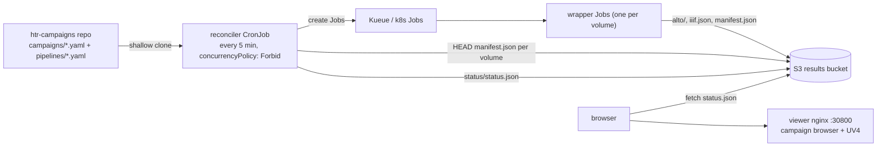

# Campaigns (GitOps)

A **campaign** is a list of volumes to transcribe with one pipeline, declared
in git. A reconciler CronJob submits the missing work every five minutes and
publishes a status document; a read-only browser page renders it.

Three properties hold the design together:

- **Desired state lives in git** (the `htr-campaigns` repo). Adding work is a
  commit, so every change is reviewable and attributable.
- **Observed state is derived, never stored.** `manifest.json` in S3 means
  done (the wrapper writes it last, after verification); a Job in the cluster
  means queued/running/failed; in git but neither means pending. There is no
  database to back up, migrate, or drift.
- **The page never writes.** The reconciler is the only component with
  cluster credentials, and it only ever reads git.

Full design rationale, alternatives and the trade-offs behind each of these:
[the campaign GitOps spec](../superpowers/specs/2026-07-29-campaign-gitops-design.md).

## Architecture



## The campaigns repo

A separate repo from `htrflow-batch`: operations and code change at different
rhythms, and PR review stays legible ("new campaign" vs "new feature").

```
campaigns/
  trolldomskommissionen.yaml
pipelines/
  demo-v1.yaml
```

### Campaign file

```yaml title="campaigns/trolldomskommissionen.yaml"
pipeline: demo-v1        # exactly one pipeline per campaign
volumes:
  - R0001203                       # shorthand: Riksarkivet ref ->
                                   #   https://lbiiif.riksarkivet.se/arkis!<ref>/manifest
  - id: dodsbok-1698               # any IIIF manifest on the web (P2 or P3)
    manifest: https://iiif.example.org/xyz/manifest
  - id: loose-scans                # bare image URLs -> the reconciler generates
    images:                        #   a synthetic P3 manifest in the bucket
      - https://example.org/scan1.jpg
      - https://example.org/scan2.jpg
```

- A volume `id` (or the ref itself, for the shorthand form) becomes the S3
  prefix `<pipeline>/<id>/` and part of the Job name, so it must be
  DNS-1123-safe and unique within the pipeline. The parser rejects anything
  else rather than letting an unsafe id reach the cluster.
- No per-volume pipeline overrides. A volume needing different treatment goes
  in its own campaign file.
- Re-running with a changed recipe means a **new pipeline id** and a new
  campaign file. Old results stay untouched and comparable side by side
  (`demo-v1/R0001203` vs `demo-v2/R0001203` in the viewer).

### Pipeline file

A pipeline id names the **full recipe**: the htrflow steps *and* the exact
wrapper image that runs them.

```yaml title="pipelines/demo-v1.yaml"
image: docker.io/riksarkivet/htrflow-batch@sha256:5d5c60...   # digest, REQUIRED
steps:
  - step: Segmentation
    ...
```

The reconciler sets the Job's container image from `image` and passes it as
`IMAGE_DIGEST`, which the wrapper stamps into every published
`manifest.json` — closing the provenance chain from git recipe to Job to
results. Tags are rejected: only `@sha256:` pins are accepted.

Only the `steps:` document goes into the `htr-pipeline-<id>` ConfigMap (it is
what htrflow parses), so the wrapper's recorded `pipeline_sha256` covers the
steps and `image_digest` covers the image — the drift guards check both.

!!! warning "Pinning our code is not pinning the world"

    Model weights are pulled from Hugging Face at runtime. Unless each step
    pins a model `revision`, an upstream model update can still change output
    under the same pipeline id (the read-only cache, filled once per
    pipeline by the warm-up Job, makes this stable in practice, not in
    principle). GPU nondeterminism means bit-identical reruns are out of
    scope regardless.

A pipeline's first appearance also creates its **warm-up Job**
(`htr-warmup-<id>`): the reconciler submits no volumes for that pipeline
until the Job completes, and reports `warming model cache` in the status
warnings meanwhile ([Model handling](wrapper.md#model-handling)).

## Immutability and the drift guards

Results are keyed by pipeline id, so `pipelines/<id>.yaml` is immutable once
any result exists under that id (D17, carried over from the chart's
`pipelines:` map). Three layered guards enforce it:

| # | Guard | Where | Fails how |
|---|---|---|---|
| 1 | PR check: existing `pipelines/*.yaml` must not be modified | `htr-campaigns` CI | PR red. Only runs on `pull_request`, so **`main` must be protected** |
| 2 | Steps document compared verbatim with the live `htr-pipeline-<id>` ConfigMap | reconciler, per tick | nothing submitted for that pipeline, loud warning on the page |
| 3 | Steps SHA-256 **and** image digest vs one already-published `manifest.json` under the pipeline prefix | reconciler, per tick | same |

Guard 3 is the one that actually protects results: guard 2 fails open if the
ConfigMap was deleted (chart reinstall). The check runs *before* the ConfigMap
is applied — applying first would overwrite the very evidence it reads.

Results published before image pinning existed record `image_digest:
"unknown"`; those are **grandfathered** with a warning rather than blocking,
since there is nothing to compare against.

## What one tick does

1. Shallow-clone the campaigns repo (HTTPS; the image carries the stock public
   CAs, which is enough for github.com — on RA-intercepted egress the corp
   bundle has to be mounted in, see below).
2. Parse campaigns and pipelines. A malformed file is contained: it is
   reported as broken on the page, and every other campaign proceeds.
3. Check drift for each pipeline, then ensure its `htr-pipeline-<id>`
   ConfigMap.
4. Pre-validate each declared manifest URL: fetch and classify it. P2 and P3
   are both submittable — the wrapper reads both. A Collection, junk, or an
   unreachable host becomes status `unsupported` / `unreachable` and no Job is
   burned. The first canvas also yields the card thumbnail (`full/200,` off
   the image service where there is one).
5. For `images:` volumes, write a synthetic P3 manifest to
   `sources/<pipeline>/<id>/manifest.json` if absent.
6. Derive each volume's status (table below).
7. Submit pending volumes up to a bounded window (default 20 not-yet-done
   Jobs at once), **round-robin across campaigns** so a 4,000-volume campaign
   cannot starve a 10-volume one.
8. Retry transient failures up to the attempt cap (default 3) — resume makes a
   retry cheap. Before deleting a failed Job, capture its last log lines to
   `status/failures/<pipeline>/<volume>.txt`, so the evidence survives the
   Job's TTL reaping.
9. Write `status/status.json`, `status/attempts.json` and
   `status/validation.json`.

!!! note "Caching, precisely"

    A verdict about the *document* (`unsupported`, or a parsed thumbnail) is
    cached in `status/validation.json` forever — a Collection will not become
    a Manifest by being asked again. `unreachable` is a verdict about the
    *network* and is deliberately **never** cached: it is re-probed every
    tick, so one flaky fetch cannot wedge a volume out of its campaign
    permanently.

    Retry budgets in `status/attempts.json` are keyed per
    *(pipeline, volume)*. A volume that burned its attempts on `demo-v1`
    therefore starts fresh on `demo-v2` — re-running under a new pipeline id
    is the upgrade path, and it must not inherit an exhausted budget.

Job names are deterministic: `htr-<pipeline>-<volume>-<8-hex>`, lowercased
and sanitised to DNS-1123, with the 8-hex digest taken over the
*(pipeline, volume)* pair. The slug alone is ambiguous (`("a-b", "c")` and
`("a", "b-c")` flatten identically), so the digest is always present.
Deterministic names plus `concurrencyPolicy: Forbid` make a duplicate create a
harmless `AlreadyExists`.

## Status derivation

The three-way join over git, S3 and the cluster:

| `manifest.json` in S3 | Job in cluster | in git | status |
|---|---|---|---|
| yes | — | yes | **done** (immutable; never re-checked) |
| no | Workload not admitted | yes | **queued** |
| no | pod running | yes | **running** |
| no | Job failed, exit 1, budget left | yes | **retry** (resubmitted this tick) |
| no | Job failed, exit 13 or budget exhausted | yes | **needs-attention** (never auto-resubmitted) |
| no | none | yes | **pending** |

Two more statuses come from pre-validation and never reach the cluster at all:
**unsupported** (a document the wrapper cannot read) and **unreachable** (the
manifest host did not answer).

**Orphans are not a volume status** — a volume that is not in git has no row in
any campaign. They surface instead as a campaign-level `orphans[]` array: the
volume ids that have results under the pipeline prefix but are no longer
declared. Removing a volume from git stops future work on it; it never
destroys results. Because two campaigns on the same pipeline share the result
namespace, orphans are a property of the prefix rather than of one campaign,
and are reported once — on the first campaign using that pipeline.

## Bucket layout

| Key | Written by | Meaning |
|---|---|---|
| `<pipeline>/<volume>/alto/*.xml` | wrapper | per-page results, streamed |
| `<pipeline>/<volume>/iiif.json` | wrapper | viewer manifest with text overlay |
| `<pipeline>/<volume>/manifest.json` | wrapper | **completion marker** + provenance, written last |
| `sources/<pipeline>/<volume>/manifest.json` | reconciler | synthetic P3 manifest for `images:` volumes |
| `status/status.json` | reconciler | everything the page renders |
| `status/attempts.json` | reconciler | retry budgets per (pipeline, volume) |
| `status/validation.json` | reconciler | cached manifest verdicts and thumbnails |
| `status/failures/<pipeline>/<volume>.txt` | reconciler | captured logs of a failed Job |

Jobs run with `S3_PREFIX` pinned empty, so results always land where
done-detection looks even if the S3 secret carries a prefix of its own.

## The status page

A Svelte SPA, built with Bun to static files and served by the viewer nginx —
the same container that serves UV4. `/` is the campaign browser; `/uv.html` is
the Universal Viewer, unchanged.

- **Campaign list** — progress bar (done/total), drift and broken-file
  warnings, orphan list, `generated at` stamp.
- **Campaign view** — volumes as cards: first-page thumbnail straight from the
  source IIIF service (no extra storage), status chip, pages done, attempts.
- **Volume click → UV**, same origin: a done volume opens its published
  `iiif.json` (images *plus* text panel and line overlays); anything else
  opens the *source* manifest, so the pages are browsable before transcription
  exists. A volume silently upgrades to transcribed the next time it is opened
  after its run completes.

Image browsing is deliberately delegated to UV: the page finds and ranks
batches, UV looks at them.

**Freshness.** The page compares `generated_at` to now and shows a red
**STALE** banner when the document is older than 3× the tick interval. A dead
reconciler must not look like "no news".

Because the SPA is baked into the viewer image, a UI change means rebuilding
that image (`make viewer-image` locally, `dagger call build-viewer`
reproducibly) — see [Running a campaign](../getting-started/campaigns.md).

## Known issues and accepted trade-offs

1. **Silent reconciler death.** Everything's liveness rides on a CronJob
   cloning GitHub through the RA firewall. Mitigated (public CAs in the image;
   the corp bundle must be mounted on intercepted egress — a chart-level
   `extraCaSecret` value is future work — plus the STALE banner) but *not
   alerted* — real alerting is out of scope until there is somewhere to send
   it.
2. **Campaigns repo write access ≈ code execution in the job pod.** Pipeline
   YAML selects arbitrary Hugging Face model repos, and model loading is a
   known code-execution surface. The pod has a GPU and S3 write, but runs
   non-root on a read-only root filesystem with no capabilities, no cluster
   credentials, a read-only model cache, and egress to DNS, S3 and the IIIF
   origin only ([Security](../development/security.md)). Model *download*
   happens in the warm-up pod, which has internet egress but no S3 and no
   GPU. Treat the repo like CI config: protected `main`, required review.
3. **Results are a single unreplicated PVC on one node.** Git is durably
   hosted; the bucket is not backed up. Losing that disk means recomputing
   every campaign. Acceptable for the PoC, and must be restated before anyone
   treats the bucket as an archive.
4. **Wild-web volumes fail in ways we cannot tune** — hotlink blocks, auth
   walls, per-host flakiness. Pre-validation turns the common cases into
   early, cheap, visible failures. Verified against the Library of Congress:
   its Presentation manifest is bot-blocked (403) while its Image API is open,
   and the synthetic-manifest path handled it end to end.
5. **The RA firewall blocks most external IIIF hosts** from the cluster,
   including every Swedish-content source (Alvin, manuscripta.se, KB, Finna).
   Reachable today: `loc.gov` / `tile.loc.gov`, `iiif.bodleian.ox.ac.uk`.
6. **The status URL is baked into the SPA.** It reads `window.STATUS_URL` and
   otherwise falls back to the PoC's tunnelled
   `http://localhost:30900/htr-results/status/status.json`. Nothing in the
   chart injects that variable yet, so a deployment with a different results
   base needs either a rebuilt SPA or a small injected script. The bucket must
   also serve `status/status.json` public-read and CORS-open, since the fetch
   is cross-origin.
7. **5-minute staleness** on the page — invisible at 30-minute volume
   timescales.
8. **A permanently-failed volume has no declarative "skip".** The remedy is
   deleting it from the campaign file, which git history records.
