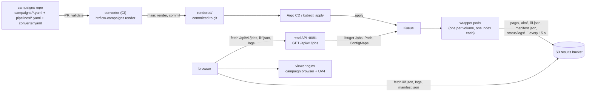

# Campaigns (Indexed Jobs)

A **campaign** is one Kubernetes `batch/v1` Job with `completionMode: Indexed`
— one index per volume. Kubernetes and [Kueue](https://kueue.sigs.k8s.io/)
own scheduling, retries, progress and pause; this repo owns only the
wrapper (unchanged core), a pure converter from campaign YAML to manifests,
and a thin read API for the status page. There is no CronJob, no controller,
no state files in the bucket.

Two rules hold the design together, and belong on the front page of every
campaigns repo:

> **Pausing a campaign is a Git change** (`suspend: true` on the campaign
> file). It is *declared* in Git and *enforced by the apply step*: Kueue owns
> `spec.suspend` for a Workload it has admitted and undoes it within seconds,
> so the last step of `htrflow-campaigns apply` (which is what
> `make campaigns-apply` and an Argo CD `PostSync` hook both run) puts the
> same intent on the Workload's `spec.active`.
>
> **Deleting a campaign's file cancels it** — the next `render` drops its
> manifest from `rendered/`, and the apply that follows prunes its Job and
> ConfigMap — but **only if that apply is asked to prune**: Argo CD requires
> `syncPolicy.automated.prune: true` (or a manual sync with `--prune`), and
> by hand it is `make campaigns-apply PRUNE=1`, which passes
> `kubectl apply --prune -l htrflow.riksarkivet.se/managed-by=converter`,
> the label every rendered object carries. Without it the deleted campaign's
> Job simply stays. **Results already in S3 are never touched by anything
> here.**

Everything else follows from those two rules plus ordinary Kubernetes
semantics: nothing here "ticks", nothing here has to be alive for a campaign
to keep running once it is submitted.

Full design rationale, alternatives and the trade-offs behind each of these:
[the Indexed Jobs design](../superpowers/specs/2026-09-01-indexed-jobs-design.md).

## Architecture



## The campaigns repo

A separate repo from `htrflow-batch`: operations and code change at
different rhythms, and PR review stays legible ("new campaign" vs "new
feature"). Its CI runs `htrflow-campaigns validate` on every PR and, on
`main`, `htrflow-campaigns render` and commits the result under `rendered/`
— see [`examples/campaigns/`](https://github.com/AI-Riksarkivet/htrflow-batch/tree/main/examples/campaigns)
for the exact shape (`.github/workflows/render.yml`, with an Azure Pipelines
equivalent as a commented block).

```
converter.yaml
campaigns/
  trolldomskommissionen.yaml
pipelines/
  demo-v1.yaml
rendered/                # committed by CI on main, never hand-edited
  pipelines/demo-v1.yaml
  campaigns/trolldomskommissionen.yaml
```

Full field-by-field rules: [Campaign & Pipeline YAML](../reference/campaign-yaml.md).

### Campaign file

```yaml title="campaigns/trolldomskommissionen.yaml"
pipeline: demo-v1        # exactly one pipeline per campaign
priority: ""             # optional: a Kueue PriorityClass name
window: 20                # optional: override converter.yaml's window (parallelism) for this campaign
volumes:
  - R0001203                       # shorthand: Riksarkivet ref ->
                                   #   https://lbiiif.riksarkivet.se/arkis!<ref>/manifest
  - id: dodsbok-1698               # any IIIF manifest on the web (P2 or P3), http(s) only
    manifest: https://iiif.example.org/xyz/manifest
  - id: loose-scans                # bare image URLs -> the wrapper generates
    images:                        #   a synthetic P3 manifest itself, in S3
      - https://example.org/scan1.jpg
      - https://example.org/scan2.jpg
```

- A volume `id` (or the ref itself, for the shorthand form) becomes the S3
  prefix `<pipeline>/<id>/` and part of the volume's line in the campaign's
  `volumes.txt` ConfigMap, so it must be label-safe (`[A-Za-z0-9._-]`,
  alphanumeric at both ends, ≤ 63 chars) and unique within the campaign.
- **A campaign is append-only.** A Job's `completions` count is set once, at
  creation, from the volume list — Kubernetes cannot change it on a running
  Job. `htrflow-campaigns render` refuses to re-render a campaign whose
  volume list changed from what is already in `rendered/`: split the new
  volumes into a new campaign file (`trolldomskommissionen-2.yaml`) instead.
  Old results stay untouched and comparable side by side.
- No per-volume pipeline overrides. A volume needing different treatment
  goes in its own campaign file.
- `window:` is clamped to `converter.yaml`'s `window`, the per-cluster cap:
  set that to what the ClusterQueue's GPU quota can actually admit.
- `suspend: true` pauses the campaign — see
  [Campaign & Pipeline YAML → Pausing](../reference/campaign-yaml.md#pausing).
- Re-running with a changed recipe means a **new pipeline id** and a new
  campaign file — `demo-v1` and `demo-v2` results sit side by side under
  different S3 prefixes.

### Pipeline file

A pipeline id names the **full recipe**: the htrflow steps *and* the exact
wrapper image that runs them.

```yaml title="pipelines/demo-v1.yaml"
image: ghcr.io/riksarkivet/htrflow-batch@sha256:5d5c60...   # digest, REQUIRED
steps:
  - step: Segmentation
    ...
```

The converter renders the Job's container image from `image` and passes it
as `IMAGE_DIGEST`, which the wrapper stamps into every published
`manifest.json` — closing the provenance chain from git recipe to Job to
results. Tags are rejected: only `@sha256:` pins are accepted, and with
`allowed_image_repos` set (`converter.yaml`) only pins under those
repositories ([Security → Trust boundary](../development/security.md#trust-boundary)).

Only the `steps:` document goes into the `htr-pipeline-<id>` ConfigMap (it is
what htrflow parses); its sha256 is recorded as the
`htrflow.riksarkivet.se/pipeline-sha256` annotation, the ground truth the
wrapper's own recorded `pipeline_sha256` can be compared against by hand.

!!! warning "Pinning our code is not pinning the world"

    Model weights are pulled from Hugging Face at runtime by the warm-up.
    Unless each step pins a model `revision` (enforceable with
    `converter.yaml`'s `require_model_revision`), an upstream model update
    can still change output under the same pipeline id (the read-only
    cache, filled once per pipeline, makes this stable in practice, not in
    principle). GPU nondeterminism means bit-identical reruns are out of
    scope regardless.

A pipeline's first appearance also renders its **warm-up Job**
(`htr-warmup-<id>`, CPU-only, outside Kueue): the batch pods wait on the
cache PVC for its completion marker in an init check before they run
([Model handling](wrapper.md#model-handling),
[Failure Handling](failure-handling.md#warm-ups-fail-the-same-way)).

## Immutability

Results are keyed by pipeline id, so `pipelines/<id>.yaml` should be treated
as immutable once any result exists under that id: minting a new id
(`demo-v2`) is the supported way to change a recipe. There is no runtime
drift guard any more — the converter renders whatever is in git, every
time — so this is a **convention enforced by review**, not code: protect
`main` and require review on pipeline files the same way you would on CI
config.

## What the converter renders

Per pipeline `pipelines/<id>.yaml`:

- `ConfigMap htr-pipeline-<id>` — `pipeline.yaml: {steps: …}`.
- `Job htr-warmup-<id>` — fills the model cache once per pipeline.

Per campaign `campaigns/<name>.yaml`:

- `ConfigMap campaign-<name>` — `volumes.txt`, one line per index:
  `<id>\t<manifest-url>` or `<id>\timages:<url1>,<url2>,…`.
- `Job <name>` — `completionMode: Indexed`, `completions` = number of
  volumes, `parallelism` = `min(campaign window, converter window)`,
  `backoffLimitPerIndex: 3`,
  `maxFailedIndexes` = completions, a `podFailurePolicy` (exit 13 →
  `FailIndex`; `DisruptionTarget` → `Ignore`), `ttlSecondsAfterFinished:
  86400`, Kueue labels (`kueue.x-k8s.io/queue-name`, plus a
  `priority-class` label when `priority:` is set). **No
  `kueue.x-k8s.io/job-min-parallelism`**: partial admission rewrites
  `spec.parallelism` on the live Job, and Kueue's own webhook then rejects
  every later apply of the unchanged rendered file. `parallelism` is instead
  clamped at render time to `converter.yaml`'s `window`, which is the
  per-cluster cap. Each pod runs
  `/bin/sh -c` args that read line `$JOB_COMPLETION_INDEX+1` of
  `/campaign/volumes.txt`, export `VOLUME_REF` and either
  `IIIF_MANIFEST_URL` or `IMAGES`, then `exec python -m htrflow_batch`; an
  init container waits for `/data/warmup/<pipeline>.done`.

Labels on everything: `htrflow.riksarkivet.se/{campaign,pipeline,managed-by=converter}`,
`app: htrflow-batch` (NetworkPolicies select on it).

More than 10 000 volumes in one campaign file is split by the converter into
`-part1.yaml`, `-part2.yaml`, … — each its own Job.

## Retries and failure, natively

There is no reconciling loop deciding what to resubmit. A pod exiting 13
(the wrapper's "do not retry" signal, e.g. an unsupported manifest) marks
its index `FailIndex` — no retry. Any other non-zero exit or a killed pod
(SIGTERM — from a drain, or from the pod's own `activeDeadlineSeconds`) is
retried by Kubernetes up to `backoffLimitPerIndex: 3` for that index; the
wrapper resumes from whatever pages it already published (measured on the
PoC: a 60-page volume under a 60 s deadline finished on its third attempt).
That deadline comes from the pipeline's own `max_seconds:` when it sets one,
otherwise `converter.yaml`'s. A `DisruptionTarget` condition (node
preemption, eviction) is ignored and does not spend a retry. Once an index
exhausts its retries it counts toward `maxFailedIndexes`; the Job's own
`failedIndexes` and `completedIndexes` fields are the full state — see
[Failure Handling](failure-handling.md) for the exit-code table and
[Model handling](wrapper.md#model-handling) for the warm-up gate.

## The read API and status page

`packages/api` (`GET /api/v1/jobs`, `GET /api/v1/jobs/{namespace}/{name}`)
is a thin, read-only projection of live Job/Pod/ConfigMap state — no state
of its own, nothing cached, nothing written. A campaign's `phase` is derived
straight from the Job: `Queued` (suspended, nothing done yet), `Paused`
(suspended, some indexes done), `Running`, `Succeeded` or `Failed` (from the
Job's own `Complete`/`Failed` conditions). Per-volume rows come from the
campaign's `volumes.txt` ConfigMap crossed with `completedIndexes` /
`failedIndexes` and any pod still present for that index (its termination
message becomes `reason` on a failed row).

The status page is a Svelte SPA served by the viewer nginx, proxied to the
read API at `/api/`. It never writes anywhere and needs no cluster
credentials of its own. Full reference: [Campaign Browser](../reference/frontend.md).

## Bucket layout

The full tree is in [S3 Layout](../reference/s3-layout.md). The wrapper is
now the only writer under a pipeline's prefix — nothing reconciles or
post-processes it:

| Key | Meaning |
|---|---|
| `<pipeline>/<volume>/page/*.xml`, `alto/*.xml` | per-page results, streamed (PAGE first, ALTO second) |
| `<pipeline>/<volume>/iiif.json` | viewer manifest with text overlay |
| `<pipeline>/<volume>/manifest.json` | **completion marker** + provenance, written last |
| `sources/<pipeline>/<volume>/manifest.json` | synthetic P3 manifest the wrapper builds itself for `images:` volumes |
| `status/logs/<pipeline>/<volume>.txt` | the run's own log, shipped live ([Live run log](live-run-log.md)) |

## Known issues and accepted trade-offs

1. **Campaigns repo write access ≈ cluster operator.** Pipeline YAML selects
   the image that runs on the GPU with the bucket's write credentials and
   the Hugging Face model repos whose weights (pickles) the warm-up pod
   loads. The controls — image allow-list, mandatory digest, model
   revisions, optional cosign verification, the pod posture and the
   NetworkPolicies — are in [Security → Trust boundary](../development/security.md#trust-boundary).
   Treat the repo like CI config: protected `main`, required review.
2. **Results are a single unreplicated PVC on one node** on the PoC. Git is
   durably hosted; the bucket is not backed up. Losing that disk means
   recomputing every campaign. Acceptable for the PoC, and must be restated
   before anyone treats the bucket as an archive.
3. **Wild-web volumes fail in ways we cannot tune** — hotlink blocks, auth
   walls, per-host flakiness. There is no pre-validation step any more
   (the old CronJob controller had one); a bad manifest URL now shows up as
   a failed index with the wrapper's own error as its `reason`.
4. **The RA firewall blocks most external IIIF hosts** from the cluster,
   including every Swedish-content source (Alvin, manuscripta.se, KB,
   Finna). Reachable today: `loc.gov` / `tile.loc.gov`,
   `iiif.bodleian.ox.ac.uk`.
5. **Run logs are public** while `devStack.rustfs.publicLogs=true` — the
   browser needs them, and a log can carry the redacted host/path of a
   private IIIF source. Set it false behind an authenticated proxy.
6. **A permanently-failed volume has no declarative "skip".** The remedy is
   deleting it from the campaign file (git history records it) and, if it
   should run again, adding it back under a new campaign file — a capped
   index does not get a fresh retry budget on its own.
