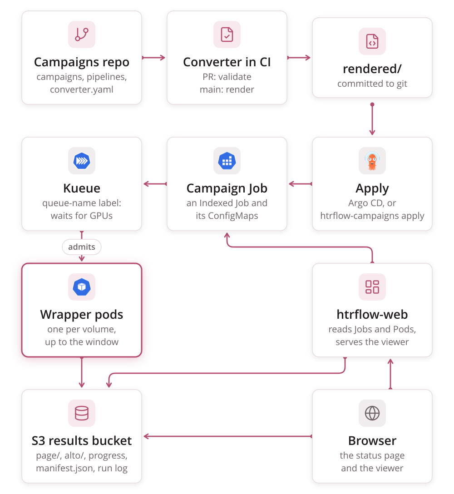

# Campaigns

A **campaign** is one Kubernetes `batch/v1` Job with
`completionMode: Indexed`, with one index per volume. Kubernetes and
[Kueue](queueing.md) own scheduling, retries, progress and pause.
htrflow-batch itself provides only three things:

- the wrapper
- a pure converter from campaign YAML to manifests, plus the one command that
  applies them
- a thin read API for the status page

There is no CronJob, no controller, and no state file in the bucket.

Two rules hold the design together:

- **Pausing a campaign is a Git change** (`suspend: true` in the campaign
  file). The pause is declared in Git and enforced by the apply step. Kueue
  owns `spec.suspend` on a Job it has admitted and undoes any change within
  seconds. So the pause sync in `htrflow-campaigns apply` puts the same intent
  on the Workload's `spec.active`. `make campaigns-apply` and an Argo CD
  `PostSync` hook both run that command
  ([Queueing](queueing.md#pause)).
- **Deleting a campaign's file cancels the campaign**, but only if the apply
  is asked to prune. The next `render` drops the campaign from `rendered/`,
  and a pruning apply then deletes its Job and ConfigMap: `htrflow-campaigns
  apply --prune`, which is the Argo CD hook's command and, by hand,
  `make campaigns-apply PRUNE=1`. A prune deletes every Job and
  ConfigMap carrying the converter's `managed-by: converter` label that the
  render did not produce. Without pruning, the deleted campaign's Job simply
  stays. **Nothing here ever touches results already in S3.**

Both rules hold only because `htrflow-campaigns apply` is the one thing that
applies `rendered/`. Every rendered object is a Skip hook to Argo CD, and
Argo CD runs the command as a hook instead of applying the directory
([`rendered/` with Argo CD](../reference/campaign-yaml.md#with-argo-cd)):
an applier that makes the cluster match `rendered/` would create a finished
campaign's reaped Job again and run every volume again.

It is also one apply at a time. Two at once, such as the Argo CD hook and a
hand-run `make campaigns-apply`, would interleave, and a prune from the
older checkout would delete the Job and ConfigMap the newer one had just
created. So an apply holds the `coordination.k8s.io` Lease
`htrflow-campaigns-apply` in the namespace for its whole run. It renews the
Lease between steps and releases it at the end. A second apply that finds
the Lease held sends nothing, names the holder and exits `1`. A Lease left
unrenewed for five minutes belongs to an apply that died, and the next one
takes it over. An apply whose Lease was taken over stops where it is.

Everything else follows from those two rules and ordinary Kubernetes
semantics. Nothing here runs on a timer, and nothing here has to stay alive
for a submitted campaign to keep running.

## Architecture




## The campaigns repo

The campaigns repo is separate from `htrflow-batch`. Operations and code
change at different rhythms, and separate repos keep pull-request review
legible: "new campaign" is a different kind of change from "new feature".
Its CI runs `htrflow-campaigns validate` on every pull request. On `main` it
runs `htrflow-campaigns render` and commits the result under `rendered/`.
[`examples/campaigns/`](https://github.com/AI-Riksarkivet/htrflow-batch/tree/main/examples/campaigns)
shows the exact shape, in `.github/workflows/render.yml`;
`htrflow-campaigns init --ci azure` writes the Azure Pipelines version,
`azure-pipelines.yml`, instead. Who may write to this repo, and
what that grants, is covered under
[Security → Trust boundary](security.md#trust-boundary).

```
converter.yaml
campaigns/
  example.yaml
pipelines/
  demo-v1.yaml
rendered/                # committed by CI on main, never hand-edited
  pipelines/demo-v1.yaml
  campaigns/example.yaml
```

Every field's rules are in [Campaign & Pipeline YAML](../reference/campaign-yaml.md).

### Campaign file

```yaml title="campaigns/example.yaml"
pipeline: demo-v1        # exactly one pipeline per campaign
priority: ""             # optional: htr-interactive / htr-bulk / htr-idle (the chart's classes); empty is htr-bulk
window: 20               # optional: this campaign's parallelism, capped by converter.yaml's window
volumes:
  - <ref>                          # shorthand: expanded through converter.yaml's source_template
  - id: volume-2                   # any IIIF manifest (Presentation 2 or 3), http(s) only
    manifest: https://iiif.example.org/volume-2/manifest
  - id: loose-scans                # bare image URLs: the wrapper builds
    images:                        #   a Presentation 3 manifest itself, in S3
      - https://example.org/scan1.jpg
      - https://example.org/scan2.jpg
```

- **Volume ids.** A volume's `id` becomes the S3 prefix `<pipeline>/<id>/`.
  For the shorthand form, the id is the ref itself. The id also starts the
  volume's line in the campaign's `volumes.txt` ConfigMap. It must therefore
  be label-safe (`[A-Za-z0-9._-]`, alphanumeric at both ends, at most 63
  characters) and unique within the campaign.
- **A campaign is append-only.** A Job's `completions` is set once, at
  creation, from the volume list, and Kubernetes cannot change it afterwards.
  `htrflow-campaigns validate` and `render` refuse a campaign whose volume
  list differs from what is already in `rendered/`, and `htrflow-campaigns apply`
  refuses one whose ConfigMap in the cluster says otherwise: a different
  volume list, pipeline or image. Put new volumes in a new
  campaign file (`example-2.yaml`). The old results stay untouched and
  comparable side by side.
- **One pipeline per campaign.** A volume that needs different treatment
  goes in its own campaign file.
- **`window:`** is capped by `converter.yaml`'s `window`, the per-cluster
  limit. Set that limit to what the ClusterQueue's quota can admit
  ([Queueing → The window](queueing.md#the-window)).
- **`suspend: true`** pauses the campaign
  ([Campaign & Pipeline YAML](../reference/campaign-yaml.md)).
- **A changed recipe needs a new pipeline id** and a new campaign file.
  Results from `demo-v1` and `demo-v2` sit side by side under different S3
  prefixes.

### Pipeline file

A pipeline id names the **full recipe**: the htrflow steps *and* the exact
wrapper image that runs them.

```yaml title="pipelines/demo-v1.yaml"
image: <registry>/htrflow-batch@sha256:<digest>   # digest, REQUIRED
steps:
  - step: Segmentation
    ...
```

The converter uses `image` for the Job's containers and also passes it as
`IMAGE_DIGEST`. The wrapper stamps that value into every published
`manifest.json` and ALTO file, which links each result back through the Job
to the recipe in git. Tags are rejected, because the renderer needs the
digest. Which repositories an image may come from is enforced at admission
([Security → Trust boundary](security.md#trust-boundary)).

Only the `steps:` document goes into the `htr-pipeline-<id>` ConfigMap,
because that is what htrflow parses. Its sha256 is recorded as the
`pipeline-sha256` annotation. You can compare that value by hand with the
`pipeline_sha256` the wrapper records.

**A digest pins the code, not the model weights.** The warm-up pulls weights
from Hugging Face. If a step does not pin a model `revision` (enforceable
with the chart's `security.requireModelRevision`), an upstream model update
can still change output under the same pipeline id. The read-only cache,
filled once per pipeline, makes output stable in practice, not by guarantee.
GPU nondeterminism also rules out bit-identical reruns.

Every pipeline file also renders a **warm-up Job** (`htr-warmup-<id>`).
Re-applying an unchanged Job changes nothing, so a completed warm-up runs
once per pipeline id. It runs on CPU, outside Kueue. Batch pods wait in
an init container for its completion marker on the cache PVC before they run
([The model cache](wrapper.md#the-model-cache),
[Failure Handling](failure-handling.md#warm-ups-fail-the-same-way)).

## Immutability

Results are keyed by pipeline id. Treat `pipelines/<id>.yaml` as immutable
once any result exists under that id, and mint a new id (`demo-v2`) to change
a recipe.

While a campaign still references a pipeline, that is enforced. `rendered/`
is committed, so `validate` and `render` hold each pipeline's image and steps
against what the previous render recorded, and refuse an edit that a rendered
campaign still in `campaigns/` would run:

```
pipeline demo-v1 changed (image) but campaigns kyrk, loc still run it — a pipeline is immutable while campaigns reference it; add a new pipeline file (demo-v1-2) and point new campaigns at it
```

That is the rule a campaign author would otherwise meet as
`spec.template: field is immutable` from the API server, halfway through an
apply and after the pipeline ConfigMap had already changed underneath a
running campaign — indexes that had not started yet running a different
recipe from the ones that had. Once no rendered campaign names the pipeline
any more (a finished campaign's file is
[removed](#removing-a-finished-campaign)), the guard lets go, and keeping an
id whose results are published out of reuse is again **a convention enforced
by review**.

`rendered/` can be missing or edited: a checkout applied without a committed
render, or a change that deletes `rendered/pipelines/<id>.yaml`. So `apply`
also holds each rendered pipeline against the cluster before it sends
anything. When a campaign Job that has not ended still mounts
`htr-pipeline-<id>`, the steps in the live ConfigMap must be the rendered
ones, compared parsed. If they are not, nothing is applied:

```
pipeline demo-v1 is in the cluster with different steps and campaigns kyrk, loc still run it: a pipeline id is a permanent name for a recipe, so add a new pipeline file instead — nothing was applied
```

The guard is about the *recipe*, not about the rendered manifest. Upgrading
the converter, or changing a `converter.yaml` setting, renders every warm-up
Job's pod template differently without touching a recipe — `apply`
[replaces a warm-up Job](../reference/campaign-yaml.md#when-the-api-server-refuses-an-object)
for that, and never a campaign Job.

## What the converter renders

For each pipeline, `pipelines/<id>.yaml`:

- `ConfigMap htr-pipeline-<id>`, holding `pipeline.yaml: {steps: …}`.
- `Job htr-warmup-<id>`, which fills the model cache once per pipeline.

For each campaign, `campaigns/<name>.yaml`:

- `ConfigMap campaign-<name>`, holding `volumes.txt` with one line per index:
  `<id>\t<manifest-url>` or `<id>\timages:<url1> <url2> …`.
- `Job <name>`, with these settings:
  - `completionMode: Indexed`
  - `completions`: the number of volumes
  - `parallelism`: `min(campaign window, converter window)`
  - `backoffLimitPerIndex: 3`
  - `maxFailedIndexes`: equal to `completions`
  - a `podFailurePolicy`: exit 13 becomes `FailIndex`, and a
    `DisruptionTarget` condition is ignored
  - `ttlSecondsAfterFinished`: `converter.yaml`'s
    `ttl_seconds_after_finished`, or the pipeline's own
  - the Kueue labels ([Queueing](queueing.md#what-the-converter-puts-on-a-job))

Every object carries the converter's `campaign`, `pipeline` and
`managed-by: converter` labels. Campaign pods also carry `app: htrflow-batch`,
and the NetworkPolicies select on it.

A campaign file too big for one Job is split into `<name>-part1`,
`<name>-part2`, and so on, each its own Job. A part is too big once it has
more than 10 000 volumes or more than 900 KiB of `volumes.txt`, whichever
comes first. The API server refuses a ConfigMap over 1 MiB. An `images:`
volume is a single line of space-joined URLs, so a few dozen long image
volumes can reach that limit on their own. A split also shortens the
campaign's name. A Job's name becomes both the `batch.kubernetes.io/job-name`
label value and the prefix of its pods' names (`<job>-<index>`), and neither
may exceed 63 characters. For an Indexed Job the API server also holds the
hostname of its last pod, `<job>-<completions − 1>`, to a DNS label: no dots,
at most 63 characters. So a campaign file's name has no dots, and a long one
leaves room for its volume count; `validate` says so. A campaign file may not
itself be named `-part<number>` either.

### The record a campaign leaves

The Job is a **window**, not the record. It carries
`ttlSecondsAfterFinished`, so some time after the last index finishes
Kubernetes deletes it, and its `completedIndexes` and `failedIndexes` go
with it. What stays is the campaign's own pair of ConfigMaps, which have no
TTL at all:

| Object | Written by | Holds |
|---|---|---|
| `ConfigMap campaign-<name>` | `render`, then `apply` | `volumes.txt`, and the provenance annotations below |
| `ConfigMap campaign-<name>-status` | **both** the read API and `apply` | `phase`, `volumesTotal`, `volumesDone`, `volumesFailed`, `startedAt`, `finishedAt`, `resultsBase`, `jobUid` — and, from one writer only, `failedVolumes` |

Two writers, on purpose. The read API observes the most, because it reads
the pods and so is the only one that can say *why* a volume failed. But it
writes only while somebody has the status page open, and a campaign that
finishes unwatched would reach its TTL with no terminal record at all. So
`apply`, the one thing guaranteed to run, reads each campaign's live Job
before it decides anything and writes the ending it can see.

`failedVolumes` — up to 50 volume ids with one sentence each — is the one
field they do not share. Only the read API's **detail** route writes it,
because only that route reads the pods. The list route and `apply` leave the
field out of their write entirely rather than send an empty one, which would
wipe what the detail route observed. Each detail request names the failures
whose pods still exist, so the field is merged per volume id: a volume named
once stays named, and a newer sentence for it replaces the older one. A
failed volume whose pod left no message is named with an empty sentence —
it is still a failure. So a campaign nobody ever opened the page for keeps a
record with counts and no ids, and so does one whose failed pods were
collected before anyone looked; its volumes that the record does not name
read `unknown` rather than `done` whenever it counts more failures than it
names.

Who owns which field is settled by server-side apply's field managers.
`apply` writes the summary fields, `jobUid` and the labels **forced**, once
the Job is over: that ending is authoritative. Until then the read API
writes the whole record, merged over what is stored so that it never
shrinks — a value that says nothing never replaces one that says
something, and `finishedAt` never moves backwards. Once `apply` owns the
record's `phase` for this Job, the read API sends only what `apply` does
not own, which is `failedVolumes`; server-side apply keeps a field another
manager still owns when one leaves it out, so nothing is lost and there is
nothing left to conflict over.

`jobUid` is the Job the record is about. A Job recreated under the same
name — a reaped campaign whose file gained volumes, say — is another run,
and its record starts over: the read API replaces the old record whole
rather than merging into it, forcing the fields `apply` still owns from the
old run but only on the version it read, so an ending `apply` writes in
between wins; and `apply` never reads a record as the ending of a Job that
is there and not over. A record written before `jobUid` existed is taken to
be the current Job's. `-status` is a reserved campaign-file ending for the
same reason `-part<number>` is: `validate` refuses a campaign called
`x-status`.

The provenance annotations on the record, all under the converter's label
domain: `image-digest` is rendered, since it is a pure function of the repo
and `rendered/` has to stay byte-identical between two renders of it;
`campaigns-commit`, `applied-by` and `applied-at` are stamped by `apply`.
`applied-by` is `HTRFLOW_APPLIED_BY` when it is set — CI sets it from
whoever triggered the run — and otherwise the OS user of the apply,
lower-cased. It says who ran the command, which is all an apply can prove.
`applied-at` is the LAST apply of the campaign, so while a campaign is still
running it moves every time; it is not the campaign's start time, which is
`startedAt` in the status ConfigMap. Once the campaign is finished `apply`
leaves it alone and it stops moving.

These things follow.

- **A finished campaign is not run again.** `apply` reads the status
  ConfigMap beside the append-only check. A campaign the record says is
  finished — `Succeeded`, `Failed` or `PartiallyFailed` — whose
  `volumes.txt` has not moved is left alone, with one line saying so:
  `campaign kyrk finished <date>, unchanged, left alone (120/120 volumes)`.
  Without it, an apply after the Job's TTL found no Job, created one, and
  re-ran every volume. There is deliberately **no `--force`**: a campaign
  that should run again is a new campaign file.
- **A stored record counts only when it names the apply's own Job.** The
  read API may write every `campaign-<name>-status` ConfigMap, so a record
  on its own is only a claim. `apply` stamps the uid of the Job it created
  on the campaign ConfigMap, which only the apply identity may write, as
  `htrflow.riksarkivet.se/job-uid`. For a new campaign that is a second
  write of the ConfigMap, once its Job exists. A record whose `jobUid` is
  a different Job, or a record where no Job was ever created, is not
  believed. `apply` says so on stderr and applies the campaign. A campaign
  ConfigMap written before the annotation existed carries no uid, and its
  record is believed as before.
- **A live Job outranks the stored record.** While the campaign's Job
  exists, it alone says whether the campaign is over. A stored `Succeeded`
  beside a Job that is still running is left over from something else — a
  reused name, a prune that never tracked the record, a Job re-created by
  hand — and the campaign is applied, and its pause synced, as usual.
- **A check that cannot be made is not one that passed.** When the Job or
  the record cannot be read (a refused `get`, a server error after the
  retries), `apply` leaves that campaign exactly as it is, names it, and
  exits non-zero, rather than risk re-running a finished campaign.
- **A changed volume list is still refused** by the append-only rule, before
  any of this is reached.
- **The status page still shows it.** `GET /api/v1/jobs` merges the Jobs
  with these ConfigMaps. A pair with no Job is a row carrying `jobGone:
  true`, the phase and counts the record last observed, and the dates. Its
  detail response carries the failed volumes with their reason, but no
  per-volume rows — those were the Job's. The card shows a "job removed"
  chip. A Job removed some other way, by hand or by a prune, can leave a
  record that never reached a terminal phase; that row reads `Unknown`
  ("outcome unknown") rather than a `Running` that can no longer change.

### Removing a finished campaign

Delete the campaign file from `campaigns/` when the campaign is over and you
no longer want it on the status page. That is what prunes both ConfigMaps —
`apply --prune`. Nothing else does, and nothing
expires them. **The results in the bucket are not touched.** Removing those
is a separate, deliberate step, and the record says what there is to remove.
Leaving the file in place costs two small ConfigMaps and keeps the campaign
on the page; there is no wrong answer, only the difference between the two.

## A worked example

This section runs `htrflow-campaigns render` on a small two-volume campaign
and walks through the output field by field. The blocks are abridged from a
real render. Three kinds of value are replaced with placeholders: the image
digest, the manifest URL and the results base. `<label-domain>` stands for
the converter's label domain (`_MANAGED_BY_LABEL` in `render.py`).

### The inputs

These are the files from
[`examples/campaigns/`](https://github.com/AI-Riksarkivet/htrflow-batch/tree/main/examples/campaigns),
except for this campaign file:

```yaml title="campaigns/example.yaml"
pipeline: demo-v1
volumes:
  - id: volume-1
    manifest: <iiif-manifest-url>

  - id: loose-scans
    images:
      - https://example.org/scan1.jpg
      - https://example.org/scan2.jpg
```

```yaml title="pipelines/demo-v1.yaml"
image: <registry>/htrflow-batch@sha256:<digest>
steps:
  - step: Segmentation
    settings:
      model: yolo
      model_settings:
        model: Riksarkivet/yolov9-regions-1
  - step: TextRecognition
    settings:
      model: TrOCR
      model_settings:
        model: Riksarkivet/trocr-base-handwritten-hist-swe-2
```

These values from `converter.yaml` show up below:

- `namespace: htr-batch`
- `queue: htr-batch`
- `window: 20`
- `s3_secret: htr-batch-s3`
- `data_pvc: htr-test-data`
- `runtime_class: nvidia`
- `public_results_base: <results-base-url>`

It sets nothing else, so the rest are the defaults:

- `max_seconds: 21600`
- `warmup_wait_seconds: 900`
- `ttl_seconds_after_finished: 604800`
- `manifest_max_bytes` and `fetch_max_bytes` at 16 and 64 MiB

The full file and what each field means are in
[Campaign & Pipeline YAML](../reference/campaign-yaml.md).

### The command

```console
$ uv run --no-sync htrflow-campaigns render <campaigns-repo> --out <campaigns-repo>/rendered
```

`render` exits 0 and writes one output file per source file:

- `rendered/campaigns/example.yaml`: the campaign's ConfigMap and Job.
- `rendered/pipelines/demo-v1.yaml`: the pipeline's ConfigMap and warm-up
  Job.

Running the same render again produces byte-identical output. The converter
is a pure function of its input files.

### The campaign ConfigMap

```yaml title="rendered/campaigns/example.yaml (part 1 of 2)"
apiVersion: v1
kind: ConfigMap
metadata:
  name: campaign-example
  namespace: htr-batch
  labels:
    <label-domain>/managed-by: converter
    <label-domain>/campaign: example
    <label-domain>/pipeline: demo-v1
data:
  volumes.txt: |
    volume-1	<iiif-manifest-url>
    loose-scans	images:https://example.org/scan1.jpg https://example.org/scan2.jpg
```

There are two lines, one per volume, in campaign-file order. That order fixes
which line `$JOB_COMPLETION_INDEX` reads: index 0 gets `volume-1` and index 1
gets `loose-scans`. The exact format is in the
[Wrapper reference](../reference/wrapper.md).

- **A shorthand ref** would appear here already expanded into a full manifest
  URL through `converter.yaml`'s `source_template`.
- **The `images:` volume** becomes one line: `images:` followed by its URLs,
  space-joined, with no manifest anywhere.
- **`managed-by: converter`** is how `apply --prune` finds this object again
  once its campaign file is deleted.
- **`argocd.argoproj.io/hook: Skip`** keeps Argo CD from applying it: only
  `htrflow-campaigns apply` does.
- **`campaign` and `pipeline`** record where the object came from.

### The Indexed Job

```yaml title="rendered/campaigns/example.yaml (part 2 of 2, trimmed)"
apiVersion: batch/v1
kind: Job
metadata:
  name: example
  namespace: htr-batch
  labels:
    app: htrflow-batch
    <label-domain>/managed-by: converter
    <label-domain>/campaign: example
    <label-domain>/pipeline: demo-v1
    kueue.x-k8s.io/queue-name: htr-batch
spec:
  completionMode: Indexed
  completions: 2
  parallelism: 20
  backoffLimitPerIndex: 3
  maxFailedIndexes: 2
  podFailurePolicy:
    rules:
    - action: Ignore
      onPodConditions:
      - type: DisruptionTarget
    - action: FailIndex
      onExitCodes:
        containerName: wrapper
        operator: In
        values:
        - 13
    - action: FailIndex
      onExitCodes:
        containerName: warmup-wait
        operator: In
        values:
        - 13
  ttlSecondsAfterFinished: 604800
  template:
    spec:
      restartPolicy: Never
      activeDeadlineSeconds: 21600
      terminationGracePeriodSeconds: 120
      automountServiceAccountToken: false
      containers:
      - name: wrapper
        image: <registry>/htrflow-batch@sha256:<digest>
        command: [/bin/sh, -c]
        args:
        - |
          set -eu
          mkdir -p "$HOME" "$TMPDIR" "$YOLO_CONFIG_DIR"
          line=$(sed -n "$((JOB_COMPLETION_INDEX + 1))p" /campaign/volumes.txt)
          [ -n "$line" ] || { echo "no volume for index $JOB_COMPLETION_INDEX" >&2; exit 13; }
          id=${line%%	*}; src=${line#*	}
          export VOLUME_REF="$id"
          case "$src" in images:*) export IMAGES="${src#images:}" ;; *) export IIIF_MANIFEST_URL="$src" ;; esac
          exec python -m htrflow_batch
        env:
        - name: PIPELINE_PATH
          value: /config/pipeline.yaml
        - name: PIPELINE_ID
          value: demo-v1
        - name: S3_PREFIX
          value: htr-batch/
        - name: PUBLIC_RESULTS_BASE
          value: <results-base-url>
        - name: IMAGE_DIGEST
          value: <registry>/htrflow-batch@sha256:<digest>
        - name: HF_HUB_OFFLINE
          value: '1'
        - name: HF_HOME
          value: /data/hf
        - name: HOME
          value: /work/home
        - name: TMPDIR
          value: /work/tmp
        volumeMounts:
        - name: campaign
          mountPath: /campaign
          readOnly: true
        - name: pipeline
          mountPath: /config
        - name: data
          mountPath: /data
          readOnly: true
        - name: work
          mountPath: /work
        - name: s3
          mountPath: /secrets/s3
          readOnly: true
        resources:
          requests: {cpu: "4", memory: 8Gi, nvidia.com/gpu: "1"}
          limits: {cpu: "4", memory: 16Gi, nvidia.com/gpu: "1"}
      volumes:
      - name: data
        persistentVolumeClaim:
          claimName: htr-test-data
      - name: work
        emptyDir:
          medium: Memory
          sizeLimit: 2Gi
      initContainers:
      - name: warmup-wait
        image: <registry>/htrflow-batch@sha256:<digest>
        command:
        - /bin/sh
        - -c
        - 'n=0; until [ -f /data/warmup/demo-v1.done ]; do n=$((n+10)); [ "$n" -le
          900 ] || { echo "no warm-up marker at /data/warmup/demo-v1.done after 900s:
          the pipeline''s warm-up Job has not finished" >&2; exit 13; }; sleep 10;
          done'
        terminationMessagePolicy: FallbackToLogsOnError
      runtimeClassName: nvidia
```

What each field is for, and where its value comes from:

- **`completionMode: Indexed`, `completions: 2`.** One index per volume, set
  once from the campaign's volume count. Kubernetes cannot change
  `completions` on an existing Job, which is why a campaign is append-only.
- **`parallelism: 20`.** This is `min(campaign window, converter.yaml window)`.
  The campaign sets no `window:` of its own, so it gets `converter.yaml`'s
  cap directly. With only two volumes, at most two pods run at once anyway.
  Against the default one-GPU quota, this campaign could never be admitted
  ([Queueing → The window](queueing.md#the-window)).
- **`backoffLimitPerIndex: 3`, `maxFailedIndexes: 2`.** Each index gets up to
  3 retries, a converter constant. `maxFailedIndexes` always equals
  `completions`, so the campaign keeps going until every index has its own
  verdict.
- **`podFailurePolicy` rules, in order.**
  1. A `DisruptionTarget` condition (node drain, preemption) is ignored and
     costs no retry.
  2. A `wrapper` exit 13 is the wrapper's "do not retry" signal, for
     example a bad manifest or a bad pipeline config.
  3. A `warmup-wait` exit 13 means the init container gave up waiting for
     the marker. A retry would only hold the GPU again for a marker that is
     not coming.

  Order matters: `Ignore` must stay first, or a drained pod would be
  charged as a failed attempt.
- **`kueue.x-k8s.io/queue-name: htr-batch`.** Comes from `converter.yaml`'s
  `queue:`. Kueue's webhook suspends a Job with this label at creation, and
  Kueue admits it when quota frees.
- **The `warmup-wait` init container.** Waits for
  `/data/warmup/demo-v1.done` (`<pipeline id>.done`), polling every 10 s for
  at most `min(warmup_wait_seconds, activeDeadlineSeconds - 10)`. Here that is
  `min(900, 21590)` = 900 s. The clamp makes the gate always expire before
  the kubelet would kill the pod. Past that bound, the gate prints the marker
  path and exits 13, which the rule above turns into `FailIndex`.
  `FallbackToLogsOnError` makes that line the pod's termination message.
- **The wrapper's env.**
  - `PIPELINE_ID` and `S3_PREFIX` (`<namespace>/`, here `htr-batch/`) place
    the S3 keys.
  - `IMAGE_DIGEST` is the pipeline's own `image:` pin, stamped into every
    ALTO's provenance block.
  - `HF_HUB_OFFLINE=1` and `HF_HOME=/data/hf` let the wrapper find the
    pre-warmed cache without ever contacting Hugging Face
    ([The model cache](wrapper.md#the-model-cache)).
- **The shell prologue.** Reads line `$JOB_COMPLETION_INDEX + 1` of
  `/campaign/volumes.txt` (`sed` counts from 1, Kubernetes indexes from 0),
  splits it on the tab into `id` and `src`, and exports `VOLUME_REF`. It then
  exports `IMAGES` if `src` starts with `images:`, and `IIIF_MANIFEST_URL`
  otherwise.
- **`activeDeadlineSeconds: 21600`.** The pod's per-volume wall-clock
  budget, from `converter.yaml`'s `max_seconds`, because this pipeline sets
  none. The kubelet enforces it, not the wrapper.
- **The `work` emptyDir (`medium: Memory`, `2Gi`).** The tmpfs workdir.
  `HOME`, `TMPDIR` and `YOLO_CONFIG_DIR` all point into it. The wrapper
  downloads its lookahead window of pages here, and apart from the tmpfs this
  read-only-rootfs container can write nowhere
  ([The Wrapper → Memory bounds](wrapper.md#memory-bounds)).
- **The `data` mount, `readOnly: true`.** The model cache PVC
  (`converter.yaml`'s `data_pvc`), mounted read-only on every batch pod. The
  warm-up Job is the only writer.

### The pipeline ConfigMap

```yaml title="rendered/pipelines/demo-v1.yaml (part 1 of 2)"
apiVersion: v1
kind: ConfigMap
metadata:
  name: htr-pipeline-demo-v1
  namespace: htr-batch
  labels:
    <label-domain>/managed-by: converter
    <label-domain>/pipeline: demo-v1
  annotations:
    <label-domain>/pipeline-sha256: <sha256 of pipeline.yaml>
data:
  pipeline.yaml: |
    steps:
    - step: Segmentation
      settings:
        model: yolo
        model_settings:
          model: Riksarkivet/yolov9-regions-1
    - step: TextRecognition
      settings:
        model: TrOCR
        model_settings:
          model: Riksarkivet/trocr-base-handwritten-hist-swe-2
```

Only the `steps:` document goes in, not `image:`. `steps:` is what htrflow
parses (`Pipeline.from_config`), and the image lives in the Job specs. The
sha256 annotation is computed from exactly this YAML dump. It changes only
when `steps:` changes, which should never happen under the id `demo-v1` once
anything has run.

### The warm-up Job

```yaml title="rendered/pipelines/demo-v1.yaml (part 2 of 2, trimmed)"
apiVersion: batch/v1
kind: Job
metadata:
  name: htr-warmup-demo-v1
  namespace: htr-batch
  labels:
    app: htrflow-warmup
    <label-domain>/managed-by: converter
    <label-domain>/pipeline: demo-v1
spec:
  backoffLimit: 2
  podFailurePolicy:
    rules:
    - action: Ignore
      onPodConditions:
      - type: DisruptionTarget
    - action: FailJob
      onExitCodes:
        containerName: warmup
        operator: In
        values:
        - 13
  template:
    spec:
      restartPolicy: Never
      activeDeadlineSeconds: 3600
      containers:
      - name: warmup
        image: <registry>/htrflow-batch@sha256:<digest>
        args:
        - |
          set -eu
          mkdir -p "$HOME" "$TMPDIR" "$YOLO_CONFIG_DIR" "$HF_HOME"
          exec python -m htrflow_batch.warmup
        env:
        - name: PIPELINE_ID
          value: demo-v1
        - name: CUDA_VISIBLE_DEVICES
          value: ""
        - name: HF_HOME
          value: /data/hf
        volumeMounts:
        - name: data
          mountPath: /data
        resources:
          requests: {cpu: "2", memory: 4Gi}
      volumes:
      - name: data
        persistentVolumeClaim:
          claimName: htr-test-data
      runtimeClassName: nvidia
```

There is one warm-up Job per pipeline id. The campaign file did not ask for
it: it exists because `pipelines/demo-v1.yaml` exists. A pruning apply
deletes it, together with the pipeline ConfigMap, once that file is gone. How
it differs from the campaign Job:

- **No Kueue queue label.** It runs outside Kueue, on CPU
  (`CUDA_VISIBLE_DEVICES: ""`, no GPU request).
- **Not an Indexed Job.** It is a plain Job with a single completion.
- **Its `data` mount has no `readOnly: true`.** It is the one pod allowed to
  write into the model cache.
- **A smaller retry budget.** `backoffLimit: 2`, with a `podFailurePolicy`
  that fails the whole Job on exit 13.
- **The same `runtimeClassName`, `nodeSelector` and `tolerations`** as the
  campaign Job, so it lands where the cache PVC is mounted.

## Retries and failure

No reconciling loop decides what to resubmit.

- **Exit 13.** A pod exiting 13, the wrapper's "do not retry" signal (for
  example, an unsupported manifest), marks its index `FailIndex`, with no
  retry.
- **Other failures.** Kubernetes retries any other non-zero exit, and a
  killed pod (SIGTERM from a drain, or from the pod's own
  `activeDeadlineSeconds`), up to `backoffLimitPerIndex: 3` for that index.
  Each retry resumes from the pages the wrapper already published, so a long
  volume finishes across attempts even under a tight deadline.
- **The deadline.** It comes from the pipeline's `max_seconds:` when set, and
  from `converter.yaml`'s otherwise.
- **Disruptions.** A `DisruptionTarget` condition (node preemption,
  eviction) is ignored and costs no retry.
- **Exhausted indexes.** An index that runs out of retries counts toward
  `maxFailedIndexes`. The Job's own `failedIndexes` and `completedIndexes` are
  the full state.

The exit-code table is in [Failure Handling](failure-handling.md), and the
warm-up gate in [The model cache](wrapper.md#the-model-cache).

## The web front and status page

`packages/web` serves `GET /api/v1/jobs` and
`GET /api/v1/jobs/{namespace}/{name}`. It is a thin, read-only projection of
live Job, Pod and ConfigMap state. It holds no state of its own and caches
nothing, and it writes exactly one thing: the per-campaign status ConfigMap
above, from what it has just observed, and only when the stored body would
change — an idle page polls, and every poll would otherwise be a write. Each
request writes at most a fixed number of records, so a namespace of hundreds
of campaigns cannot turn one page load into hundreds of round trips; the
rest are written by the next poll, and by `apply`. A write it cannot make is
logged once per namespace and never fails a request, and a deployment with
no cluster to read writes nothing at all. A campaign's `phase` comes
straight from the Job:

- `Queued`: suspended, nothing done yet
- `Paused`: suspended, some indexes done
- `Running`
- `Succeeded`
- `PartiallyFailed`: the `Failed` condition with a non-empty
  `completedIndexes`. The campaign gave up, but what those indexes published
  is there
- `Failed`: the same condition with nothing completed
- `Unknown`: only ever on a row whose Job is gone and whose record never
  reached one of the phases above

A row whose Job has been reaped carries the same fields with `jobGone: true`
— see [The record a campaign leaves](#the-record-a-campaign-leaves).

Per-volume rows come from the campaign's `volumes.txt` ConfigMap, crossed with
`completedIndexes`, `failedIndexes`, and any pod still present for that index.
A failed pod's termination message becomes the row's `reason`. The URL half
of each `volumes.txt` line becomes the row's `sourceUrl`. The detail response
also reads the Job's `htr-pipeline-<id>` ConfigMap, so the card can list the
pipeline's steps and show its YAML. A missing ConfigMap means no steps, not
an error. For running volumes, the API also reads each volume's
`progress.json` out of the bucket ([Events and signals](signals.md)).

Every row also carries `warmup: {phase, reason?}`, taken from the pipeline's
warm-up Job, matched by namespace and pipeline label. The phase is one of:

- `missing`: no such Job exists, so the campaign's pods wait until their
  gate gives up
- `pending`
- `running`
- `succeeded`
- `failed`, with the same structured `reason` a volume carries

This is what tells a reader why a campaign's pods are stuck in `Init:0/1`
while the campaign's own `phase` still says `Running`.

The status page is a Svelte single-page app served by the same process, on
the same origin as `/api/v1` and the Universal Viewer at `/uv.html`: one
image, no proxy. It writes nothing and holds no cluster credentials of its
own. The full reference is [Campaign Browser](../reference/frontend.md).

## Bucket layout

The full tree is in [S3 Layout](../reference/s3-layout.md). The wrapper is
the only writer under a pipeline's prefix. Nothing reconciles or
post-processes it.

| Key | Meaning |
|---|---|
| `<pipeline>/<volume>/page/*.xml`, `alto/*.xml` | Per-page results, streamed (PAGE first, ALTO second) |
| `<pipeline>/<volume>/progress.json` | How far the running volume has got. Never a completion marker |
| `<pipeline>/<volume>/iiif.json` | Viewer manifest with text overlay |
| `<pipeline>/<volume>/manifest.json` | **Completion marker** and provenance, written last |
| `sources/<pipeline>/<volume>/manifest.json` | The Presentation 3 manifest the wrapper builds for `images:` volumes |
| `status/logs/<pipeline>/<volume>.txt` | The run's own log, shipped live ([Events and signals](signals.md#the-run-log)) |

## Trade-offs

1. **Write access to the campaigns repo is a trust decision.** See
   [Security → Trust boundary](security.md#trust-boundary).
2. **The results bucket is the only durable record of results.** Git holds
   the desired state, and the cluster holds a Job for a week after it
   finishes by default. Nothing in htrflow-batch copies results anywhere else. How
   durable the results are therefore depends entirely on the bucket: its
   replication, versioning and backups. Losing the bucket means recomputing
   every campaign.
3. **Volumes from arbitrary web hosts fail in ways the platform cannot
   tune**: hotlink blocks, auth walls, flaky hosts. There is no pre-validation
   step. A bad manifest URL shows up as a failed index, with the wrapper's own
   error as its `reason`.
4. **Campaign pods reach only the IIIF origins listed in `network.iiifCidrs`**
   ([Security → NetworkPolicy](security.md#networkpolicy)), and whatever
   your own network's egress rules allow. A source outside both fails the
   volume at setup.
5. **Run logs may be world-readable.** The browser needs them, and a log can
   carry the redacted host and path of a private IIIF source
   ([Security → The bucket policy](security.md#the-bucket-policy)).
6. **A permanently failed volume has no declarative "skip".** Delete it from
   the campaign file (git history records the change). If it should run again,
   add it back under a new campaign file. A capped index does not get a fresh
   retry budget on its own.
