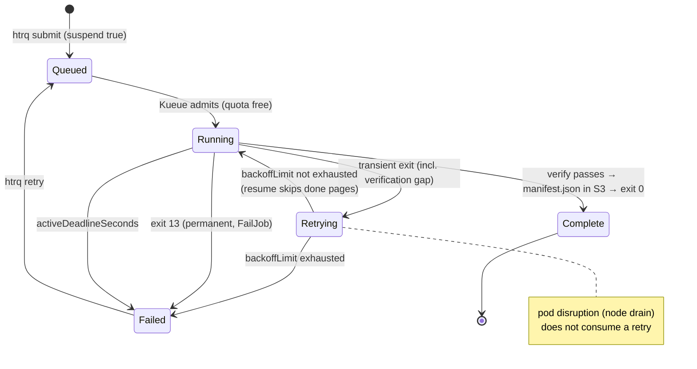

# Failure Handling

Invariants:

- **Complete ⇔ verified ⇔ `manifest.json` exists** (per pipeline id). Exit code
  alone is never trusted (see the [known upstream flaw](decision-log.md#known-upstream-flaw-the-design-must-absorb)).
- Retries converge: per-page overwrite + resume → a retry of a long volume
  costs minutes, not hours.
- A page that can't be fetched or transcribed after retries **fails the whole
  Job** — archival completeness over partial results.
- Failed Jobs stay inspectable 7 days; reason surfaced via termination-log.
