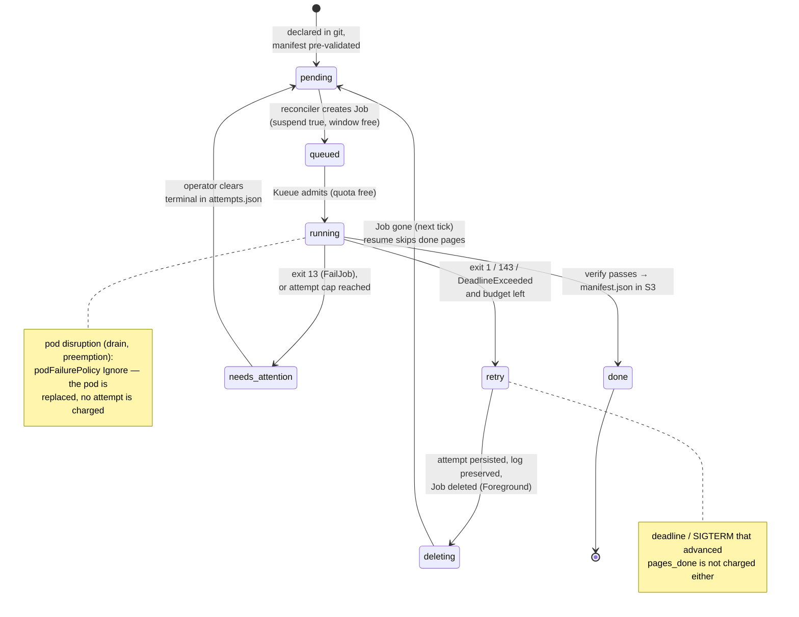

# Failure Handling

Failure handling has two layers and one authority. The **wrapper** decides
whether a failure is permanent (exit 13) or transient (exit 1), or reports a
kill (exit 143). The **Job** carries that verdict in its `Failed` condition
and absorbs disruptions. The **reconciler** owns retries, budgets and the
sticky verdict — and the only thing that ever means "done" is
`manifest.json` in S3.

`needs_attention` is `needs-attention` in `status.json`; the pre-validation
states `unreachable` / `unsupported` sit before `pending` and never reach the
cluster ([state table](../reference/reconciler.md#volume-states)).

## Invariants

- **Done ⇔ verified ⇔ `manifest.json` exists** (per pipeline id). Exit code
  alone is never trusted (see the
  [known upstream flaw](decision-log.md#known-upstream-flaw-the-design-must-absorb)):
  the wrapper lists `page/` and `alto/` after the run and publishes the
  marker only when both cover every page.
- **Retries converge.** Per-page keys are overwritten blindly and a resumed
  run skips pages that already have both files (and whose source image URL
  has not changed, per `manifest.json.page_sources`), so a retry of a long
  volume costs minutes, not hours.
- **A page that cannot be fetched or transcribed fails the whole volume** —
  archival completeness over partial results. The verify gate reports the
  missing/failed page list in the termination message.
- **`needs-attention` is sticky.** The verdict is written to
  `status/attempts.json` the first tick it is seen, so a Job being
  TTL-reaped 24 h later cannot turn the volume back into `pending` and burn a
  GPU run every day.

## The Job contract

Built by `jobspec.build_job`; `templates/job-example.yaml` mirrors it.

| Field | Value | Why |
|---|---|---|
| `backoffLimit` | `0` | One pod per Job. Retries are the reconciler's, so an attempt is a whole resumed run with fresh evidence, not a kubelet restart loop that re-pulls a 10 GB image |
| `podFailurePolicy` | `Ignore` on pod condition `DisruptionTarget`; `FailJob` on container `wrapper` exit code `13` | A node drain, preemption or eviction replaces the pod without failing the Job (and without an attempt). Exit 13 fails the Job at once, and the `Failed` condition then carries reason `PodFailurePolicy` — the verdict survives the pod being gone. Exit 143 matches neither rule |
| `activeDeadlineSeconds` | `max(job.minDeadlineSeconds, pages × job.secondsPerPage)` = `max(6 h, pages × 30 s)` | ~13 s/page measured on the PoC GPU; a flat 6 h could never finish a 1 700-page volume. The minimum applies when the page count is unknown |
| `ttlSecondsAfterFinished` | `86400` (24 h) | Failed Jobs stay inspectable a day; everything the reconciler needs from them is copied to S3 before that |
| `suspend` | `true` | Kueue admits it |
| labels | `app=htrflow-batch`, `batch.htrflow/managed-by=reconciler`, `batch.htrflow/{volume,pipeline,campaign}`, `kueue.x-k8s.io/queue-name` | window accounting, fairness, selectors |
| `terminationGracePeriodSeconds` | default (30 s) | Enough for the wrapper's SIGTERM handler: one local write + one bounded S3 PUT |

Resources, mounts and the pod hardening are in
[The Wrapper → Job template](wrapper.md#job-template-one-volume-one-job).

## Exit codes and what each one costs

| Wrapper exit | Written to `/dev/termination-log` | Job | Reconciler |
|---|---|---|---|
| `0` | — | `Complete` | `done` once `manifest.json` is visible (a moment of `queued` in between) |
| `13` permanent | `{"stage", "permanent": true, "error"}` | `Failed`, reason `PodFailurePolicy` | `needs-attention`, `terminal: "exit-13"` persisted; never resubmitted |
| `1` transient | `{"stage", "permanent": false, "error"}` | `Failed` | `retry` while `n < attemptCap`: bump **and persist** `n`, preserve evidence, delete the Job; resubmitted next tick. At the cap: `needs-attention`, `terminal: "capped"` |
| `143` SIGTERM (deadline, drain that reached the container) | `{"stage", "permanent": false, "error": "SIGTERM"}`, then the final log ship | `Failed` (reason `DeadlineExceeded` when the Job deadline caused it) | `retry` as above — **except** that when `pages_done` advanced since `pages_at_submit`, no attempt is charged: the run made progress and the resumed run will skip it |
| none (pod disrupted before/while running) | — | pod replaced (`Ignore`) | nothing to do; still `running`/`queued` |

Permanent, per the wrapper: config errors (missing env), a manifest URL that
is not http(s), 400/401/403/404/410 on the manifest, a body over
`MANIFEST_MAX_BYTES`, non-JSON, no canvases, a canvas without an image, bad
pipeline YAML, an unknown step or model class. Transient: 5xx/429/network on
the manifest, page fetch or transcription failures surfacing at verify, a
model-load `OSError`, five consecutive upload failures (`UploadOutage`).
Full table: [Wrapper reference](../reference/wrapper.md#exit-codes).

## Evidence that survives the Job

Everything an operator needs is in the bucket before the reconciler deletes
or the TTL reaps a Job:

| Key | Written when | Content |
|---|---|---|
| `status/logs/<pipeline>/<volume>.txt` | while the volume runs, every 15 s, and once on exit (also on SIGTERM) | the wrapper's own stdout/stderr — the complete log ([Live run log](live-run-log.md)) |
| `status/failures/<pipeline>/<volume>.txt` | on `retry` (before the delete) and on first-sight `needs-attention` | the shipped run log when there is one, else a 50-line `kubectl logs` tail |
| `<pipeline>/<volume>/metrics-failed-latest.json` | by the wrapper on every failed run | stage, error, per-page results, `gpu_stall_seconds` |
| `status/warmup/<pipeline>.log` | when a warm-up Job fails | its pod log |
| `status/attempts.json` | immediately after every change | `{"<pipeline>/<volume>": {"n", "terminal", "pages_at_submit"}}` |

On the retry path the run-log key is retired (deleted) after its copy, so
the next attempt is never shown the previous attempt's log as if it were
live; on `needs-attention` it stays, so later ticks keep the complete log.

## Retry budgets and clearing a verdict

Budgets are keyed per *(pipeline, volume)* in `status/attempts.json`, so a
volume that burned its attempts on `demo-v1` starts fresh on `demo-v2` — a
new pipeline id is the upgrade path and must not inherit an exhausted
budget. The default cap is 3 (`reconciler.attemptCap`).

To re-run a `needs-attention` volume: fix the cause, then delete its
`<pipeline>/<volume>` key from `status/attempts.json` (credentials needed;
the file is not anonymous-readable) — or declare it under a new pipeline id.
The campaign browser shows the verdict as a `terminal` tag next to the
status chip.

## Warm-ups fail the same way

A pipeline's `htr-warmup-<id>` Job (`backoffLimit: 2`, 1 h deadline, the
same `podFailurePolicy` on its `warmup` container) shares the attempt cap
under the key `warmup/<pipeline>`. A transient failure (HF Hub outage) is
logged to `status/warmup/<id>.log`, deleted and recreated next tick; a
permanent one (exit 13: bad model id, unknown step, invalid YAML) or the cap
parks the pipeline with a `model warm-up needs attention` warning and no
delete-recreate loop. Clearing `warmup/<id>` in `attempts.json` (or a new
pipeline id) is the retry.

## The reconciler's own failures

- **Two ticks at once** (a manual `kubectl create job --from=cronjob/…`):
  the second finds the Lease held and exits 0 without doing anything.
- **A tick killed by its deadline** (`reconciler.tickDeadlineSeconds`, 600
  s): validation verdicts and attempt bumps were persisted as they happened;
  submissions and `status.json` are lost for that tick and redone next tick.
  The Lease expires on its own.
- **One bad volume** (an S3 error, a kube 500) marks that row `error` in
  `status.json`; the campaign and the tick continue.
- **Corrupt owned JSON** (`attempts.json`, `validation.json`,
  `volumes.json`) is treated as absent with a warning. Losing `attempts.json`
  resets budgets and terminal verdicts — the one case where a capped volume
  would be resubmitted.
- **Dead reconciler**: `status.json` stops updating and the page shows
  **STALE** after `3 × tick_seconds`. There is no alerting beyond that.
