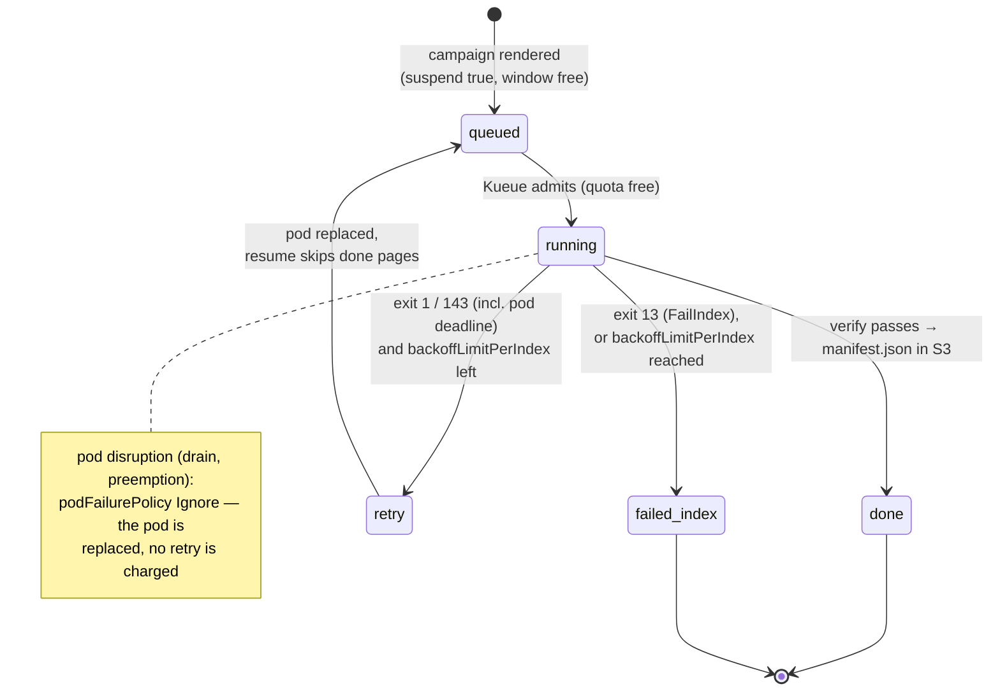

# Failure Handling

Failure handling has two layers and one authority. The **wrapper** decides
whether a failure is permanent (exit 13) or transient (exit 1) and reports a
kill (exit 143) — including the one the kubelet sends when the pod's
wall-clock budget runs out. The
**Indexed Job** carries that verdict per index and absorbs disruptions —
retries, budgets and progress are Kubernetes', not anything this repo runs.
The only thing that ever means "done" is `manifest.json` in S3.

`failed_index` shows up in the Job's `failedIndexes` field and the read
API's per-volume `state: "failed"`, with the wrapper's termination message
as `reason` for as long as the pod that produced it still exists.

## Invariants

- **Done ⇔ verified ⇔ `manifest.json` exists** (per pipeline id). Exit code
  alone is never trusted (see the
  [known upstream flaw](decision-log.md#known-upstream-flaw-the-design-must-absorb)):
  the wrapper lists `page/` and `alto/` after the run and publishes the
  marker only when both cover every page.
- **Retries converge.** Per-page keys are overwritten blindly and a resumed
  run skips pages that already have both files (and whose source image URL
  has not changed, per `manifest.json.page_sources`), so a retry of a long
  volume costs minutes, not hours.
- **A page that cannot be fetched or transcribed fails the whole volume** —
  archival completeness over partial results. The verify gate reports the
  missing/failed page list in the termination message.
- **A campaign is append-only.** `completions` is fixed at creation from the
  volume list; nothing in this design can add volumes to a running campaign
  — a new campaign file is the only way (see
  [Campaign & Pipeline YAML](../reference/campaign-yaml.md)).

## The Job contract

Rendered by the converter's `render._campaign_job`.

| Field | Value | Why |
|---|---|---|
| `completionMode` | `Indexed` | One index per volume; `$JOB_COMPLETION_INDEX` selects the line of `volumes.txt` a pod runs |
| `completions` | number of volumes in the campaign | Fixed at render time — this is what makes a campaign append-only |
| `parallelism` | the campaign's `window:`, else `converter.yaml`'s default (20) | How many volumes run at once, subject to Kueue's own quota |
| `backoffLimitPerIndex` | `3` | Per-index retry budget — Kubernetes' own bookkeeping, nothing to reconcile |
| `maxFailedIndexes` | = `completions` | A campaign never aborts early on failures; every index gets its own verdict |
| `podFailurePolicy` | `Ignore` on pod condition `DisruptionTarget`; `FailIndex` on container `wrapper` exit code `13` | A node drain, preemption or eviction replaces the pod without failing the index (and without a retry charged). Exit 13 fails the index at once. Exit 143 (SIGTERM) matches neither rule, so it is retried like exit 1 |
| `ttlSecondsAfterFinished` | `86400` (24 h) | The whole campaign Job stays inspectable a day after its last index finishes, then self-cleans; the wrapper has already put everything durable in S3 |
| Kueue labels | `queue-name`, `priority-class` (when the campaign sets `priority:`) | window accounting, fairness, selectors |
| `terminationGracePeriodSeconds` | `120` | The wrapper's SIGTERM handler joins the log-shipping thread (up to 30 s), then takes `_upload_lock` — a periodic PUT already in flight can hold it for the rest of its own budget (5 s connect, 30 s read, 2 attempts ≈ 70 s) — and only then ships the run log one last time through that same bounded client. The true worst case is therefore ≈ 140 s, more than the 120 s granted; the common case is a fraction of a second, and the only way to reach 140 s is an S3 endpoint answering nothing, where the final PUT fails inside any grace period and no larger number would save the log. The default 30 s, by contrast, would SIGKILL the pod mid-cleanup on a merely slow endpoint, losing the complete run log and the clean exit 143 |

The per-volume time limit is `spec.template.spec.activeDeadlineSeconds` —
the **pod's** deadline, not the Job's, rendered from `converter.yaml`'s
`max_seconds` (default 6 h) or the pipeline's own. A Job-level deadline
would kill the whole campaign; a pod-level one kills exactly the attempt
that overran. Verified on k3s v1.35.5: the kubelet SIGTERMs the container
(the wrapper writes its message and exits 143) and marks the pod
`status.reason: DeadlineExceeded` **without** a `DisruptionTarget`
condition — so the `Ignore` rule above does not swallow it, the attempt is
counted, and `backoffLimitPerIndex` retries the index.

Resources, mounts and the pod hardening are in
[The Wrapper → Job template](wrapper.md#job-template-one-campaign-one-indexed-job).

## Exit codes and what each one costs

| Wrapper exit | Written to `/dev/termination-log` | Index outcome |
|---|---|---|
| `0` | — | `Complete` — visible in `completedIndexes` once `manifest.json` exists |
| `13` permanent | `{"stage", "permanent": true, "error"}` | `FailIndex` — `failedIndexes`, never retried |
| `1` transient | `{"stage", "permanent": false, "error"}` | retried up to `backoffLimitPerIndex` (3), resuming from published pages; at the cap, `failedIndexes` |
| `143` SIGTERM (a drain that reached the container, or the pod deadline) | `{"stage", "permanent": false, "error": "SIGTERM"}`, then the final log ship | retried the same as exit 1 — progress already published is not redone |
| none (pod disrupted before/while running) | — | pod replaced (`Ignore`), no retry charged |

Permanent, per the wrapper: config errors (missing env), a manifest URL that
is not http(s), 400/401/403/404/410 on the manifest, a body over
`MANIFEST_MAX_BYTES`, non-JSON, no canvases, a canvas without an image, bad
pipeline YAML, an unknown step or model class. Transient: 5xx/429/network on
the manifest, page fetch or transcription failures surfacing at verify, a
model-load `OSError`, five consecutive upload failures (`UploadOutage`).
Full table: [Wrapper reference](../reference/wrapper.md#exit-codes).

## Evidence that survives the Job

Everything an operator needs is in the bucket well before the Job's
`ttlSecondsAfterFinished` TTL reaps it:

| Key | Written when | Content |
|---|---|---|
| `status/logs/<pipeline>/<volume>.txt` | while the volume runs, every 15 s, and once on exit (also on SIGTERM) | the wrapper's own stdout/stderr — the complete log ([Live run log](live-run-log.md)) |

The read API surfaces a failed pod's termination message as `reason` only
while that pod still exists — once the pod is garbage-collected the log
above is the remaining evidence for that attempt.

## Retries, natively

There is no retry budget file and nothing to clear by hand: `backoffLimitPerIndex`
and `maxFailedIndexes` are read straight off the Job by `kubectl describe
job` and the read API. A volume that exhausts its retries under one
pipeline id starts with a fresh budget the moment it is declared under a
new pipeline id (a new Job, from scratch) — re-running under a new pipeline
id is the natural upgrade path, and there is no shared state to reset.

To re-run a permanently-failed (`FailIndex`) volume: fix the cause (a model,
a manifest URL, a pipeline bug), then either wait for the next render if the
campaign's own volume list already covers it, or add it to a new campaign
file — a completed campaign Job's indexes do not get re-run in place.

## Warm-ups fail the same way

A pipeline's `htr-warmup-<id>` Job (`backoffLimit: 2`, 1 h deadline, the
same `podFailurePolicy` shape on its `warmup` container) fails independently
of any campaign. A transient failure is logged to `status/warmup/<id>.log`
by the pod itself and the Job is retried by Kubernetes up to its own
`backoffLimit`; a permanent one (exit 13: bad model id, unknown step,
invalid YAML) leaves the pipeline's warm-up Job failed and every campaign
using that pipeline stuck at its init container
(`warmup-wait`) until the Job is fixed and re-applied. There is no
delete-recreate loop or attempt cap shared with volumes any more — it is
just another Kubernetes Job.
