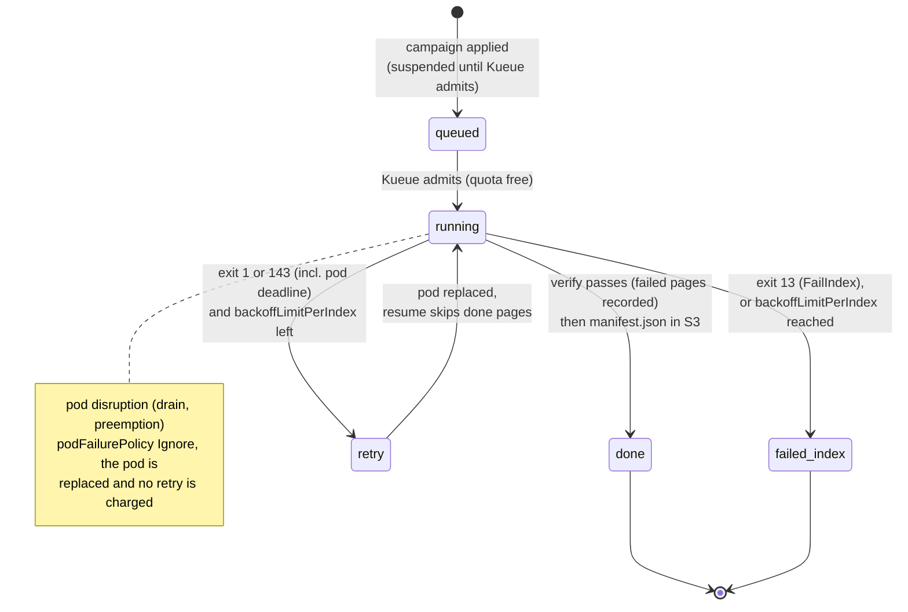

# Failure Handling

Failure handling has two layers and one authority:

- **The wrapper** decides whether a failure is permanent (exit 13) or
  transient (exit 1). It also reports a kill (exit 143), including the one the
  kubelet sends when the pod's wall-clock budget runs out.
- **The Indexed Job** carries that verdict for each index and absorbs
  disruptions. Retries, retry budgets and progress belong to Kubernetes, not
  to anything htrflow-batch runs.
- **`manifest.json` in S3** is the authority. It is the only thing that ever
  means "done".



A `failed_index` appears in the Job's `failedIndexes` field and as
`state: "failed"` on the read API's volume row. The wrapper's termination
message appears as the row's `reason` for as long as the pod that produced it
still exists.

A retried index stays inside the admitted Job, so it does not go back
through Kueue ([Queueing](queueing.md#failure-interplay)).

## Invariants

- **Done means verified means `manifest.json` exists** (per pipeline id).
  An exit code alone is never trusted. htrflow's own CLI submits pages to a
  thread pool without collecting the futures, so a page that throws can vanish
  while the process still exits 0. The wrapper runs each page itself and keeps
  its outcome. After the loop it also lists `page/` and `alto/`, and publishes
  the marker only when every page is accounted for.
- **Retries converge.** Per-page keys are overwritten blindly. A resumed run
  skips pages that already have both files and whose source image URL has not
  changed (per `manifest.json`'s `page_sources`). A retry of a long volume
  costs minutes, not hours.
- **A page that cannot be fetched or transcribed is recorded, not hidden.**
  The volume completes, and that page appears as `failed` in `manifest.json`,
  is counted in `pages_failed`, and is named on the campaign page. A page that
  fails deterministically fails the same way on every retry. Failing the whole
  volume for it would leave the bucket with the good pages and no marker to
  open them.
- **Two cases still fail the volume.** The first is a page **missing** from
  the results: neither uploaded nor recorded as failed, which is an
  inconsistency a retry converges on. The second is a run where every page it
  processed failed and nothing was resumed, which points to a broken model or
  a dead GPU. Both report their page lists in the termination message.
- **A campaign is append-only.** `completions` is fixed at creation from the
  volume list. Nothing can add volumes to a running campaign, and a new
  campaign file is the only way to add them
  ([Campaigns](campaigns.md#campaign-file)).

## The Job contract

`render._campaign_job` renders the Job. The full rendered object is in
[Campaigns → A worked example](campaigns.md#a-worked-example).

| Field | Value | Why |
|---|---|---|
| `completionMode` | `Indexed` | One index per volume. `$JOB_COMPLETION_INDEX` selects the `volumes.txt` line a pod runs |
| `completions` | the number of volumes in the campaign | Fixed at render time, which is what makes a campaign append-only |
| `parallelism` | `min(campaign window, converter.yaml window)` | How many volumes run at once, subject to Kueue's quota |
| `backoffLimitPerIndex` | `3` | The per-index retry budget. It is Kubernetes' own bookkeeping, so there is nothing to reconcile |
| `maxFailedIndexes` | equal to `completions` | A campaign never stops early because of failures. Every index gets its own verdict |
| `podFailurePolicy` | `Ignore` on pod condition `DisruptionTarget`. `FailIndex` on container `wrapper` exit 13. `FailIndex` on init container `warmup-wait` exit 13 | A node drain, preemption or eviction replaces the pod without failing the index or charging a retry. Exit 13 fails the index at once. Exit 143 (SIGTERM) matches no rule, so it is retried like exit 1. Rules apply in order, so `Ignore` stays first |
| `ttlSecondsAfterFinished` | `converter.yaml`'s `ttl_seconds_after_finished`, or the pipeline's own | The campaign Job stays inspectable that long after its last index finishes, then cleans itself up. By then the wrapper has put everything durable in S3, and the campaign's own ConfigMaps — which have no TTL — keep the record ([The record a campaign leaves](campaigns.md#the-record-a-campaign-leaves)) |
| `terminationGracePeriodSeconds` | `120` | Covers the wrapper's SIGTERM path in the common case (see below) |

**Why the grace period is 120 s.** On SIGTERM the wrapper's handler runs
three steps:

1. It joins the log-shipping thread, waiting up to 30 s.
2. It takes the upload lock. A periodic PUT already in flight can hold that
   lock for the rest of its own budget: 5 s connect plus 30 s read, over 2
   attempts, about 70 s.
3. It ships the run log one last time through the same bounded client.

The true worst case is therefore about 140 s, more than the 120 s granted.
The common case is a fraction of a second. The only way to reach 140 s is an
S3 endpoint that answers nothing, and then the final PUT fails within any
grace period, so no larger number would save the log. Kubernetes' default of
30 s, by contrast, would SIGKILL the pod mid-cleanup on a merely slow
endpoint, losing both the complete run log and the clean exit 143.

**The per-volume time limit is the pod's deadline**,
`spec.template.spec.activeDeadlineSeconds`, not the Job's. It is rendered from
the pipeline's own `max_seconds`, or from `converter.yaml`'s (default 21600 s,
6 h). A Job-level deadline would kill the whole campaign. A pod-level one
kills exactly the attempt that overran. At the deadline:

1. The kubelet SIGTERMs the container.
2. The wrapper writes its message and exits 143.
3. The kubelet marks the pod `status.reason: DeadlineExceeded`, **without**
   a `DisruptionTarget` condition.

The `Ignore` rule therefore does not swallow it. The attempt is counted, and
`backoffLimitPerIndex` retries the index.

Resources, mounts and pod hardening are in
[Campaigns → A worked example](campaigns.md#a-worked-example) and
[Security](security.md#pod-security-posture).

## Exit codes and what each one costs

| Wrapper exit | Written to `/dev/termination-log` | Index outcome |
|---|---|---|
| `0` | — | `Complete`, shown in `completedIndexes`, once `manifest.json` exists. A volume that lost pages still exits 0: they are recorded, and `pages_failed` says how many |
| `13` permanent | `{"stage", "permanent": true, "error"}` | `FailIndex`: in `failedIndexes`, never retried |
| `1` transient | `{"stage", "permanent": false, "error"}` | Retried up to `backoffLimitPerIndex` (3), resuming from published pages. At the cap, in `failedIndexes` |
| `143` SIGTERM (a drain that reached the container, or the pod deadline) | `{"stage", "permanent": false, "error": "SIGTERM"}`, then the final log ship | Retried the same as exit 1. Progress already published is not redone |
| none (pod disrupted before or while running) | — | Pod replaced (`Ignore`), no retry charged |

**Permanent, per the wrapper:**

- config errors, such as a missing environment variable
- a manifest URL that is not http(s)
- a 400, 401, 403, 404 or 410 on the manifest
- a manifest body over `MANIFEST_MAX_BYTES`, non-JSON, with no canvases, or
  with a canvas that has no image
- bad pipeline YAML, an unknown step or model class, or a setting a step
  does not take

**Transient:**

- a 5xx, a 429 or a network error on the manifest
- a page missing at verify
- a run where every processed page failed and nothing was resumed
- a model-load `OSError`, including a model missing from the read-only cache
- five consecutive upload failures (`UploadOutage`)
- three consecutive pipeline rebuild failures after a dead worker thread

The full table is in the [Wrapper reference](../reference/wrapper.md).

## A dead htrflow worker thread

htrflow's `Inference` steps (Segmentation, TextRecognition) hand each batch
to a daemon thread and wait on a `Future`. An exception inside that thread
kills it, and `pipeline.run` then waits for a future nobody will ever
complete. One known trigger is a YOLO detection whose mask is too small to
become a polygon: htrflow puts `None` in its polygon list, and the thread
dies with `TypeError: 'NoneType' object is not iterable`. Without a guard, the
pod would stand still with its GPU reserved until the pod deadline, then retry
onto the same page and stall again.

The wrapper does not wait for that. `driver` runs each page's `pipeline.run`
in a helper thread. It checks every step's worker threads before the run and
once a second (`THREAD_POLL_SECONDS`) while it waits. That includes each
step's own thread and its batching queue's thread. A step whose thread is gone
raises `PipelineDead`, which is a **page** failure like any other:

```
WARNING page 0044 failed: PipelineDead("page 0044: htrflow's Segmentation (model Riksarkivet/yolov9-regions-1) worker thread died; the page is marked failed and the pipeline is rebuilt")
WARNING rebuilding the htrflow pipeline after a dead worker thread
```

A pipeline built from scratch processes the next page. Its models come back
from the cache PVC, not the Hub. The rest of the volume runs, and the volume
**completes** with that one page recorded as failed:

- `manifest.json` names the page and its reason.
- `progress.json` carries the count and the sentence.
- The campaign row reads, for example, "637 / 638 pages · 1 failed".
- The viewer opens on the pages that came out.

It is not exit 1. The cause is in the image, so the page would die the same
way on every attempt, and the volume would end as a failed index with no
marker at all.

Before the rebuild, the dead pipeline's models are dropped and the CUDA cache
is emptied (`driver.release_pipeline`). The stuck run's helper thread is a
daemon that is never joined, and its frame holds the steps. Without that
release, the new pipeline would load a second set of weights onto the same
GPU. What stays parked for the life of the process is the thread itself and
that one page's document, not the models.

## What a person is told

The machine-readable forms above are for Kubernetes, the read API and the run
viewer's stop rule:

- exit codes
- the termination JSON
- the `permanent failure in <stage>:` prefix

None of them is a message, and none of them reaches a person unedited. Every
surface that talks to people says three things in plain sentences: **what
happened, where, and what to do next**. No surface shows JSON, Python reprs,
stage names or `loc` paths.

Each surface translates in exactly one place:

| Surface | Where the sentence is written |
|---|---|
| Campaign page (volume rows, failures block, banners) | `frontend/src/lib/reasons.ts`: `describeReason`, `describeApiError`. Wording pinned in `reasons.test.ts` |
| Run log | `packages/wrapper/src/htrflow_batch/main.py`: `_advice`, appended after the prefix |
| Converter CLI | `packages/converter/…/parse.py` and the models' validators. See [Campaign & Pipeline YAML](../reference/campaign-yaml.md) |

### A failed volume, on the campaign page

`reason` reaches the browser as `{stage, permanent, error}`. The card renders
one sentence per case and never shows the fields themselves.

| `error` | What the reader is told | What the operator does |
|---|---|---|
| `DeadlineExceeded` (also `MAX_SECONDS`, from an older wrapper) | "Stopped when this volume's time budget ran out; the next attempt resumes from the pages already finished." | Nothing, unless it keeps happening. Then raise `max_seconds` on the pipeline |
| `SIGTERM` | "The pod was stopped by the cluster (a node drain or a pause); the volume will be retried." | Nothing. The index is retried |
| Stage `config` (the wrapper sets it around `Config.from_env`) | "The volume's settings are incomplete or wrong: `<error>`. This is a deployment problem, not a manifest problem — check the campaign's converter.yaml and the chart values." | Fix `converter.yaml` or the chart values, and re-render. Nothing in the campaign file is wrong |
| A manifest or canvas error at stage `setup`, `permanent: true` | "The IIIF manifest could not be read: `<error>`. Fix the manifest URL in the campaign file — this volume will not be retried." | Fix the URL in `campaigns/<name>.yaml`, then put the volume in a new campaign |
| `verify failed: N missing, M failed … missing=[…]` | "2 pages are missing from the results (p012, p045); the volume is retried automatically and only those pages are redone." | Nothing, unless the retries also fail. A missing page is an upload that never landed, and resume redoes only it. The `failed=[…]` pages beside it are *not* named here: they are accounted for and are not coming back |
| `verify failed: all N processed pages failed …` | "None of the 3 pages processed in this attempt produced a result; the volume is retried automatically — check the model and the GPU." | Look at the node and the pipeline before the retries run out. Nothing came out of this pod at all |
| Stage `warmup` | The warm-up's own sentence, with whether it will be retried | See [Warm-ups fail the same way](#warm-ups-fail-the-same-way) |
| Anything else, with a stage | "Failed while processing pages: `<error>`." plus either "It will be retried automatically." or "This volume will not be retried — fix the cause, then put the volume in a new campaign." | Depends on the error. The run log is one click away on the same row |
| A termination message the API could not parse (raw JSON in `error`) | "The pod stopped without a message this page can read; open the run log to see what happened." | Open the run log |

The wrapper's `stage` tells a `config` failure apart from a `setup` failure,
not matching on the error text. `config` covers everything `Config.from_env`
rejects: a missing variable, or `IIIF_MANIFEST_URL` and `IMAGES` both set.
Only what follows it is `setup`.

Stage names turn into what the pod was doing:

| Stage | Shown as |
|---|---|
| `setup` | reading the manifest |
| `resume` | checking earlier results |
| `load` | loading the model |
| `stream` | processing pages |
| `verify` | checking results |
| `publish` | publishing results |

### The campaign page itself

| What went wrong | What the reader is told |
|---|---|
| A non-2xx or a network error, with a list already on screen | "Can't reach the campaign service right now (HTTP 503). Showing the list we last received. Retrying every 60 seconds." |
| The same, with nothing on screen yet | "Can't reach the campaign service right now (HTTP 500). Retrying every 60 seconds." |
| `404` on a campaign's detail | "This campaign is gone: its campaign file has been removed from the campaigns repo." A campaign whose Job its TTL reaped is not a 404 — it is still served from [the record](campaigns.md#the-record-a-campaign-leaves) |
| A 200 whose shape does not parse | "The campaign service answered in a form this page doesn't understand. Reload the page; if it keeps happening, the page and the service are running different versions." |

### The run log

The wrapper's terminal lines keep their prefix, because that is the contract
the run viewer's stop rule keys on. After an em dash, each line adds a
sentence:

```
ERROR permanent failure in setup: manifest is not JSON — a retry changes nothing — fix the campaign or pipeline file
ERROR transient failure in verify: verify failed: 1 missing, 0 failed missing=['0002'] failed=[] — some pages produced no result; the retry redoes only those
ERROR transient failure in stream: SIGTERM — stopped by the cluster (drain, pause, or time budget); retried
```

| Failure | The sentence |
|---|---|
| `verify failed: all …` | "no page produced a result — check the model and the GPU" |
| `verify failed: …` (a page missing from the results) | "some pages produced no result; the retry redoes only those" |
| `SIGTERM` | "stopped by the cluster (drain, pause, or time budget); retried" |
| Any permanent failure | "a retry changes nothing — fix the campaign or pipeline file" |
| Any other transient failure | "the index is retried, resuming from the pages already done" |

The sentences change nothing machine-readable. The wrapper still writes
`{"stage", "permanent", "error"}` with the bare error in it, and the read API
still parses that.

## Evidence that survives the Job

Everything an operator needs is in the bucket well before the Job's
`ttlSecondsAfterFinished` reaps it:

| Key | Written when | Content |
|---|---|---|
| `status/logs/<pipeline>/<volume>.txt` | While the volume runs, every 15 s, and once on exit (also on SIGTERM) | The wrapper's own stdout and stderr: the complete log ([The run log](signals.md#the-run-log)) |
| `<pipeline>/<volume>/progress.json` | After every page outcome and at every stage change, except in the `config` stage (see below) | The last stage reached, page counts and the most recent page failure |

A run that fails in the `config` stage writes no `progress.json` at all: the
bucket, the prefix and the volume's own name are settings, so until they
parse there is nowhere to write it to. That failure is permanent and its
evidence is the termination message and the pod's log, both of which name the
setting; the campaign page shows it from the pod.

The read API shows a failed pod's termination message as `reason` only while
that pod still exists. Once the pod is garbage-collected, the log above is
the remaining evidence for that attempt.

One field is rewritten on the way out. When a pod's `status.reason` is
`DeadlineExceeded` and its message's `error` is exactly `"SIGTERM"`, the API
shows `"error": "DeadlineExceeded"` instead. The wrapper cannot tell a deadline
kill from a node drain, since both arrive as SIGTERM. The pod can, and an
operator reading the card needs the difference.

## Retries, natively

There is no retry budget file and nothing to clear by hand.
`backoffLimitPerIndex` and `maxFailedIndexes` are read straight off the Job,
by `kubectl describe job` and by the read API. A volume that exhausts its
retries under one pipeline id gets a fresh budget when it is declared under a
new pipeline id, as a new Job, from scratch. Re-running under a new pipeline
id is the natural upgrade path, and there is no shared state to reset.

To re-run a permanently failed (`FailIndex`) volume:

1. Fix the cause: a model, a manifest URL, or a pipeline bug.
2. Add the volume to a new campaign file.

A campaign Job's indexes are not re-run in place.

## Warm-ups fail the same way

A pipeline's `htr-warmup-<id>` Job fails independently of any campaign. It
has `backoffLimit: 2`, a 1 h pod deadline, and a `podFailurePolicy` of the
same shape on its `warmup` container. Exit 13 there is `FailJob`.

- **The deadline is the pod's, not the Job's**, for the same reason a
  volume's is. The Job controller deletes a pod it kills on a Job-level
  deadline, and the termination message goes with it. On the pod template, the
  kubelet kills the pod instead: `status.reason` reads `DeadlineExceeded`, the
  message survives, and the attempt counts against `backoffLimit`. So a
  warm-up that ran out of time on a slow first download is retried, not
  terminally failed.
- **There is no warm-up log.** The pod mounts no S3 secret. It is the one pod
  that mounts the cache PVC read-write, and the only one the NetworkPolicy
  lets reach Hugging Face Hub. Its termination message
  (`{stage: "warmup", permanent, error}`) is read off the warm-up Job's pod
  and shown on the campaign card's warm-up chip
  ([Campaigns](campaigns.md#the-web-front-and-status-page)).
- **A transient failure** (a network or disk error) is retried by Kubernetes
  up to `backoffLimit`.
- **A permanent failure** is exit 13. The causes are a bad model id or
  revision, an unknown step, a setting a step does not take, invalid YAML,
  or a marker that could not be written. It leaves the warm-up Job failed.
- **The marker is written before the success log line**, and failing to write
  it is fatal. A warm-up that exits `0` without a marker would be a green Job
  whose campaigns then wait for nothing.
- **A kill leaves a message.** The warm-up installs the batch wrapper's
  SIGTERM handler, so a node drain, a preemption or the pod deadline leaves
  `{stage: "warmup", permanent: false, error: "SIGTERM"}`, not an empty
  message.

**The campaign side is bounded.** Every batch pod waits for the marker in its
`warmup-wait` init container, which gives up after `converter.yaml`'s
`warmup_wait_seconds` (default 900). It prints one line naming the marker it
waited for and exits 13. The campaign Job's `podFailurePolicy` turns that into
`FailIndex`, so the index fails once instead of being retried. The init
container reports with `terminationMessagePolicy: FallbackToLogsOnError`, so
that line becomes the row's `reason` on the campaign card. The wait has to be
bounded. A batch pod reserves `nvidia.com/gpu: 1` for its whole lifetime,
init containers included, and Kueue holds the quota through them. An endless
wait would cost one GPU for the pod's entire `activeDeadlineSeconds`, once per
retry, without a word anywhere.

### Why is the marker missing?

Look in three places, in this order:

1. **The index that gave up** says *which* marker it waited for.
2. **The warm-up Job** says *why* it never wrote one.
3. **The cache PVC** shows what is actually on disk.

```bash
# 1. The failed index's own pod, and the init container's one line.
kubectl -n <namespace> get pods -l batch.kubernetes.io/job-name=<campaign> \
  -L batch.kubernetes.io/job-completion-index
kubectl -n <namespace> logs <pod> -c warmup-wait
# no warm-up marker at /data/warmup/<pipeline>.done after 900s: …

# 2. The warm-up Job for that pipeline: did it run, and what did it say?
kubectl -n <namespace> get job htr-warmup-<pipeline>
kubectl -n <namespace> logs job/htr-warmup-<pipeline> --tail=50
kubectl -n <namespace> get pods -l batch.kubernetes.io/job-name=htr-warmup-<pipeline> \
  -o jsonpath='{.items[*].status.containerStatuses[*].state.terminated.message}'
# {"stage": "warmup", "permanent": true, "error": "…"}  (the chip's tooltip)

# 3. The marker directory, from any pod that mounts the cache PVC
#    (campaign pods mount /data read-only, which is enough to look).
kubectl -n <namespace> exec <running-pod> -- ls -l /data/warmup
```

A `Complete` warm-up Job with no marker on the PVC means the two are not
looking at the same volume. First check that the warm-up Job carries the same
`runtimeClassName`, `nodeSelector` and `tolerations` as the campaign Job. The
converter renders both from `converter.yaml`, and matching values put both in
the same node pool. A pool is not a node, though. With two or more GPU nodes,
a `ReadWriteOnce` cache can be filled on one node and read on another
([The Wrapper → The model cache](wrapper.md#the-model-cache)).

Once the cause is fixed, run
`kubectl delete job -n <namespace> htr-warmup-<pipeline>` and re-apply the
campaigns repo to run the warm-up again. The Job has no TTL, and the apply
does not recreate it while it still exists.
