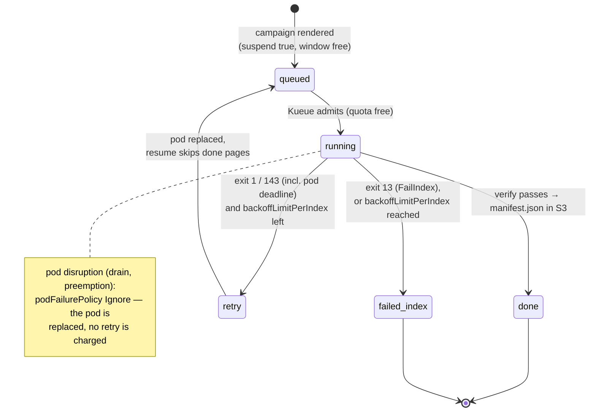

# Failure Handling

Failure handling has two layers and one authority. The **wrapper** decides
whether a failure is permanent (exit 13) or transient (exit 1) and reports a
kill (exit 143) — including the one the kubelet sends when the pod's
wall-clock budget runs out. The
**Indexed Job** carries that verdict per index and absorbs disruptions —
retries, budgets and progress are Kubernetes', not anything this repo runs.
The only thing that ever means "done" is `manifest.json` in S3.



`failed_index` shows up in the Job's `failedIndexes` field and the read
API's per-volume `state: "failed"`, with the wrapper's termination message
as `reason` for as long as the pod that produced it still exists.

## Invariants

- **Done ⇔ verified ⇔ `manifest.json` exists** (per pipeline id). Exit code
  alone is never trusted (see the
  [known upstream flaw](decision-log.md#known-upstream-flaw-the-design-must-absorb)):
  the wrapper lists `page/` and `alto/` after the run and publishes the
  marker only when both cover every page.
- **Retries converge.** Per-page keys are overwritten blindly and a resumed
  run skips pages that already have both files (and whose source image URL
  has not changed, per `manifest.json.page_sources`), so a retry of a long
  volume costs minutes, not hours.
- **A page that cannot be fetched or transcribed fails the whole volume** —
  archival completeness over partial results. The verify gate reports the
  missing/failed page list in the termination message.
- **A campaign is append-only.** `completions` is fixed at creation from the
  volume list; nothing in this design can add volumes to a running campaign
  — a new campaign file is the only way (see
  [Campaign & Pipeline YAML](../reference/campaign-yaml.md)).

## The Job contract

Rendered by the converter's `render._campaign_job`.

| Field | Value | Why |
|---|---|---|
| `completionMode` | `Indexed` | One index per volume; `$JOB_COMPLETION_INDEX` selects the line of `volumes.txt` a pod runs |
| `completions` | number of volumes in the campaign | Fixed at render time — this is what makes a campaign append-only |
| `parallelism` | the campaign's `window:`, else `converter.yaml`'s default (20) | How many volumes run at once, subject to Kueue's own quota |
| `backoffLimitPerIndex` | `3` | Per-index retry budget — Kubernetes' own bookkeeping, nothing to reconcile |
| `maxFailedIndexes` | = `completions` | A campaign never aborts early on failures; every index gets its own verdict |
| `podFailurePolicy` | `Ignore` on pod condition `DisruptionTarget`; `FailIndex` on container `wrapper` exit code `13` | A node drain, preemption or eviction replaces the pod without failing the index (and without a retry charged). Exit 13 fails the index at once. Exit 143 (SIGTERM) matches neither rule, so it is retried like exit 1 |
| `ttlSecondsAfterFinished` | `86400` (24 h) | The whole campaign Job stays inspectable a day after its last index finishes, then self-cleans; the wrapper has already put everything durable in S3 |
| Kueue labels | `queue-name`, `priority-class` (when the campaign sets `priority:`) | window accounting, fairness, selectors |
| `terminationGracePeriodSeconds` | `120` | The wrapper's SIGTERM handler joins the log-shipping thread (up to 30 s), then takes `_upload_lock` — a periodic PUT already in flight can hold it for the rest of its own budget (5 s connect, 30 s read, 2 attempts ≈ 70 s) — and only then ships the run log one last time through that same bounded client. The true worst case is therefore ≈ 140 s, more than the 120 s granted; the common case is a fraction of a second, and the only way to reach 140 s is an S3 endpoint answering nothing, where the final PUT fails inside any grace period and no larger number would save the log. The default 30 s, by contrast, would SIGKILL the pod mid-cleanup on a merely slow endpoint, losing the complete run log and the clean exit 143 |

The per-volume time limit is `spec.template.spec.activeDeadlineSeconds` —
the **pod's** deadline, not the Job's, rendered from `converter.yaml`'s
`max_seconds` (default 6 h) or the pipeline's own. A Job-level deadline
would kill the whole campaign; a pod-level one kills exactly the attempt
that overran. Verified on k3s v1.35.5: the kubelet SIGTERMs the container
(the wrapper writes its message and exits 143) and marks the pod
`status.reason: DeadlineExceeded` **without** a `DisruptionTarget`
condition — so the `Ignore` rule above does not swallow it, the attempt is
counted, and `backoffLimitPerIndex` retries the index.

Resources, mounts and the pod hardening are in
[The Wrapper → Job template](wrapper.md#job-template-one-campaign-one-indexed-job).

## Exit codes and what each one costs

| Wrapper exit | Written to `/dev/termination-log` | Index outcome |
|---|---|---|
| `0` | — | `Complete` — visible in `completedIndexes` once `manifest.json` exists |
| `13` permanent | `{"stage", "permanent": true, "error"}` | `FailIndex` — `failedIndexes`, never retried |
| `1` transient | `{"stage", "permanent": false, "error"}` | retried up to `backoffLimitPerIndex` (3), resuming from published pages; at the cap, `failedIndexes` |
| `143` SIGTERM (a drain that reached the container, or the pod deadline) | `{"stage", "permanent": false, "error": "SIGTERM"}`, then the final log ship | retried the same as exit 1 — progress already published is not redone |
| none (pod disrupted before/while running) | — | pod replaced (`Ignore`), no retry charged |

Permanent, per the wrapper: config errors (missing env), a manifest URL that
is not http(s), 400/401/403/404/410 on the manifest, a body over
`MANIFEST_MAX_BYTES`, non-JSON, no canvases, a canvas without an image, bad
pipeline YAML, an unknown step or model class. Transient: 5xx/429/network on
the manifest, page fetch or transcription failures surfacing at verify, a
model-load `OSError`, five consecutive upload failures (`UploadOutage`).
Full table: [Wrapper reference](../reference/wrapper.md#exit-codes).

## What a person is told

The machine-readable forms above — exit codes, the termination JSON, the
`permanent failure in <stage>:` prefix — are for Kubernetes, the read API and
the run viewer's stop rule. None of them is a message, and none of them ever
reaches a person unedited. Every surface that talks to people says the same
three things in plain sentences: **what happened, where, and what to do
next**; no JSON, no Python reprs, no stage names or `loc` paths.

Each surface has exactly one place where that translation happens:

| Surface | Where the sentence is written |
|---|---|
| Campaign page (volume rows, failures block, banners) | `frontend/src/lib/reasons.ts` — `describeReason`, `describeApiError`; wording pinned in `reasons.test.ts` |
| Run log | `packages/wrapper/src/htrflow_batch/main.py` — `_advice`, appended after the prefix |
| Converter CLI | `packages/converter/…/parse.py` + the models' validators — see [Campaign & Pipeline YAML](../reference/campaign-yaml.md#when-something-is-wrong) |

### A failed volume, on the campaign page

`reason` reaches the browser as `{stage, permanent, error}`; the card renders
one sentence per case and never the fields themselves.

| `error` | What the reader is told | What the operator does |
|---|---|---|
| `DeadlineExceeded` (also `MAX_SECONDS`, from a pre-Task-25 wrapper) | "Stopped when this volume's time budget ran out; the next attempt resumes from the pages already finished." | Nothing, unless it keeps happening — then raise `max_seconds` on the pipeline |
| `SIGTERM` | "The pod was stopped by the cluster (a node drain or a pause); the volume will be retried." | Nothing; the index is retried |
| Stage `config` (the wrapper sets it around `Config.from_env`) | "The volume's settings are incomplete or wrong: `<error>`. This is a deployment problem, not a manifest problem — check the campaign's converter.yaml and the chart values." | Fix `converter.yaml` or the chart values and re-render; nothing in the campaign file is wrong |
| A manifest or canvas error at stage `setup`, `permanent: true` | "The IIIF manifest could not be read: `<error>`. Fix the manifest URL in the campaign file — this volume will not be retried." | Fix the URL in `campaigns/<name>.yaml`, then put the volume in a new campaign |
| `verify failed: … missing=[…] failed=[…]` | "3 pages could not be processed (p012, p045, p101); the volume is retried automatically and only those pages are redone." | Read the run log for the per-page causes; act only if the retries also fail |
| Anything else, with a stage | "Failed while processing pages: `<error>`." + "It will be retried automatically." / "This volume will not be retried — fix the cause, then put the volume in a new campaign." | Depends on the error; the run log is one click away on the same row |
| A termination message the API could not parse (raw JSON in `error`) | "The pod stopped without a message this page can read; open the run log to see what happened." | Open the run log |

The two are told apart by the wrapper's `stage`, not by matching on the error
text: `config` covers everything `Config.from_env` rejects (a missing
variable, `IIIF_MANIFEST_URL` and `IMAGES` both set), and only what follows
it is `setup`.

Stage names become the thing the pod was doing: `setup` → reading the
manifest, `resume` → checking earlier results, `load` → loading the model,
`stream` → processing pages, `verify` → checking results, `publish` →
publishing results.

### The campaign page itself

| What went wrong | What the reader is told |
|---|---|
| A non-2xx or a network error, with a list already on screen | "Can't reach the campaign service right now (HTTP 503). Showing the list we last received. Retrying every 60 seconds." |
| The same, with nothing on screen yet | "Can't reach the campaign service right now (HTTP 500). Retrying every 60 seconds." |
| `404` on a campaign's detail | "This campaign no longer exists (finished campaigns are removed after 24 hours)." |
| A 200 whose shape does not parse | "The campaign service answered in a form this page doesn't understand. Reload the page; if it keeps happening, the page and the service are running different versions." |

### The run log

The wrapper's terminal lines keep their prefix — it is the contract the run
viewer's stop rule keys on — and gain a sentence after an em dash:

```
ERROR permanent failure in setup: manifest is not JSON — a retry changes nothing — fix the campaign or pipeline file
ERROR transient failure in verify: verify failed: 1 missing, 0 failed missing=['0002'] failed=[] — some pages produced no result; the retry redoes only those
ERROR transient failure in stream: SIGTERM — stopped by the cluster (drain, pause, or time budget); retried
```

| Failure | The sentence |
|---|---|
| `verify failed: …` | "some pages produced no result; the retry redoes only those" |
| `SIGTERM` | "stopped by the cluster (drain, pause, or time budget); retried" |
| Any permanent failure | "a retry changes nothing — fix the campaign or pipeline file" |
| Any other transient failure | "the index is retried, resuming from the pages already done" |

Exit codes and the termination JSON are unchanged by this: the wrapper still
writes `{"stage", "permanent", "error"}` with the bare error in it, and the
read API still parses that.

## Evidence that survives the Job

Everything an operator needs is in the bucket well before the Job's
`ttlSecondsAfterFinished` TTL reaps it:

| Key | Written when | Content |
|---|---|---|
| `status/logs/<pipeline>/<volume>.txt` | while the volume runs, every 15 s, and once on exit (also on SIGTERM) | the wrapper's own stdout/stderr — the complete log ([Live run log](live-run-log.md)) |

The read API surfaces a failed pod's termination message as `reason` only
while that pod still exists — once the pod is garbage-collected the log
above is the remaining evidence for that attempt. One field is rewritten on
the way out: a pod whose `status.reason` is `DeadlineExceeded` has its
`"error": "SIGTERM"` shown as `"error": "DeadlineExceeded"`. The wrapper
cannot tell a deadline kill from a node drain — both arrive as SIGTERM — but
the pod can, and an operator reading the card needs the difference.

## Retries, natively

There is no retry budget file and nothing to clear by hand: `backoffLimitPerIndex`
and `maxFailedIndexes` are read straight off the Job by `kubectl describe
job` and the read API. A volume that exhausts its retries under one
pipeline id starts with a fresh budget the moment it is declared under a
new pipeline id (a new Job, from scratch) — re-running under a new pipeline
id is the natural upgrade path, and there is no shared state to reset.

To re-run a permanently-failed (`FailIndex`) volume: fix the cause (a model,
a manifest URL, a pipeline bug), then either wait for the next render if the
campaign's own volume list already covers it, or add it to a new campaign
file — a completed campaign Job's indexes do not get re-run in place.

## Warm-ups fail the same way

A pipeline's `htr-warmup-<id>` Job (`backoffLimit: 2`, 1 h deadline, the
same `podFailurePolicy` shape on its `warmup` container) fails independently
of any campaign. There is no warm-up log: the pod mounts no S3 secret (it is
the one pod the cache PVC is mounted read-write on, and the only one the
NetworkPolicy lets reach HF Hub), so a transient failure is only visible on
the campaign card's warm-up chip and is retried by Kubernetes up to its own
`backoffLimit`; a permanent one (exit 13: bad model id, unknown step,
invalid YAML) leaves the pipeline's warm-up Job failed and every campaign
using that pipeline stuck at its init container (`warmup-wait`) until the
Job is fixed and re-applied. The chip's tooltip (and, with the card open,
the line under it) is the wrapper's own termination message —
`{stage: "warmup", permanent, error}`, the same shape a volume's `reason`
carries — read off the warm-up Job's pod
([Campaigns](campaigns.md#the-web-front-and-status-page)). There is no
delete-recreate loop or attempt cap shared with volumes any more — it is
just another Kubernetes Job.
