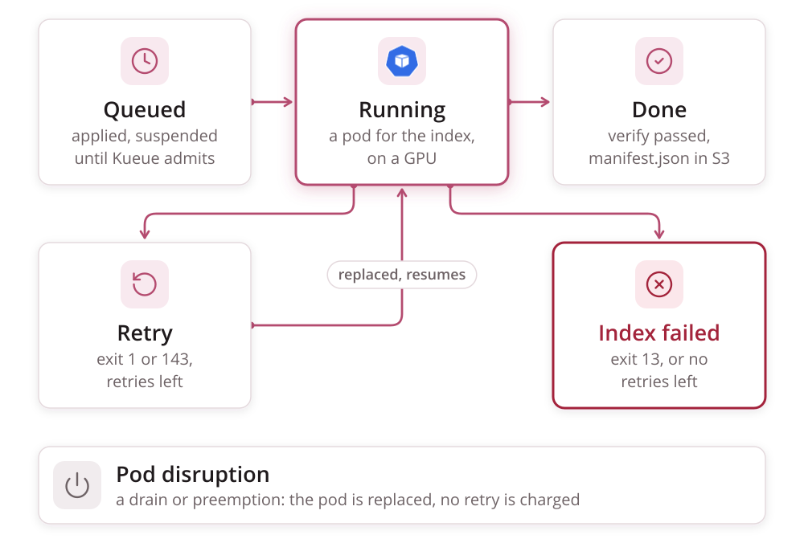

# Failure Handling

Failure handling has two layers and one authority:

- **The wrapper** decides whether a failure is permanent (exit 13) or
  transient (exit 1). It also reports a kill (exit 143), including the one the
  kubelet sends when the pod's wall-clock budget runs out.
- **The Indexed Job** carries that verdict for each index and absorbs
  disruptions. Retries, retry budgets and progress belong to Kubernetes, not
  to anything htrflow-batch runs.
- **`manifest.json` in S3** is the authority. It is the only thing that ever
  means "done".



A `failed_index` appears in the Job's `failedIndexes` field and as
`state: "failed"` on the read API's volume row. The wrapper's termination
message appears as the row's `reason` for as long as the pod that produced it
still exists.

A retried index stays inside the admitted Job, so it does not go back
through Kueue ([Queueing](queueing.md#failure-interplay)).

## Invariants

- **Done means verified means `manifest.json` exists** (per pipeline id).
  An exit code alone is never trusted: the wrapper keeps each page's outcome,
  lists `page/` and `alto/` after the loop, and publishes the marker only
  when every page is accounted for.
- **Retries converge.** A resumed run skips pages that already have both
  files and were made from the source image the page has now (per the
  `source-digest` each page's ALTO carries). Every other page loses its
  stored files before it is redone. A retry of a long volume costs minutes,
  not hours, and a source that changed does not reset the attempts that
  follow it.
- **A page that cannot be fetched or transcribed is recorded, not hidden.**
  The volume completes, and that page appears as `failed` in `manifest.json`,
  is counted in `pages_failed`, and is named on the campaign page. A page that
  fails deterministically fails the same way on every retry. Failing the whole
  volume for it would leave the bucket with the good pages and no marker to
  open them.
- **Two cases still fail the volume.** A page **missing** from the results
  (neither uploaded nor recorded as failed, usually a download or upload
  *deferred* to the next attempt), and a run where every processed page
  failed and nothing was resumed. Both are transient and report their page
  lists in the termination message.
- **The last attempt does not defer.** A page still deferred on the index's
  last attempt is recorded as failed instead, with
  `(still failing on the index's last attempt)`, so one page the source never
  serves cannot cost the others their completion marker.
- **A campaign is append-only.** `completions` is fixed at creation from the
  volume list, and a new campaign file is the only way to add volumes
  ([Campaign & Pipeline YAML](../reference/campaign-yaml.md#immutability)).

## The Job contract

`render._campaign_job` renders the Job. The fields that decide what a
failure costs are below; the full rendered object is in
[Rendered objects](../reference/rendered.md).

| Field | Value | Why |
|---|---|---|
| `backoffLimitPerIndex` | `3` | The per-index retry budget, kept by Kubernetes, so there is nothing to reconcile |
| `maxFailedIndexes` | equal to `completions` | A campaign never stops early because of failures. Every index gets its own verdict |
| `podFailurePolicy` | `Ignore` on `DisruptionTarget`, then `FailIndex` on exit 13 from `wrapper` or `warmup-wait` | A drain, preemption or eviction replaces the pod without charging a retry. Exit 143 matches no rule, so it is retried like exit 1 |
| `terminationGracePeriodSeconds` | `120` | Covers the wrapper's SIGTERM path |

**Why the grace period is 120 s.** On SIGTERM the wrapper writes its
termination message and ships the run log one last time inside a 90 s budget
(the log client: 5 s connect, 15 s read, two attempts). An upload still going
at 90 s is abandoned, so the SIGKILL at 120 s never arrives first.
Kubernetes' default of 30 s would kill the pod mid-cleanup on a merely slow
endpoint.

**The per-volume time limit is the pod's deadline**,
`spec.template.spec.activeDeadlineSeconds`, not the Job's. It is rendered from
the pipeline's own `max_seconds`, or from `converter.yaml`'s (default 21600 s,
6 h). A Job-level deadline would kill the whole campaign. A pod-level one
kills exactly the attempt that overran. At the deadline:

1. The kubelet SIGTERMs the container.
2. The wrapper writes its message and exits 143.
3. The kubelet marks the pod `status.reason: DeadlineExceeded`, **without**
   a `DisruptionTarget` condition.

The `Ignore` rule therefore does not swallow it. The attempt is counted, and
`backoffLimitPerIndex` retries the index.

Resources, mounts and pod hardening are in
[Rendered objects](../reference/rendered.md) and
[Security](security.md#pod-security-posture).

## Exit codes and what each one costs

| Wrapper exit | Written to `/dev/termination-log` | Index outcome |
|---|---|---|
| `0` | — | `Complete`, shown in `completedIndexes`, once `manifest.json` exists. A volume that lost pages still exits 0: they are recorded, and `pages_failed` says how many |
| `13` permanent | `{"stage", "permanent": true, "error"}` | `FailIndex`: in `failedIndexes`, never retried |
| `1` transient | `{"stage", "permanent": false, "error"}` | Retried up to `backoffLimitPerIndex` (3), resuming from published pages. At the cap, in `failedIndexes` |
| `143` SIGTERM (a drain that reached the container, or the pod deadline) | `{"stage", "permanent": false, "error": "SIGTERM"}`, then the final log ship | Retried the same as exit 1. Progress already published is not redone |
| none (pod disrupted before or while running) | — | Pod replaced (`Ignore`), no retry charged |

**Permanent, per the wrapper:**

- config errors, such as a missing environment variable
- a manifest URL that is not http(s)
- a 400, 401, 403, 404 or 410 on the manifest
- a manifest body over `MANIFEST_MAX_BYTES`, non-JSON, with no canvases, or
  with a canvas that has no image
- bad pipeline YAML, an unknown step or model class, or a setting a step
  does not take

**Transient:**

- a 5xx, a 429, a network error or the download deadline on the manifest
- a page missing at verify, including a page whose download was deferred
- a run where every processed page failed and nothing was resumed
- a model-load `OSError`, including a model missing from the read-only cache
- five consecutive upload failures (`UploadOutage`); a single failed upload
  only defers its page
- three consecutive pipeline rebuild failures after a dead worker thread
- eight or more htrflow threads left running by pipelines the wrapper had
  to give up on (see below)

The full table is in the [Wrapper reference](../reference/wrapper.md).

## A dead htrflow worker thread

htrflow's `Inference` steps hand each batch to a daemon thread and wait on a
`Future`. An exception inside that thread kills it, and `pipeline.run` then
waits for ever. One known trigger is a YOLO mask too small to become a
polygon (`TypeError: 'NoneType' object is not iterable`). Unguarded, the pod
would hold its GPU until the pod deadline, then retry onto the same page.

So `driver` runs each page's `pipeline.run` in a helper thread and checks
every step's worker threads once a second (`THREAD_POLL_SECONDS`). A dead
thread, or a page with no progress for `PAGE_TIMEOUT_SECONDS` (default 600 s,
a window without progress, not a total), raises `PipelineDead`, a **page**
failure:

```
WARNING page 0044 failed: PipelineDead("page 0044: htrflow's Segmentation (model Riksarkivet/yolov9-regions-1) worker thread died; the page is marked failed and the pipeline is rebuilt")
WARNING rebuilding the htrflow pipeline after a dead worker thread
```

The dead pipeline's models are released and the CUDA cache emptied
(`driver.release_pipeline`), a fresh pipeline loads from the cache PVC, and
the volume **completes** with that page recorded as failed. It is not exit 1:
the cause is in the image, so every attempt would die the same way. A thread
stuck inside a model call cannot be stopped and may still hold weights, so at
eight such threads (about four hung pages) the run stops as transient and the
retry gets a fresh pod.

## What a person is told

Exit codes, the termination JSON and the `permanent failure in <stage>:`
prefix are for machines. Every surface that talks to people says instead,
in plain sentences, **what happened, where, and what to do next**, and each
translates in one place:

| Surface | Where the sentence is written |
|---|---|
| Campaign page | `frontend/src/lib/reasons.ts` (`describeReason`, `describeApiError`), pinned in `reasons.test.ts` |
| Run log | `packages/wrapper/src/htrflow_batch/main.py`: `_advice`, appended after the prefix |
| Converter CLI | `parse.py` and the models' validators ([Campaign & Pipeline YAML](../reference/campaign-yaml.md)) |

What each failed-volume sentence on the card means, and what the operator
does about it, is in [Troubleshooting](../getting-started/troubleshooting.md).
The page-level errors and stage names the card shows are in
[Web front & read API](../reference/web.md).

## Evidence that survives the Job

Everything an operator needs is in the bucket well before the Job's
`ttlSecondsAfterFinished` reaps it:

| Key | Written when | Content |
|---|---|---|
| `status/logs/<pipeline>/<volume>.txt` | While the volume runs, every 15 s, and once on exit (also on SIGTERM) | The wrapper's own stdout and stderr: the complete log ([The run log](signals.md#the-run-log)) |
| `<pipeline>/<volume>/progress.json` | After every page outcome and at every stage change, except in the `config` stage (see below) | The last stage reached, page counts and the most recent page failure |

A run that fails in the `config` stage writes no `progress.json`: until the
settings parse there is nowhere to write it. Its evidence is the termination
message and the pod's log. The read API shows a termination message as
`reason` only while the pod exists; after that the run log is what remains.
When a pod's `status.reason` is `DeadlineExceeded` and its `error` is
`"SIGTERM"`, the API shows `"error": "DeadlineExceeded"`, since only the pod
can tell a deadline kill from a drain.

## Retries, natively

There is no retry budget file and nothing to clear by hand.
`backoffLimitPerIndex` and `maxFailedIndexes` are read straight off the Job.
A failed index is never re-run in place: the volume goes into a new
campaign. On the same pipeline id, `apply` holds that campaign back while
the old one still runs, since both would write the same results; under a new
pipeline id it starts at once
([Troubleshooting](../getting-started/troubleshooting.md)).

## Warm-ups fail the same way

A pipeline's `htr-warmup-<id>` Job fails independently of any campaign. It
has `backoffLimit: 2`, a 1 h pod deadline, and a `podFailurePolicy` of the
same shape on its `warmup` container. Exit 13 there is `FailJob`.

- **The deadline is the pod's, not the Job's**, so a kill keeps its
  termination message and counts against `backoffLimit`: a warm-up that ran
  out of time on a slow first download is retried.
- **There is no warm-up log.** The pod mounts no S3 Secret. Its termination
  message (`{stage: "warmup", permanent, error}`) is shown on the campaign
  card's warm-up chip ([Web front & read API](../reference/web.md)), and a
  kill leaves `error: "SIGTERM"` there rather than nothing.
- **A transient failure** (a network or disk error) is retried up to
  `backoffLimit`.
- **A permanent failure** is exit 13: a bad model id or revision, an unknown
  step, a setting a step does not take, invalid YAML, or a marker that could
  not be written.
- **Recovery is a re-apply.** The next `apply` deletes and recreates a
  failed warm-up, so fixing the cause (a missing Secret, a Hub outage) and
  re-applying is the whole recovery.
- **The marker is written before the success log line**, and failing to
  write it is fatal, so a green warm-up always left a marker.

**The campaign side is bounded.** Every batch pod waits for the marker in its
`warmup-wait` init container, which gives up after `converter.yaml`'s
`warmup_wait_seconds` (default 900), prints one line naming the marker, and
exits 13. The `podFailurePolicy` turns that into `FailIndex`, and
`terminationMessagePolicy: FallbackToLogsOnError` makes the line the row's
`reason`. The wait is bounded because a batch pod holds its GPU and Kueue's
quota through its init containers.

Only a **completed** warm-up whose marker is gone (a replaced or wiped cache
PVC) needs a manual step: delete the Job, and the next apply runs it again.
How to find out why a marker is missing is in
[Troubleshooting](../getting-started/troubleshooting.md).
