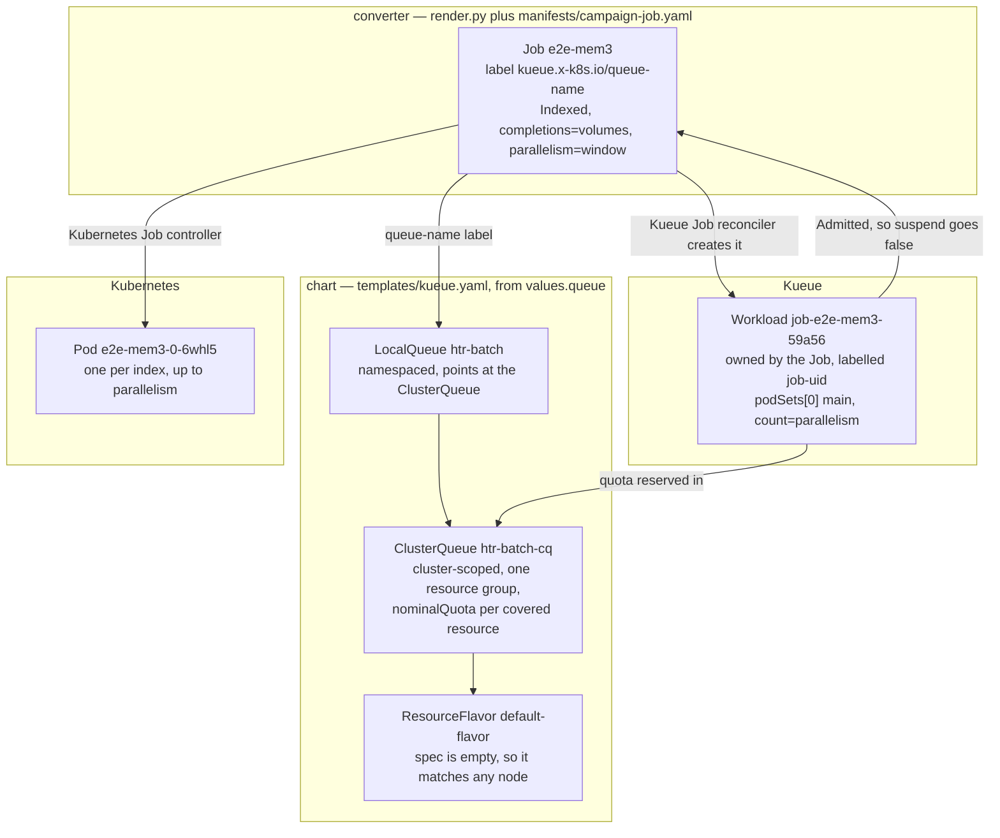
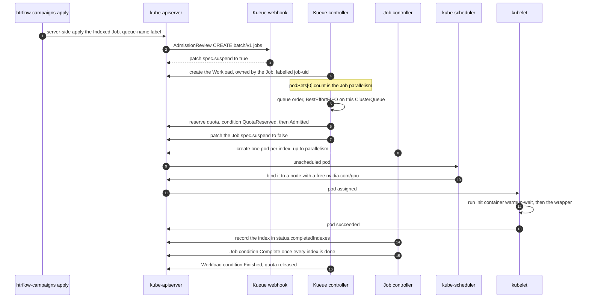

# Kueue in depth

[Queueing (Kueue)](queueing.md) is the htrflow-batch view. This page is the
mechanism: the objects, the controllers, the webhooks and the fields that
change at each step, checked against Kueue's docs, this repo's code, or the
PoC cluster — Kueue **v0.18.1**, one `kueue-controller-manager` Deployment in
`kueue-system`, with the live campaign `e2e-mem3` as the worked example.

## What Kueue is, and what it is not

Kueue is a **job-level admission controller and quota manager**. Its unit of
admission is a *Workload*, "an application that will run to completion",[^concepts]
and it answers one question — may this Job start now? — by reserving quota in
a ClusterQueue and un-suspending the Job. It is **not** a pod scheduler: it
never picks a node, never binds a pod, never replaces `kube-scheduler` (live
proof: the pod `e2e-mem3-0-6whl5` carries `schedulerName: default-scheduler`).
**Kueue decides WHEN, kube-scheduler decides WHERE.**

## The objects, and who creates them



| Object | Created by | On the PoC |
|---|---|---|
| `ResourceFlavor` | chart, `queue.flavor` | `spec: {}` — no `nodeLabels`/`nodeTaints`, so Kueue injects no `nodeSelector` at admission[^flavor] |
| `ClusterQueue` | chart, `<queue.name>-cq` | `coveredResources: [cpu, memory, nvidia.com/gpu]`, `nominalQuota` 8 / 32Gi / 1, `namespaceSelector` on `kubernetes.io/metadata.name` |
| `LocalQueue` | chart, `queue.name` | `spec.clusterQueue: htr-batch-cq` — the name Jobs label themselves with |
| `Job` | converter, applied by `cluster.py` | the label `kueue.x-k8s.io/queue-name` (`render._QUEUE_LABEL`),[^jobs] plus `kueue.x-k8s.io/priority-class` (`render._PRIORITY_LABEL`) when the campaign file sets `priority:` — no annotations |
| `Workload` | **Kueue**, one per Job | below |

**What a Workload holds.** Kueue names it `job-<campaign>-<hash>`; from the
live `job-e2e-mem3-59a56`:
`ownerReferences` naming the Job (`controller: true`,
`blockOwnerDeletion: true`); the label `kueue.x-k8s.io/job-uid`, the only
link that survives a delete/recreate of the Job and the one
`cluster.py._workload` selects by; the finalizer
`kueue.x-k8s.io/resource-in-use`; `spec.queueName: htr-batch`,
`spec.priority: 0`, `spec.active: true`; and `spec.podSets[0]` —
`name: main`, **`count: 1`**, plus a verbatim copy of the Job's pod template.

`count` is the Job's **`parallelism`**, not its `completions`: a podSet
describes the pods that exist at once, not the work items. `e2e-mem3` runs
`completions: 1 / parallelism: 1` and so does not discriminate on its own;
the discriminating case is on [Queueing](queueing.md#admission) — campaign
`e2e-t22run`, `completions: 2 / parallelism: 1`, podSet count 1.

`status.admission` records the decision: `clusterQueue: htr-batch-cq`, and
`podSetAssignments[0]` with `cpu`, `memory` and `nvidia.com/gpu` all on
`default-flavor`, `resourceUsage: cpu 4, memory 8Gi, nvidia.com/gpu 1`. Note
the memory — the container *limit* is 16Gi, but quota counts the **request**.

## The controllers and webhooks Kueue adds

**Mutating webhook `mjob.kb.io`** — live rule: path `/mutate-batch-v1-job`,
`apiGroups: [batch]`, `apiVersions: [v1]`, `operations: [CREATE]`,
`resources: [jobs]`, `failurePolicy: Fail`, `sideEffects: None`,
`timeoutSeconds: 10`, `namespaceSelector` excluding `kube-system` and
`kueue-system`. It stamps `spec.suspend: true` on a queue-labelled Job as it
is created, so the Job cannot run before Kueue has seen it.[^jobs] The rule
is `CREATE` only — keeping `suspend` right afterwards is the reconciler's
job, not the webhook's.

**Validating webhook `vjob.kb.io`** (`/validate-batch-v1-job`, `CREATE` and
`UPDATE`) rejects changes Kueue cannot honour on a managed Job — why a
`priority:` naming a `WorkloadPriorityClass` that does not exist is refused
at apply time (B18). `vworkload.kb.io` guards `workloads` and
`workloads/status` the same way.

**The Job reconciler** owns the Job↔Workload pair: creates the Workload
(Job event `CreatedWorkload`), sets `spec.suspend: false` on admission (Job
events `Started` and `Resumed`, condition `Suspended=False` reason
`JobResumed`), writes the pod-template annotation `kueue.x-k8s.io/workload`
and the labels `kueue.x-k8s.io/cluster-queue-name`,
`kueue.x-k8s.io/local-queue-name`, `kueue.x-k8s.io/podset` (all four live on
the Job and its pod), and marks the Workload `Finished` when the Job ends.

**The scheduler/quota reconciler** walks each ClusterQueue's queue, picks the
next Workload, assigns flavors and reserves quota, keeping `flavorsUsage`,
`pendingWorkloads`, `reservingWorkloads` and `admittedWorkloads` current on
the ClusterQueue and the LocalQueue.

## The admission cycle, step by step



As fields, one row per step:

| # | What changes |
|---|---|
| 1 | `cluster.apply` server-side applies the Job, field manager `htrflow-campaigns` |
| 2 | `mjob.kb.io` writes `spec.suspend: true` — Job event `Suspended` |
| 3 | Workload created, no `status.admission`, counted in `clusterqueue.status.pendingWorkloads` |
| 4 | queue order: the live ClusterQueue is `queueingStrategy: BestEffortFIFO`, so an older Workload that cannot be admitted does **not** block a newer one that fits[^cq] |
| 5 | a flavor per resource, `nvidia.com/gpu: 1` off `nominalQuota`, condition `QuotaReserved` ("Quota reserved in ClusterQueue htr-batch-cq") |
| 6 | condition `Admitted` ("The workload is admitted") — reservation is the scheduling decision, admission the authorisation after it[^concepts] |
| 7 | Kueue patches `spec.suspend: false`, Job condition `Suspended=False` reason `JobResumed` |
| 8 | the Job controller creates pods labelled `batch.kubernetes.io/job-completion-index`, at most `parallelism` at once |
| 9 | `kube-scheduler` binds each: `runtimeClassName: nvidia`, the GPU request, and whatever `nodeSelector`/`tolerations` `render._scheduling` wrote — the flavor adds none, being empty[^flavor] |
| 10 | kubelet runs `warmup-wait` to the cache marker, then the wrapper |
| 11 | exit 0 lands in `status.completedIndexes`; the last index gives the Job `Complete`, the Workload `Finished`, and the quota back |

Live events for steps 5 and 6: `QuotaReserved … wait time since queued was
1s`, then `Admitted … wait time since reservation was 0s`.

**Admission is per Job, not per index** — the last four steps repeat without
Kueue being asked again, so the campaign at the front holds its GPU until
its final index is done.

## When the quota is short

Fifty campaigns against a 1-GPU quota: fifty Jobs, fifty Workloads, one
admitted, forty-nine with no `QuotaReserved` condition and counted in
`pendingWorkloads`. `BestEffortFIFO` skips one that does not fit rather than
blocking the rest,[^cq] but with one GPU and a podSet of one there is nothing
smaller to slip through, so it is a plain queue. A campaign whose
`parallelism × per-pod request` exceeds `nominalQuota` is inadmissible
**forever** and reads only as `Queued` (**B84**).

The warm-up Job is outside all of this: `manifests/warmup-job.yaml` carries
no `kueue.x-k8s.io/queue-name` label, so Kueue never sees it — and it
requests `cpu: 2 / memory: 4Gi` and **no `nvidia.com/gpu`**, so the quota it
is not counted against is not one it would consume anyway. It runs alongside
an admitted campaign pod, which is what the live namespace shows: the
`e2e-mem3` pod and `htr-warmup-e2e-mem3` were scheduled to the same node in
the same second. (It still gets `runtimeClassName: nvidia` from
`render._scheduling`, because it must land on the node that holds the model
cache PVC.)

## Pause

`suspend: true` in the campaign file is intent. Kueue owns `spec.suspend` on
a Job it manages and flips it back within seconds, so that field cannot be
the lever ([Campaigns](campaigns.md) states this as one of the two rules the
design rests on). The lever that holds is the Workload's `spec.active`:
setting it `false` "will cause a running workload to be evicted and not be
requeued".[^workload]

So `cluster.sync_pause` runs last in every apply: find the Workload by
`kueue.x-k8s.io/job-uid`, and where `spec.active` disagrees with the intent
send a merge patch `{"spec": {"active": want}}` — a Workload that already
agrees gets no patch, which is what makes re-applying an unchanged repo a
no-op. A brand-new paused campaign has no Workload for a moment, exactly the
window Kueue would admit it in, so the apply polls for `pause_wait` seconds
and exits non-zero if none appears. Deactivating evicts the pods, keeps every
completed index and leaves the Job reading `suspend: true`; reactivating
continues at the next index. It costs `patch` on `workloads` in
`templates/apply-rbac.yaml` and leans on behaviour Kueue does not promise to
keep — hence **B66**.

## Partial admission and the window

Kueue does support partial admission: annotate a Job
`kueue.x-k8s.io/job-min-parallelism` and it may start with fewer pods than
asked, after borrowing and preemption are exhausted.[^jobs] We do not use
it — `render._campaign_job` sets **no annotations**, so the whole podSet
`count` must fit or nothing starts. The reason is mechanical: partial
admission rewrites `spec.parallelism` on the live Job, and the validating
webhook then refuses every later apply of the unchanged rendered file.
Instead the converter clamps at render time,
`parallelism = min(campaign window, converter.yaml window)`, with
`converter.yaml`'s `window` as the per-cluster cap (**B84**).

## Preemption and cohorts

Both off, read live off the ClusterQueue:

```yaml
preemption: {withinClusterQueue: Never, reclaimWithinCohort: Never,
             borrowWithinCohort: {policy: Never}}
flavorFungibility: {whenCanBorrow: MayStopSearch, whenCanPreempt: TryNextFlavor}
stopPolicy: None
```

and no `spec.cohort`, so there is nobody to borrow from or lend to. Turned
on, preemption lets a higher-priority Workload evict an admitted one: the
victim gets `Evicted` reason `Preempted` plus a `Preempted` condition naming
what displaced it.[^preempt] Here that means killing a running volume
mid-transcription — survivable, since the wrapper resumes from published
pages, but a product decision rather than a switch. A cohort would let
another tenant's idle quota be borrowed. Both belong to **B18**, with the
`WorkloadPriorityClass` objects nothing renders today.

## Who owns which field

| Field | Owner | Note |
|---|---|---|
| `job.spec.suspend` | **Kueue** | `true` by the webhook at CREATE, `false` by the reconciler at admission |
| `job` label `kueue.x-k8s.io/queue-name` | converter | effectively immutable once admitted — removing it on the PoC released no quota and blocked resuming (B66) |
| `completions`, `parallelism`, `backoffLimitPerIndex`, `maxFailedIndexes`, `podFailurePolicy`, `ttlSecondsAfterFinished` | converter | Kueue reads `parallelism` into the podSet and ignores the rest |
| `pod.spec.containers[*].resources.requests` | converter | the numbers quota is counted in |
| `job.status.completedIndexes`, `failedIndexes`, conditions | Kubernetes | the only progress signal the status page reads |
| `workload.spec.active` | ours, by patch | the pause lever (B66) |
| `workload.spec.podSets`, `status.admission`, conditions | Kueue | never written by us |
| pod placement and binding | kube-scheduler | Kueue contributes only flavor `nodeLabels`, and ours has none |

## Failure interplay

Kueue watches Job completion and failure, nothing finer.

- **A pod failure** is invisible to it: the Job controller retries the index
  under `backoffLimitPerIndex: 3` and the Workload keeps its admission — and
  its GPU — throughout.
- **`FailIndex`** (the `podFailurePolicy` rules for exit 13 from `wrapper`
  or `warmup-wait`) burns the index with no retry, still invisible until
  `maxFailedIndexes` is exceeded and the Job goes `Failed` — then the
  Workload is `Finished` and the quota is released.
- **`activeDeadlineSeconds`** sits on the **pod template**
  (`spec.template.spec`, 21600 s live), so the kubelet kills the pod at the
  deadline and the Job retries the index. It is not Kueue's
  `maximumExecutionTimeSeconds`, which we do not set.
- **TTL.** `ttlSecondsAfterFinished: 86400` deletes the Job a day after it
  finishes and the Workload, an owned `blockOwnerDeletion` child, goes with
  it. The next apply recreates the Job, Kueue makes a fresh Workload, and
  every index runs again — **B76**.

## The operator's reading

```bash
kubectl get workloads -n htr-batch              # QUEUE, RESERVED IN, ADMITTED, FINISHED
kubectl describe workload job-e2e-mem3-59a56 -n htr-batch
kubectl get clusterqueue htr-batch-cq -o yaml   # pendingWorkloads, flavorsUsage, Active
kubectl get events -n htr-batch --sort-by=.lastTimestamp
JOB_UID=$(kubectl get job -n htr-batch e2e-mem3 -o jsonpath='{.metadata.uid}')
kubectl get workloads -n htr-batch -l "kueue.x-k8s.io/job-uid=$JOB_UID"
```

The last two lines are Kueue's own recipe for finding a Job's Workload.[^ts]
Conditions worth knowing: `QuotaReserved`, `Admitted`, `PodsReady` (only
under `waitForPodsReady`, not configured here), `Finished`, and `Evicted`
with reason `Preempted`, `PodsReadyTimeout` or `Deactivated` (what our pause
produces; `underlyingCause: RequeuingLimitExceeded` when requeuing gave
up).[^workload] Metrics from `kueue-controller-manager`, all labelled by
`cluster_queue`: `kueue_pending_workloads`,
`kueue_admitted_active_workloads`, `kueue_admission_wait_time_seconds` and
`kueue_evicted_workloads_total`.[^metrics] The per-resource pair
`kueue_cluster_queue_resource_usage` / `kueue_cluster_queue_nominal_quota`
is **optional**, gated on `metrics.enableClusterQueueResources`, which the
PoC's `kueue-manager-config` does not set — its `metrics:` block is a
`bindAddress` and nothing else, so those two are not exported here.
One rule above the rest: **if Workloads sit pending while the GPU is idle,
check the Kueue controller before the GPU** — a dead Kueue and a busy GPU
look identical from outside.

## Known limits and open stories

- **B66** — *A pause is expressed in Kueue, not by us patching its Workload.*
  `sync_pause` is our own lever, needs `patch` on `workloads`, and talks to
  the **`v1beta1`** Workload API (`cluster.py`:
  `_KUEUE = ("kueue.x-k8s.io", "v1beta1")`) while the chart renders
  `v1beta2` and the cluster stores `v1beta2` — `v1beta1` is still served, so
  it works for now. Audit X24.
- **B18** — *Let urgent volumes jump the queue.* No `WorkloadPriorityClass`
  is rendered and `withinClusterQueue: Never`, so a campaign's `priority:`
  names a class that does not exist and the validating webhook rejects the
  Job. Priority lanes need the classes, preemption, and an answer for what
  "next" means when one campaign owns the whole quota. Audit X17.
- **B84** — *`htrflow-campaigns apply` warns when `window` does not fit the
  quota.* Without partial admission the whole podSet must fit; the shipped
  defaults (converter `window` 20 against a 1-GPU quota) render
  `parallelism: 20`, inadmissible forever. Audit X18.
- **B76** — *A finished campaign does not come back when the TTL has reaped
  its Job.* The Workload dies with the Job, so nothing remembers that the
  campaign already ran. Audit X6.

[^concepts]: Kueue docs — [Concepts](https://kueue.sigs.k8s.io/docs/concepts/) (glossary: Workload, admission, quota reservation).
[^workload]: Kueue docs — [Workload](https://kueue.sigs.k8s.io/docs/concepts/workload/).
[^cq]: Kueue docs — [ClusterQueue](https://kueue.sigs.k8s.io/docs/concepts/cluster_queue/).
[^flavor]: Kueue docs — [ResourceFlavor](https://kueue.sigs.k8s.io/docs/concepts/resource_flavor/).
[^jobs]: Kueue docs — [Run a Kubernetes Job](https://kueue.sigs.k8s.io/docs/tasks/run/jobs/).
[^preempt]: Kueue docs — [Preemption](https://kueue.sigs.k8s.io/docs/concepts/preemption/).
[^metrics]: Kueue docs — [Metrics](https://kueue.sigs.k8s.io/docs/reference/metrics/).
[^ts]: Kueue docs — [Troubleshooting Jobs](https://kueue.sigs.k8s.io/docs/tasks/troubleshooting/troubleshooting_jobs/).
