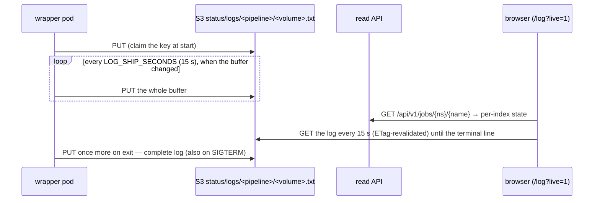

# Live Run Log

How the campaign browser follows a running volume without anything writing
its own status document: **the pod ships its own log to S3**. The browser
reads S3 directly for the log itself, and the read API (the only
cluster-credentialed component) for which volume is running at all. Design
record:
[the live-run-log spec](../superpowers/specs/2026-08-26-live-run-log-design.md)
— written against the previous CronJob-controller design and since carried
over onto Indexed Jobs unchanged on the wrapper side; the deviations from
the spec are listed at the end.

## Wrapper side (`htrflow_batch.logship`)

- `LogCapture.install()` replaces `sys.stdout`/`sys.stderr` with tees that
  write through to the originals (so `kubectl logs` is unchanged) and append
  to one in-memory buffer, in arrival order. It is installed **before**
  logging is configured, so the root `StreamHandler` binds the tee —
  htrflow's own `logging` output and its bare `print`s both land in the
  buffer. The handler's formatter redacts URLs (no userinfo, no query) on
  the way through.
- Once the `ResultStore` exists, `start_shipping(upload, LOG_SHIP_SECONDS)`
  uploads immediately (so a retried volume replaces the previous attempt's
  log before the reader's first poll), then a daemon thread re-uploads the
  buffer every interval **when it changed**. Upload errors are logged once
  and retried next interval; they never fail the run. The upload client has
  its own short timeouts (5 s connect / 30 s read / 2 retries) so a dead
  bucket cannot pin the shipping thread or the final upload.
- `finish()` runs on every exit path — success, exit 13, exit 1 and the
  SIGTERM handler — joins the thread (30 s cap), does a last upload and
  restores the streams. The final object is therefore the complete log,
  not a tail.
- Buffer cap **4 MiB**: beyond it the middle is dropped with a marker line,
  keeping the first 1 MiB and the last 2 MiB (cut on line boundaries), so a
  pathological run cannot grow memory or upload size without bound.
- Key: `status/logs/<PIPELINE_ID>/<VOLUME_REF>.txt` at the bucket root — a
  shared `status/` namespace, deliberately not under the volume prefix.
  `LOG_SHIP_SECONDS=0` disables periodic shipping (`finish` still ships).

Honest limits: only Python-level writes are teed — anything writing to
fd 1/2 directly (CUDA/C++ warnings, subprocesses) shows in `kubectl logs`
only. On a **versioned** bucket each upload is a new version (~240/h per
running volume) — add a lifecycle rule or set `LOG_SHIP_SECONDS=0`.

## Read API side

- `GET /api/v1/jobs/{namespace}/{name}` returns a deterministic, **absolute**
  `logUrl: <public_results_base>/status/logs/<pipeline>/<volume>.txt` for
  every volume row, regardless of state — there is no existence check and
  nothing cached. It is absolute (not a bare bucket key) because the browser
  has no bucket base URL of its own to resolve a key against; the API is the
  only component that knows `public_results_base`. The browser fetches
  `logUrl` directly and treats a 404 as "no log yet".
- A **retry** does not retire or copy the key anywhere: the wrapper claims
  the same key again at the start of the new attempt (the first `PUT`
  above), so the previous attempt's log is simply overwritten by the next
  one's. There is no separate `status/failures/` tree any more — the log at
  `status/logs/<pipeline>/<volume>.txt` is the complete evidence for
  whichever attempt is most recent, and the read API's per-index `reason`
  (the wrapper's own termination message) is the failure summary as long as
  the failed pod itself still exists.
- Anonymous read on `status/logs/*` is governed by
  `devStack.rustfs.publicLogs` (default on) — see
  [Security](../development/security.md#the-bucket-policy).

## Browser side (`/log`)

- `CampaignCard.svelte` fetches its volumes from `GET /api/v1/jobs/{ns}/{name}`
  (`$lib/api.ts`'s `fetchJob`, paged by `offset`/`limit`) and renders a `log`
  link for every volume row, built from `logUrl`:
  `log?log=<encodeURIComponent(logUrl)>`. For a volume whose `state` is not
  `"done"` it adds `&live=1`.
- Live mode re-fetches every `VITE_LIVE_MS` (15 s, ETag-revalidated), shows
  a "● live · updated HH:MM:SS" badge, keeps the view pinned to the bottom
  while the reader is at the bottom, and stops on the wrapper's terminal
  line (`[<volume>] COMPLETE <n> pages`, `permanent failure in <stage>:`,
  `transient failure in <stage>:` — `isTerminalLog` in `runlog.ts`), on a
  `manifest.json` that covers every page, or after `LIVE_MAX_FAILURES` (20)
  consecutive failed polls. A SIGTERM'd attempt ends with `SIGTERM in stage
  …`, which is **not** in that pattern: the view keeps polling until the
  retry's new attempt replaces the log, or the key is retired and 20 polls
  miss.
- The summary card (counts, median/p95/max, slowest pages, failed pages, the
  per-page grid) appears when `manifest.json` lands; the manifest fetch is
  retried on the same cadence while live. A 4 MB log renders in under two
  seconds.

## Where it deviates from the spec

The spec was written for the pre-B63 frontend; the wrapper-side behaviour
below is unchanged by B63, the status-derivation columns are not:

| Spec said | Built |
|---|---|
| tail 3 MiB kept | 1 MiB head + **2 MiB** tail (`TAIL_BYTES`), cut on line boundaries |
| a status-deriving component emits a `run_log` link per volume state | the read API returns a deterministic, absolute `logUrl` for every volume row, unconditionally (no existence check, no per-state logic) |
| a retry overwrites the key with the new attempt | unchanged: the wrapper's own claim-at-start (`PUT` at the top of `finish()`/`start_shipping`) is what makes a retry overwrite the previous attempt's log; there is no separate "retire" step anywhere in the design any more |
| a SIGTERM exits without the final upload | the SIGTERM handler ships the final log before `os._exit(143)` |
