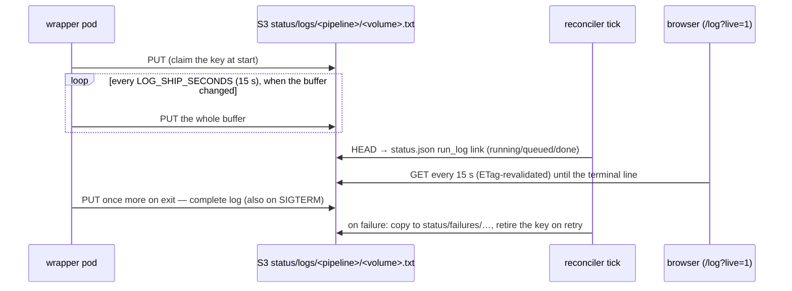

# Live Run Log

How the campaign browser follows a running volume without anything ever
reading the kube API from a browser: **the pod ships its own log to S3**.
The browser only reads S3, the reconciler stays the only kube-API client,
and the same path works against real AWS S3 in production. Design record:
[the live-run-log spec](../superpowers/specs/2026-08-26-live-run-log-design.md);
this page is what was built (the deviations from the spec are listed at
the end).

## Wrapper side (`htrflow_batch.logship`)

- `LogCapture.install()` replaces `sys.stdout`/`sys.stderr` with tees that
  write through to the originals (so `kubectl logs` is unchanged) and append
  to one in-memory buffer, in arrival order. It is installed **before**
  logging is configured, so the root `StreamHandler` binds the tee —
  htrflow's own `logging` output and its bare `print`s both land in the
  buffer. The handler's formatter redacts URLs (no userinfo, no query) on
  the way through.
- Once the `ResultStore` exists, `start_shipping(upload, LOG_SHIP_SECONDS)`
  uploads immediately (so a retried volume replaces the previous attempt's
  log before the reader's first poll), then a daemon thread re-uploads the
  buffer every interval **when it changed**. Upload errors are logged once
  and retried next interval; they never fail the run. The upload client has
  its own short timeouts (5 s connect / 30 s read / 2 retries) so a dead
  bucket cannot pin the shipping thread or the final upload.
- `finish()` runs on every exit path — success, exit 13, exit 1 and the
  SIGTERM handler — joins the thread (30 s cap), does a last upload and
  restores the streams. The final object is therefore the complete log,
  not a tail.
- Buffer cap **4 MiB**: beyond it the middle is dropped with a marker line,
  keeping the first 1 MiB and the last 2 MiB (cut on line boundaries), so a
  pathological run cannot grow memory or upload size without bound.
- Key: `status/logs/<PIPELINE_ID>/<VOLUME_REF>.txt` at the bucket root —
  the reconciler's status namespace, deliberately not under the volume
  prefix. `LOG_SHIP_SECONDS=0` disables periodic shipping (`finish` still
  ships).

Honest limits: only Python-level writes are teed — anything writing to
fd 1/2 directly (CUDA/C++ warnings, subprocesses) shows in `kubectl logs`
only. On a **versioned** bucket each upload is a new version (~240/h per
running volume) — add a lifecycle rule or set `LOG_SHIP_SECONDS=0`.

## Reconciler side

- `run_log` in `status.json` is set for `done`, `running` and `queued`
  volumes whenever the key exists (one HEAD per such volume per tick; for
  done volumes the answer is cached in `status/volumes.json` once the Job is
  gone). `run_manifest` (the run's `manifest.json`, 404 until published) is
  linked for the same statuses so the run viewer can show its summary card.
- For images that predate the shipper (`done` + succeeded Job + no key) the
  reconciler uploads a 500-line `kubectl logs` tail once as a fallback.
- On **retry**, before deleting the Job, the reconciler copies the shipped
  log (complete) — or a 50-line kube tail when there is none — to
  `status/failures/<pipeline>/<volume>.txt` and links it as `failure_log`,
  then **retires** the run-log key so the next attempt is never linked to
  the previous attempt's log as if it were live. On `needs-attention` the
  copy is made too but the run-log key stays, so later ticks keep the
  complete log rather than falling back to a tail.
- Anonymous read on `status/logs/*` is governed by
  `devStack.rustfs.publicLogs` (default on); `status/failures/*` always needs
  credentials — the browser reaches it only when the operator serves it
  through something authenticated ([Security](../development/security.md#the-bucket-policy)).

## Browser side (`/log`)

- The campaign table's `log` link renders whenever `run_log` (or
  `failure_log`) is set. For a volume that is not `done` it adds `live=1`.
- Live mode re-fetches every `VITE_LIVE_MS` (15 s, ETag-revalidated), shows
  a "● live · updated HH:MM:SS" badge, keeps the view pinned to the bottom
  while the reader is at the bottom, and stops on the wrapper's terminal
  line (`[<volume>] COMPLETE <n> pages`, `permanent failure in <stage>:`,
  `transient failure in <stage>:` — `isTerminalLog` in `runlog.ts`), on a
  `manifest.json` that covers every page, or after `LIVE_MAX_FAILURES` (20)
  consecutive failed polls. A SIGTERM'd attempt ends with `SIGTERM in stage
  …`, which is **not** in that pattern: the view keeps polling until the
  retry's new attempt replaces the log, or the key is retired and 20 polls
  miss.
- The summary card (counts, median/p95/max, slowest pages, failed pages, the
  per-page grid) appears when `manifest.json` lands; the manifest fetch is
  retried on the same cadence while live. A 4 MB log renders in under two
  seconds.

## Where it deviates from the spec

| Spec said | Built |
|---|---|
| tail 3 MiB kept | 1 MiB head + **2 MiB** tail (`TAIL_BYTES`), cut on line boundaries |
| `run_log` emitted for `done`, `running`, `retry`, `needs-attention`, `queued` | `run_log` for `done`/`running`/`queued`; failed volumes get the same evidence as `failure_log` (copied to `status/failures/`), and the run-log key is retired on retry |
| a retry overwrites the key with the new attempt | the reconciler retires the key first; the next attempt claims it again at start |
| — | `run_manifest` added so the run viewer can show the summary card |
| a SIGTERM exits without the final upload | the SIGTERM handler ships the final log before `os._exit(143)` |
