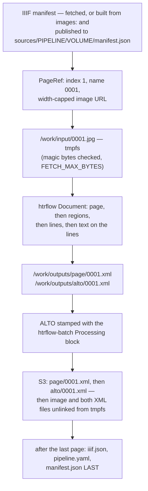

# From image to transcription

One page, end to end. Everything here happens inside a single wrapper pod
(one campaign index, one volume); the volume around it is
[The Wrapper](wrapper.md).



## The source

`setup` fetches the campaign's IIIF manifest (Presentation 2 or 3, http(s)
only, ≤ 5 redirects, capped at `MANIFEST_MAX_BYTES`). An `images:` volume has
no manifest, so the wrapper **builds one** — a minimal P3 document, one
canvas per URL, the bare URL as the painting body — and publishes it under
`sources/`. Each canvas becomes a `PageRef`: 1-based `index`, zero-padded
`name` (`0001`), and the URL to fetch.

## The width-capped GET

For a canvas with an IIIF image service the URL is
`SERVICE/full/2500,/0/default.jpg` (`MAX_IMAGE_WIDTH`), with three
deliberate fallbacks: **`w,` not `!w,h`** (lbiiif answers 501 to the
latter); **`max` when the canvas is already narrower than the cap** (Level 1
servers refuse upscaling with a 400); and **a 400 anyway retries once with
`/full/max/`** before the page fails. Live, on volume R0001203: 638 pages in
the manifest; of the 107 fetched before the run stalled, 106 at
`/full/2500,/` and one at `/full/max/` (canvas `_00002`, already narrower
than the cap). A canvas with **no** image service cannot be resized
server-side at all — native size, bounded only by `FETCH_MAX_BYTES`.

The body is checked before it is kept: a textual `Content-Type` is refused,
the first chunk must start with a known raster signature, and an empty or
oversized body is rejected — a 200 login page used to be saved as the JPEG
and burn a whole attempt inside htrflow.

It lands in `/work/input/`, on the memory-backed `emptyDir` (`sizeLimit:
2Gi`) that also holds `/work/outputs/{alto,page}/` and — under
`readOnlyRootFilesystem`, with nowhere else to write — `HOME`, `TMPDIR` and
`YOLO_CONFIG_DIR`.

## What htrflow does to it

Every `Inference` step runs its model on the document's **leaf** nodes and
attaches the results there, which is why order is the whole recipe. The
pipeline the PoC runs (`.docker/pipeline-demo-v1.yaml`):

| Step | Runs on | Leaves behind |
|---|---|---|
| `Segmentation` (`yolov9-regions-1`) | the page | regions attached to the page |
| `Segmentation` (`yolov9-lines-within-regions-1`) | those regions | lines attached to each region |
| `TextRecognition` (TrOCR) | those lines | a transcription on each line |

Two levels of segmentation are not decoration: htrflow's ALTO template walks
`document.regions` and then `region.regions` to emit `TextBlock` and
`TextLine`, so a pipeline that recognises text straight off the regions —
like the two-step starter of the same name,
`examples/campaigns/pipelines/demo-v1.yaml` —
gives `TextBlock`s with no `TextLine` in them, and the serializer "will
always produce a file, but the file may be empty". The wrapper appends the
two `Export` steps itself; a pipeline file containing one is rejected.

## The two files

ALTO 4.4 — a `Description` (measurement unit, source file name, htrflow's
`Processing` block and then ours), a `ReadingOrder`, and a `Layout` whose
`Page` carries the dimensions of the image **actually processed** — the
width-capped fetch, or native size when the canvas has no image service, as
in the `images:` volume below:

```xml
<Page WIDTH="2864" HEIGHT="2288" PHYSICAL_IMG_NR="0" ID="_0001">
  <PrintSpace>
    <TextBlock ID="block_0" HPOS="792" VPOS="286" HEIGHT="1405" WIDTH="1843" CS="false">
      <TextLine ID="block0_line0" HPOS="1583" VPOS="1535" HEIGHT="150" WIDTH="787">
        <Shape><Polygon POINTS="2370,1535 2272,1558 …" /></Shape>
        <String CONTENT="Comminist loci." />
      </TextLine>
      …
```

PAGE XML carries per-line confidence scores and supports nested
segmentation, so it is the richer of the two — and it is **not** stamped:
the same provenance facts sit in `manifest.json` (**B71**).

Between htrflow's Export and the upload, the wrapper appends a second
`Processing` block to the ALTO naming the image digest, the htrflow base
revision and the wrapper package
([Provenance in every ALTO](wrapper.md#provenance-in-every-alto)). An ALTO it
cannot parse fails the page. The models htrflow's own block names are the
same ones the campaign card lists, each linking to that Hugging Face repo at
the revision the pipeline pinned
([Campaign Browser](../reference/frontend.md#derivation-rules)) — so the
recipe on the page and the recipe in the file are one click apart.

## Upload, then delete

Both files are parsed before the first PUT, then uploaded **PAGE first, ALTO
second** — a crash between the two leaves a PAGE without its ALTO
(reprocessed on resume), never the reverse, so an ALTO count strictly means
"page complete". The ALTO's `Page` dimensions are kept in memory on the way
past, which is what lets `iiif.json` be written later without reading a
single ALTO back.

Then the rolling delete: image and both XML files are unlinked as soon as
the page's outcome is recorded — nothing downstream needs them. After the
last page: `iiif.json` (skipped entirely if no page's dimensions resolved),
`pipeline.yaml`, and `manifest.json` last.

## What the page's outcome publishes

The same moment the outcome is recorded, the wrapper rewrites
`progress.json` beside the results — stage, `pages_done`/`pages_total`, the
last page, the most recent failure and the run's error count (ERROR and
worse only — a benign WARNING, a pipeline rebuild after a dead worker
thread, must not light the campaign page's notice chip on a healthy run)
([S3 layout](../reference/s3-layout.md#progressjson-live-and-never-a-completion-marker))
— and every tenth page it republishes `iiif.json` with the pages finished so
far and sets `viewer_published: true`, once that PUT has actually succeeded.
That is the whole reason a 638-page volume can be watched, and opened in the
viewer, before its last page: nothing else the pod does leaves the pod until
publish. On a resumed run the interim publish is skipped instead, while the
dimensions this process holds in memory cover fewer pages than `pages_done`
— else it would overwrite a complete `iiif.json` with one naming only the
pages since resume. Both writes are best-effort and neither can fail a
page: a status write that raises is logged and forgotten, and the order
that matters — PAGE, then ALTO, then eventually `manifest.json` last — is
untouched by either.

## Where a later run touches this page again

- **Resume** lists `page/` and `alto/` and treats the page as done only if
  it is in **both**, and only if its `page_sources` entry in the previous
  `manifest.json` still matches the URL this run would fetch (redacted on
  both sides). A done page is never downloaded.
- **Verify** lists S3 once more after the loop: a page missing from either
  format, or marked failed, is exit 1 and a retry.
- **The viewer** opens `uv.html#?manifest=…` with this volume's `iiif.json`
  as soon as one has actually been published (the source manifest before
  that — the campaign page switches on `progress.viewerPublished`, never on
  a page count: a count crossing zero does not mean the interim publish at
  `PUBLISH_EVERY_PAGES` has happened yet, and a volume smaller than that
  cadence would otherwise link to a manifest that is not there). The canvas
  dimensions are the ALTO's, so line overlays need no coordinate rewriting,
  and each canvas's `seeAlso` points at `alto/0001.xml`.

## Known limits and open stories

- **B88** (upstream **Bug 3023**, found on the 2026-09-08 live run) — *a page
  htrflow cannot segment must not stall the run.* `_simplify_polygons` puts
  `None` in its list for a mask of fewer than four points ("to use the
  bounding box instead"), but the `map(Polygon, …)` consumed at
  `yolo.py:87` then raises `TypeError: 'NoneType' object is not iterable`.
  It happens inside `Inference._process`'s daemon thread, which dies
  silently, so `pipeline.run()` blocks forever and the pod holds the GPU
  until its deadline. Seen on R0001203: the last export was `0043.xml`, and
  page 0044 never came back. The fix belongs upstream; B88 is the
  wrapper-side workaround.
- **B73** — *The wrapper's memory does not grow with the page count.* Landed
  2026-09-07 (the rolling delete above, plus emptying htrflow's `progress`
  registries per page); its last acceptance box is a live 2 000-page volume
  showing flat tmpfs and RSS ([Memory Budget](memory-budget.md)).
- **B65** — *A page that is retrying must not stall the GPU behind it.* The
  consumer waits on the head of the lookahead window, so one slow IIIF fetch
  holds up every page already on disk behind it.
- **B83** — *Resume recomputes pages when `pipeline_sha256` or
  `image_digest` changed.* Today resume compares only the source URL, so a
  model-revision bump keeps every finished page while the fresh
  `manifest.json` claims the new recipe produced them all (audit X20).
- **B70** and **B71** — *Every ALTO says which campaign, volume and source
  image it came from* / *PAGE XML carries the same provenance.* Our block
  names the image and the htrflow base, not the campaign, volume or source
  URL; PAGE carries nothing at all.
- **B72** — *The campaign split always produces something the cluster
  accepts.* Done 2026-09-07: `volumes.txt` is cut on bytes as well as on
  count, so an `images:` campaign can no longer render a ConfigMap the API
  server refuses.
