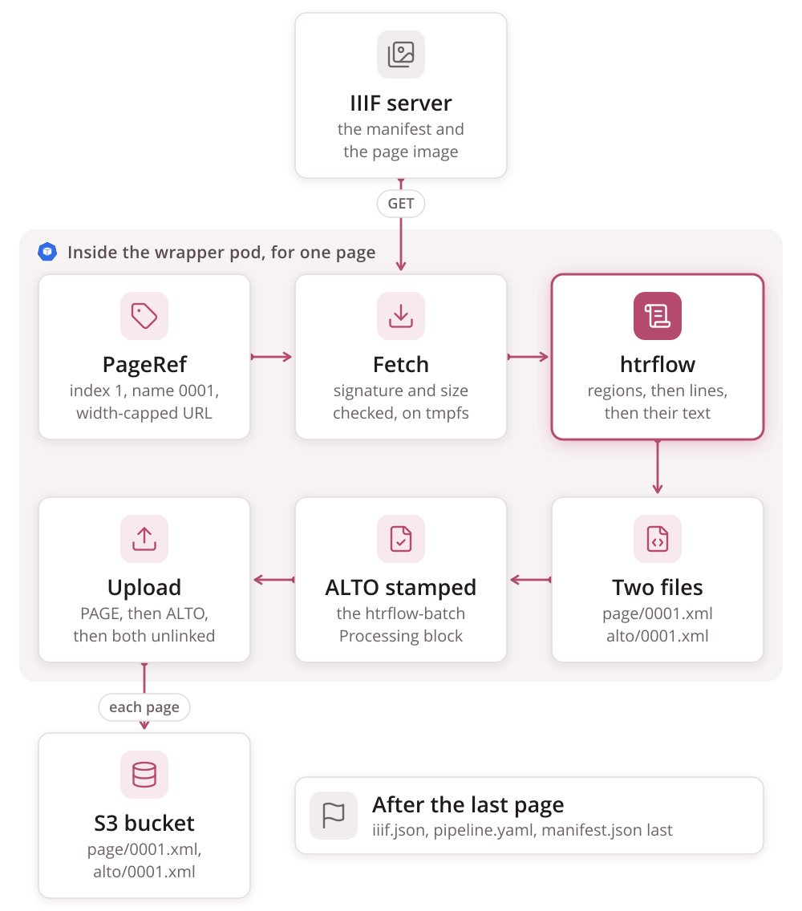

# From image to transcription

This page follows one page from start to finish. Everything here happens
inside a single wrapper pod, which runs one campaign index and so one volume.
The volume-level view is [The Wrapper](wrapper.md).




## The source

The `setup` stage fetches the campaign's IIIF manifest: Presentation 2 or 3,
http(s) only, at most 5 redirects, capped at `MANIFEST_MAX_BYTES`, and
within `DOWNLOAD_DEADLINE_SECONDS`.

An `images:` volume has no manifest, so the wrapper **builds one**: a minimal
Presentation 3 document with one canvas per URL and the bare URL as the
painting body. It publishes that manifest under `sources/`.

Each canvas becomes a `PageRef` with three fields: a 1-based `index`, a
zero-padded `name` (`0001`), and the URL to fetch.

A canvas can offer more than one image: several painting annotations, a
`Choice`, or a list of bodies. **One rule picks the image**, and both the
fetch URL and the image in the published viewer manifest come from it. That
way the ALTO is always drawn over the image it was read from. The rule takes
the first image whose URLs are all http(s). If there is none, the page is
still fetched and transcribed, but the viewer manifest shows no image for it.

## The width-capped GET

For a canvas with an IIIF image service, the URL is
`<service>/full/<MAX_IMAGE_WIDTH>,/0/default.jpg`. Three deliberate choices
shape it:

- **`w,` rather than `!w,h`.** Some image servers answer 501 to the
  best-fit form, and every compliant server supports the width form.
- **`max` when the canvas is already narrower than the cap.** Level 1
  servers refuse upscaling with a 400.
- **A 400 anyway retries once with `/full/max/`** before the page fails.

A canvas with **no** image service cannot be resized on the server. It is
fetched at native size, bounded only by `FETCH_MAX_BYTES`.

The body is checked before it is kept. A textual `Content-Type` is refused.
The first chunk must start with a known raster signature. An empty or
oversized body is rejected. Without these checks, a login page served with a
200 would be saved as the image and waste a whole attempt inside htrflow.

Two limits bound what one download can cost, whatever the host sends:

- **Size is counted after decoding.** The wrapper asks only for `gzip` and
  inflates it a chunk at a time, stopping at `FETCH_MAX_BYTES`. Any other
  `Content-Encoding` is refused before it is decoded. A small compressed body
  can no longer expand into gigabytes in memory.
- **Time is wall-clock.** Each attempt has `DOWNLOAD_DEADLINE_SECONDS`. When
  it runs out, the connection is cut, whether the host is still sending the
  headers or the body. A read timeout alone would restart with every byte.

A failure is either the page's or the source's:

| Failure | Retried in the pod | If it persists |
|---|---|---|
| Network error, deadline, 408, 425, 429, 5xx except 501 and 505, an HTML or empty answer | Yes: 4 attempts, 2 s then doubling, or the `Retry-After` wait if longer (at most 60 s) | The page is **deferred**. Verify finds it missing, the index is retried, and resume fetches only that page |
| Any other status, a body over a cap, an unrequested encoding, an image over `MAX_IMAGE_PIXELS` | No | The page is **failed** and recorded in `manifest.json`. The volume still completes |

A 400 on a sized request is the one exception: it is retried once with
`/full/max/` first, without spending an attempt.

The image lands in `/work/input/`. That directory is on the memory-backed
`emptyDir` (`sizeLimit: 2Gi`), which also holds `/work/outputs/{alto,page}/`
and, under `readOnlyRootFilesystem` with nowhere else to write, `HOME`,
`TMPDIR` and `YOLO_CONFIG_DIR`.

## What htrflow does to it

Every `Inference` step runs its model on the document's **leaf** nodes and
attaches the results there. That is why step order is the whole recipe. Here
is the three-step pipeline in `.docker/pipeline-demo-v1.yaml`:

| Step | Runs on | Leaves behind |
|---|---|---|
| `Segmentation` (`yolov9-regions-1`) | the page | regions attached to the page |
| `Segmentation` (`yolov9-lines-within-regions-1`) | those regions | lines attached to each region |
| `TextRecognition` (TrOCR) | those lines | a transcription on each line |

The two levels of segmentation are required. htrflow's ALTO template walks
`document.regions` and then `region.regions` to emit `TextBlock` and
`TextLine`. A pipeline that recognises text straight off the regions, like
the two-step starter in `examples/campaigns/pipelines/demo-v1.yaml`, produces
`TextBlock`s with no `TextLine` inside. The serializer "will always produce a
file, but the file may be empty".

The wrapper appends the two `Export` steps itself. It rejects a pipeline file
that already contains one.

## The two files

The ALTO file has three parts:

- a `Description`: measurement unit, source file name, htrflow's
  `Processing` block and then the wrapper's
- a `ReadingOrder`
- a `Layout`, whose `Page` carries the dimensions of the image **actually
  processed**. That is the width-capped fetch, or native size when the
  canvas has no image service.

```xml
<Page WIDTH="2864" HEIGHT="2288" PHYSICAL_IMG_NR="0" ID="_0001">
  <PrintSpace>
    <TextBlock ID="block_0" HPOS="792" VPOS="286" HEIGHT="1405" WIDTH="1843" CS="false">
      <TextLine ID="block0_line0" HPOS="1583" VPOS="1535" HEIGHT="150" WIDTH="787">
        <Shape><Polygon POINTS="2370,1535 2272,1558 …" /></Shape>
        <String CONTENT="Comminist loci." />
      </TextLine>
      …
```

PAGE XML carries per-line confidence scores and supports nested segmentation,
so it is the richer of the two formats. It is **not** stamped. The same
provenance facts are in `manifest.json`.

Between htrflow's Export and the upload, the wrapper appends a second
`Processing` block to the ALTO. It names the image digest, the htrflow base
revision and the wrapper package
([Provenance in every ALTO](wrapper.md#provenance-in-every-alto)). If the
wrapper cannot parse an ALTO, the page fails.

The models named in htrflow's own block are the ones the campaign card lists.
Each one links to its Hugging Face repo at the revision the pipeline pinned
([Campaign Browser](../reference/frontend.md)). The recipe on the page and the
recipe in the file are one click apart.

## Upload, then delete

Both files are parsed before the first PUT. They are then uploaded **PAGE
first, ALTO second**. A crash between the two leaves a PAGE without its ALTO,
which resume reprocesses, and never the reverse. So an ALTO's presence always
means the page is complete. Both PUTs carry the digest of the page's source
image as object metadata (`source-digest`), which is what a later resume
compares. The ALTO's `Page` dimensions are kept in memory
as the file goes by. Because of that, `iiif.json` can be written later without
reading a single ALTO back.

Then comes the rolling delete. The image and both XML files are unlinked as
soon as the page's outcome is recorded, since nothing downstream needs them.

After the last page, the wrapper writes three objects:

1. `iiif.json`, skipped entirely if no page's dimensions resolved
2. `pipeline.yaml`
3. `manifest.json`, last

## What the page's outcome publishes

When the outcome is recorded, the wrapper also rewrites `progress.json` next
to the results ([S3 Layout](../reference/s3-layout.md)). It holds:

- the stage
- `pages_done`, `pages_total` and `pages_failed`
- the last page
- the most recent failure
- the run's error count

The error count covers ERROR and worse only. A benign WARNING, such as a
pipeline rebuild after a dead worker thread, must not light the campaign
page's notice chip on a healthy run.

Every tenth page (`PUBLISH_EVERY_PAGES`), the wrapper also republishes
`iiif.json` with the pages finished so far. It sets `viewer_published: true`
once that PUT has actually succeeded. This is why a large volume can be
watched, and opened in the viewer, before its last page. Nothing else the pod
does leaves the pod until publish.

On a resumed run, the interim publish is skipped while the dimensions this
process holds cover fewer pages than `pages_done`. Otherwise it would
overwrite a complete `iiif.json` with one naming only the pages since the
resume.

Both writes are best-effort, and neither can fail a page. A status write that
raises is logged and dropped. Neither write touches the order that matters:
PAGE, then ALTO, and eventually `manifest.json` last.

## Where a later run touches this page again

- **Resume** lists `page/` and `alto/`. It treats the page as done only if it
  is in **both**, and only if the source digest its ALTO carries (the
  `source-digest` object metadata, written with each upload) still matches
  the digest of the URL this run would fetch. A page stored without that
  metadata is compared with its `page_source_digests` entry in the previous
  `manifest.json`. Credentials are out of both sides of that comparison. A
  done page is never downloaded. A page that is not done loses whatever it
  has stored before the run starts.
- **Verify** lists S3 once more after the loop. A page missing from either
  format, and not recorded as failed, means exit 1 and a retry. So does a
  deferred page, even if an earlier run left files for it.
- **The viewer** opens `uv.html#?manifest=…` on the volume's source manifest
  until an `iiif.json` has actually been published. After that it opens
  `iiif.json`. The campaign page switches on `progress.viewerPublished`,
  never on a page count, because a count above zero does not mean the interim
  publish has happened yet. The canvas dimensions come from the ALTO, so line
  overlays need no coordinate rewriting, and each canvas's `seeAlso` points at
  `alto/0001.xml`.

## Known limits

- **One slow page holds up the pages behind it.** The consumer waits on the
  head of the lookahead window, so a single slow or retrying IIIF fetch stalls
  every page already on disk behind it.
- **Resume compares only the source URL.** If a pipeline's models or image
  change while the pipeline id stays the same, resume keeps every finished
  page. The fresh `manifest.json` then claims the new recipe produced them
  all. The immutability convention
  ([Campaigns → Immutability](campaigns.md#immutability)) is what prevents
  this.
- **Provenance is partial.** The wrapper's ALTO block names the image and
  the htrflow base, but not the campaign, the volume or the source image URL.
  PAGE XML carries no provenance of its own.
