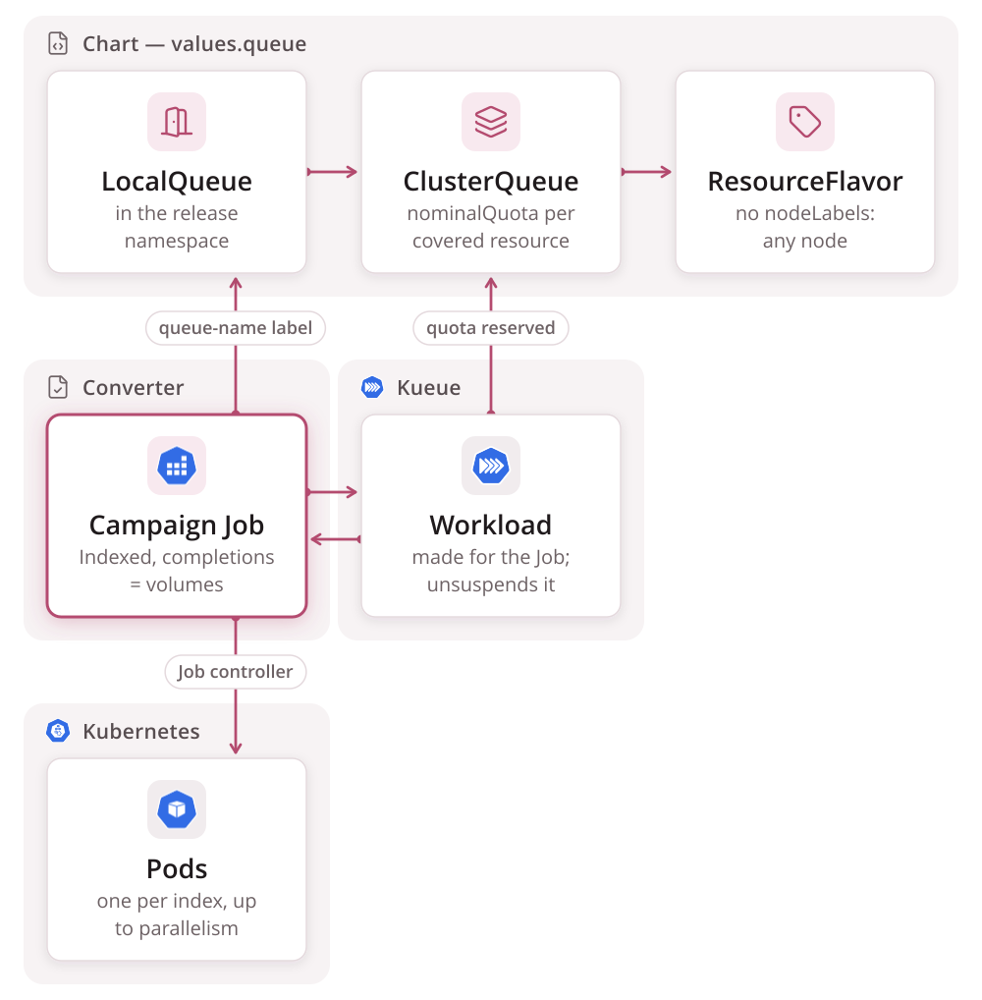
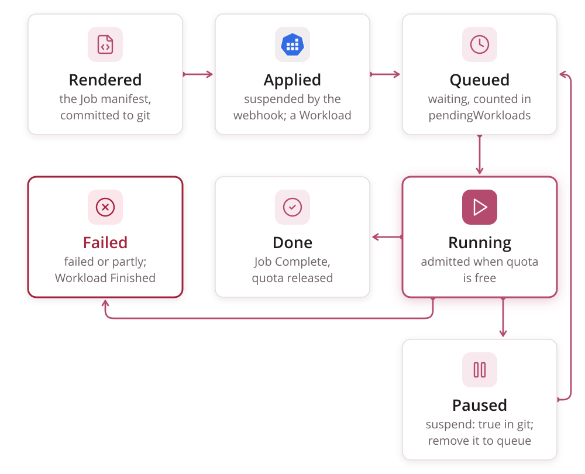
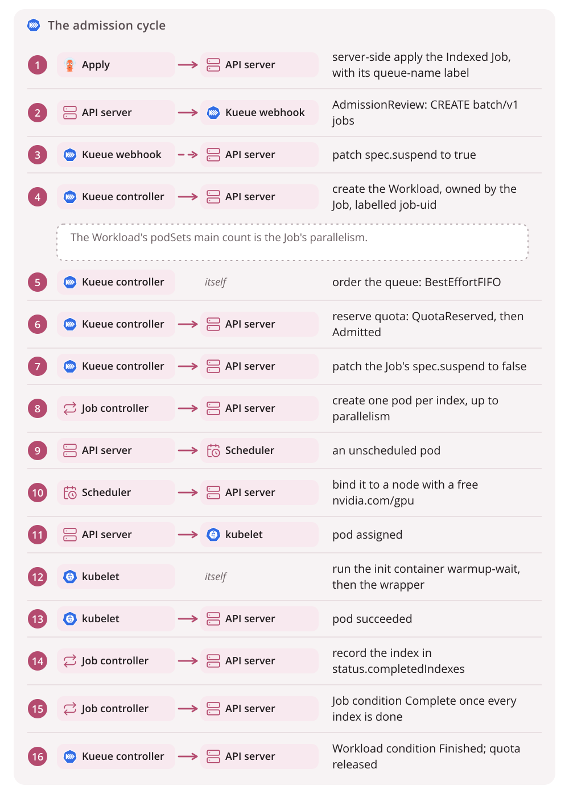

# Queueing

[Kueue](https://kueue.sigs.k8s.io/) is the only part of this system that
decides **when** a campaign may run. It owns admission and GPU quota, and
knows nothing about HTR, IIIF or S3. A campaign is one Indexed Job, and so
**one Kueue Workload, not one per index**. Most of this page follows from
that fact.

Kueue is a job-level admission controller and quota manager. It is **not** a
pod scheduler. It never picks a node or binds a pod, and campaign pods keep
`schedulerName: default-scheduler`. **Kueue decides when, kube-scheduler
decides where.** The Kueue release the Makefile installs is `KUEUE_VERSION`.

## Topology




The chart renders three queue objects from `queue.*`, plus one priority
class per `queue.priorityClasses` entry
([Chart Values](../reference/chart.md)):

| Object | Name | What it carries |
|---|---|---|
| `ResourceFlavor` | `queue.flavor` (default `default-flavor`) | Nothing. With no `nodeLabels` or `nodeTaints`, Kueue injects no `nodeSelector` at admission |
| `ClusterQueue` | `<queue.name>-cq` (default `htr-batch-cq`) | One resource group, one flavor, `nominalQuota` per covered resource, and a `namespaceSelector` on `kubernetes.io/metadata.name`. A ClusterQueue is cluster-scoped, so the selector keeps any other namespace from pointing a LocalQueue at this quota |
| `LocalQueue` | `queue.name` (default `htr-batch`), in the release namespace | `spec.clusterQueue` pointing at the ClusterQueue. Jobs name this queue in their `queue-name` label |
| `WorkloadPriorityClass` | one per `queue.priorityClasses` entry (default `htr-interactive` 1000, `htr-bulk` 0, `htr-idle` -10) | `value` and a `description`. Cluster-scoped, so the names are the same for every namespace. A campaign names one in its `priority-class` label |

The default quota is **cpu 4, memory 8 Gi, `nvidia.com/gpu` 1**, which is
exactly one wrapper pod. Kueue marks a Workload inadmissible unless the
ClusterQueue covers every resource its pod *requests*. So the covered list
and the pod's requests have to change together. Raise the quotas to run more
volumes at once.

Everything else on the ClusterQueue is Kueue's own default:

- `queueingStrategy: BestEffortFIFO`
- `preemption.withinClusterQueue: Never`
- `stopPolicy: None`
- no `cohort`

Priority is where the classes come in. Kueue orders the queue by class value
first, higher first, and by creation time within a value, so a campaign on
`htr-interactive` is admitted before every waiting campaign on `htr-bulk`
however long those have waited. A Job with no `priority-class` label ranks
at 0, and the converter renders no label when a campaign leaves `priority:`
out, which is why `htr-bulk` sits at 0: naming it is the same as leaving the
field out. `htr-idle` sits below both, for work that may wait behind anything
that turns up. None of this evicts a running campaign: with
`withinClusterQueue: Never` a higher class goes ahead of what is *waiting*,
never ahead of what is *running*, and the next admission happens when the
running campaign's quota comes back.

A cluster with several kinds of GPU node gives each group its own flavor with
`nodeLabels` and covers the flavors separately. That is a values change, not
a chart change.

## What the converter puts on a Job

`render._campaign_job` sets two Kueue **labels** on the Job and no
annotations:

- `kueue.x-k8s.io/queue-name: <queue from converter.yaml>`, always.
- `kueue.x-k8s.io/priority-class: <priority from the campaign>`, only when
  the campaign file sets `priority:`. The name must be one of the
  `WorkloadPriorityClass` objects the chart ships (`queue.priorityClasses`),
  and `validate` holds it to `converter.yaml`'s `priority_classes`, which
  mirrors that list; leaving `priority:` out is `htr-bulk`.

## What a Workload holds

Kueue creates one Workload per Job, named `job-<campaign>-<hash>`:

- `ownerReferences` naming the Job (`controller: true`,
  `blockOwnerDeletion: true`), plus the finalizer
  `kueue.x-k8s.io/resource-in-use`.
- The label `kueue.x-k8s.io/job-uid`. It is the one link that survives a
  delete and recreate of the Job, and `cluster.py` selects by it.
- `spec.queueName`, `spec.priority`, `spec.active`.
- `spec.podSets[0]`: `name: main`, a `count`, and a verbatim copy of the
  Job's pod template.

`count` is the Job's **`parallelism`**, not its `completions`. A podSet
describes the pods that exist at once, not the work items. For example, a
campaign with `completions: 2` and `parallelism: 1` reserves quota for a
podSet of one.

`status.admission` records the decision: the ClusterQueue, and one
`podSetAssignments` entry mapping each resource to a flavor with its
`resourceUsage`. Quota counts pod **requests**. The wrapper container
requests 8 Gi of memory with a 16 Gi limit, and 8 Gi is what the quota sees.

## The controllers and webhooks Kueue adds

**Mutating webhook `mjob.kb.io`** (`/mutate-batch-v1-job`, `CREATE` only,
`failurePolicy: Fail`) sets `spec.suspend: true` on a Job with a queue label
at creation, so the Job cannot run before Kueue has seen it. After that,
keeping `suspend` right is the reconciler's job.

**Validating webhook `vjob.kb.io`** (`/validate-batch-v1-job`, `CREATE` and
`UPDATE`) rejects changes Kueue cannot honour on a managed Job. It does
**not** look at the `priority-class` label: a Job naming a
`WorkloadPriorityClass` that does not exist passes the webhook, the
reconciler then cannot resolve the class, creates no Workload and raises no
event, and the Job stays suspended — "Queued" for ever, with nothing to say
why. That is why `htrflow-campaigns validate` refuses a `priority:` outside
`converter.yaml`'s `priority_classes`, the list that mirrors the chart's.
`vworkload.kb.io` guards `workloads` and `workloads/status` the same way.

**The Job reconciler** owns the Job-and-Workload pair. It:

- creates the Workload (Job event `CreatedWorkload`)
- sets `spec.suspend: false` on admission (Job events `Started` and
  `Resumed`; condition `Suspended=False` with reason `JobResumed`)
- writes the `kueue.x-k8s.io/workload` pod-template annotation, plus the
  `cluster-queue-name`, `local-queue-name` and `podset` labels
- marks the Workload `Finished` when the Job ends

**The scheduler/quota reconciler** walks each ClusterQueue, picks the next
Workload, assigns flavors and reserves quota. It keeps `flavorsUsage`,
`pendingWorkloads`, `reservingWorkloads` and `admittedWorkloads` current on
the ClusterQueue and LocalQueue.

## The admission cycle




Step by step, with the controller that acts at each step:




| # | What changes |
|---|---|
| 1 | `cluster.apply` server-side applies the Job, with field manager `htrflow-campaigns` |
| 2 | `mjob.kb.io` writes `spec.suspend: true` (Job event `Suspended`) |
| 3 | Kueue creates the Workload with no `status.admission`, and counts it in `status.pendingWorkloads` |
| 4 | Queue order: with `BestEffortFIFO`, an older Workload that cannot be admitted does **not** block a newer one that fits |
| 5 | Kueue picks a flavor per resource, takes the requests off `nominalQuota`, and sets condition `QuotaReserved` |
| 6 | Condition `Admitted`. Quota reservation is the scheduling decision, and admission is the authorisation that follows it |
| 7 | Kueue patches `spec.suspend: false` (Job condition `Suspended=False`, reason `JobResumed`) |
| 8 | The Job controller creates pods labelled `batch.kubernetes.io/job-completion-index`, at most `parallelism` at once |
| 9 | `kube-scheduler` binds each pod, using `runtimeClassName`, the GPU request, and any `nodeSelector` and `tolerations` that `render._scheduling` wrote. The empty flavor adds nothing |
| 10 | The kubelet runs `warmup-wait` until the cache marker exists, then the wrapper |
| 11 | Exit 0 lands in `status.completedIndexes`. The last index gives the Job `Complete`, the Workload `Finished`, and the quota back |

**Admission is per Job, not per index.** Steps 8 to 11 repeat without asking
Kueue again: Kubernetes replaces each finished pod with the next index. The
campaign at the front of the queue therefore holds its GPU until its last
index is done.

The warm-up Job is outside all of this. `manifests/warmup-job.yaml` carries
no `queue-name` label, so Kueue never sees it. It requests `cpu: 2`,
`memory: 4Gi` and **no `nvidia.com/gpu`**, so it runs alongside an admitted
campaign pod. It still gets the campaign Job's `runtimeClassName`,
`nodeSelector` and `tolerations` from `render._scheduling`, so it lands where
the model cache PVC can be mounted
([The Wrapper](wrapper.md#the-model-cache)).

## Pause

`suspend: true` in the campaign file renders `spec.suspend: true`, but that
field cannot be the lever. **Kueue owns `spec.suspend` on a Job it manages**,
and sets it back within seconds. The lever that holds is the Workload's
`spec.active`. Setting it to `false` evicts a running Workload and stops it
being requeued.

So `cluster.sync_pause` runs last in every apply:

1. It finds the Workload by `kueue.x-k8s.io/job-uid`.
2. Where `spec.active` disagrees with the intent in git, it sends the merge
   patch `{"spec": {"active": <want>}}`. A Workload that already agrees gets
   no patch, so re-applying an unchanged repo changes nothing.
3. A brand-new paused campaign has no Workload for a moment, and that moment
   is exactly when Kueue would admit it. So the apply polls for
   `--pause-wait` seconds and exits non-zero if no Workload appears. A
   campaign that is not paused needs no wait.
4. A campaign Job the API server refuses, typically because a converter
   release or a `converter.yaml` change moved every pod template and a
   Job's template is fixed, is still paused or resumed. The pause needs
   only the live Job's uid and its Workload, so the sync reads the live Job
   and runs against it. Only when that Job cannot be read either is a
   paused campaign's pause not enforced (exit `1`). A refused campaign that
   has no Job at all has nothing running to stop.
5. A Workload the apply cannot patch (deleted between the list and the
   patch, or a patch the Role does not allow) is that campaign's problem.
   The error is printed, the Workload is named in the closing summary as
   refused, and the other campaigns' pauses and the prune still run. For a
   paused campaign that is a pause not enforced, and the apply exits `1`.
   For one that is not paused it exits `3`, like any refused object.

Deactivating a Workload evicts its pods and keeps every completed index. The
Job then reads `suspend: true`. Reactivating continues from the next index.

Resuming has one trap in server-side apply. A campaign paused before Kueue
ever admitted it (a full queue) has `spec.suspend: true` owned by the
apply's field manager alone. The resuming render no longer carries the
field, and a field its last owner stops sending is removed, so the API
server would put the default back: `false`, a Job that starts at once with
no admission. The apply therefore hands the field to a second field manager
of its own, `htrflow-campaigns-suspend`, first. That apply sends the same
value and is never forced, so the field stays `true` until Kueue admits the
reactivated Workload and flips it.
Pausing costs `list` and `patch` on `workloads` (`templates/apply-rbac.yaml`,
when the apply runs in-cluster). It also relies on Kueue behaviour that Kueue
does not promise to keep. The campaign-file side is in
[Campaign & Pipeline YAML](../reference/campaign-yaml.md).

## The window

Kueue supports partial admission. With the annotation
`kueue.x-k8s.io/job-min-parallelism` on a Job, Kueue may start it with fewer
pods than it asked for, once borrowing and preemption are exhausted. The
converter does not use this. Partial admission rewrites `spec.parallelism` on
the live Job, and the validating webhook then refuses every later apply of
the unchanged rendered file.

The converter clamps at render time instead:
`parallelism = min(campaign window, converter.yaml window)`, with
`converter.yaml`'s `window` as the per-cluster cap. The whole podSet `count`
must fit the quota, or nothing starts. Set `converter.yaml`'s `window` so
that `window × per-pod requests` fits `nominalQuota`.

## Many campaigns at once

Submit fifty campaigns against a one-GPU quota and you get fifty Jobs and
fifty Workloads. One is admitted, and the other forty-nine have no
`QuotaReserved` condition and are counted in `pendingWorkloads`.
`BestEffortFIFO` skips a Workload that does not fit, so it cannot block the
rest. With one GPU and a podSet of one, though, nothing smaller can slip
through, and it behaves as a plain queue. Nothing jumps the line, because
preemption is off. And because admission covers the entire Job, the campaign
at the front owns the GPU until its last index finishes, whether that takes
minutes or weeks.

## Preemption and cohorts

Both are off. The ClusterQueue carries Kueue's defaults:

```yaml
preemption: {withinClusterQueue: Never, reclaimWithinCohort: Never,
             borrowWithinCohort: {policy: Never}}
flavorFungibility: {whenCanBorrow: MayStopSearch, whenCanPreempt: TryNextFlavor}
stopPolicy: None
```

The ClusterQueue has no `spec.cohort`, so there is no quota to borrow or lend.

With preemption on, a higher-priority Workload can evict an admitted one. The
victim gets `Evicted` with reason `Preempted`, and a `Preempted` condition
naming what displaced it. For this system that means stopping a running
volume mid-transcription. The volume survives, because the wrapper resumes
from its published pages, but it is a policy choice rather than a switch. A
cohort would let the queue borrow another tenant's idle quota. The chart
ships the `WorkloadPriorityClass` objects preemption would rank by; what it
does not do is turn preemption on.

## Who owns which field

| Field | Owner | Note |
|---|---|---|
| `job.spec.suspend` | **Kueue** | Set `true` by the webhook at CREATE, and `false` by the reconciler at admission. The apply sets it `true` for a paused campaign, and holds it there through a resume (see [Pause](#pause)) |
| Job label `kueue.x-k8s.io/queue-name` | converter | Effectively immutable once admitted: removing it releases no quota and blocks resuming |
| `completions`, `parallelism`, `backoffLimitPerIndex`, `maxFailedIndexes`, `podFailurePolicy`, `ttlSecondsAfterFinished` | converter | Kueue reads `parallelism` into the podSet and ignores the rest |
| `pod.spec.containers[*].resources.requests` | converter | The numbers quota is counted in |
| `job.status.completedIndexes`, `failedIndexes`, conditions | Kubernetes Job controller | The only progress the status page reads |
| `workload.spec.active` | `htrflow-campaigns apply`, by patch | The pause lever |
| `workload.spec.podSets`, `status.admission`, conditions | Kueue | Nothing else writes these |
| Pod placement and binding | kube-scheduler | Kueue contributes only flavor `nodeLabels`, and the default flavor has none |

## Failure interplay

Kueue watches a Job's completion and failure, and nothing finer.

- **A pod failure** is invisible to Kueue. The Job controller retries the
  index under `backoffLimitPerIndex`, and the Workload keeps its admission,
  and its GPU, throughout.
- **`FailIndex`** (the `podFailurePolicy` rules for exit 13 from `wrapper`
  or `warmup-wait`) fails the index with no retry. Kueue does not see it
  unless `maxFailedIndexes` is exceeded and the Job goes `Failed`. The
  Workload is then `Finished` and the quota is released.
- **`activeDeadlineSeconds`** sits on the **pod template**, so the kubelet
  kills the pod at the deadline and the Job retries the index. It is not
  Kueue's `maximumExecutionTimeSeconds`, which is not set.
- **TTL.** `ttlSecondsAfterFinished` deletes the Job a week after it
  finishes — `converter.yaml`'s default, which a pipeline may set for
  itself — and the Workload, as an owned child, goes with it.

The whole failure model is in [Failure Handling](failure-handling.md).

## The operator's reading

```bash
kubectl get workloads -n <namespace>              # QUEUE, RESERVED IN, ADMITTED, FINISHED
kubectl describe workload <workload> -n <namespace>
kubectl get clusterqueue <queue>-cq -o yaml       # pendingWorkloads, flavorsUsage, Active
kubectl get events -n <namespace> --sort-by=.lastTimestamp
JOB_UID=$(kubectl get job -n <namespace> <campaign> -o jsonpath='{.metadata.uid}')
kubectl get workloads -n <namespace> -l "kueue.x-k8s.io/job-uid=$JOB_UID"
```

The last two lines are Kueue's own recipe for finding a Job's Workload.

An admitted Workload has the conditions `QuotaReserved` and `Admitted`, and
`Finished` (reason `Succeeded`) once the Job completes. A waiting Workload has
none of them: its `ADMITTED` column is empty, and the ClusterQueue counts it
in `status.pendingWorkloads`. Other conditions worth knowing:

- `PodsReady`, which appears only under `waitForPodsReady`
- `Evicted`, with reason `Preempted`, `PodsReadyTimeout` or `Deactivated`.
  `Deactivated` is what a pause produces.

Kueue's controller exports metrics labelled by `cluster_queue`:

- `kueue_pending_workloads`
- `kueue_admitted_active_workloads`
- `kueue_admission_wait_time_seconds`
- `kueue_evicted_workloads_total`

The per-resource pair `kueue_cluster_queue_resource_usage` and
`kueue_cluster_queue_nominal_quota` is exported only when Kueue's manager
config sets `metrics.enableClusterQueueResources`.

**If Workloads sit pending while the GPU is idle, check the Kueue controller
before the GPU.** From outside, a dead Kueue and a busy GPU look the same.

### What "Queued" means on a campaign card

The status page derives a campaign's phase from the Job alone
(`projection._phase`), checking in this order:

1. `Complete` condition: **Succeeded**.
2. `Failed` condition: **PartiallyFailed** if any index completed, else
   **Failed**.
3. `spec.suspend` true: **Queued** when nothing has completed, else
   **Paused**.
4. Anything else: **Running**.

So "Queued" is not a Kueue state. It means the Job is suspended and no volume
has finished yet. A campaign paused in git before its first volume completed
also reads "Queued". So does a campaign that can never be admitted, such as
one whose `window` the quota cannot cover, and it reads "Queued" forever.

## Known limits

- **The pause patches Kueue's Workload directly.** `sync_pause` needs
  `patch` on `workloads`. It relies on eviction by `spec.active`, which Kueue
  does not promise to keep. It also talks to a Workload API version the
  chart does not render: `cluster.py` (`_KUEUE`) asks for the older beta
  version, while the chart's own ClusterQueue, LocalQueue and ResourceFlavor
  are written against the newer one. Kueue serves both today, so the pause
  works; it stops working on the release that drops the older version, and
  the symptom is a campaign git says is paused that keeps running.
- **Priority orders the queue; preemption is off.** The chart ships three
  `WorkloadPriorityClass` objects and `withinClusterQueue` stays `Never`, so
  a campaign's `priority:` decides who is admitted *next* and never evicts
  a running campaign. While one campaign holds the whole quota, "next" is
  when that campaign's quota comes back. A `priority:` naming a class the
  cluster does not have is not refused by Kueue: the Job reads "Queued" for
  ever with no event, which is why `validate` checks the name against
  `converter.yaml`'s `priority_classes`. Preemption stops a running volume
  mid-transcription (resume makes that survivable), and turning it on is a
  product decision rather than a switch.
- **`window` is not checked against the quota.** Without partial admission
  the whole podSet must fit. The shipped defaults (converter `window` 20
  against a one-GPU quota) render `parallelism: 20`, which is inadmissible
  forever and reads only as "Queued".
- **A reaped campaign is remembered by a ConfigMap, not by Kueue.** The
  Workload is deleted with the Job, so the queue itself remembers nothing.
  What stops the next apply from running every index again is the campaign's
  status ConfigMap: `apply` writes how the Job ended before it applies
  anything, and then leaves a campaign alone when that record says it
  finished and its volume list has not moved
  ([The record a campaign leaves](campaigns.md#the-record-a-campaign-leaves)).
  Append a volume and it is a changed campaign, which is applied: past the
  TTL that is a new Job over the whole list, and re-running the volumes that
  already finished is what resume makes cheap rather than free — each still
  takes a GPU slot and a model load, and rewrites its viewer manifest and
  `manifest.json`.
