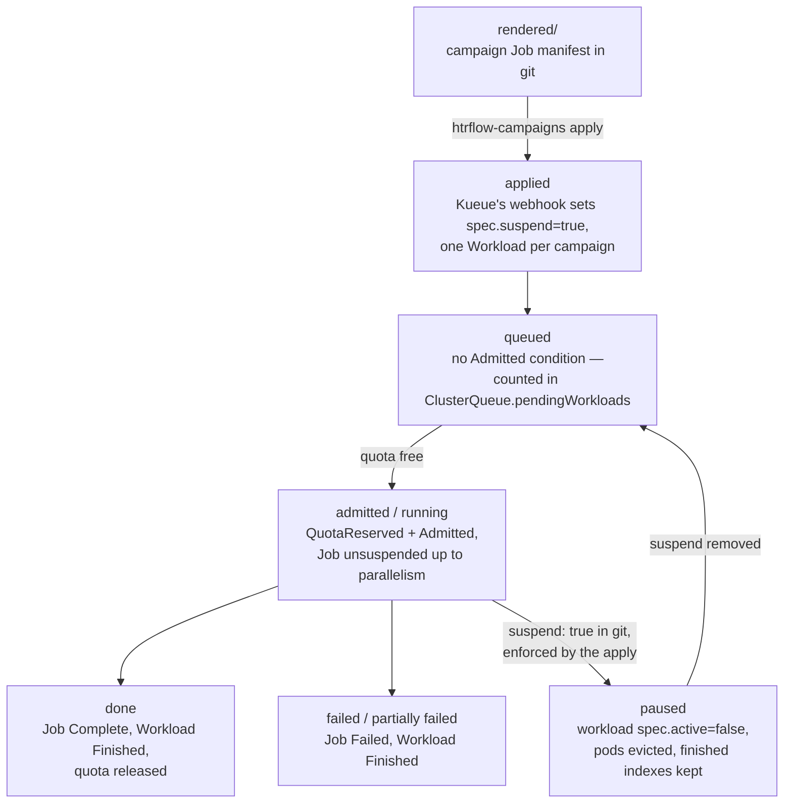

# Queueing (Kueue)

> The mechanics — Kueue's own objects, webhooks and reconcilers, the
> admission cycle field by field, pause, preemption — are on
> [Kueue in depth](kueue.md). This page is the htrflow-batch view: what our
> chart renders, what the converter puts on a Job, and what an operator sees.

Kueue is the only thing in this system that decides **when** a campaign may
run. It owns admission and GPU quota; it knows nothing about HTR, IIIF or
S3. A campaign is one Indexed Job and — the fact everything else on this
page follows from — **one Kueue Workload, not one per index**.

## Topology

Namespace `htr-batch`. Three objects, all rendered by the chart's
`templates/kueue.yaml` from `queue.*`
([Chart Values](../reference/chart.md#queue-queue)):

| Object | Name | What it carries |
|---|---|---|
| `ResourceFlavor` | `queue.flavor` (default `default-flavor`) | nothing else — the chart renders no `nodeLabels`, so the flavor matches any node |
| `ClusterQueue` | `<queue.name>-cq` (default `htr-batch-cq`) | one resource group, one flavor, `nominalQuota` per covered resource; a `namespaceSelector` on `kubernetes.io/metadata.name` so only LocalQueues in the release namespace may use it |
| `LocalQueue` | `queue.name` (default `htr-batch`), in the release namespace | points at the ClusterQueue; this is the name Jobs label themselves with |

Default quota is **cpu 4 / memory 8 Gi / `nvidia.com/gpu` 1** — exactly one
wrapper pod; the PoC cluster runs cpu 8 / 32 Gi / 1 GPU. Every resource a
pod *requests* must be covered by the ClusterQueue or Kueue marks the
Workload inadmissible, so the covered list and the pod's requests move
together.

Everything else on the ClusterQueue is Kueue's own default, not ours — live
on the PoC: `queueingStrategy: BestEffortFIFO`, `preemption.withinClusterQueue:
Never`, `stopPolicy: None`.

A cluster with more than one GPU generation would give each flavour its own
`nodeLabels` and cover them separately — HTR on one group, another tenant's
models on another. That is a values change, not a chart change.

## What the converter puts on a Job

`render._campaign_job` sets two Kueue **labels** on the Job's metadata and no
annotations at all:

- `kueue.x-k8s.io/queue-name: <converter.yaml's queue>` — always.
- `kueue.x-k8s.io/priority-class: <campaign's priority>` — only when the
  campaign file sets `priority:`. Nothing renders the matching
  `WorkloadPriorityClass`, so this is not usable today (**B18** below).

The design's `kueue.x-k8s.io/job-min-parallelism` annotation — partial
admission, letting Kueue start a campaign with fewer pods than it asked for
— **was rejected**: Kueue rewrites `spec.parallelism` on the live Job, and
its own webhook then refuses every later apply of the unchanged rendered
file. Instead `parallelism` is clamped at render time to
`min(campaign window, converter.yaml window)`, and `converter.yaml`'s
`window` is the per-cluster cap.

## Admission



The step-by-step — which controller writes which field, and when — is
[Kueue in depth](kueue.md#the-admission-cycle-step-by-step). The one fact
worth repeating here, because everything above follows from it: the Workload
carries **one podSet**, `main`, whose `count` is the Job's `spec.parallelism`
— not its `completions`. Verified live: campaign `e2e-t22run`,
`completions: 2 / parallelism: 1`, reserved
`cpu 4, memory 8Gi, nvidia.com/gpu 1` for a podSet of one. So admission
lasts for the **whole Job**: Kubernetes runs indexes up to `parallelism` and
replaces each finished pod with the next without asking Kueue again.

## Pausing

`suspend: true` in the campaign file renders `spec.suspend: true`, but that
field is not the lever: **Kueue owns `spec.suspend` for a Workload it has
admitted** and flips it back within seconds. The last step of
`htrflow-campaigns apply` patches the Workload's `spec.active` instead —
mechanism, RBAC and the wait for a brand-new Workload in
[Kueue in depth](kueue.md#pause); the campaign-file side in
[Campaign & Pipeline YAML → Pausing](../reference/campaign-yaml.md#pausing).

## What "Queued" means on a campaign card

`projection._phase` derives the phase from the Job alone, in this order:
`Complete` condition → **Succeeded**; `Failed` condition →
**PartiallyFailed** if any index completed, else **Failed**;
`spec.suspend` true → **Queued** when nothing has completed, **Paused**
otherwise; anything else → **Running**.

So "Queued" is not a Kueue state at all — it is *the Job is suspended and no
volume has finished yet*. A campaign paused in git before its first volume
completed reads "Queued" too, and a campaign that will never be admitted
(a `window` the quota cannot cover) reads "Queued" forever.

## Fifty campaigns at once

Submit fifty and exactly one runs. Each is one Workload; the ClusterQueue is
`BestEffortFIFO`, so they are admitted in submission order, except that a
Workload that does not fit is skipped rather than blocking smaller ones
behind it. There is no preemption (`withinClusterQueue: Never`), so nothing
jumps the line — and because admission covers the entire Job, **the campaign
at the front owns the single GPU until its last index finishes**, whether
that is minutes or weeks.

No preemption and no cohorts is the Phase 1 position, not a conclusion: they
are the first knobs to turn when this queue is shared with another tenant.

## The operator's view

```bash
kubectl get workloads -n htr-batch          # QUEUE, RESERVED IN, ADMITTED, FINISHED
kubectl describe workload job-<campaign>-<hash> -n htr-batch
kubectl get clusterqueue htr-batch-cq -o yaml   # pendingWorkloads, flavorsUsage,
                                                # the Active condition
```

An admitted Workload's conditions are `QuotaReserved` + `Admitted`, and
`Finished` (reason `Succeeded`) once the Job completes — all three verified
on the PoC. A waiting Workload has none of them: it shows `ADMITTED` empty
and is counted in the ClusterQueue's `status.pendingWorkloads`. The full set
of conditions, the events and the metrics are in
[Kueue in depth](kueue.md#the-operators-reading).

## Known limits and open stories

**B18** (priority lanes), **B66** (a pause Kueue owns), **B84** (`window`
against the quota) and **B76** (a TTL-reaped Job re-run from zero), each with
what stands in the way, close
[Kueue in depth](kueue.md#known-limits-and-open-stories).
