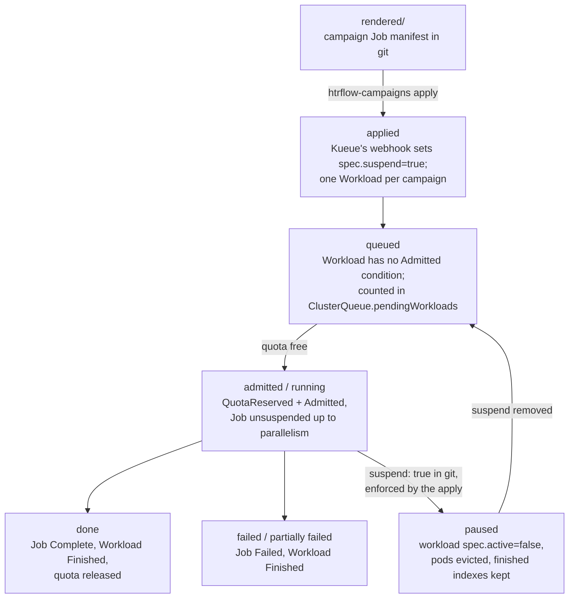

# Queueing (Kueue)

Kueue is the only thing in this system that decides **when** a campaign may
run. It owns admission and GPU quota; it knows nothing about HTR, IIIF or
S3. A campaign is one Indexed Job and — the fact everything else on this
page follows from — **one Kueue Workload, not one per index**.

## Topology

Namespace `htr-batch`. Three objects, all rendered by the chart's
`templates/kueue.yaml` from `queue.*`
([Chart Values](../reference/chart.md#queue-queue)):

| Object | Name | What it carries |
|---|---|---|
| `ResourceFlavor` | `queue.flavor` (default `default-flavor`) | nothing else — the chart renders no `nodeLabels`, so the flavor matches any node |
| `ClusterQueue` | `<queue.name>-cq` (default `htr-batch-cq`) | one resource group, one flavor, `nominalQuota` per covered resource; a `namespaceSelector` on `kubernetes.io/metadata.name` so only LocalQueues in the release namespace may use it |
| `LocalQueue` | `queue.name` (default `htr-batch`), in the release namespace | points at the ClusterQueue; this is the name Jobs label themselves with |

Default quota is **cpu 4 / memory 8 Gi / `nvidia.com/gpu` 1** — exactly one
wrapper pod. Every resource a pod *requests* must be covered by the
ClusterQueue or Kueue marks the Workload inadmissible, so the covered list
and the pod's requests move together. The PoC cluster runs cpu 8 / 32 Gi /
1 GPU.

Everything else on the ClusterQueue is Kueue's own default, not ours — live
on the PoC: `queueingStrategy: BestEffortFIFO`, `preemption.withinClusterQueue:
Never`, `stopPolicy: None`.

## What the converter puts on a Job

`render._campaign_job` sets two Kueue **labels** on the Job's metadata and no
annotations at all:

- `kueue.x-k8s.io/queue-name: <converter.yaml's queue>` — always.
- `kueue.x-k8s.io/priority-class: <campaign's priority>` — only when the
  campaign file sets `priority:`. Nothing renders the matching
  `WorkloadPriorityClass`, so this is not usable today (**B18** below).

The design's `kueue.x-k8s.io/job-min-parallelism` annotation — partial
admission, letting Kueue start a campaign with fewer pods than it asked for
— **was rejected**: Kueue rewrites `spec.parallelism` on the live Job, and
its own webhook then refuses every later apply of the unchanged rendered
file. Instead `parallelism` is clamped at render time to
`min(campaign window, converter.yaml window)`, and `converter.yaml`'s
`window` is the per-cluster cap.

## Admission



1. The apply creates the Job. Kueue's mutating webhook **suspends it on
   creation** and creates one `Workload`, named `job-<campaign>-<hash>`,
   owned by the Job and labelled `kueue.x-k8s.io/job-uid=<the Job's uid>` —
   the only link that survives a delete/recreate of the Job.
2. The Workload carries **one podSet**, `main`, whose `count` is the Job's
   `spec.parallelism` — not its `completions`. Verified live: campaign
   `e2e-t22run`, `completions: 2 / parallelism: 1`, reserved
   `cpu 4, memory 8Gi, nvidia.com/gpu 1` for a podSet of one.
3. When that much quota is free, Kueue writes `QuotaReserved` then
   `Admitted` and unsuspends the Job; the Job gets `Suspended=False` with
   reason `JobResumed`, and the namespace shows a `Suspended` event followed
   by a `Resumed` one.
4. The admission lasts for the **whole Job**: Kubernetes runs indexes up to
   `parallelism` and replaces each finished pod with the next index without
   asking Kueue again.

## Pausing

`suspend: true` in the campaign file renders `spec.suspend: true`, but that
field is not the lever: **Kueue owns `spec.suspend` for a Workload it has
admitted** and flips it back within seconds. So the last step of
`htrflow-campaigns apply` patches the Workload's `spec.active` instead
(`cluster.py`'s `sync_pause`, a merge patch, skipped when the Workload
already agrees). Deactivating evicts the pods, keeps every completed index
and leaves `kubectl get job` reporting `suspend: true`; reactivating
continues at the next index. A brand-new paused campaign has no Workload for
a moment, which is exactly the window Kueue would start it in — so the apply
waits for it and exits non-zero if it never appears
([Campaign & Pipeline YAML → Pausing](../reference/campaign-yaml.md#pausing)).

## What "Queued" means on a campaign card

`projection._phase` derives the phase from the Job alone, in this order:
`Complete` condition → **Succeeded**; `Failed` condition →
**PartiallyFailed** if any index completed, else **Failed**;
`spec.suspend` true → **Queued** when nothing has completed, **Paused**
otherwise; anything else → **Running**.

So "Queued" is not a Kueue state at all — it is *the Job is suspended and no
volume has finished yet*. A campaign paused in git before its first volume
completed reads "Queued" too, and a campaign that will never be admitted
(a `window` the quota cannot cover) reads "Queued" forever.

## Fifty campaigns at once

Submit fifty and exactly one runs. Each is one Workload; the ClusterQueue is
`BestEffortFIFO`, so they are admitted in submission order, except that a
Workload that does not fit is skipped rather than blocking smaller ones
behind it. There is no preemption (`withinClusterQueue: Never`), so nothing
jumps the line — and because admission covers the entire Job, **the campaign
at the front owns the single GPU until its last index finishes**, whether
that is minutes or weeks.

## The operator's view

```bash
kubectl get workloads -n htr-batch          # QUEUE, RESERVED IN, ADMITTED, FINISHED
kubectl describe workload job-<campaign>-<hash> -n htr-batch
kubectl get clusterqueue htr-batch-cq -o yaml   # pendingWorkloads, flavorsUsage,
                                                # the Active condition
```

An admitted Workload's conditions are `QuotaReserved` + `Admitted`, and
`Finished` (reason `Succeeded`) once the Job completes — all three verified
on the PoC. A waiting Workload has none of them: it shows `ADMITTED` empty
and is counted in the ClusterQueue's `status.pendingWorkloads`, with Kueue's
reason on the object itself. If Workloads sit queued while the GPU is idle,
**check the Kueue controller first** — a dead Kueue looks exactly like a busy
GPU.

## Known limits and open stories

- **B18** — *Let urgent volumes jump the queue.* No `WorkloadPriorityClass`
  is rendered and preemption is `Never`, so a campaign's `priority:` label
  names a class that does not exist and Kueue's webhook rejects the Job.
  Priority lanes need the classes, preemption, and a story for what "admitted
  next" means when one campaign already holds the quota (audit X17).
- **B66** — *A pause is expressed in Kueue, not by us patching its
  Workload.* `sync_pause` is our own lever, and it talks to the deprecated
  `v1beta1` Workload API while the chart renders `v1beta2` (audit X24).
- **B84** — *`htrflow-campaigns apply` warns when `window` does not fit the
  quota.* The shipped defaults cannot admit anything: converter `window` 20
  against a 1-GPU quota renders `parallelism: 20`, inadmissible forever and
  shown only as "Queued" (audit X18).
- **B76** — *A finished campaign does not come back when the TTL has reaped
  its Job.* `ttlSecondsAfterFinished: 86400` removes the Job a day after it
  finishes; the next apply re-creates it and every index runs again
  (audit X6).
