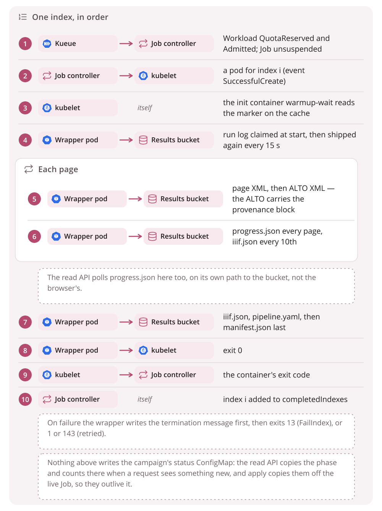
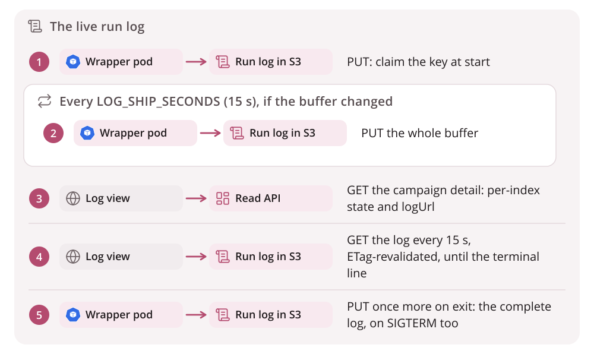

# Events and signals

Almost nothing in this system publishes a *campaign* status document. Nearly
every question is answered from a signal something else already emits:
Kubernetes' own bookkeeping while the Job exists, and objects in the bucket
after it is gone. There are two exceptions. **How far a running pod has got**
is answered by the wrapper itself, in `progress.json` beside the volume's
results, which the read API fetches anonymously from inside the cluster
([View results](../getting-started/viewing.md) covers the address it uses).
**How a campaign ended** is kept in one small ConfigMap,
`campaign-<name>-status`, written by the read API and by `apply`
([The record a campaign leaves](campaigns.md#the-record-a-campaign-leaves)).
This page lists every signal and who reads it.

## One index, in order

## The signals

| Signal | Produced by | Read by | Survives the Job's TTL |
|---|---|---|---|
| Job condition `Suspended` (reason `JobResumed` when it clears) | Kueue's webhook, then the Job controller | Status page (`Queued`/`Paused`), operator | no |
| Job conditions `SuccessCriteriaMet` then `Complete`, `FailureTarget` then `Failed` | Job controller | Status page phase, operator | no |
| `status.completedIndexes`/`failedIndexes` (range strings, e.g. `0-2,5`) | Job controller | Status page per-volume state, operator | no |
| Pod phase and `status.reason` (`DeadlineExceeded` after the pod's own deadline) | kubelet | Status page, which shows the wrapper's `SIGTERM` as `DeadlineExceeded` when the pod's `status.reason` says so | no |
| Container exit code: 0, 13, 1, 143 | wrapper, via the kubelet | `podFailurePolicy` (13 becomes `FailIndex`), operator | no |
| `wrapper` termination message, `{"stage", "permanent", "error"}` (policy `File`) | wrapper | Status page `reason`, operator | no, and only while the pod itself exists |
| `warmup-wait` termination message: one sentence naming the marker (policy `FallbackToLogsOnError`) | the init gate | Status page. The volume's `reason` falls through to a non-zero init container | no |
| Warm-up Job's `{"stage": "warmup", …}` message | `htrflow_batch.warmup` | The campaign card's warm-up chip | Warm-up Jobs have no TTL. A pruning apply removes a warm-up Job once its pipeline file is gone |
| Workload conditions `QuotaReserved`, `Admitted`, `Finished`, `Evicted` | Kueue | operator ([Troubleshooting](../getting-started/troubleshooting.md)) | no. The Workload is owned by the Job |
| Events: `Suspended`, `Resumed`, `SuccessfulCreate`, `Killing`, `FailedIndexes` | Kueue, Job controller, kubelet | operator (`kubectl get events`) | no, and the API server drops them after its event TTL (an hour by default) |
| Warm-up marker `/data/warmup/<pipeline-id>.done`, in the recipe's own directory of the cache (`<pipeline-id>-<recipe sha256>/` on the volume) | The warm-up Job, before it logs success | Every batch pod's init container of the same recipe | **yes**, it lives on the cache PVC |
| Run log `status/logs/<pipeline>/<volume>.txt` | wrapper, every 15 s and once on every exit path | Run viewer, operator ([below](#the-run-log)) | **yes** |
| `page/NNNN.xml` and `alto/NNNN.xml` | wrapper uploader, PAGE first, each with the `source-digest` of its image as object metadata | Resume (both must exist, and the ALTO's digest must match the page's source now), verify, the viewer | **yes** |
| `progress.json` | wrapper, after every page outcome and at every stage change, and with stage `failed` on any exit that is not a success | The read API, and so the campaign page's page counts and its failure notice. It caches each: 5 s for a running volume, an hour once it is over | **yes** |
| `iiif.json`, `pipeline.yaml` | Publish, after verify. `iiif.json` covers the pages that came out, so a volume with a failed page is one canvas short. `iiif.json` is also written every 10 pages *during* the run, covering the pages done so far | The Universal Viewer, and a person reading the recipe back | **yes** |
| `manifest.json` | Publish, **last** | Anyone asking "is it done?". `pages_ok`/`pages_failed` say whether the volume lost pages on the way. Resume falls back to its `page_source_digests` for a page stored without a `source-digest`, and its timings (`gpu_stall_seconds`, `wall_seconds`) are the evidence for or against a [cache layer](../roadmap/cache-layer.md) | **yes** |
| ALTO `Processing ID="htrflow-batch"` block | `provenance.stamp_alto`, before the upload | Anyone holding the file, with no cluster at all | **yes** |
| `ConfigMap campaign-<name>-status`: `phase`, the three volume counts, `startedAt`, `finishedAt`, `resultsBase`, `jobUid`, and `failedVolumes` from the detail route | The read API on every request that sees something new; `apply`, from the live Job | The campaign browser once the Job is gone, and `apply`, to leave a finished unchanged campaign alone | **yes**, it has no TTL of its own. It is a cluster object, not a bucket one |

The pattern is the same everywhere: **everything Kubernetes emits is evidence
for as long as the Job lives, and everything in the bucket is evidence for
good.** The status ConfigMap is the one deliberate exception, and it carries a
summary rather than the per-index detail. That is why `manifest.json`, not an
exit code or a Job condition, is the only thing that means "done".

The commands that answer the everyday questions (what is running, how far a
campaign has got, why an index failed, whether a volume is finished) are in
[Troubleshooting](../getting-started/troubleshooting.md).

## Progress staleness

`progress.json` is the one signal here that a reader may find *stale*
rather than missing:

- **It is written best-effort.** A failed write is logged and dropped, so a
  page never loses its work to a status file.
- **It is read best-effort.** A bucket that does not answer means no progress
  on the page, never an error.
- **Its age is shown with it.** "Updated 12 s ago" is the difference between
  a volume that is working and one that has stopped. The API computes
  `ageSeconds` from its own clock, so a reader's skewed clock cannot distort
  it.
- **It never means "done".** Only `manifest.json`, written last, does.

## The run log

The campaign browser follows a running volume without anything writing a
status document for it. **The pod ships its own log to S3.** The browser reads
the log straight from S3, and asks the read API, the only component with
cluster credentials, which volumes exist and what state they are in.

### Wrapper side (`htrflow_batch.logship`)

- **Capture.** `LogCapture.install()` replaces `sys.stdout` and
  `sys.stderr` with tees. The tees write through to the originals, so
  `kubectl logs` is unchanged, and append to one in-memory buffer in arrival
  order. It is installed **before** logging is configured, so the root
  `StreamHandler` binds the tee, and both htrflow's `logging` output and its
  bare `print`s land in the buffer.
- **Redaction.** Every chunk is URL-redacted (userinfo and query removed) as
  it arrives in the buffer. That covers a bare `print`, and a handler a
  library installed itself, not only the wrapper's own log lines.
- **Shipping.** Once the `ResultStore` exists,
  `start_shipping(upload, LOG_SHIP_SECONDS)` uploads straight away. A retried
  volume therefore replaces the previous attempt's log before the reader's
  first poll. A daemon thread then re-uploads the buffer every interval,
  **when it has changed**. An upload error is logged once and retried at the
  next interval, and never fails the run. The upload client has its own short
  timeouts (5 s connect, 15 s read, 2 attempts in all), so a dead bucket
  cannot pin the shipping thread.
- **The final upload.** `finish()` runs on every exit path: success, exit 13,
  exit 1, and the SIGTERM handler. It stops the thread, does a last upload
  and restores the streams, all inside a 90 s budget
  (`FINAL_SHIP_SECONDS`) that fits the pod's 120 s grace period. The final
  object is the complete log, not a tail.
- **A size cap.** The buffer is capped at **4 MiB**. Past that, the middle is
  dropped with a marker line, keeping the first 1 MiB and the last 2 MiB, cut
  on line boundaries. A pathological run cannot grow memory or upload size
  without bound.
- **The key.** `status/logs/<PIPELINE_ID>/<VOLUME_REF>.txt`, at the bucket
  root. It is a shared `status/` namespace, deliberately not under the volume
  prefix. `LOG_SHIP_SECONDS=0` disables periodic shipping, and `finish` still
  ships.

**Limits.** Only Python-level writes are teed. Anything writing to file
descriptors 1 and 2 directly, such as CUDA and C++ warnings or subprocesses,
shows only in `kubectl logs`. On a **versioned** bucket, each upload is a new
object version, about 240 an hour per running volume. Add a lifecycle rule,
or set `LOG_SHIP_SECONDS=0`.

### Read API side

- **`logUrl`.** `GET /api/v1/jobs/{namespace}/{name}` returns a
  deterministic, **absolute** `logUrl`,
  `<results-base-url>/status/logs/<pipeline>/<volume>.txt`, for every volume
  row regardless of state. There is no existence check and nothing is cached.
  The URL is absolute because the browser has no bucket base URL of its own:
  the API is the component that knows the results base. The browser fetches
  `logUrl` directly and treats a 404 as "no log yet".
- **Retries.** A retry does not retire or copy the key. The wrapper claims
  the same key again at the start of the new attempt, so the new attempt's log
  overwrites the previous one. The log is the complete evidence for the most
  recent attempt. The read API's per-index `reason`, the wrapper's own
  termination message, is the failure summary for as long as the failed pod
  exists.
- **Access.** The bucket policy decides whether anyone can read
  `status/logs/*` anonymously ([Security](security.md#the-bucket-policy)).

### Browser side

The run viewer (`/log`) follows a running volume live and stops at the
wrapper's terminal line, a complete `manifest.json`, or a run of failed polls
([Web front & read API](../reference/web.md)). The terminal lines it keys on
are `[<volume>] COMPLETE <n> pages`, `permanent failure in <stage>:` and
`transient failure in <stage>:`; a SIGTERMed attempt ends with the last.

## Known limits

- **A queued campaign does not say what it is waiting on.** It could be
  quota, its warm-up, or a pause. A volume whose last page is long past is not
  marked as stalled either. Progress per volume is there, and this campaign
  half is not.
- **Some failures surface as nothing.** A campaign whose `volumes.txt`
  ConfigMap is missing shows an empty table and a "load more" that never
  loads.
- **Only a summary outlives the Job.** A week after a campaign finishes —
  `ttlSecondsAfterFinished`, which a pipeline may set for itself — the Job is
  reaped and `completedIndexes` and `failedIndexes` go with it. The status
  ConfigMap stays, so the read API still answers with the phase, the three
  counts, the timestamps and up to 50 failed volume ids with a sentence each;
  a 404 means no record was ever written, not that one expired. What is gone
  is per-volume detail beyond those 50, so "which volumes failed?" then costs
  one request per volume, against `manifest.json` and `progress.json`. No
  campaign-level record is written to the *bucket* at all.
- **Read API edges.** A detail request lists the campaign's running and
  failed pods, a page at a time and trimmed to the fields it reads; a
  succeeded pod is not read at all, since its index is already in
  `completedIndexes`. For the few seconds between a volume's pod succeeding
  and the Job counting its index done, that volume can read `pending`.
- **An oversized `images:` volume has no signal at all.** An `images:`
  volume whose URL list does not fit in one environment variable (Linux allows
  128 KiB) kills the pod with `Argument list too long` before the wrapper
  starts. `validate` refuses an `images:` line over 100 KiB, so only a
  campaign rendered before that check can hit it.
- **A warm-up that is running when its pod template changes waits for the
  next apply.** A warm-up Job whose rendered pod template moved is deleted and
  created again, but not while it is downloading: that one is reported and
  left alone, and it is the operator who has to come back and apply again once
  it has finished
  ([htrflow-campaigns CLI](../reference/cli.md)).
