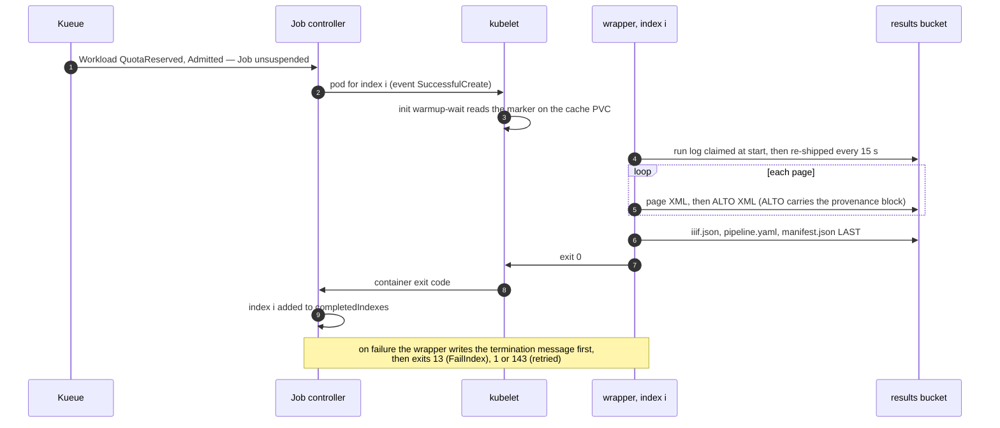

# Events and signals

Nothing in this system publishes a status document. Every question about a
campaign is answered by reading a signal something else already emits —
Kubernetes' own bookkeeping while the Job exists, and objects in the bucket
after it is gone. This page is the whole list, and who reads each one.

## One index, in order



## The signals

| Signal | Produced by | Read by | Survives the Job's TTL |
|---|---|---|---|
| Job condition `Suspended` (reason `JobResumed` when it clears) | Kueue's webhook, then the Job controller | status page (`Queued` / `Paused`), operator | no |
| Job conditions `SuccessCriteriaMet` → `Complete`, `FailureTarget` → `Failed` | Job controller | status page phase, operator | no |
| `status.completedIndexes` / `failedIndexes` (range strings, e.g. `0-2,5`) | Job controller | status page per-volume state, operator | no |
| Pod phase and `status.reason` (`DeadlineExceeded` after the pod's own deadline) | kubelet | status page — it rewrites the wrapper's `SIGTERM` to `DeadlineExceeded`, but only when the pod's `status.reason` is `DeadlineExceeded` **and** the termination message's `error` is exactly `SIGTERM`; every other pairing passes through untouched | no |
| Container exit code — 0, 13, 1, 143 | wrapper → kubelet | `podFailurePolicy` (13 → `FailIndex`), operator | no |
| `wrapper` termination message, `{"stage", "permanent", "error"}` (policy `File`) | wrapper | status page `reason`, operator | no — and only while the pod itself exists |
| `warmup-wait` termination message: one sentence naming the marker (policy `FallbackToLogsOnError`, so the container's own stderr becomes the message) | the init gate | status page — `wrapper_reason` falls through to any non-zero init container | no |
| warm-up Job's `{"stage": "warmup", …}` message | `htrflow_batch.warmup` | the campaign card's warm-up chip | n/a — warm-up Jobs have no TTL at all (**B87**) |
| Workload conditions `QuotaReserved`, `Admitted`, `Finished`, `Evicted` | Kueue | operator ([Queueing](queueing.md#the-operators-view)) | no — the Workload is owned by the Job |
| Events: `Suspended`, `Resumed`, `SuccessfulCreate`, `Killing`, `FailedIndexes` | Kueue, Job controller, kubelet | operator (`kubectl get events`) | no — and dropped within the API server's event TTL (an hour by default) |
| Warm-up marker `/data/warmup/<pipeline-id>.done` | the warm-up Job, before it logs success | every batch pod's init container | **yes** — it lives on the cache PVC |
| Run log `status/logs/<pipeline>/<volume>.txt` | wrapper, every 15 s and once on every exit path | run viewer, operator | **yes** |
| `page/NNNN.xml` + `alto/NNNN.xml` | wrapper uploader, PAGE first | resume (both must exist), verify, the viewer | **yes** |
| `iiif.json`, `pipeline.yaml` | publish, after a clean verify | Universal Viewer; a human reading the recipe back | **yes** |
| `manifest.json` | publish, **last** | the completion marker; resume compares its `page_sources`; the Phase 2 gate reads its timings | **yes** |
| ALTO `Processing ID="htrflow-batch"` block | `provenance.stamp_alto`, before the upload | anyone holding the file, with no cluster at all | **yes** |

The pattern is the same everywhere: **everything Kubernetes emits is
evidence for a day; everything in the bucket is evidence for good.** That is
why `manifest.json` — not an exit code, not a Job condition — is the only
thing that means "done".

## The 03:00 lookups

| Question | Command |
|---|---|
| Is anything running? | `kubectl get jobs,workloads -n htr-batch` |
| Which volume is on the GPU right now? | `kubectl get pods -n htr-batch -L batch.kubernetes.io/job-completion-index` |
| How far has this campaign got? | `kubectl get job NAME -n htr-batch -o jsonpath='{.status.completedIndexes} {.status.failedIndexes}'` |
| Why did index 7 fail? | `kubectl get pods -n htr-batch -l batch.kubernetes.io/job-name=NAME -o jsonpath='{.items[*].status.containerStatuses[*].state.terminated.message}'` |
| …and the pod is already gone? | `curl PUBLIC_RESULTS_BASE/status/logs/PIPELINE/VOLUME.txt` |
| Is this volume actually finished? | `curl -I PUBLIC_RESULTS_BASE/NAMESPACE/PIPELINE/VOLUME/manifest.json` |
| Why are the pods stuck in `Init:0/1`? | `kubectl logs POD -n htr-batch -c warmup-wait`, then the warm-up Job ([Failure Handling](failure-handling.md#why-is-the-marker-missing)) |
| Why is nothing being admitted? | `kubectl get clusterqueue htr-batch-cq -o yaml` — `pendingWorkloads`, `flavorsUsage` |
| Which image and pipeline produced this ALTO? | read the file: two `Processing` blocks, htrflow's and ours |

Live example of the last one, from the PoC bucket
(`htr-batch/e2e-prov/e2e-prov-01/alto/0001.xml`):

```xml
<Processing ID="htrflow-batch">
    <processingDateTime>2026-09-07T07:57:15.538114+00:00</processingDateTime>
    <processingStepDescription>image=127.0.0.1:30500/htrflow-batch@sha256:175269ee…</processingStepDescription>
    <processingStepDescription>htrflow-base=v0.2.6-79-g0ede4da</processingStepDescription>
</Processing>
```

## Known limits and open stories

- **C13** — *The status page says exactly where in the cycle a campaign and
  each volume are.* The phases derive from the Job alone, so "waiting for the
  warm-up", "downloading", "on the GPU" and "publishing" all read `active`.
- **C14** — *Every error says what happened, where, and what the user does
  about it.* Some paths still surface nothing: a campaign whose `volumes.txt`
  ConfigMap is missing shows an empty table and a "load more" that never
  loads (audit X29).
- **C08** and **B76** — *Status at archive scale* / *a finished campaign does
  not come back after the TTL.* Twenty-four hours on, `completedIndexes` and
  `failedIndexes` are gone with the Job, the read API answers 404, and no
  campaign-level record was ever written to the bucket: "which volumes
  failed?" then costs one HEAD per volume (audit X19).
- **C15** and **C16** — *The read API answers with a sentence and the right
  headers* / *fetch only the Pods that are needed.* One unparseable index
  label is a bare 500 with no security headers, and every poll lists every
  Pod the campaign ever made (audit X12, X13).
- **B74** and **B75** — *A broken warm-up does not hold the GPU quota for
  hours* / *a warm-up that did not work fails visibly.* **Both landed
  2026-09-07**: the gate is bounded, exits 13 with a sentence, and its
  message reaches the card; the warm-up writes its marker before it logs
  success and installs the same SIGTERM handler the batch wrapper has.
- **B86** — *The converter and the wrapper reject unreasonable values and
  name the line.* Found on the 2026-09-08 live run: an `images:` volume whose
  URL list does not fit one environment variable (Linux allows 128 KiB per
  argument) kills the pod with `Argument list too long` before the wrapper
  starts — no stage, no termination message, no signal at all.
- **B77** — *A changed pipeline is stopped in `validate`, not as "field is
  immutable".* Also found 2026-09-08: when it is the *converter* that changed
  and it now renders a warm-up Job differently, the apply gets a 422 against
  the existing warm-up Job and stops before the campaign Jobs, with raw
  webhook JSON as the only signal.
- **B88** (upstream **Bug 3023**) — *a page htrflow cannot segment must not
  stall the run.* The worst case on this page is the one with **no signal at
  all**: htrflow's YOLO step raises inside `Inference._process`'s daemon
  thread, the thread dies silently, `pipeline.run()` blocks forever, and the
  wrapper sits holding the GPU until the pod's `activeDeadlineSeconds` — no
  page failure, no stage change, no termination message, only a run log that
  stops advancing. Seen on the 2026-09-08 live run
  ([From image to transcription](page-flow.md#known-limits-and-open-stories)).
- **B87** — *`apply` prunes the warm-up Job and ConfigMap of a pipeline that
  is gone.* Warm-up Jobs have no TTL and are not pruned: after the 2026-09-08
  cleanup, `htr-warmup-e2e-prov`, `htr-warmup-e2e-t22-v2` and
  `htr-warmup-e2e-t22-v3` were all still sitting `Complete` in the namespace.
