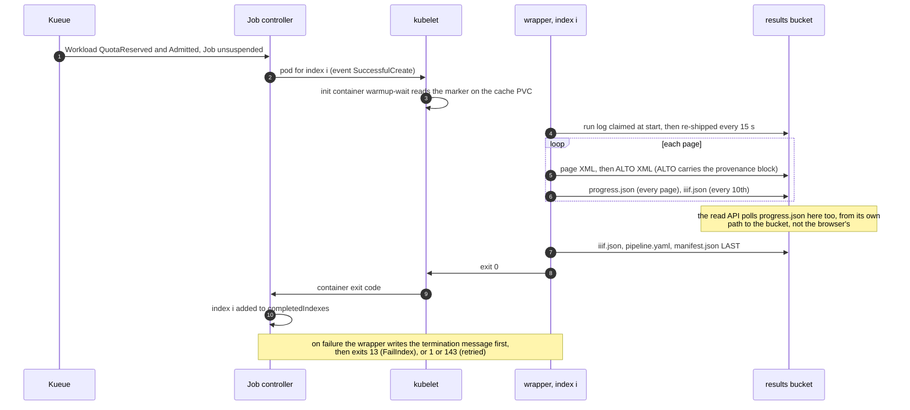
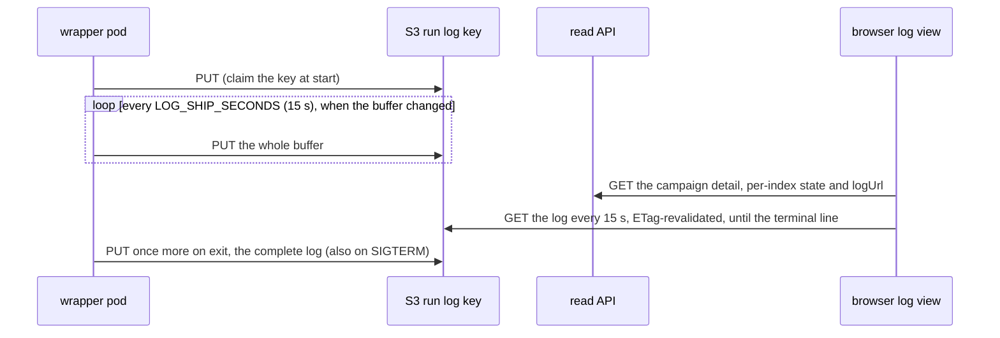

# Events and signals

Nothing in this system publishes a *campaign* status document. Every question
about a campaign is answered from a signal that something else already emits:
Kubernetes' own bookkeeping while the Job exists, and objects in the bucket
after it is gone.

The one exception is a question the cluster cannot answer: how far into a
volume a running pod has got. The wrapper answers that itself, in
`progress.json` next to the volume's results. This page lists every signal and
who reads it.

Answering that question makes the read API a bucket **reader**, not only a
Kubernetes API client. It fetches `progress.json` itself (`ProgressReader` in
`packages/web`), with anonymous GETs and no credentials. So the web pod must
be able to reach the results bucket at whatever address works from *inside*
the cluster, which is `HTRFLOW_INTERNAL_RESULTS_BASE` (chart value
`web.internalResultsBase`, see [Chart Values](../reference/chart.md)). The
browser-facing `resultsBase`, which every link on the campaign page is built
from, may be a different address. If you point the internal one at an address
the pod cannot reach, every row silently shows no progress.

## One index, in order



## The signals

| Signal | Produced by | Read by | Survives the Job's TTL |
|---|---|---|---|
| Job condition `Suspended` (reason `JobResumed` when it clears) | Kueue's webhook, then the Job controller | Status page (`Queued`/`Paused`), operator | no |
| Job conditions `SuccessCriteriaMet` then `Complete`, `FailureTarget` then `Failed` | Job controller | Status page phase, operator | no |
| `status.completedIndexes`/`failedIndexes` (range strings, e.g. `0-2,5`) | Job controller | Status page per-volume state, operator | no |
| Pod phase and `status.reason` (`DeadlineExceeded` after the pod's own deadline) | kubelet | Status page. It rewrites the wrapper's `SIGTERM` to `DeadlineExceeded`, but only when the pod's `status.reason` is `DeadlineExceeded` **and** the termination message's `error` is exactly `SIGTERM`. Every other pairing passes through untouched | no |
| Container exit code: 0, 13, 1, 143 | wrapper, via the kubelet | `podFailurePolicy` (13 becomes `FailIndex`), operator | no |
| `wrapper` termination message, `{"stage", "permanent", "error"}` (policy `File`) | wrapper | Status page `reason`, operator | no, and only while the pod itself exists |
| `warmup-wait` termination message: one sentence naming the marker (policy `FallbackToLogsOnError`, so the container's own stderr becomes the message) | the init gate | Status page. The volume's `reason` falls through to a non-zero init container | no |
| Warm-up Job's `{"stage": "warmup", …}` message | `htrflow_batch.warmup` | The campaign card's warm-up chip | Warm-up Jobs have no TTL. A pruning apply removes a warm-up Job once its pipeline file is gone |
| Workload conditions `QuotaReserved`, `Admitted`, `Finished`, `Evicted` | Kueue | operator ([Queueing](queueing.md#the-operators-reading)) | no. The Workload is owned by the Job |
| Events: `Suspended`, `Resumed`, `SuccessfulCreate`, `Killing`, `FailedIndexes` | Kueue, Job controller, kubelet | operator (`kubectl get events`) | no, and the API server drops them after its event TTL (an hour by default) |
| Warm-up marker `/data/warmup/<pipeline-id>.done` | The warm-up Job, before it logs success | Every batch pod's init container | **yes**, it lives on the cache PVC |
| Run log `status/logs/<pipeline>/<volume>.txt` | wrapper, every 15 s and once on every exit path | Run viewer, operator ([below](#the-run-log)) | **yes** |
| `page/NNNN.xml` and `alto/NNNN.xml` | wrapper uploader, PAGE first | Resume (both must exist), verify, the viewer | **yes** |
| `progress.json` | wrapper, after every page outcome and at every stage change, and with stage `failed` on any exit that is not a success | The read API, from its own path to the bucket, and so the campaign page's page counts and its failure/error notice. The API fetches at most `PROGRESS_FETCH_CAP` (32) per request, running rows first, and caches each for a few seconds | **yes** |
| `iiif.json`, `pipeline.yaml` | Publish, after verify. `iiif.json` covers the pages that came out, so a volume with a failed page is one canvas short. `iiif.json` is also written every 10 pages *during* the run, covering the pages done so far | The Universal Viewer, and a person reading the recipe back | **yes** |
| `manifest.json` | Publish, **last** | Anyone asking "is it done?". `pages_ok`/`pages_failed` say whether the volume lost pages on the way. Resume compares its `page_sources`, and its timings (`gpu_stall_seconds`, `wall_seconds`) are the evidence for or against a [cache layer](../roadmap/cache-layer.md) | **yes** |
| ALTO `Processing ID="htrflow-batch"` block | `provenance.stamp_alto`, before the upload | Anyone holding the file, with no cluster at all | **yes** |

The pattern is the same everywhere: **everything Kubernetes emits is
evidence for a day, and everything in the bucket is evidence for good.** That
is why `manifest.json`, not an exit code or a Job condition, is the only thing
that means "done".

## Quick lookups

| Question | Command |
|---|---|
| Is anything running? | `kubectl get jobs,workloads -n <namespace>` |
| Which volume is on the GPU right now? | `kubectl get pods -n <namespace> -L batch.kubernetes.io/job-completion-index` |
| How far has this campaign got? | `kubectl get job <campaign> -n <namespace> -o jsonpath='{.status.completedIndexes} {.status.failedIndexes}'` |
| Why did an index fail? | `kubectl get pods -n <namespace> -l batch.kubernetes.io/job-name=<campaign> -o jsonpath='{.items[*].status.containerStatuses[*].state.terminated.message}'` |
| …and the pod is already gone? | `curl <results-base-url>/status/logs/<pipeline>/<volume>.txt` |
| How far is this volume, right now? | `curl <results-base-url>/<namespace>/<pipeline>/<volume>/progress.json` |
| Is this volume actually finished? | `curl -I <results-base-url>/<namespace>/<pipeline>/<volume>/manifest.json` |
| Why are the pods stuck in `Init:0/1`? | `kubectl logs <pod> -n <namespace> -c warmup-wait`, then the warm-up Job ([Failure Handling](failure-handling.md#why-is-the-marker-missing)) |
| Why is nothing being admitted? | `kubectl get clusterqueue <queue>-cq -o yaml`: `pendingWorkloads`, `flavorsUsage` |
| Which image and pipeline produced this ALTO? | Read the file. It has two `Processing` blocks, htrflow's and the wrapper's |

The wrapper's block looks like this:

```xml
<Processing ID="htrflow-batch">
    <processingDateTime>…</processingDateTime>
    <processingStepDescription>image=<registry>/htrflow-batch@sha256:<digest></processingStepDescription>
    <processingStepDescription>htrflow-base=<revision></processingStepDescription>
</Processing>
```

`progress.json` is the one signal here that a reader may find *stale*
rather than missing:

- **It is written best-effort.** A failed write is logged and dropped, so a
  page never loses its work to a status file.
- **It is read best-effort.** A bucket that does not answer means no progress
  on the page, never an error.
- **Its age is shown with it.** "Updated 12 s ago" is the difference between
  a volume that is working and one that has stopped. The API turns
  `updated_at` into `ageSeconds` itself, from its own clock at fetch time,
  rather than handing the browser a timestamp to compare with its own. A
  reader's clock running fast or slow must not turn "12 s ago" into "0 s ago"
  or a negative number.
- **It never means "done".** Only `manifest.json`, written last, does.

## The run log

The campaign browser follows a running volume without anything writing a
status document for it. **The pod ships its own log to S3.** The browser reads
the log straight from S3, and asks the read API, the only component with
cluster credentials, which volumes exist and what state they are in.



### Wrapper side (`htrflow_batch.logship`)

- **Capture.** `LogCapture.install()` replaces `sys.stdout` and
  `sys.stderr` with tees. The tees write through to the originals, so
  `kubectl logs` is unchanged, and append to one in-memory buffer in arrival
  order. It is installed **before** logging is configured, so the root
  `StreamHandler` binds the tee, and both htrflow's `logging` output and its
  bare `print`s land in the buffer.
- **Redaction.** Every chunk is URL-redacted (userinfo and query removed) as
  it arrives in the buffer. That covers a bare `print`, and a handler a
  library installed itself, not only the wrapper's own log lines.
- **Shipping.** Once the `ResultStore` exists,
  `start_shipping(upload, LOG_SHIP_SECONDS)` uploads straight away. A retried
  volume therefore replaces the previous attempt's log before the reader's
  first poll. A daemon thread then re-uploads the buffer every interval,
  **when it has changed**. An upload error is logged once and retried at the
  next interval, and never fails the run. The upload client has its own short
  timeouts (5 s connect, 30 s read, 2 attempts), so a dead bucket cannot pin
  the shipping thread or the final upload.
- **The final upload.** `finish()` runs on every exit path: success, exit 13,
  exit 1, and the SIGTERM handler. It joins the thread (with a 30 s cap), does
  a last upload and restores the streams. The final object is the complete
  log, not a tail.
- **A size cap.** The buffer is capped at **4 MiB**. Past that, the middle is
  dropped with a marker line, keeping the first 1 MiB and the last 2 MiB, cut
  on line boundaries. A pathological run cannot grow memory or upload size
  without bound.
- **The key.** `status/logs/<PIPELINE_ID>/<VOLUME_REF>.txt`, at the bucket
  root. It is a shared `status/` namespace, deliberately not under the volume
  prefix. `LOG_SHIP_SECONDS=0` disables periodic shipping, and `finish` still
  ships.

**Limits.** Only Python-level writes are teed. Anything writing to file
descriptors 1 and 2 directly, such as CUDA and C++ warnings or subprocesses,
shows only in `kubectl logs`. On a **versioned** bucket, each upload is a new
object version, about 240 an hour per running volume. Add a lifecycle rule,
or set `LOG_SHIP_SECONDS=0`.

### Read API side

- **`logUrl`.** `GET /api/v1/jobs/{namespace}/{name}` returns a
  deterministic, **absolute** `logUrl`,
  `<results-base-url>/status/logs/<pipeline>/<volume>.txt`, for every volume
  row regardless of state. There is no existence check and nothing is cached.
  The URL is absolute because the browser has no bucket base URL of its own:
  the API is the component that knows the results base. The browser fetches
  `logUrl` directly and treats a 404 as "no log yet".
- **Retries.** A retry does not retire or copy the key. The wrapper claims
  the same key again at the start of the new attempt, so the new attempt's log
  overwrites the previous one. The log is the complete evidence for the most
  recent attempt. The read API's per-index `reason`, the wrapper's own
  termination message, is the failure summary for as long as the failed pod
  exists.
- **Access.** The bucket policy decides whether anyone can read
  `status/logs/*` anonymously ([Security](security.md#the-bucket-policy)).

### Browser side (`/log`)

- **Links.** The campaign card fetches its volumes from
  `GET /api/v1/jobs/{namespace}/{name}`, paged by `offset`/`limit`. Every
  volume row gets a `log` link built from `logUrl`. For a volume whose `state`
  is not `"done"`, the link adds `&live=1`.
- **Live mode.** The view re-fetches every `VITE_LIVE_MS` (15 s,
  ETag-revalidated) and shows a "live · updated HH:MM:SS" badge. It keeps the
  view pinned to the bottom while the reader is at the bottom. It stops in any
  of three cases:
  - the wrapper's terminal line appears: `[<volume>] COMPLETE <n> pages`,
    `permanent failure in <stage>:` or `transient failure in <stage>:`
    (`isTerminalLog` in `runlog.ts`, which ignores the plain-language sentence
    after the em dash). A SIGTERMed attempt ends with
    `transient failure in <stage>: SIGTERM`, so it stops the view too
  - a `manifest.json` covers every page
  - `LIVE_MAX_FAILURES` (20) polls in a row fail
- **The summary.** A summary card appears once `manifest.json` lands: counts,
  median, p95 and max page times, the slowest pages, failed pages, and the
  per-page grid. While live, the manifest fetch is retried on the same
  cadence.

## Known limits

- **A queued campaign does not say what it is waiting on.** It could be
  quota, its warm-up, or a pause. A volume whose last page is long past is not
  marked as stalled either. Progress per volume is there, and this campaign
  half is not.
- **Some failures surface as nothing.** A campaign whose `volumes.txt`
  ConfigMap is missing shows an empty table and a "load more" that never
  loads.
- **Status does not outlive the Job.** A day after a campaign finishes,
  `completedIndexes` and `failedIndexes` are gone with the Job, and the read
  API answers 404. No campaign-level record is written to the bucket, so
  "which volumes failed?" then costs one request per volume, against
  `manifest.json` and `progress.json`.
- **Read API edges.** One unparseable index label on a pod makes the whole
  response a bare 500. Every poll lists every Pod the campaign has made, not
  only the ones needed.
- **An oversized `images:` volume has no signal at all.** An `images:` volume
  whose URL list does not fit in one environment variable (Linux allows
  128 KiB per argument) kills the pod with `Argument list too long` before the
  wrapper starts. There is no stage and no termination message. Keep such
  volumes small, or give them an IIIF manifest.
- **A changed warm-up Job shows up as "field is immutable".** When a new
  converter renders a warm-up Job differently, the apply gets a 422 against
  the existing Job and stops before the campaign Jobs. The only signal is the
  API server's raw response. Delete the old warm-up Job and apply again.
