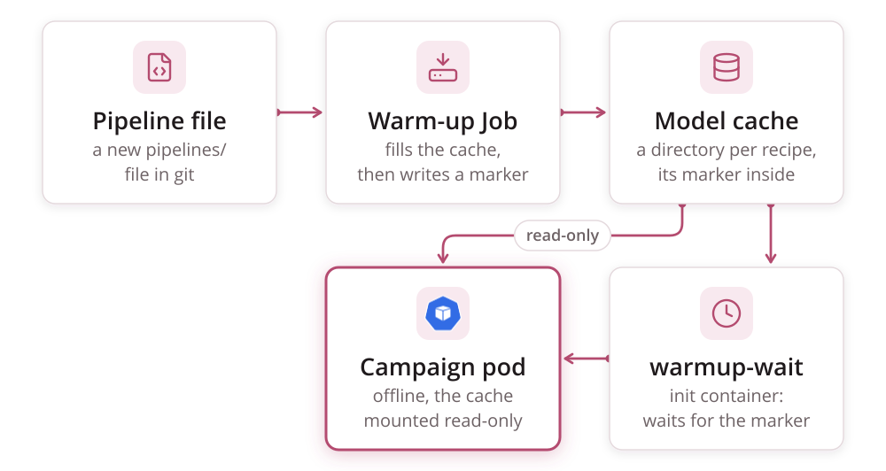

# The Wrapper

The wrapper is the process inside every campaign pod. One pod runs one index,
and one index is one volume. The wrapper does the I/O in both directions
(IIIF in, S3 out), the page queue, resume, output verification, provenance
and the live run log. It drives htrflow in-process and owns no HTR logic.

What schedules the pod is in [Queueing](queueing.md). The Job it runs in,
field by field, is in [Campaigns → A worked example](campaigns.md#a-worked-example).
The full environment, stage and exit-code contract is in the
[Wrapper reference](../reference/wrapper.md).

## The image

The `htrflow-batch` image is built `FROM` the upstream htrflow image, pinned
by digest, or from an htrflow base built for your node's architecture
([Dev cluster](../development/dev-cluster.md)). On top of it the build adds:

- the `htrflow_batch` package (`packages/wrapper/`), installed from the
  workspace lock with hashes
- its runtime dependencies, `httpx` and `boto3`

The base revision travels with the image, both as an OCI label and as the
environment variable `HTRFLOW_BASE_REVISION`, so the wrapper can read it at
runtime. The build lives in `.docker/htrflow-batch.dockerfile`, and releases
are covered in [Releasing](../development/releasing.md).

## The streaming driver

**The wrapper imports htrflow as a library. It does not shell out to the
CLI.** At startup it calls `Pipeline.from_config()` once, so the models load
once. It then runs a producer–consumer pipeline with three concurrent roles
(`stream.PageStream` and `stream.consume()`):

| Role | What it does |
|---|---|
| **downloader pool** (`stream.PageStream`: threads, with `DOWNLOAD_CONCURRENCY` in flight and never more than `LOOKAHEAD_PAGES` submitted ahead of the consumer) | Fetches pages into tmpfs, submitted in manifest order, retrying each page with backoff. Refuses anything that is not a raster image. Hands pages over in manifest order, so the consumer waits on the head of the window |
| **consumer** (a single thread, since the GPU serializes the work anyway) | Runs `pipeline.run(document)` on each page, in order, as soon as that page is available. A page's lookahead slot frees only when the consumer has finished with it and its image is deleted, and that is what bounds tmpfs. Keeps each page's result or exception itself |
| **uploader** | Ships each page's PAGE XML and then its ALTO to S3 as soon as htrflow writes them (deterministic keys, blind overwrite). Deletes the source image and both output files once the page is done |

The consumer keeps each page's outcome because htrflow's own CLI submits
pages to a thread pool and never collects the futures. A page that throws can
vanish there without failing the process, so a CLI exit 0 does not prove
every page was transcribed. Running pages itself fixes that at the source, and
the verify stage below checks the outcome again against the bucket.

The effect:

- The GPU is idle for roughly one page's download time.
- Results stream into S3 as the run goes, so a long volume shows live
  progress.
- tmpfs holds only the lookahead window, never the whole volume.

The library API is not a stability contract the way the CLI is. That makes
the image digest pin load-bearing: the wrapper is tested against the exact
htrflow in the image ([Testing](../development/testing.md)). If the library
API becomes awkward in a future htrflow, there are two fallbacks:

- **Stock CLI plus a watcher-uploader.** Download everything, then run the
  CLI while an uploader thread streams outputs as they are written. Only the
  output side streams.
- **Chunked CLI invocations.** Download chunk N+1 while chunk N processes.
  Each chunk pays a model reload with the GPU idle.

### The knobs that shape the loop

The full table, with defaults from `config.py`, is in the
[Wrapper reference](../reference/wrapper.md).

| Env | Meaning | Default |
|---|---|---|
| `MAX_IMAGE_WIDTH` | IIIF size cap (`/full/{w},/`). **Enforced**, and part of the fetched URL, so stored results always match the config. A canvas narrower than the cap asks for `max`, and a 400 falls back to `max` ([From image to transcription](page-flow.md#the-width-capped-get)). Canvases without an image service are fetched at native size | 2500 |
| `LOOKAHEAD_PAGES` | Maximum pages downloaded ahead of the consumer (bounds tmpfs) | 64 |
| `DOWNLOAD_CONCURRENCY` | Concurrent image downloads | 12 |
| `RESUME` | Skip pages whose PAGE and ALTO already exist and whose source URL is unchanged | true |
| `MANIFEST_MAX_BYTES` / `FETCH_MAX_BYTES` | Byte caps on the manifest and on one image body, because campaign data is untrusted. Counted on the **decoded** bytes, as they are decoded | 16 MiB / 64 MiB |
| `DOWNLOAD_DEADLINE_SECONDS` | Wall-clock limit on one download: the manifest, or one attempt at a page. The per-read timeouts restart with every byte, so this is what stops a host that sends one byte at a time | 300 |
| `LOG_SHIP_SECONDS` | How often the run log is uploaded. `0` means final upload only ([The run log](signals.md#the-run-log)) | 15 |

### Stages around the streaming loop

Every stage name can appear in the termination message.

0. **config**: reads and checks the environment (`Config.from_env`). This
   is its own stage so that a deployment fault is never reported as a
   manifest problem. A missing variable, or `IIIF_MANIFEST_URL` and `IMAGES`
   both set, is exit 13, and the campaign page points at `converter.yaml` and
   the chart values.
1. **setup**: fetches the IIIF manifest (http(s) only, at most 5 redirects,
   a 60 s read timeout inside the `DOWNLOAD_DEADLINE_SECONDS` limit, capped at
   `MANIFEST_MAX_BYTES`) and turns its canvases into
   an ordered page list with zero-padded file names. For an `images:` volume it
   builds the manifest instead ([From image to transcription](page-flow.md)).
   An empty manifest, a canvas with no image, a non-JSON body or a 4xx is exit
   13. A 5xx, a 429, a network error or the download deadline is exit 1.
2. **resume**: lists `page/` and `alto/` in S3. A page counts as done only
   when **both** exist. A page is reprocessed if the source digest its ALTO
   was stamped with at upload (the `source-digest` object metadata) differs
   from the digest of the URL the manifest gives now. A page stored without
   that metadata is compared with its `page_source_digests` entry in the
   previous `manifest.json` instead. Credentials are taken out of both sides,
   so a re-signed URL is not a new source image: userinfo, and the query
   parameters of the common signing schemes (S3 and GCS presigned URLs,
   Azure SAS, CloudFront signed URLs, Akamai tokens, and plain `token`,
   `sig`, `signature` and `key`). Every other query parameter still names
   the image, so a changed `?id=` is a changed source. Because each page carries
   its own record, a page an interrupted attempt redid from a changed source
   stays done on the next attempt. `RESUME=false` forces everything to be
   reprocessed. Every page about to be reprocessed loses its stored PAGE and
   ALTO first, so a reprocessing that fails, or dies between the two PUTs,
   never leaves an older file answering for the page. When there is any such
   page, the previous run's `manifest.json` is deleted before them, and its
   `iiif.json` next: a completion marker never describes outputs that are
   gone, and a `manifest.json` is never there without its `iiif.json`.
   Skipped pages are never downloaded.
3. **load**: starts `stream.PageStream(...)` downloading, **then** calls
   `Pipeline.from_config($PIPELINE_PATH)`. The model load overlaps the first
   pages' downloads, so the GPU's idle time at startup is
   `max(model_load, first_page_download)`, not the sum. Bad YAML, an unknown
   step or model class, or an `Export` step in the YAML is exit 13. So is a
   model whose pinned revision under `model_settings` is overridden by a key
   beside it. Those two are read off the YAML before any model is built,
   here and in the warm-up alike. An
   `OSError` while building the models is exit 1
   ([The model cache](#the-model-cache)).
4. **stream**: the downloader, consumer and uploader run as described above.
   - **Per-page failures are recorded, not fatal mid-loop.** That covers a
     download that failed for good, an exception from `pipeline.run`, and
     malformed XML. The loop drains what it can first.
   - **A download the source could not serve today is deferred, not
     failed.** A network error, the download deadline, a 429, a 5xx, or an
     HTML page where the image should be is retried in the pod first. If it
     still fails, the page is recorded as deferred. Verify then finds it
     missing, so the index is retried and resume fetches only that page
     ([From image to transcription](page-flow.md#the-width-capped-get)).
   - **`pipeline.run` runs behind a liveness guard.** If a step's htrflow
     worker thread has died, the run would otherwise block forever. The guard
     fails the page, naming the step and its model, and the pipeline is
     rebuilt before the next page
     ([A dead htrflow worker thread](failure-handling.md#a-dead-htrflow-worker-thread)).
   - **An upload the store could not take is deferred too.** A PUT that
     still fails after the S3 client's own retries is the store's condition,
     not the page's, so the page is deferred like a download and any half of
     its pair already stored is deleted. A page whose own output is bad
     (a missing format, malformed XML) is failed.
   - **Five consecutive S3 upload failures abort the run** (`UploadOutage`,
     exit 1).
5. **verify**: checks that every page is accounted for. Each page must be
   uploaded to both `page/` and `alto/`, skipped by resume, or recorded as
   failed with a reason.
   - **A missing page means exit 1.** A page that is none of those is an
     upload that never landed, or a download or upload that was deferred. Kubernetes
     retries the index, resume converges, and the termination message lists
     the missing and failed pages.
   - **On the index's last attempt a deferred page is failed.** A page the
     source would not serve on any attempt (an image server answering 500
     for a corrupt file, a soft-404 page served with a 200) is recorded as
     failed, with its reason, rather than missing, so it cannot cost the
     other pages their `manifest.json`. The wrapper knows the attempt is the
     last from the pod's `job-index-failure-count` annotation and the Job's
     `backoffLimitPerIndex` (`INDEX_FAILURE_COUNT`, `BACKOFF_LIMIT_PER_INDEX`).
   - **A failed page does not fail the volume.** It would fail the same way
     on every attempt, so failing the volume for it would spend every retry
     and still leave the bucket with good pages and no `manifest.json` to open
     them.
   - **One exception: nothing succeeded.** A run where every page it processed
     failed and nothing was resumed points to a broken model or a dead GPU,
     not a finished volume, so it is exit 1 again. A resumed run never counts
     as that case: pages already in the bucket show the volume is coming out.
6. **publish** (`publish.py`): runs after verify and writes `iiif.json`,
   `pipeline.yaml`, and then `manifest.json` **last**, as the sole completion
   marker. Every upload carries a real content type (`application/xml` for
   ALTO and PAGE, `application/json` for manifests). A blind `put_object`
   defaults to `application/octet-stream`, which breaks browsers.

**SIGTERM**, at any stage (the pod deadline, or a drain that reaches the
container), triggers the handler. It writes
`{"stage": …, "permanent": false, "error": "SIGTERM"}` to the termination log,
ships the final run log, and calls `os._exit(143)`. `sys.exit` would wait for
downloads stuck in their 120 s timeout and run into the SIGKILL.

Exit codes, retries and what a person is told are in
[Failure Handling](failure-handling.md).

### Provenance in every ALTO

htrflow's own `<Processing>` block in the ALTO names htrflow, its version,
the pipeline steps and each model's commit hash. htrflow cannot know about the
layer above it. So after htrflow's Export writes the file, and before the
upload, the wrapper appends a second block, `<Processing ID="htrflow-batch">`
(`provenance.py`), with:

- the processing time
- `image=<the pipeline's digest pin>`, from `IMAGE_DIGEST`
- `htrflow-base=<revision>`, from `HTRFLOW_BASE_REVISION`
- `processingSoftware`, naming the wrapper package, its version and its
  author

ALTO allows any number of `Processing` blocks in that position, so the file
stays schema-valid and htrflow's block stays as written. If the stamp cannot
parse an ALTO, the page fails, just as a page missing a format does.

PAGE XML is not stamped. The same facts are in the volume's `manifest.json`.

Resume has one consequence here. If a volume is resumed on a newer image, the
pages already done stay as they are. Their ALTOs name the image that made
them, while `manifest.json` names the image that finished the volume. Each
file is still right about itself.

## Output store and completion contract

S3 sits behind a single seam, `ResultStore`:

- **Key layout.** Keys follow
  `s3://$BUCKET/$S3_PREFIX/<pipeline-id>/<volume-ref>/...`. **The pipeline id
  is in the key**, so reprocessing with a better model writes to a new prefix
  and never overwrites the earlier results
  ([S3 Layout](../reference/s3-layout.md)).
- **Per-page keys.** They are deterministic and overwritten blindly, so
  retries converge. PAGE is uploaded before ALTO, and both are parsed as XML
  before the first PUT. A crash between the two uploads leaves a PAGE without
  its ALTO, which resume reprocesses, and never the reverse. So an ALTO's
  presence always means the page is complete.
- **`manifest.json` goes last.** Its presence *is* "volume complete" for
  that pipeline id. It contains:
  - the page count, `page_sources` (page to source image URL, redacted) and
    `canvas_ids`
  - the pipeline YAML and its sha256, the htrflow version and the batch image
    digest
  - per-page results, with `pages_ok` and `pages_failed`
  - `bytes_fetched`, `wall_seconds`, `gpu_stall_seconds` and
    `pages_per_second`
  - `viewer_url`

  The pipeline YAML is also uploaded next to it.
- **Timeouts.** The S3 client uses a 10 s connect timeout, a 60 s read
  timeout and 3 standard retries, so a dead bucket cannot pin a run for hours.
  The run-log client is tighter: 5 s, 15 s and 2 attempts in all, and the
  final upload on exit has a 90 s wall-clock budget that fits the pod's
  120 s grace period.
- **Other storage.** A filesystem store (NFS, say) could keep the same
  contract with write-to-temp plus an atomic rename. Only the store
  implementation would change.
- **Only durable state.** The results bucket is the one stateful dependency
  in the system. How durable the results are depends on the bucket's own
  replication and backups ([Campaigns → Trade-offs](campaigns.md#trade-offs)).
- **After the Job is gone.** The Job's TTL is a week by default, set in `converter.yaml`. After that, "what has
  been processed?" is answered by listing `manifest.json` keys in S3. The read
  API's `completedIndexes`/`failedIndexes` view only covers a Job that still
  exists.

### The viewer manifest

`iiif.json` is a IIIF Presentation 3 manifest with one canvas per page that
came out:

- **Image.** The canvas's image body, and its image service when there is
  one, is copied from the source canvas. Tiles keep coming from the IIIF
  origin, and the platform serves no images.
- **Dimensions.** The canvas width and height are the **width-capped
  dimensions actually processed**, read from the ALTO `<Page>`. The Universal
  Viewer's line overlays therefore line up without any coordinate rewriting.
- **Text.** Each canvas has a `seeAlso` entry pointing at its public ALTO
  URL, with the ALTO v4 profile. That is the shape the viewer's text panel
  matches on.
- **Search service.** The manifest carries a stub `SearchService1` entry. Its
  endpoint is not implemented, but the viewer shows the text panel only when a
  search service is present.

Publishing `iiif.json` needs `PUBLIC_RESULTS_BASE`, the browser-reachable URL
base, which is not the in-cluster S3 endpoint. The viewer manifest is written
after verify, under the same `<pipeline-id>/<volume-ref>/` prefix, and
during the run every tenth page ([From image to transcription](page-flow.md)).
The browser fetches the manifest and the ALTO straight from the bucket. The
results prefix therefore needs anonymous read and CORS for GET from the
viewer's origin ([Security → The bucket policy](security.md#the-bucket-policy)).
The viewer's own patches are described in
[Campaign Browser](../reference/frontend.md).

## Model handling

A Job pays two separate model costs. Don't mix them up.

| Cost | When it is paid | Size |
|---|---|---|
| **download** (Hugging Face Hub to `HF_HOME`) | **Once per pipeline**, by the warm-up Job, never by a batch Job | The pipeline's model weights, off the GPU's clock entirely |
| **load** (`HF_HOME` to GPU) | Every Job. `Pipeline.from_config()` builds the step models eagerly, and every `pipeline.run(page)` reuses them | Seconds to a minute, which averages out to noise over a volume |

The streaming driver overlaps the load with the first pages' downloads.
`stream.PageStream(...)` starts first and submits its first window on the
calling thread, and only then does `from_config()` run.

**The cache is pre-warmed and read-only for Jobs.** Batch Jobs mount the
cache PVC `readOnly` with `HF_HUB_OFFLINE=1`. They never download and never
write, and the NetworkPolicy gives them no route to Hugging Face Hub.

The only writer is the **warm-up Job** (`htrflow_batch.warmup`). It uses the
same image and the same pipeline ConfigMap, runs on CPU, outside the Kueue
queue, and simply calls `Pipeline.from_config()`. Building the pipeline *is*
the download, so exactly the files a Job will load land in the cache, and
nothing else has to parse the pipeline YAML.

The warm-up exits 13 for a pipeline that is wrong: invalid YAML, a pydantic
validation error, an unknown step or model class, or a model repo or revision
that does not exist. It exits 1 for one that is merely unlucky, such as a
network or disk error. Either way it writes the same
`{stage: "warmup", permanent, error}` termination message a volume's wrapper
does. The warm-up Job mounts no S3 secret, so that message is the only place
the failure reaches a person. It shows on the campaign card's warm-up chip
([Campaigns](campaigns.md#the-web-front-and-status-page)).

**Models are never baked into the image.** Every model a pipeline uses
reaches the GPU only through this cache. Baking weights in would make images
hermetic, but it would also mean multi-gigabyte images per pipeline, and every
model change would need an image rebuild. Skipping the cache would make every
Job download while holding its GPU, and every Job would need a Hugging Face
token and Hub egress. The wrapper only ever sees `HF_HOME`, so changing where
the cache comes from is a mount-point swap. One example is weights published
as signed OCI artifacts and pulled into the cache from a registry.

**Two transformers lines.** A model's files are written by the library
version that saved it, and the two current major lines of the transformers
library do not read each other's. A model saved by the newer line carries
tokenizer settings the older one cannot parse — and, once that is worked
around by hand, the older line still decodes its byte-level tokenizer
wrongly, so the text comes out subtly wrong rather than failing. Models
saved by the older line — which is the line upstream htrflow is tested on,
and the one the image carries by default — fail to load under the newer one
instead, on a buffer the newer loader leaves uninitialised. So which line an
image carries is a build argument
([Releasing](../development/releasing.md#publishing)), and a pipeline pins
the image digest it runs: one campaigns repo can carry pipelines on both
lines at once, and no campaign has to move because a model was re-saved. The
two lines become one again when every model in use is saved by the newer
one.

## The model cache




**What is cached.** One PVC holds two kinds of file:

- **Hugging Face Hub snapshots**, in the library's default layout.
  `huggingface_hub` puts them under `$HF_HOME/hub`, and nothing here sets
  `HF_HUB_CACHE`. With `HF_HOME=/data/hf`, a model lands at
  `/data/hf/hub/models--<org>--<name>/snapshots/<revision>/…`.
- **Warm-up completion markers**: one empty file per pipeline id, at
  `/data/warmup/<pipeline-id>.done` (`warmup.py`). A batch pod's
  `warmup-wait` init container checks only this marker. It never looks at
  what is actually in `hub/`.

**The PVC.** It is one PersistentVolumeClaim, named by `modelCache.name` in
the chart and rendered by `charts/htrflow-batch/templates/modelcache.yaml`.
`converter.yaml`'s `data_pvc` must name the same object, and
`packages/converter/tests/test_chart_agreement.py` checks that the two
configs agree. Its size, storage class and access modes come from
`modelCache.*` ([Chart Values](../reference/chart.md)).

Mount mode differs by role. The warm-up Job's `data` mount has no `readOnly`
key (`manifests/warmup-job.yaml`), while the campaign Job's does
(`readOnly: true`, `manifests/campaign-job.yaml`). The default access mode is
`ReadWriteOnce`.

**Who fills it, and when.** The warm-up Job fills it, once per pipeline id,
at apply time. The converter renders one `htr-warmup-<id>` Job for every file
in `pipelines/`, alongside its `htr-pipeline-<id>` ConfigMap. Re-applying an
unchanged Job changes nothing, so a completed warm-up runs once. A pruning
apply deletes the warm-up Job and ConfigMap of a pipeline file that is gone.

- **Placement.** The warm-up Job carries the campaign Job's
  `runtimeClassName`, `nodeSelector` and `tolerations` (the same
  `converter.yaml` keys), so warm-up and batch pods land in the same node
  pool.
- **No TTL.** The warm-up Job is never reaped. After replacing the cache PVC,
  delete the `htr-warmup-*` Jobs by hand so they re-warm (see
  [the operator's commands](#the-operators-commands)). The chart itself
  renders no warm-up Job.
- **Campaign pods never fill the cache.** `HF_HUB_OFFLINE=1` turns any
  attempted download into a local error rather than a network call. Of the
  two NetworkPolicies, only `htr-warmup` gets public egress on port 443.
  `htr-batch-job` gets DNS, S3 and the IIIF CIDRs in `network.iiifCidrs`, so a
  batch pod has no path to Hugging Face Hub even with `HF_HUB_OFFLINE` unset
  ([Security → NetworkPolicy](security.md#networkpolicy)).

**Private models.** A model that is private or gated on Hugging Face Hub
cannot be downloaded anonymously, so the warm-up needs a token. Set
`hf_token_secret` in `converter.yaml` to the name of a Secret in the campaign
namespace with one key, `token`, holding a Hub token with **read** scope. The
converter renders it as `HF_TOKEN` on the warm-up container only
(`secretKeyRef`, `optional: false`, so a missing Secret keeps the pod from
starting rather than letting it fail later on a download that looks like a
typo in the model id). Campaign pods get nothing: they run `HF_HUB_OFFLINE=1`
against the cache the warm-up already filled, and the `htr-batch-job`
NetworkPolicy gives them no route to the Hub, so the token would be a
credential they could not spend. The warm-up logs one line saying a token is
present — never the value, never its length — which is how a run is read back
for "the Secret reached the pod" against "it did not". Unset the key and
nothing changes: the warm-up downloads anonymously, as it always has.

**How a campaign pod waits for it.** The `warmup-wait` init container polls
for `/data/warmup/<pipeline-id>.done` every 10 s. It waits at most
`converter.yaml`'s `warmup_wait_seconds` (default 900), or the pod's own
`activeDeadlineSeconds` minus one poll step if that is smaller. The wait is
bounded because the pod holds its GPU, and Kueue's quota for it, for as long
as the init container runs. Past that bound, the init container prints the
marker path and exits 13, and the Job's `podFailurePolicy` turns that into
`FailIndex` for the index. A retry would only hold the GPU again for a marker
that is not coming
([Failure Handling](failure-handling.md#warm-ups-fail-the-same-way)).

**A cache miss during a run.** Sometimes a model the pipeline needs is
missing from `/data/hf` when a batch pod tries to load it: the cache was
wiped without a re-warm, a download was incomplete, or the PVC was replaced.
Under `HF_HUB_OFFLINE=1`, `huggingface_hub` then raises
`LocalEntryNotFoundError`. That class is an `OSError` on every version of the
library, and a `ValueError` as well on the older line. `main.py` catches
`OSError` before `ValueError`, so the wrapper classifies the miss as
**transient**, exit 1, whichever line the image carries. Kubernetes retries the index up
to `backoffLimitPerIndex`, resuming from the pages already published. A retry
succeeds only once the cache is fixed. The transient classification keeps a
real gap from failing, with `FailIndex`, a volume that a re-warm can still
save.

**Growth and cleanup.** Nothing prunes the cache. A retired pipeline's
snapshots and its `.done` marker stay on the PVC after its warm-up Job is
gone. Removing the marker needs PVC access, and the apply has none.

**Several nodes.** A `ReadWriteOnce` cache pins every warm-up pod and every
batch pod to the node the volume is attached to. That is fine for one GPU
node. With more nodes, the warm-up can fill the volume on one node while batch
pods wait for it on another. Two ways to scale out:

- **Shared cache.** A `ReadWriteMany` volume on a shared filesystem class
  (NFS, CephFS). Several namespaces can each bind a PVC to the same export
  through a statically provisioned PV.
- **Per-node caches.** One cache on each node.

Either way, the warm-up and the read-only mount work exactly as described
above. Only the storage changes.

### The operator's commands

There is no read API for the cache, only the filesystem. Every command below
runs inside a pod that mounts the PVC. A campaign pod mounts `/data`
read-only, which is enough for looking. A warm-up pod exits as soon as its
download finishes, so for anything longer, start a debug pod that mounts the
same PVC. It lands on the node that holds a `ReadWriteOnce` volume; pin it with
`nodeName` if the scheduler would place it elsewhere.

```bash
kubectl run htr-cache-debug -n <namespace> --rm -it --restart=Never --image=busybox \
  --overrides='{"spec":{"containers":[{"name":"debug","image":"busybox","command":["sh"],"stdin":true,"tty":true,"volumeMounts":[{"name":"data","mountPath":"/data"}]}],"volumes":[{"name":"data","persistentVolumeClaim":{"claimName":"<cache-pvc>"}}]}}'
```

| Task | Command |
|---|---|
| See how full the cache is | `du -sh /data/hf` |
| List cached model snapshots | `find /data/hf/hub -maxdepth 1 -name 'models--*'` |
| List warm-up markers (which pipeline ids are warmed) | `ls /data/warmup` |
| Force a pipeline to re-warm | Delete its marker (`rm /data/warmup/<pipeline-id>.done`, from a pod with write access) **and** the completed Job (`kubectl delete job -n <namespace> htr-warmup-<pipeline-id>`). The next apply then recreates and runs the Job. The Job has no TTL, so while it exists the apply never recreates it |

## Pipeline configs

Pipeline YAMLs use the upstream format: any `steps:` document the stock CLI
accepts, with its step names, model names and generation settings. The one
exception is Export steps, which the wrapper appends itself for `alto` and
`page`. A pipeline travels from authoring to a result in five steps:

1. **Declare.** Write `pipelines/<id>.yaml` in the campaigns repo: the
   `steps:` document plus the digest-pinned `image:`
   ([Campaign & Pipeline YAML](../reference/campaign-yaml.md)).
2. **Deploy.** The converter renders one ConfigMap per pipeline id,
   `htr-pipeline-<id>`. It holds only the `steps:` document, with its sha256
   as the `pipeline-sha256` annotation. Nothing guards against drift at
   runtime. The rule that a changed pipeline gets a new id, never an in-place
   edit, is enforced by review on the campaigns repo
   ([Campaigns → Immutability](campaigns.md#immutability)).
3. **Select.** The campaign's `pipeline:` sets `PIPELINE_ID`, which places
   the S3 keys, and mounts that ConfigMap. `PIPELINE_PATH` points at the file
   inside it. The same volume under a different pipeline writes under a
   different prefix and never over the first run's results.
4. **Run.** The wrapper calls `Pipeline.from_config($PIPELINE_PATH)`. To
   htrflow, it is just a file.
5. **Provenance.** The wrapper records the YAML, its sha256 and the image
   digest in `manifest.json`, and uploads the YAML next to the results. It
   also stamps the image digest and htrflow base revision into every ALTO
   ([Provenance in every ALTO](#provenance-in-every-alto)). Every result stays
   explainable without the cluster.

**Validation happens before the GPU.** The warm-up Job is the deploy-time
dry run of `Pipeline.from_config()`. Broken YAML or unresolvable models fail
there, on CPU, and the pipeline's campaigns stop at their gate instead of
using up GPU time.

**Why not an `HtrPipeline` CRD?** A ConfigMap per pipeline version gives the
custom-resource properties that matter here (identity, GitOps, kubectl
tooling) with no controller. What a real CRD would add is admission-time
schema validation, a status subresource ("models warmed") and automatic
warm-up on create. CI-time `htrflow-campaigns validate` and the warm-up gate
cover those instead. A CRD earns its place only if admission-time guarantees
or a second machine consumer need it ([Roadmap](../roadmap/index.md)).

## Memory bounds

tmpfs is accounted memory. Its pages count against the container's memory
limit, so running out is an **OOMKill**, not a polite eviction: exit 137, no
termination message, no final log ship, and a viewer that polls forever. An
`emptyDir` eviction is no better. It carries `DisruptionTarget`, which the
Job's `Ignore` rule swallows, so the attempt goes uncounted and the index is
retried, holding a GPU each time. The design therefore keeps the wrapper's
footprint flat in the number of pages. Two things would otherwise grow with
the volume, and both are bounded:

- **Page files leave the workdir with the page.** `stream.consume` unlinks
  the downloaded image *and* both XML outputs as soon as the page's outcome
  is recorded (`stream.discard`). A page that fails after writing one format
  but not the other discards what it wrote before raising
  (`driver.process_page`), because `consume` can only reach the files a page
  returns.
- **htrflow's progress registries are emptied per page.** `htrflow.progress`
  keeps module-global `_tasks`, `_exports` and `_steps` keyed by `Document`,
  plus a rich progress task for each, and never removes them. `Document` has
  no `__eq__`, so every page is a distinct key. htrflow's CLI runs one process
  per volume and never notices. The wrapper runs one long-lived `Pipeline`
  over a whole volume, so each page's region tree would stay reachable.

  How many entries a page registers depends on its steps. `Segmentation`,
  `TextRecognition`, `Export` and the ordering steps all return the document
  they were given. A `ProcessImages` step such as `Binarization` returns a
  *new* `Document` and adds another entry. So `driver.release_documents`
  empties the registries outright once the page is done, rather than naming
  objects it cannot enumerate. That is sound because this process has one
  caller of htrflow and one page in flight at a time.

Nothing downstream needs a file to stay local. Resume and verify list S3.
The one thing publish needs from an ALTO, the page's width and height for
`iiif.json`, is kept from the parse `store.upload_page` does before its first
PUT (`store.page_dims`). A full volume therefore publishes without reading a
single ALTO back. `publish.alto_dims` falls back to fetching the ALTO only for
pages a *previous* run published. A stored ALTO that does not parse leaves
that canvas out of `iiif.json`; a store error reading one fails the run
(exit 1) instead, since `manifest.json` follows and nothing would write the
canvas back. The retry redoes only the publish.

| Item | Bound |
|---|---|
| Model weights and the torch runtime | Set by the pipeline's models, not by the volume |
| Page images in flight | `LOOKAHEAD_PAGES` (64) times one width-capped image |
| Outputs awaiting upload | One page's PAGE and ALTO |
| The source manifest and its `PageRef` list | At most `MANIFEST_MAX_BYTES` (16 MiB) |
| Per-page outcomes (`StreamStats.results`) and dimensions (`store.page_dims`) | A few hundred bytes per page |
| Run-log buffer | At most 4 MiB (`logship.CAP_BYTES`) |
| tmpfs `sizeLimit` | 2 Gi |
| Pod memory **request** | 8 Gi (`manifests/campaign-job.yaml`, and what Kueue's quota must cover) |
| Pod memory **limit** | 16 Gi (what tmpfs and the OOM killer see) |

The manifest and the per-page records are the only wrapper state still
proportional to page count. Both are bounded: the manifest cannot exceed
`MANIFEST_MAX_BYTES`, and the per-page records stay in megabytes even for very
large volumes.

- **Width capping is mandatory**, and the wrapper enforces it for canvases
  with an IIIF image service. Uncapped masters would still fit the window, but
  they waste IIIF bandwidth and slow the fetch path for detail HTR cannot use.
- **Canvases without a service** (`images:` volumes, static painting bodies)
  cannot be downscaled on the server. They are fetched at native size, and
  htrflow processes the full-resolution image. The only bound is
  `FETCH_MAX_BYTES` (64 MiB per image by default), so keep such image lists
  pre-sized.
- **A disk-backed workdir** is a Job-manifest change, with no wrapper flag:
  the wrapper only sees `WORKDIR_PATH`, so swap the tmpfs `emptyDir` for a
  disk-backed one.

Tests pin the flat footprint:

- `test_workdir_holds_only_the_page_in_flight` (`packages/wrapper/tests/test_stream.py`)
- `test_progress_registries_are_empty_after_every_page` (`packages/wrapper/tests/test_driver_real.py`), which runs inside the wrapper image
