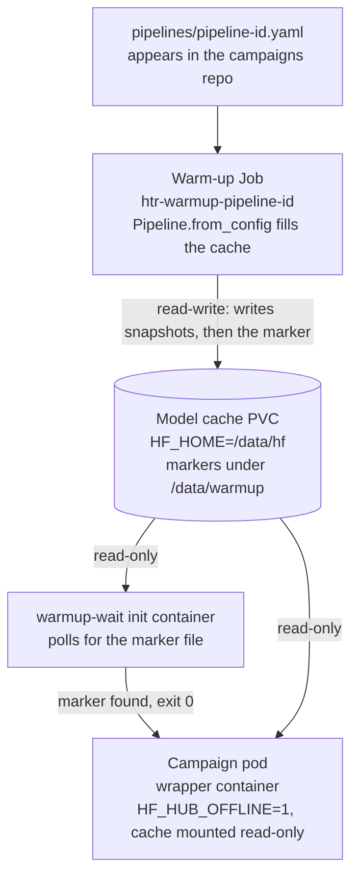

# The Wrapper

## `htrflow-batch` image and wrapper

`FROM <registry>/htrflow:<tag>@sha256:…` (the upstream image, pinned by
digest — or, on the arm64 GPU node, a locally built base, see
[Local k3s development](../development/local-k3s.md)) plus the
`htrflow_batch` package (`packages/wrapper/`, installed from the workspace
lock with hashes) and its runtime deps `httpx`, `boto3`.

**The wrapper is a streaming driver (D16), not a CLI shell-out.** It imports
htrflow as a library — `Pipeline.from_config()` once at startup (models load
once) — then runs a producer–consumer pipeline with three concurrent roles
(`stream.PageStream` ∥ `stream.consume()`):

| Role | What it does |
|---|---|
| **downloader pool** (`stream.PageStream`: threads, `DOWNLOAD_CONCURRENCY` in flight, never more than `LOOKAHEAD_PAGES` submitted ahead of the consumer) | fetches pages, submitted in manifest order, into tmpfs; per-page retry with backoff; refuses anything that is not a raster image; hands over each page in manifest order (submission order: the consumer waits on the head of the window) |
| **consumer** (single thread — the GPU serializes work anyway) | `pipeline.run(document)` per page, in order, the moment that page is available; a page's lookahead slot frees only when the consumer is done with it (image deleted), which is what bounds tmpfs; holds each page's result/exception directly (fixes the [known upstream flaw](decision-log.md#known-upstream-flaw-the-design-must-absorb) at the source) |
| **uploader** | ships each page's PAGE XML then ALTO to S3 the moment htrflow writes them (deterministic keys, blind overwrite); rolling-deletes the source image and both output files once its page is done |

Net effect: GPU idle ≈ one page's download time; results stream into S3
progressively (a 6-hour volume shows live progress); tmpfs holds only the
lookahead window, never the whole volume.

Because the library API — unlike the CLI — is not a stability contract, the
image digest pin is load-bearing: the wrapper is validated against the exact
htrflow version in the image (see [Testing](../development/testing.md) for
what exists today). Fallback modes if the API proves awkward at a version
bump:

- **L1 — stock CLI + watcher-uploader:** download-all-then-run, uploader thread
  streams outputs as they're written. Streaming out only.
- **L2 — chunked CLI invocations:** ~100-page chunks, download chunk N+1 while
  chunk N processes; costs a model reload (~30–60 s GPU idle) per chunk.

### Wrapper contract — env vars

The full table, with defaults from `config.py`, is the
[Wrapper reference](../reference/wrapper.md#environment-contract). The
knobs that shape the streaming loop:

| Env | Meaning | Default |
|---|---|---|
| `MAX_IMAGE_WIDTH` | IIIF size cap (`/full/{w},/`) — **enforced**, and part of the fetched URL, so cached/stored artifacts can never disagree with config (`!w,h` 501s on lbiiif; a canvas narrower than the cap asks for `max`; a 400 falls back to `max`). Does not apply to service-less canvases, which are fetched at native size | 2500 |
| `LOOKAHEAD_PAGES` | max pages downloaded ahead of the consumer (bounds tmpfs) | 64 |
| `DOWNLOAD_CONCURRENCY` | concurrent image downloads | 12 |
| `RESUME` | skip pages whose PAGE + ALTO already exist (and whose source URL is unchanged) | true |
| `MANIFEST_MAX_BYTES` / `FETCH_MAX_BYTES` | byte caps on the manifest and on one image body (campaign data is untrusted) | 16 MiB / 64 MiB |
| `LOG_SHIP_SECONDS` | run-log upload interval, `0` = final upload only ([Live run log](live-run-log.md)) | 15 |

### Stages around the streaming loop

Every stage name can appear in the termination log.

0. **config** — read and check the env (`Config.from_env`). Its own stage, so
   a deployment fault (a missing variable, `IIIF_MANIFEST_URL` and `IMAGES`
   both set) is never reported as a manifest problem: exit 13, and the
   campaign page says to look at `converter.yaml` and the chart values.
1. **setup** — fetch the IIIF manifest (http(s) only, ≤ 5 redirects, 60 s,
   capped at `MANIFEST_MAX_BYTES`), enumerate canvases → ordered page list,
   zero-padded filenames. An empty manifest, a canvas without an image,
   non-JSON or a 4xx is exit 13; 5xx/429/network is exit 1.
2. **resume** — list `page/` and `alto/` in S3; a page is done only when
   **both** exist. Pages whose recorded `page_sources` URL differs from the
   manifest's are reprocessed (`RESUME=false` forces everything). Skipped
   pages are never downloaded.
3. **load** — `stream.PageStream(...)` starts the downloads, **then**
   `Pipeline.from_config($PIPELINE_PATH)`: model load overlaps the first
   pages' downloads, so startup GPU-idle is `max(model_load,
   first_page_download)`, not the sum (see [Model handling](#model-handling)).
   Bad YAML, an unknown step or model class, or an `Export` step in the YAML
   is exit 13; an `OSError` from the model files is exit 1.
4. **stream** — downloader ∥ consumer ∥ uploader as above; per-page failures
   (download after retries, an exception from `pipeline.run`, malformed XML)
   are recorded, not fatal mid-loop — the loop drains what it can first.
   `pipeline.run` runs behind a liveness guard: a step whose htrflow worker
   thread has died would otherwise block the page forever, so it fails the
   page — naming the step and its model — and the pipeline is rebuilt before
   the next one ([A dead htrflow worker
   thread](failure-handling.md#a-dead-htrflow-worker-thread)).
   Five consecutive S3 upload failures abort the run (`UploadOutage`, exit 1).
5. **verify (D8)** — every page accounted for: `page/` AND `alto/` uploaded,
   no page marked failed. Any gap → exit 1 (Kubernetes retries the index;
   resume converges); the missing/failed page list goes in the termination
   message.
6. **publish** (`publish.py`) — after a clean verify: `iiif.json` (viewer
   manifest, D19),
   `pipeline.yaml`, then `manifest.json` **last** (the sole completion
   marker). All uploads carry real content-types (`application/xml` for
   ALTO/PAGE, `application/json` for manifests) — a blind `put_object`
   defaults to octet-stream, which breaks browsers.

**SIGTERM** at any stage (Job deadline, a drain that reaches the container):
the handler writes `{"stage": …, "permanent": false, "error": "SIGTERM"}`
to the termination log, ships the final run log, and `os._exit(143)`s —
`sys.exit` would wait for downloads stuck in their 120 s timeout and run
into the SIGKILL.

### Provenance in every ALTO

htrflow's own `<Processing>` block in the ALTO names htrflow, its version,
the pipeline steps and each model's commit hash. What htrflow cannot know
is the layer above it, so after its Export writes the file and before the
upload, the wrapper appends a second block, `<Processing ID="htrflow-batch">`
(`provenance.py`): the time, `image=<the pipeline's digest pin>`
(`IMAGE_DIGEST`, which the Job skeleton sets), `htrflow-base=<revision>`
(`HTRFLOW_BASE_REVISION`, an ENV the image itself carries next to its OCI
label), and `processingSoftware` with the wrapper package's name, version
and author. ALTO 4.4 allows any number of `Processing` blocks in that
position, so the file stays schema-valid and htrflow's block is left as
written. An ALTO the stamp cannot parse fails the page, the same as a page
with a missing format. PAGE XML is not stamped; the same facts sit in the
volume's `manifest.json`. One consequence of resume: a volume resumed on a
newer image keeps the pages already done, so their ALTOs name the image
that made them while `manifest.json` names the image that finished the
volume — each file is still right about itself.

### Exit codes

| Code | Meaning | Job / Kubernetes reaction |
|---|---|---|
| 0 | success (verified) | index `Complete` |
| 13 | permanent (config, bad manifest URL / 4xx / non-JSON / empty / over cap, bad pipeline YAML, unknown step or model) | `podFailurePolicy` `FailIndex` — index failed, never retried |
| 1 | transient (network, 5xx/429 on the manifest, CUDA hiccup, verification gap, S3 outage) | retried by Kubernetes up to `backoffLimitPerIndex` (3), with resume |
| 143 | SIGTERM with termination log + final log ship | retried the same as exit 1 — a resumed run skips pages already published |

Failures write a structured reason to `/dev/termination-log`
(`{"stage": "stream", "permanent": false, "error": "verify failed: N missing, M failed errors: … missing=[…]"}`),
URL-redacted — and nothing at all to S3 beyond the run log: a failed volume
leaves no marker object of its own. The whole contract is in
[Failure Handling](failure-handling.md).

**Instrumentation for the Phase 2 gate:** `manifest.json` records `pages`,
`bytes_fetched`, `wall_seconds`, per-page timings, and — the key metric —
`gpu_stall_seconds`: total time the consumer sat waiting for the next
page to land. Stall fraction = `gpu_stall_seconds / wall_seconds`, aggregated over
the first real campaign, decides whether Phase 2 exists (see
[Phase 2: Cache Layer](../roadmap/phase-2-cache.md)). With streaming,
expected stall ≈ first page's download + any moments IIIF falls behind the GPU.

## Kueue topology

Moved to [Queueing (Kueue)](queueing.md): what the chart renders, how a
campaign is admitted, and how a pause holds.

## Job template (one campaign = one Indexed Job)

Rendered by the converter's `render._campaign_job`
([source](https://github.com/AI-Riksarkivet/htrflow-batch/blob/main/packages/converter/src/htrflow_converter/render.py));
the failure semantics are in [Failure Handling → The Job contract](failure-handling.md#the-job-contract).

A campaign is one `batch/v1` Job with `completionMode: Indexed` —
`completions` = number of volumes, one index per volume, `$JOB_COMPLETION_INDEX`
reading a line of the campaign's `volumes.txt` ConfigMap.

- Single container `wrapper` per pod, `restartPolicy: Never`, image = the
  pipeline's digest pin, passed again as `IMAGE_DIGEST` for provenance. An
  init container `warmup-wait` blocks on the pipeline's warm-up marker file
  before the wrapper starts, for at most `converter.yaml`'s
  `warmup_wait_seconds` (default 900) — it holds the pod's GPU while it
  waits, so it gives up rather than wait out the pod's deadline.
- Resources: requests cpu 4 / memory **8 Gi** / 1 GPU, limits cpu 4 /
  memory **16 Gi** / 1 GPU (tmpfs counts against the limit — see
  [Memory Budget](memory-budget.md)). `runtimeClassName`, `nodeSelector` and
  `tolerations` from `converter.yaml`.
- `parallelism` = **min(the campaign's `window:`, `converter.yaml`'s
  `window:`)** — the campaign asks, `converter.yaml` caps (a campaign with no
  `window:` of its own gets the cap); `backoffLimitPerIndex: 3`;
  `maxFailedIndexes` = completions;
  `podFailurePolicy`: `Ignore` on `DisruptionTarget` (a drain does not burn
  a retry), `FailIndex` on wrapper exit 13, `FailIndex` on `warmup-wait`
  exit 13 (the marker never arrived — a retry only holds the GPU again).
  Rules are evaluated in order, so the `Ignore` stays first.
- `ttlSecondsAfterFinished: 86400` (24 h — inspectable, then self-cleans;
  the evidence is in S3 before that).
- Labels `app=htrflow-batch`, `htrflow.riksarkivet.se/managed-by=converter`,
  `htrflow.riksarkivet.se/pipeline`, `htrflow.riksarkivet.se/campaign`,
  `kueue.x-k8s.io/queue-name` (+ `kueue.x-k8s.io/priority-class` when the
  campaign sets `priority:`), no `kueue.x-k8s.io/job-min-parallelism` — the
  `min()` above is applied at render time instead of Kueue shrinking
  `parallelism` on the live Job; volume ids are label-safe by construction
  (the parser rejects anything else).
- Job name is the campaign file's stem (`-part2`, … past 10 000 volumes) —
  no per-volume Job name: **Kubernetes' own index bookkeeping is the retry
  ledger, there is nothing else to reconcile** (D1/D2).
- Env: the [wrapper contract](../reference/wrapper.md#environment-contract)
  with `S3_PREFIX=<namespace>/` from `converter.yaml`, `HF_HUB_OFFLINE=1`,
  `HF_HOME=/data/hf`, `MANIFEST_MAX_BYTES`/`FETCH_MAX_BYTES` from
  `converter.yaml`, and `HOME`, `TMPDIR`, `YOLO_CONFIG_DIR` pointed into the
  tmpfs workdir (the shell prologue `mkdir -p`s those three before exec'ing
  the wrapper; the warm-up Job's prologue adds `HF_HOME`). The per-volume time budget is not env at all: it is the
  pod's own `activeDeadlineSeconds`.
- Mounts: the campaign's `volumes.txt` ConfigMap at `/campaign` (read-only),
  the pipeline ConfigMap at `/config`, the model cache PVC at `/data`
  **read-only**, a 2 Gi memory-backed emptyDir at `/work`, the S3 Secret at
  `/secrets/s3` (`credentials` file, mode `0440`). Pod Security `restricted`
  ([Security](../development/security.md)), no ServiceAccount token.

## Output store and completion contract

S3 behind a one-function seam — `ResultStore`:

- Key layout: `s3://$BUCKET/$PREFIX/<pipeline-id>/<volume-ref>/...` —
  **pipeline id in the key**, so reprocessing with a better model is a new
  namespace, never an overwrite of the previous campaign's results
  ([S3 Layout](../reference/s3-layout.md)).
- Per-page keys, deterministic, blind overwrite → retries converge. Upload
  order is `page/<n>.xml` then `alto/<n>.xml`, both parsed as XML before the
  first PUT: a crash between the two leaves a PAGE without its ALTO
  (reprocessed on resume), never the reverse — an ALTO count strictly means
  "page complete".
- `manifest.json` uploaded **last**; its presence *is* "volume complete"
  (for that pipeline id).
- Contents (D11): page count, `page_sources` (page → source image URL,
  redacted) and `canvas_ids`, pipeline YAML content + sha256, htrflow
  version, batch image digest, per-page results, `bytes_fetched` /
  `wall_seconds` / `gpu_stall_seconds` / `pages_per_second`, `viewer_url`.
  The pipeline YAML itself is uploaded alongside.
- S3 client: connect 10 s / read 60 s / 3 standard retries, so a dead bucket
  cannot pin a run for hours; the run-log client is tighter (5 s / 30 s / 2).
- NFS alternative: same contract via write-temp + atomic rename; swap the
  store implementation only.
- **Viewer manifest `iiif.json` (D19):** IIIF Presentation 3, one canvas per
  page — image service copied from the source lbiiif canvas (tiles keep coming
  from lbiiif; we serve no images), canvas width/height = the **width-capped
  dimensions actually processed** (read back from the ALTO `<Page>` — keeps
  the UV line overlays aligned without coordinate rewriting), and per-canvas
  `seeAlso: [{id: <public ALTO URL>, profile: ".../alto/ns-v4#"}]` — the exact
  shape the UV fork's TextRightPanel matches on. Needs env
  `PUBLIC_RESULTS_BASE` (browser-reachable URL base, ≠ the in-cluster S3
  endpoint). Written after verify, keyed under the same
  `<pipeline-id>/<volume-ref>/` prefix — reprocessed campaigns get their own
  viewer manifests.
- **Store requirements for the viewer:** anonymous read on the results
  prefix + CORS (GET from the viewer origin) — the browser fetches manifest
  and ALTO directly. The devStack `rustfs-init` hook applies both; a real
  bucket needs the equivalent policy ([Security](../development/security.md#the-bucket-policy)).
- **UV4-fork gotchas (found deploying the viewer, 2026-07-28, see the
  [test log](../development/test-log.md)):**
  - The ALTO text panel is gated on `manifest.getSearchService()` — a
    manifest without a IIIF search service never shows transcriptions.
    The wrapper therefore emits a **stub SearchService1 entry** (endpoint
    not implemented; only its presence matters). Replace with a real
    content-search service if one ever exists.
  - Canvases need an explicit `thumbnail` property when the image body has
    no IIIF image service (UV renders empty thumbs otherwise). The wrapper
    emits `{service}/full/200,/0/default.jpg` when a service exists
    (width syntax — lbiiif 501s on `!w,h`), else the full static image.
  - The fork's shipped `uv.html` never fetches `uv-iiif-config.json` (the
    fetch is commented out) and `textRightPanelEnabled` is **not** compiled
    into `UV.js` — the panel can't turn on without patching the page.
  - The fork feeds raw ALTO pixel coords to OpenSeadragon as **viewport**
    coords → line overlays land ~10⁵ px off-canvas for plain images; fix is
    `viewport.imageToViewportRectangle(...)`. Both fixes are captured in
    `.docker/uv4-uv-html.patch` and applied in the web image's UV build
    stage (`make build-web`, `dagger call build-web`).
- **Live run log:** the wrapper tees its own stdout/stderr and ships the
  buffer to `status/logs/<pipeline-id>/<volume-ref>.txt` while it runs —
  how the frontend follows a running volume without anything ever reading
  the kube API from a browser. Its own page: [Live run log](live-run-log.md).
- The results bucket is the **only stateful dependency** in the system.
  On the PoC that is the devStack RustFS on a single unreplicated
  `local-path` PVC — fine for iteration, not an archive; anything past the
  PoC needs a durable bucket (HCP or real S3) so viewer links do not die
  with a node.
- Honest limit: with Job TTL at 24 h, long-term "what has been processed?"
  is answered by listing `manifest.json` keys in S3 once the Job itself is
  gone — the read API's `completedIndexes`/`failedIndexes` view only
  covers a Job that still exists.

## Model handling

Two distinct per-Job costs — don't conflate them:

| Cost | When paid | Size |
|---|---|---|
| **download** (HF Hub → `HF_HOME`) | **once per pipeline**, by the warm-up Job — never by a batch Job | ~2–4 GB, off the GPU's clock entirely |
| **load** (`HF_HOME` → GPU) | per Job, always — `Pipeline.from_config()` instantiates step models eagerly (verified: `steps.py` builds models at construction; TrOCR `__init__` calls `from_pretrained`); every `pipeline.run(page)` reuses them | ~30–60 s, amortized to noise at volume granularity |

The streaming driver overlaps the load with the first pages' downloads
(`stream.PageStream(...)` first — it submits its first window on the calling
thread — *then* `from_config()`), so startup GPU-idle is
`max(model_load, first_page_download)`, not the sum.

**Pre-warmed cache, read-only for Jobs (settled, D14).** Batch Jobs mount the
cache PVC `readOnly` with `HF_HUB_OFFLINE=1`: they never download and never
write, and the NetworkPolicy gives them no HF Hub egress at all. The one
writer is the **warm-up Job** (`htrflow_batch.warmup`) — same image, same
pipeline ConfigMap, CPU-only, outside the Kueue queue — which simply calls
`Pipeline.from_config()`: instantiating the pipeline *is* the download, so
exactly the files a Job will load land in the cache, with no second parser of
the pipeline YAML. It exits 13 for a pipeline that is wrong (invalid YAML,
pydantic validation, unknown step or model class) and 1 for one that is
unlucky (network, disk), writing the same `{stage: "warmup", permanent,
error}` termination message a volume's wrapper does — the warm-up Job mounts
no S3 secret, so this message, read by the campaign card's warm-up chip
([Campaigns](campaigns.md#the-web-front-and-status-page)), is the only place
the failure reaches a person.

Alternatives kept on record: no cache (v1 — every Job re-downloads while
holding the GPU, needs `HF_TOKEN` + HF egress in every Job) and baking the
weights into the image (hermetic, but multi-GB images per pipeline — the
standing ruling stays: models are never baked into the image, only reached
through this cache). The model-registry variant — weights as signed OCI
artifacts pulled from an in-cluster registry into the cache — is the natural
next step and keeps this mount-point contract unchanged.

Wrapper only ever sees `HF_HOME`; the cache choice is a mount-point swap.

## The model cache

**What is cached.** Two kinds of file, both under one PVC:

- Hugging Face Hub snapshots, at the library's own default layout —
  `huggingface_hub` puts them under `$HF_HOME/hub` unless overridden (verified:
  `huggingface_hub.constants.HUGGINGFACE_HUB_CACHE` = `os.path.join(HF_HOME,
  "hub")`; nothing in this repo sets `HF_HUB_CACHE`), so with `HF_HOME=/data/hf`
  a model lands at `/data/hf/hub/models--<org>--<name>/snapshots/<revision>/…`.
  Roughly 2–4 GB per pipeline (see [Model handling](#model-handling) above).
- Warm-up completion markers, one empty file per pipeline id at
  `/data/warmup/<pipeline-id>.done` (`warmup.py`'s `_write_marker`,
  `Path(HF_HOME).parent / "warmup" / f"{pipeline_id}.done"`) — the only thing
  a batch pod's `warmup-wait` init container checks; it never looks at what
  is actually in `hub/`.

**The PVC.** One PersistentVolumeClaim, named by `modelCache.name` in the
chart (`converter.yaml`'s `data_pvc` must name the same object — the two
configs agree by convention, checked by
`packages/converter/tests/test_chart_agreement.py`) and rendered by
`charts/htrflow-batch/templates/modelcache.yaml`. Mount mode differs by role
— verified directly in the manifest skeletons: the warm-up Job's
`volumeMounts` entry for `data` carries no `readOnly` key
(`manifests/warmup-job.yaml`), while the campaign Job's does
(`readOnly: true`, `manifests/campaign-job.yaml`) — and confirmed on the live
PoC cluster (`kubectl get pvc htr-test-data -n htr-batch`): `accessModes:
[ReadWriteOnce]`, `storage: 30Gi`, `storageClass: local-path`. **RWO, one
node, today** — every pod that mounts it, warm-up or batch, is pinned to
whichever node the volume is bound to.

**Who fills it, and when.** The warm-up Job, once per pipeline id, at apply
time: the converter renders one `htr-warmup-<id>` Job the first time that
pipeline id appears in `pipelines/`, alongside its `htr-pipeline-<id>`
ConfigMap (`htrflow-campaigns render`, applied by `make campaigns-apply` or
by Argo CD from `rendered/`). It carries the campaign Job's
`runtimeClassName`, `nodeSelector` and `tolerations` (the same
`converter.yaml` keys), so warm-up and batch pods land in the same GPU node
pool — and, on the PoC's single-node RWO volume, the *same* node. The Job has
no TTL — it is never reaped — so after replacing the cache PVC, delete
`htr-warmup-*` by hand to re-warm (below). The chart itself renders no
warm-up Job; it lives entirely with the campaigns repo now. Campaign pods
never fill the cache themselves: `HF_HUB_OFFLINE=1` in their env makes any
attempted download a hard local error rather than a network call, and of the
two NetworkPolicies (`charts/htrflow-batch/templates/network.yaml`) only
`htr-warmup` gets broad public egress on port 443 (a CDN like HF Hub needs no
narrower rule); `htr-batch-job` gets DNS, S3, and only the specific IIIF host
CIDRs `network.iiifCidrs` lists (`192.121.221.27/32` by default) — Hugging
Face's own IPs are not among them, so a batch pod has no path to HF Hub even
with `HF_HUB_OFFLINE` unset.

**How a campaign pod waits for it.** The `warmup-wait` init container polls
for `/data/warmup/<pipeline-id>.done` every 10 s, for at most the smaller of
`converter.yaml`'s `warmup_wait_seconds` (default 900) and the pod's own
`activeDeadlineSeconds` minus one poll step — bounded because the pod holds
its GPU (and Kueue's quota for it) for as long as the init container runs.
Past that bound it prints the marker path to stderr and exits 13,
which the Job's `podFailurePolicy` turns into `FailIndex` for that index —
retrying would only hold the GPU again for a marker that is not coming (see
[Failure Handling](failure-handling.md#warm-ups-fail-the-same-way) and the
worked example's [warm-up wait
walkthrough](rendering-example.md#the-indexed-job)).

**A cache miss during a run.** If a model the pipeline needs is not actually
present under `/data/hf` when a batch pod tries to load it — a cache wiped
without a re-warm, an incomplete download, or an id trimmed off by
regenerating the PVC — `huggingface_hub` raises `LocalEntryNotFoundError`
under `HF_HUB_OFFLINE=1`. That class subclasses both `OSError` and
`ValueError` (verified in the pinned `huggingface_hub`), and `main.py`
catches `OSError` before it catches `ValueError`, so the wrapper classifies
it **transient**, exit 1: Kubernetes retries the index up to
`backoffLimitPerIndex`, resuming from whatever pages already published. A
retry only actually succeeds once the cache is fixed — the transient
classification exists so a real gap doesn't wrongly `FailIndex` a volume
that a re-warm could still save, not because the retry alone repairs
anything.

**What is not in the cache.** Nothing in the wrapper image. The standing
ruling (2026-09-07, [Decision Log](decision-log.md)) is that weights are
never baked into the image — every model a pipeline uses reaches a GPU only
through this cache, filled by the warm-up Job.

**Growth and cleanup.** Nothing prunes the cache today. A retired pipeline's
snapshots and its `.done` marker stay on the PVC after its warm-up Job (and,
once story B87 ships, the Job and ConfigMap themselves) are gone — B87
explicitly does not remove the marker file, because that needs PVC access
`apply` does not have. Retention and a size guard for the model cache
(alongside results and run logs) is future work tracked on story B10. To see
how full it is today: the warm-up pod itself exits as soon as its
download finishes, so `kubectl exec -n htr-batch <warm-up-pod> -- du -sh
/data/hf` only catches it in the narrow window while one is still `Running`;
the reliable way is a one-off debug pod that mounts the same PVC and lands on
the node holding it (the RWO volume forces that — pin it with `nodeName` if
the scheduler would otherwise place it elsewhere), for example `kubectl run
htr-cache-debug -n htr-batch --rm -it --restart=Never --image=busybox
--overrides='{"spec":{"containers":[{"name":"debug","image":"busybox","command":["sh"],"volumeMounts":[{"name":"data","mountPath":"/data"}]}],"volumes":[{"name":"data","persistentVolumeClaim":{"claimName":"htr-test-data"}}]}}'
-- sh`, then `du -sh /data/hf` and `ls /data/warmup` inside it.

**Multi-node consequences.** The PoC's PVC is `ReadWriteOnce` — fine on one
GPU node, but it pins every warm-up and every batch pod to that node, which
does not scale to a second node let alone a second tenant. The [multi-tenant
design](../superpowers/specs/2026-09-08-multi-tenant-design.md#2-decisions)'s
D14 settles this for the next step: the model cache becomes **one
ReadWriteMany volume on a shared filesystem class** (NFS or CephFS), with a
PVC per tenant namespace bound to the same export by a statically
provisioned PV — warm-up and the read-only mount stay exactly as described
above, only the storage class changes. Confirmed RWX storage on the target
clusters is an open risk in that spec (R7); its fallback, if RWX does not
materialize, is per-node caches instead of one shared one.

**The operator's commands.** All of these run from inside a pod that mounts
the PVC (a warm-up pod while it is `Running`, or a debug pod as above) —
there is no read API for the cache, only the filesystem:

| Task | Command |
|---|---|
| List cached model snapshots | `find /data/hf/hub -maxdepth 1 -name 'models--*'` |
| List warm-up markers (which pipeline ids are warmed) | `ls /data/warmup` |
| Force a pipeline to re-warm | delete its marker (`rm /data/warmup/<pipeline-id>.done`, needs a pod with write access — i.e. while a warm-up pod for it is running, or by hand on the node) **and** delete the completed `htr-warmup-<pipeline-id>` Job (`kubectl delete job -n htr-batch htr-warmup-<pipeline-id>`) so the next `apply` renders and runs it again — the Job has no TTL, so leaving it in place means `apply` never re-creates it |

## Pipeline configs (D17)

Pipeline YAMLs are upstream-format (any `steps:` document the stock CLI
accepts — step names, model names, generation settings — **minus** Export
steps, which the wrapper appends itself for `alto` and `page`). How they
travel from authoring to a result:

1. **Declare:** `pipelines/<id>.yaml` in the campaigns repo — the `steps:`
   document plus the digest-pinned `image:`
   ([Campaign & Pipeline YAML](../reference/campaign-yaml.md)).
2. **Deploy:** the converter renders one ConfigMap per pipeline id —
   `htr-pipeline-<id>`, holding only the `steps:` document, with its sha256
   as the `htrflow.riksarkivet.se/pipeline-sha256` annotation. There is no
   runtime drift guard: the rule that a changed pipeline is a new id
   (`-v2`, never edited in place) is enforced by review convention on the
   campaigns repo, not by the API server
   ([Campaign & Pipeline YAML → Immutability](../reference/campaign-yaml.md#immutability)).
3. **Select:** the campaign's `pipeline:` sets `PIPELINE_ID`, which
   namespaces the S3 keys — the same volume under a different pipeline
   writes under a different prefix, never over the first run's results — and
   mounts that ConfigMap; `PIPELINE_PATH` points at the file inside it.
4. **Run:** the wrapper calls `Pipeline.from_config($PIPELINE_PATH)` — to
   htrflow it's just a file.
5. **Provenance:** the wrapper embeds the YAML content + its sha256 and the
   image digest in `manifest.json`, uploads the YAML next to the results, and
   stamps the image digest and htrflow base revision into every ALTO
   ([Provenance in every ALTO](#provenance-in-every-alto)) — every result
   stays explainable independent of cluster state.

**Validation before the GPU:** the warm-up Job (above) is the deploy-time
`Pipeline.from_config()` dry run — broken YAML or unresolvable models fail
there, on CPU, and park the pipeline instead of burning GPU Jobs.

**Why not a `HtrPipeline` CRD:** the ConfigMap-per-version pattern is a
deliberate poor-man's CRD — it delivers the CR properties that matter here
(identity, GitOps, kubectl UX) with zero controllers. What it lacks vs a
real CRD — admission-time schema validation, a status subresource ("models
warmed"), auto-warm-up on create — CI-time `htrflow-campaigns validate` and
the warm-up gate cover instead. The maturity ladder: **v1** ConfigMaps +
CI-time validation (today) → **v2** an API service that lists and validates
pipelines, ConfigMaps still underneath → **v3** a real CRD only if
admission-time guarantees or a second machine consumer demand it (see
[Evolution](../roadmap/evolution.md)).
