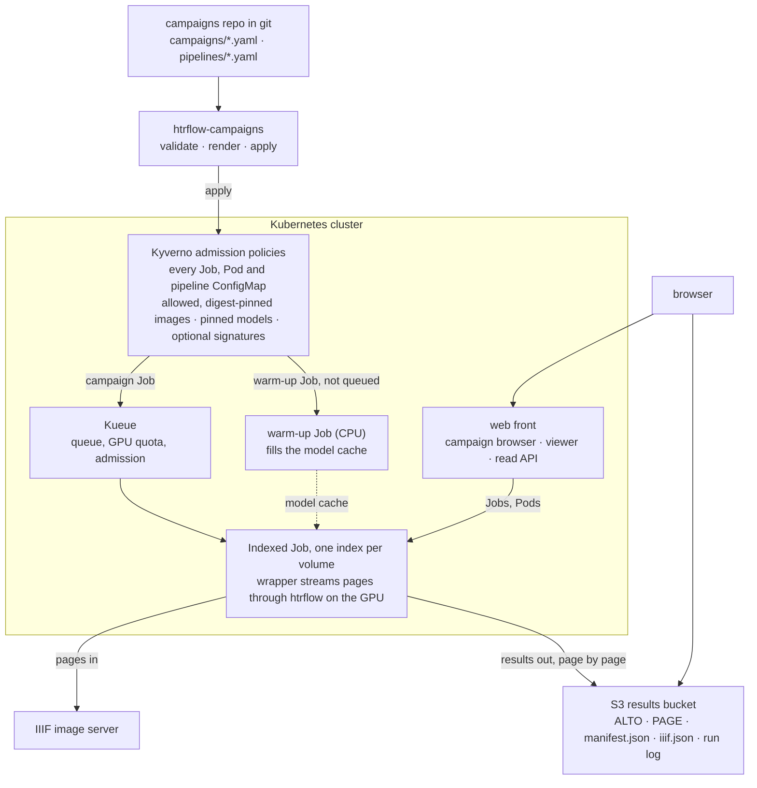

# htrflow-batch

!!! warning "Not for use yet"
    This project is under active development and is not ready for others to
    run: interfaces, chart values and the campaigns format still change
    without notice. This notice goes when there is a release to stand behind.

Batch handwritten-text recognition for whole archive volumes on Kubernetes,
built around the stock [htrflow](https://github.com/AI-Riksarkivet/htrflow)
image. Results stream to an S3 bucket page by page and open in a IIIF viewer;
what to transcribe is declared in a campaigns git repository.

## What it does

- **Runs htrflow unmodified.** The wrapper image builds on the stock htrflow
  image and drives it page by page, so a long volume costs the same memory
  as a short one.
- **Kueue owns queueing and GPU quota.** There is no custom scheduler.
- **Git is the desired state; Kubernetes and S3 are the observed state.** A
  campaign is a YAML file. A pure converter renders it into one Kubernetes
  Indexed Job (one index per volume) plus a warm-up Job that caches the
  pipeline's models. Kubernetes and Kueue own scheduling and retries, and a
  read-only status API with a campaign browser shows progress live. There is
  no CRD, no controller and no database.
- **Kyverno decides what may run.** Chart-shipped policies admit only
  digest-pinned images from allowed registries and, optionally, only
  revision-pinned models.
- **Every page is traceable.** Each ALTO file records the models, image and
  htrflow-batch build that produced it, and a volume is done only when every
  page is accounted for.
- **It measures itself.** Every volume's `manifest.json` records how long
  the GPU sat waiting for page fetches (`gpu_stall_seconds`) against wall
  time. Those numbers decide whether a cache layer in front of the IIIF
  source is worth building ([Roadmap](roadmap/index.md)).

## How it fits together

## Where to start

- [Try it](getting-started/try-it.md) — the wrapper and viewer on your own
  machine with Docker Compose, then a dev cluster.
- [Getting Started](getting-started/index.md) — prerequisites, deploying the
  chart, running a campaign and viewing results.
- [How it Works](how-it-works/architecture.md) — the architecture, campaigns,
  queueing, the streaming wrapper, failure handling and security.
- [Reference](reference/index.md) — configuration, campaign and pipeline
  YAML, the wrapper contract, chart values and the S3 layout.
- [Development](development/index.md) — workspace setup, tests, CI,
  releasing and a dev cluster.
- [Roadmap](roadmap/index.md) — what is open and what could come next.

## License

htrflow-batch is licensed under the European Union Public Licence (EUPL-1.2),
the same licence as htrflow — the `LICENSE` file at the root of the
repository. The third-party components the images ship, with their licences,
are in [Third-party licences](development/licenses.md).
