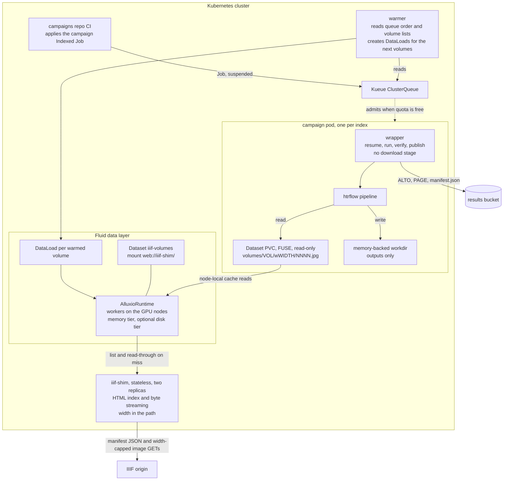
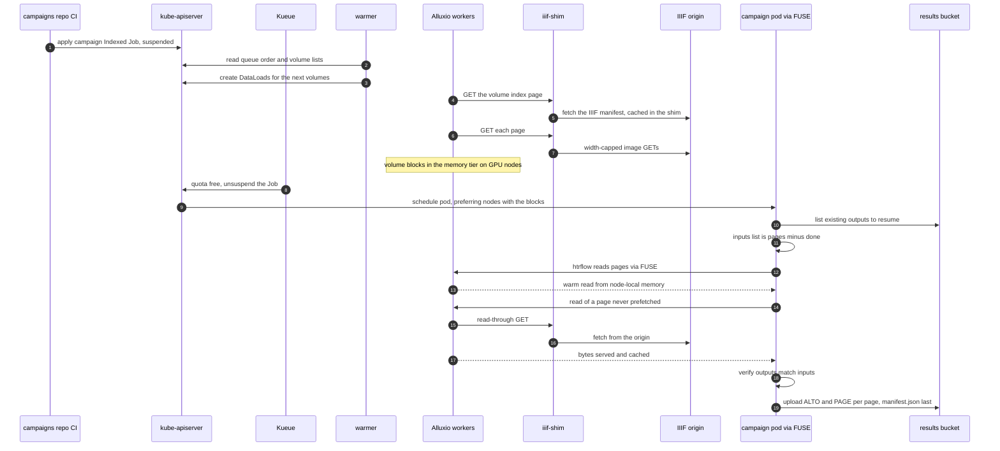

# Cache layer

A proposal, not built: a read-through cache between campaign pods and the
IIIF origin. Build it only when measurements from real campaigns show it is
needed. This page covers the evidence that would justify it, two ways to
build it, what each one promises, how each one fails, and the spike that
decides between them.

## What happens today

The wrapper fetches pages straight from the IIIF origin
([Page flow](../how-it-works/page-flow.md),
[The Wrapper](../how-it-works/wrapper.md)):

- Downloads start as soon as the stream is built, so they overlap the model
  load.
- A bounded pool (`DOWNLOAD_CONCURRENCY`) fills a bounded lookahead window
  (`LOOKAHEAD_PAGES`) on a memory-backed workdir. The GPU consumes pages as
  they land, and each image is deleted once its outcome is recorded.
- Each image URL comes from the canvas's image service in the source
  manifest, capped at `MAX_IMAGE_WIDTH`. Volumes listed as plain `images:`
  are fetched at the URL given.
- Nothing is cached. A retry or a re-run under a new pipeline fetches every
  page it processes again, from the origin.

Streaming already caps the GPU's wait at about one page's download at the
start, plus any moments the origin falls behind. So the case for a cache
rests mostly on two things: shielding the origin from backfill and repeat
fetches, and the economics of reading the same corpus more than once. It
rests less on idle GPUs.

## The evidence that would justify it

Every completed volume's `manifest.json` records the numbers needed
([S3 Layout](../reference/s3-layout.md)):

| Field | What it measures |
|---|---|
| `wall_seconds` | the whole run, from the wrapper's start to the last write |
| `gpu_stall_seconds` | time the consumer waited for the next page to land: the fetch time the GPU actually felt |
| `results.<page>.seconds` | processing time for each page that reached the pipeline |
| `bytes_fetched` | image bytes this run downloaded |
| `pages`, `pages_per_second` | volume size and throughput |

Fetch time itself is not recorded. Downloads run concurrently and ahead of
the GPU, so their sum would not measure what they cost; stall does.
Per-page download latency, if it is wanted, is a small addition to
`results`.

Nothing aggregates these yet. A one-off over the manifests of one pipeline
does it (use `<namespace>/` in front only when the release sets
`S3_PREFIX`):

```bash
aws s3 cp --recursive "s3://<bucket>/<namespace>/<pipeline>/" ./manifests \
  --exclude '*' --include '*/manifest.json'
find ./manifests -name manifest.json -print0 | xargs -0 jq -s '
  { volumes: length,
    wall:  (map(.wall_seconds) | add),
    stall: (map(.gpu_stall_seconds) | add),
    gpu:   (map([.results[] | select(.status == "ok") | .seconds] | add // 0) | add),
    bytes: (map(.bytes_fetched) | add) }
  | .stall_fraction = (.stall / .wall)'
```

Build the cache when one of these holds across an archive-scale campaign,
not a handful of volumes:

- **GPU idle.** The aggregate `stall_fraction` stays above roughly ten per
  cent.
- **Origin load.** The origin rate-limits or fails under backfill: `429` and
  `5xx` fetch errors in the run logs, and page failures they explain.
- **Repeat fetches.** The same volumes are fetched again and again, through
  retries, re-runs under new pipeline ids or several tenants. `bytes_fetched`
  summed per volume across runs shows how much.

## What both variants keep

- **Read-through.** A page never prefetched is fetched on first read. The
  cache accelerates and is never a correctness dependency: if it is cold or
  gone, Jobs are slower, not broken.
- **Width in the key.** The requested width stays part of the cache key, so
  a cached image can never be served at the wrong resolution.
- **Queue-aware warming.** Warming at submit time would push hundreds of
  volumes through the cache hours before they run, and evict each other on
  the way. A small warmer instead prefetches only the next few volumes that
  will actually run:
  - the pending indexes of admitted campaigns
  - then the first lines of the queued campaigns, in admission order

  It reads Jobs, Workloads and each campaign's `volumes.txt` ConfigMap, and
  drops warm data for completed volumes. Its death only makes Jobs colder.

## Variant A: caching HTTP proxy

One proxy Deployment with its cache on a memory-backed `emptyDir` (or a
disk, for reuse across campaigns), plus the warmer.

```nginx
proxy_cache_path /cache levels=1:2 keys_zone=iiif:64m
                 max_size=<cache-size> inactive=24h use_temp_path=off;
server {
  listen 8080;
  location / {
    proxy_pass https://<iiif-origin>;
    proxy_ssl_server_name on;
    proxy_cache iiif;
    proxy_cache_valid 200 7d;
    proxy_cache_lock on;                          # collapses concurrent misses
    proxy_ignore_headers Cache-Control Expires;   # IIIF image URLs are immutable
    add_header X-Cache-Status $upstream_cache_status;
  }
}
```

**Contract.**

- The proxy serves `GET <image-path>` byte-identical to the origin. The full
  URL, including the width segment, is the cache key.
- The wrapper takes image URLs from the manifest, so there is no base URL to
  repoint. The wrapper needs a setting that maps `<iiif-origin>` to the
  proxy for image requests, and it falls back to the origin when the proxy
  errors.
- Campaign pods' IIIF egress can then narrow to the proxy.

**Failure modes.**

| Failure | Effect | Recovery |
|---|---|---|
| proxy down | fetches fall back to the origin | none needed, slower |
| cache full | least-recently-used entries evicted | read-through |
| proxy restarts on a memory-backed cache | cache empty | read-through, warmer refills |
| warmer down or behind | cold reads | read-through |
| origin down | misses fail, cached pages still served | Job retry |

## Variant B: Fluid, Alluxio and an index shim

A data layer that makes every volume a read-only directory on a FUSE mount,
cached in memory on the GPU nodes. Campaign pods do no downloading.

### What it rests on

- **HTTP sources.** Alluxio's web under-storage (WebUFS) mounts a plain
  HTTP(S) source, and Fluid's own samples mount a public HTTPS mirror as a
  `Dataset` this way.
- **How WebUFS lists.** It builds its namespace by parsing HTML directory
  index pages:
  - a `text/html` page whose title carries a configured marker (such as
    `Index of`) is a directory
  - configured parent-link names are skipped
  - every remaining link is an entry

  It is read-only: every write operation is refused.
- **File metadata.** WebUFS takes a file's size from `Content-Length` and its
  mtime from `Last-Modified` on a `HEAD`, parsed with a configured date
  format. The timeout, date format, title markers and parent names are
  properties.
- **Warming.** Fluid's `DataLoad` resource preloads a path of a `Dataset`
  into the runtime's cache.
- **The gap.** IIIF serves JSON manifests and parameterised image URLs, not
  directory index pages, so it cannot be mounted directly. A small stateless
  **index shim** makes it look like one.

These come from Fluid's samples on accelerating web data access and data
warm-up, and from the Alluxio web under-storage source.

### Architecture



| Piece | Owns | Does not own |
|---|---|---|
| **Kueue** | *when*: GPU quota, queue order | data, placement |
| **warmer** | queue-aware prefetch: DataLoads for the next volumes only | correctness |
| **Fluid and Alluxio** | *where*: cache tiers, prefetch execution, placement affinity | queueing, HTR |
| **index shim** | IIIF to filesystem: manifest to listing, URL to bytes, width cap | caching, state |
| **Indexed Job** | lifecycle: retries, deadlines, completion | queueing |
| **wrapper** | resume, invoking htrflow, verify, publish | downloading |
| **htrflow** | HTR | everything else, unmodified |

Kueue and Fluid do not conflict. Kueue decides when a Job runs. Fluid's
webhook adds node-affinity preferences that decide where its pods land, near
the cached blocks.

### Warm path and miss path



### Component contracts

**Index shim.** A stateless Deployment with two replicas behind a Service.

| Endpoint | Returns |
|---|---|
| `GET /<volume-ref>/w<width>/` | An HTML index built from the IIIF manifest: a title carrying the WebUFS directory marker, a parent link, and one `NNNN.jpg` link per canvas in manifest order, zero-padded. `Last-Modified` is in the date format WebUFS is configured with. The width is in the path, so the cache key can never disagree with the delivered resolution. |
| `GET /<volume-ref>/w<width>/NNNN.jpg` | Image bytes streamed from the origin at the width cap, the same request the wrapper makes today. |
| `HEAD /<volume-ref>/w<width>/NNNN.jpg` | Size and mtime for Alluxio. See the metadata problem below. |
| `GET /_meta/<volume-ref>.json` | Canvas-to-page mapping and source URLs for the wrapper's provenance record. It lives outside volume listings, so htrflow never sees it as an input. |
| `GET /` | A root listing, only if the spike shows Alluxio needs one. Otherwise any `/<volume-ref>/` path resolves lazily. Listing live volumes from the Kubernetes API would need RBAC. |

- **Manifests** are cached in memory (LRU, minutes), so the origin is hit
  once per listing or warm, not once per page.
- **Bytes** are proxied, not redirected. That keeps WebUFS on one host,
  applies the width cap and controls the headers.
- **Configuration** is the origin, the allowed widths and the manifest
  template. No disk and no state.

**The metadata problem.** Alluxio wants a size and an mtime at listing time.
IIIF image servers derive images on demand and often send no
`Content-Length` on `HEAD`. The options, in order of preference:

1. **Stable fake sizes.** The shim reports one constant size. The spike
   checks that Alluxio reads to the real end of the stream, without
   truncating or padding.
2. **Size on first touch.** The shim fetches each derivative once and
   remembers its real size. Per volume this is exactly the warm traffic, so
   the DataLoad pays for it, not the GPU.
3. **Both fail.** Variant B falls, and Variant A remains.

**Fluid objects.** One `Dataset` and one runtime serve the whole system. The
warmer creates a `DataLoad` for each volume it warms.

```yaml
apiVersion: data.fluid.io/v1alpha1
kind: Dataset
metadata:
  name: iiif-volumes
  namespace: <namespace>
spec:
  mounts:
    - name: volumes
      mountPoint: web://iiif-shim.<namespace>.svc:8080/
      # WebUFS options, keys pinned during the spike: connection timeout,
      # Last-Modified date format (must match the shim), directory title
      # markers, parent-link names
  accessModes: ["ReadOnlyMany"]
---
apiVersion: data.fluid.io/v1alpha1
kind: AlluxioRuntime
metadata:
  name: iiif-volumes
  namespace: <namespace>
spec:
  replicas: <gpu-node-count>     # workers on the GPU nodes
  tieredstore:
    levels:
      - mediumtype: MEM
        path: /dev/shm
        quota: <cache-size-per-worker>
        high: "0.95"
        low: "0.7"
      # a disk tier here is what makes reuse across campaigns real
  properties:
    alluxio.user.file.metadata.sync.interval: "30s"   # new volumes appear without a remount
---
apiVersion: data.fluid.io/v1alpha1
kind: DataLoad
metadata:
  name: warm-<volume-slug>
  namespace: <namespace>
spec:
  dataset: { name: iiif-volumes, namespace: <namespace> }
  target:
    - path: /volumes/<volume-ref>/w<width>/
      replicas: 1
```

**Campaign pod changes.**

- The pod mounts the Dataset's PVC read-only, and the wrapper's input
  directory becomes `volumes/<volume-ref>/w<width>/` on that mount.
- The fetch stage disappears: resume, run, verify, publish.
- Resume passes htrflow an inputs list, because pages cannot be deleted from
  a read-only mount.
- Outputs still go to the memory-backed workdir.

### Memory

Images leave the pod: the lookahead window no longer lives on the workdir,
so the pod's memory holds the resident models and page outputs only. Pod OOM
risk stops scaling with image size. A huge volume churns the cache instead
of killing a Job. The RAM moves to the Alluxio workers, which serve reads at
memory speed on the same nodes.

Those workers are a standing Deployment, not queued workloads, so their
memory is **outside** the Kueue quota. Size node capacity for both.

### Failure modes

| Failure | Effect | Recovery |
|---|---|---|
| warmer down or behind | cold reads | read-through, slower |
| shim pod dies | cached pages still served, misses fail | second replica, Job retry |
| FUSE mount wedges | reads hang or fail inside htrflow | Fluid FUSE recovery, else the pod fails and the index retries |
| Alluxio evicts mid-volume | next read is a miss | read-through |
| Alluxio master down | every read fails, cached or not | a highly available master, or an accepted risk |
| origin down | misses fail, warm volumes unaffected | Job retry |

Open issues:

1. **`Content-Length` behaviour.** Unresolved until the spike runs.
2. **FUSE in the GPU's critical path.** A stalled read looks like a hung
   image read inside htrflow. The wrapper's guard watches htrflow's worker
   threads for death, not for a blocked read. Timeout ownership moves from the
   wrapper's own HTTP client to a FUSE daemon. Adopting Variant B needs a
   watchdog on output progress: the pod's `activeDeadlineSeconds` is a
   backstop, not an answer.
3. **Shim scope.** "Small and stateless" is the floor. A root listing from
   the Kubernetes API adds RBAC and watches.
4. **Master as a single point of failure.** Run a highly available master,
   or accept that its outage stops every read.
5. **Reuse across campaigns needs a persistent tier.** A memory tier cannot
   hold a corpus between campaigns months apart. Repeat-read savings need a
   disk tier sized to the corpus. Without one, Variant B's benefit is
   prefetch and node locality only.

Variant B also narrows egress. Campaign pods talk only to the bucket: images
come through the local mount and models through the cache volume. The shim
is the only component that talks to the IIIF origin.

### Adoption spike

One to two days on a CPU-only cluster, before choosing Variant B:

| Check | Pass criterion |
|---|---|
| Listing | WebUFS lists the shim's index for a volume: every page, correct names and order. The WebUFS property keys are pinned for the Alluxio release in use. |
| Metadata | Every page read through the mount is byte-identical to a direct fetch from the origin, with fake sizes tolerated or size on first touch implemented. |
| Warming | A DataLoad completes, and a test pod reads the volume from the mount at node-local speed. |
| Late volumes | A new volume path becomes visible through metadata sync within about a minute, without a remount. |
| Failure | Killing the shim mid-read leaves cached pages readable and surfaces misses as read errors, not hangs. The mount recovers when the shim returns. |

If the metadata check fails, Variant B falls. Variant A needs no change to
the wrapper's design, since the wrapper keeps its download stage.

## Choosing

- **Variant A** is a small fraction of the operating surface and solves
  prefetch and origin shielding. If the evidence shows idle GPUs or origin
  load, start here.
- **Variant B** adds node-local reads, declarative warming, placement near
  the data, and a data layer other pipelines can share. It costs operating
  Fluid, Alluxio and the shim. Reach for it only if the data layer will be
  shared beyond this system, or if origin load demands persistent caching at
  corpus scale.
