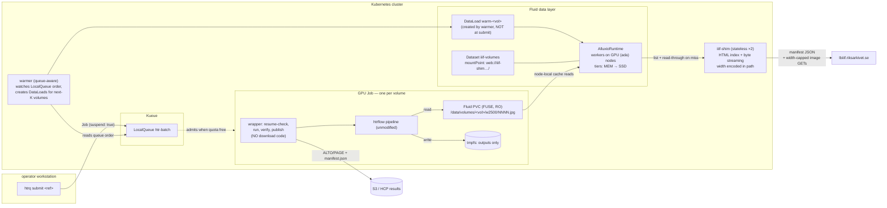
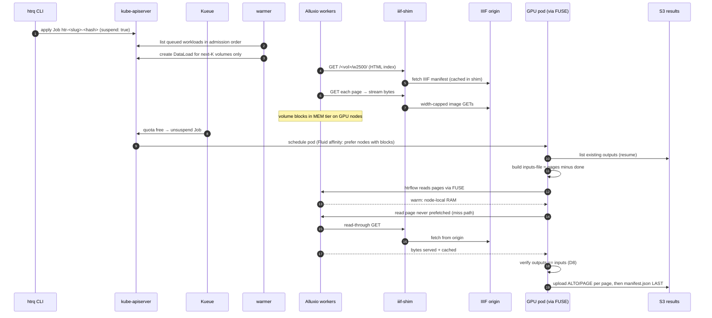

# Phase 2: Cache Layer

**Trigger:** build this only if Phase 1 numbers or operations demand it —
e.g. aggregate GPU stall fraction from `htrq report` exceeds ~10 %, or the IIIF
origin needs shielding from backfill load (repeat fetches on retries/re-runs).
Note that the D16 streaming driver already reduces expected stall to roughly
one page's download time per volume — so the remaining Phase 2 case rests
mostly on **IIIF shielding and repeat-fetch economics**, not GPU idle.
Until then it is documented, not built.

Two candidate shapes, both preserving the settled pattern (read-through, cache
never a correctness dependency):

## Variant (a): nginx proxy_cache — minimal

One nginx Deployment, cache on a 24 Gi memory `emptyDir`, plus a warmer that
pre-GETs the next-K *queued* volumes (queue-aware by construction). Wrapper
change: `IIIF_BASE_URL` points at the proxy, direct-to-origin fallback kept.
Width stays in the URL → cache key and content can never disagree.

```nginx
proxy_cache_path /cache levels=1:2 keys_zone=iiif:64m
                 max_size=24g inactive=24h use_temp_path=off;
server {
  listen 8080;
  location / {
    proxy_pass https://lbiiif.riksarkivet.se;
    proxy_ssl_server_name on;
    proxy_cache iiif;
    proxy_cache_valid 200 7d;
    proxy_cache_lock on;            # collapses concurrent misses
    proxy_ignore_headers Cache-Control Expires;   # IIIF URLs immutable
    add_header X-Cache-Status $upstream_cache_status;
  }
}
```

## Variant (c): Fluid + AlluxioRuntime + WebUFS index shim — maximal

The "GPU-pure" architecture. Detailed in full here (with the critique fixes
from [Failure modes and known issues](#failure-modes-and-known-issues-from-design-critique)
already applied) so nothing is lost if Phase 2 lands on this variant.

### Verified facts this variant rests on

- Alluxio's **WebUFS** under-storage mounts plain HTTP/HTTPS sources; Fluid's
  own samples mount an HTTPS Apache mirror as a Dataset.
- WebUFS builds its namespace by **parsing Apache-style HTML directory index
  pages**: it recognizes directories via literal markers (page title starting
  `Index of ` / `Directory listing for `), skips `Parent Directory`/`..` links,
  and treats remaining links as files. Configurable knobs: connection timeout,
  `Last-Modified` date format, parent-link markers, directory-title markers.
  Read-only — which fits.
- IIIF exposes JSON manifests and parameterized image URLs
  (`/full/!2500,/0/default.jpg`) — no HTML index pages → **not directly
  mountable**. The gap is bridged by a small stateless **index shim** that
  makes IIIF look like an Apache directory server.

Sources: Fluid sample `accelerate_data_accessing.md` (WebUFS mount of an HTTPS
mirror), Alluxio WEB under-storage documentation, Fluid `data_warmup.md`
(DataLoad prefetch).

### Architecture



Ownership map:

| Piece | Owns | Explicitly does not own |
|---|---|---|
| **Kueue** | admission *when* (GPU quota, queue order) | data, placement details |
| **warmer** | queue-aware prefetch: DataLoads for next-K admissible volumes only | correctness (pure acceleration) |
| **Fluid/Alluxio** | data locality *where* (cache tiers, prefetch execution, placement affinity) | queueing, HTR |
| **index shim** | IIIF → filesystem translation (manifest → listing, URL → bytes, width cap) | caching (stateless), state |
| **k8s Job** | lifecycle: retries, deadlines, completion | queueing (starts suspended) |
| **wrapper** | resume-check, invoke htrflow, verify, publish | downloading (gone), HTR |
| **htrflow** | HTR | everything else — unmodified |

Kueue and Fluid compose without conflict: Kueue decides **when** a Job runs
(quota admission); Fluid's webhook injects node-affinity preferences deciding
**where** its pod lands (near cached blocks). Different layers.

**Read-through is the correctness backbone:** a page never prefetched is
fetched on first FUSE read via Alluxio → shim → IIIF. DataLoads are pure
acceleration; if the warmer never ran, Jobs are slower, not broken.

### Sequence (warm path + miss path)



### Component contracts

**Index shim** (stateless Deployment, 2 replicas behind a Service):

| Endpoint | Returns |
|---|---|
| `GET /<volume-ref>/w<width>/` | Apache-style HTML index built from the IIIF manifest: `<title>Index of /<volume-ref>/w<width>/</title>`, a `Parent Directory` link, one `<a href="NNNN.jpg">` per canvas in manifest order, zero-padded, `Last-Modified` in the date format WebUFS parses. **Width is in the path** so the Alluxio cache key can never disagree with the delivered resolution (fix #2) |
| `GET /<volume-ref>/w<width>/NNNN.jpg` | image bytes streamed from IIIF at `/full/!<width>,/0/default.jpg` |
| `HEAD /<volume-ref>/w<width>/NNNN.jpg` | file metadata for Alluxio — **the S2 spike question**, options below |
| `GET /_meta/<volume-ref>.json` | manifest-derived metadata (canvas→page mapping, source URLs) for the wrapper's provenance record; lives outside volume listings so htrflow never sees it as an input |
| `GET /` | minimal root listing. Preferred source: k8s API list of non-terminal `app=htrflow-batch` Jobs (requires RBAC + makes the shim less trivial — fix #5); alternative: lazy resolution of any `/<ref>/` path without a root index, if the spike shows Alluxio doesn't need root enumeration |

Shim behavior: IIIF manifests cached in-memory (LRU, minutes TTL) — hit once
per listing/warm, not per page. Proxies bytes itself rather than redirecting
(keeps WebUFS single-host, applies the width cap, controls headers). Config:
`IIIF_BASE`, allowed widths, manifest-resolution template. No disk, no state.

**The metadata problem (S2):** Alluxio wants file size and mtime at listing
time; IIIF derives images on demand (chunked responses, often no
`Content-Length` on HEAD). Options in order of preference:

1. **Stable fake sizes** — shim reports a constant plausible size; spike
   verifies Alluxio streams to actual EOF rather than truncating/padding.
2. **Size-on-first-touch** — shim fetches each derivative once and caches real
   sizes; per volume this is exactly the warm traffic, paid by the DataLoad,
   not the GPU.
3. Both fail → variant (c) falls; revert to (a).

**Fluid objects** (one Dataset + Runtime for the whole system; DataLoads per
volume, created by the warmer):

```yaml
apiVersion: data.fluid.io/v1alpha1
kind: Dataset
metadata:
  name: iiif-volumes
  namespace: htr-batch
spec:
  mounts:
    - name: volumes
      mountPoint: web://iiif-shim.htr-batch.svc:8080/
      # WebUFS parsing knobs (exact property keys pinned during the spike
      # against the deployed Alluxio version): connection timeout,
      # Last-Modified date format (must match shim output),
      # directory-title markers ("Index of "), parent-link markers
  accessModes: ["ReadOnlyMany"]
---
apiVersion: data.fluid.io/v1alpha1
kind: AlluxioRuntime
metadata:
  name: iiif-volumes
  namespace: htr-batch
spec:
  replicas: 2                    # workers co-located on the GPU (ada) nodes
  tieredstore:
    levels:
      - mediumtype: MEM
        path: /dev/shm
        quota: 12Gi              # per worker — same RAM the nginx variant
        high: "0.95"             # spends, relocated node-local to the GPUs
        low: "0.7"
      # optional SSD tier here is what makes cross-campaign reuse real (fix #7)
  properties:
    alluxio.user.file.metadata.sync.interval: "30s"   # late-submitted volumes
                                                      # appear without remount
---
# created by the WARMER for the next-K admissible volumes (fix #1 — never
# at submit time: 200 submits at once would thrash the LRU hours before
# their Jobs are admitted):
apiVersion: data.fluid.io/v1alpha1
kind: DataLoad
metadata:
  name: warm-<slug>
  namespace: htr-batch
  labels: { app: htrflow-batch, batch.htrflow/volume: <slug> }
spec:
  dataset: { name: iiif-volumes, namespace: htr-batch }
  target:
    - path: /volumes/<volume-ref>/w2500/
      replicas: 1
```

**Warmer** (small CPU Deployment, ~100 lines): lists suspended workloads in
LocalQueue admission order, maintains DataLoads for the next K≈3 volumes,
deletes DataLoads (and optionally frees cache paths) for Completed volumes.
Purely an accelerator: its death only makes Jobs colder.

**GPU Job changes vs Phase 1:** mounts the Dataset PVC read-only; wrapper input
dir = `/data/volumes/<vol>/w<width>/`; the fetch stage disappears (stages:
resume → run → verify → publish); resume uses htrflow's `--inputs-file` since
pages can't be deleted from a read-only PVC. Outputs still go to a small tmpfs.

### Memory relocation

| Item | Phase 1 (direct fetch) | Variant (c) |
|---|---|---|
| torch + models resident | ~6–8 Gi | ~6–8 Gi |
| page images | ~128 Mi tmpfs lookahead window (D16 streaming) | **0 — in Alluxio MEM tier on the node** |
| outputs (XML) | noise | noise (1 Gi tmpfs cap) |
| pod memory request | 16 Gi | **12 Gi** |
| node-level cache RAM | — | 2 × 12 Gi Alluxio workers |

Same total RAM, relocated: cache RAM serves FUSE reads at memory speed on the
GPU nodes, and pod OOM risk no longer scales with volume size — a giant volume
churns the LRU instead of OOMKilling a Job. Note: Alluxio worker RAM lives
**outside** the Kueue ClusterQueue quota (standing Deployment, not queued
workloads) — size node capacity accordingly.

### Failure modes and known issues (from design critique)

Additional failure rows vs Phase 1:

| Failure | Effect | Recovery |
|---|---|---|
| warmer down / behind | cold reads | read-through; slower, never broken |
| shim pod dies | cached pages still served; misses fail | 2 replicas; transient Job failures retry |
| FUSE mount wedges | reads hang/err in htrflow | Fluid FUSE auto-recovery; else pod fails → Job retry — see issue 4 |
| Alluxio evicts mid-job | next read is a miss | transparent read-through |
| Alluxio master down | ALL reads fail (cached or not) | issue 6 — single-master JVM SPOF; HA or accept |
| IIIF origin down | misses fail | Job retry; warm volumes unaffected |

Issues that remain open even with the fixes applied in this section:

1. ~~DataLoad-at-submit LRU thrash~~ → fixed: queue-aware warmer (see
   [Component contracts](#component-contracts) above). Cost: the "Fluid
   deletes the warmer" claim was false — the warmer exists in both variants.
2. ~~Width missing from cache key~~ → fixed: width in the shim path.
3. **Content-Length behavior** — unresolved until the S2 spike runs.
4. **FUSE in the GPU critical path** — a stalled Alluxio read looks like a hung
   `imread`, and htrflow already has known thread-wedge failure modes; timeout
   ownership moves from wrapper (explicit, controlled) to a FUSE daemon (not
   ours). Mitigation to design if adopted: wrapper-side watchdog on output
   progress; `activeDeadlineSeconds` is a 6 h backstop, not an answer.
5. **Shim scope creep** — the k8s-API root listing needs RBAC/watches; "~100
   lines, stateless" is the floor, not the ceiling.
6. **Alluxio master SPOF** — single-master JVM; when down, every Job's reads
   fail. HA master or accepted risk.
7. **Cross-campaign reuse requires a persistent tier** — 24 Gi MEM cannot hold
   a corpus between campaigns months apart; repeat-read economics need an SSD
   tier sized to the corpus (or the staging-bucket variant (b)). Without it,
   variant (c)'s honest benefit is prefetch-ahead + node-locality only.

Security note: variant (c) tightens egress — GPU pods talk only to S3 (images
via local FUSE, models via PVC, zero WAN egress); the shim is the only
component talking to IIIF.

### Adoption spike (1–2 days, no GPU needed) — gates the variant

| # | Check | Pass criterion |
|---|---|---|
| S1 | WebUFS lists the shim's HTML index | `alluxio fs ls /volumes/<vol>/w2500/` shows all pages, correct names/order; exact WebUFS property keys pinned for the deployed Alluxio version |
| S2 | **Metadata/Content-Length behavior** | full read of every page byte-identical to direct IIIF fetch — fake-size tolerated, or size-on-first-touch implemented |
| S3 | DataLoad warm + read speed | DataLoad completes; test pod reads the volume from PVC at node-local speed (≥100 MB/s effective) |
| S4 | Late-submitted volume appears | new `/vol/` path visible via metadata sync within ~1 min, no remount |
| S5 | Failure sanity | kill shim mid-read: cached pages fine, misses surface as read errors (not hangs); FUSE recovers when shim returns |

Fail S2 → variant (c) falls; revert to (a) with no wrapper-design changes
(Phase 1 wrapper already has the download stage).

**Choosing between them:** (a) is ~1 % of the operational surface and solves
prefetch-ahead; (c) additionally gives node-local reads, declarative warming,
data-aware placement, and a reusable data layer for other pipelines — at the
cost of operating Fluid + Alluxio + shim. If Phase 1 shows idle is the problem,
start with (a); reach for (c) only if the data layer will be shared beyond this
system or IIIF load demands corpus-scale persistent caching.
