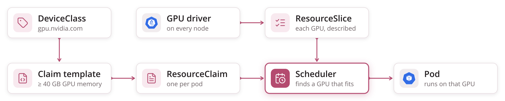
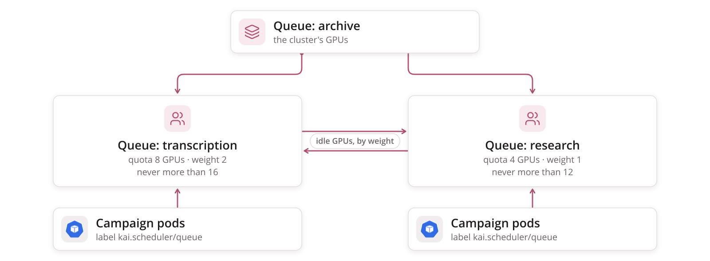
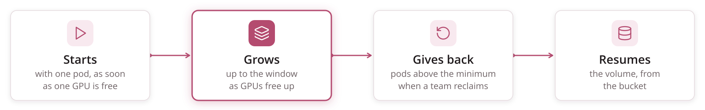

<!-- _class: lead cover -->
<!-- _footer: "Enheten för AI-labb och datatjänster" -->

# A possible future: DRA and KAI

## What the platform could do if GPUs were described, not counted

<!--
A map of possibilities, not a plan. Everything here is something Kubernetes,
the NVIDIA DRA driver or KAI Scheduler documents today; where a piece is
alpha, beta or only on a roadmap, the slide says so.
-->

---

# What we cannot say today

<table class="plain">
<tr><td></td><td></td><td><strong>today</strong></td><td><strong>could help</strong></td></tr>
<tr><td class="icon"></td><td>"a card with enough memory"</td><td>GPUs are counted; a kind of card is only a node label</td><td>DRA</td></tr>
<tr><td class="icon"></td><td>"this recipe needs more"</td><td>every pod asks for the same</td><td>DRA claims</td></tr>
<tr><td class="icon"></td><td>"use what is free"</td><td>the window is fixed and admitted whole</td><td>KAI elastic jobs, Kueue elastic workloads</td></tr>
<tr><td class="icon"></td><td>"each team its share"</td><td>one pool, first come first served</td><td>KAI queues, Kueue cohorts</td></tr>
<tr><td class="icon"></td><td>"part of a card"</td><td>whole cards only</td><td>MIG through DRA, KAI fractions</td></tr>
</table>

---

# DRA — claim a GPU by what it is



<div class="cols">
<div>

**The driver describes every GPU.** A ResourceSlice lists each device with its product name and memory, so the cluster knows what a card is, not only how many.

</div>
<div>

**A pod asks for what it needs.** A claim template says "a GPU with more than 40 GB"; each pod gets its own claim, and the scheduler finds a card that fits.

</div>
</div>

<!--
DeviceClass: a category of devices an admin or driver defines.
ResourceClaimTemplate: Kubernetes creates one ResourceClaim per pod from it
and deletes it with the pod -- the natural fit for one pod per volume.
ResourceSlice: published by the driver per node. Core DRA is stable in
Kubernetes; the NVIDIA driver's GPU allocation is not yet officially supported
and must be switched on.
-->

---

# A pipeline asks for what its model needs

<div class="cols wide-left">
<div>

<p class="filename">a claim template — the need, not the machine</p>

```yaml
kind: ResourceClaimTemplate
metadata:
  name: large-model
spec:
  spec:
    devices:
      requests:
      - name: gpu
        exactly:
          deviceClassName: gpu.nvidia.com
          selectors:
          - cel:
              expression: >-
                device.capacity['gpu.nvidia.com'].memory
                  .isGreaterThan(quantity("40Gi"))
```

</div>
<div>

**Any card that has it will do.** The recipe says how much GPU memory its models want; named sizes become a claim.

**Kueue still counts.** It charges a claim to quota by its device class, not by the expression — one quota per kind of card needs one class per kind.

**Not yet in Kueue:** a claim with a fallback list.

</div>
</div>

---

# Split a card, share a card

<table class="plain">
<tr><td></td><td><strong>what it gives</strong></td><td><strong>memory isolation</strong></td><td><strong>status</strong></td></tr>
<tr><td>MIG, set up in advance</td><td>fixed slices of one card, each its own device</td><td>yes, in hardware</td><td>on by default in the NVIDIA DRA driver</td></tr>
<tr><td>MIG, on demand</td><td>slices cut when a claim asks for one</td><td>yes, in hardware</td><td>alpha</td></tr>
<tr><td>Time-slicing</td><td>pods take turns on one card</td><td>none</td><td>alpha</td></tr>
<tr><td>MPS</td><td>processes run side by side</td><td>thread share and pinned-memory limits only</td><td>alpha</td></tr>
<tr><td>KAI GPU fractions</td><td>a pod asks for half a card, or a number of MiB</td><td>none</td><td>off by default</td></tr>
</table>

**Only MIG keeps one model out of another's memory.** Everything else trusts each pod to stay within what it asked for.

---

# KAI Scheduler — a scheduler built for GPUs

<div class="cols">
<div>

**A second scheduler, beside the default one.** It places the pods that ask for it, with its own queues and pod groups. It began inside Run:ai and is now a CNCF sandbox project.

**A Job opts in** from its pod template:

```yaml
template:
  metadata:
    labels:
      kai.scheduler/queue: transcription
  spec:
    schedulerName: kai-scheduler
```

</div>
<div>

**What it adds:**

* queues per team — quota, over-quota weight, a limit
* gang scheduling — a group starts together, or at least a minimum of it
* elastic jobs — a minimum that must run, the rest reclaimable
* GPU fractions, bin-packing and consolidation
* topology-aware placement

</div>
</div>

---

# Team queues that lend and take back



<div class="cols">
<div>

**Quota is guaranteed; weight shares the rest.** A team always gets its quota; idle GPUs go out by over-quota weight, up to each queue's limit.

</div>
<div>

**Reclaim takes back only what was lent.** When a team needs its quota, pods running over someone else's are evicted — never a team's own share. The volume resumes from the bucket.

</div>
</div>

<!--
Only leaf queues take jobs. KAI's two reclaim strategies, fair-share reclaim
and quota reclaim, both only ever take over-quota resources. It also has
time-based fair share and a minimum guaranteed runtime, so a reclaimed pod has
had some time to make progress.
-->

---

# A window that is a range



<div class="cols">
<div>

**The window becomes the most, not the must.** A KAI Job starts with a minimum of one pod and grows as GPUs free up; the pods above the minimum are what a reclaim takes.

</div>
<div>

**Kueue has a version too.** Elastic workloads change an admitted Job's parallelism without suspending it — beta, and not together with partial admission.

</div>
</div>

<!--
For a plain batch Job, KAI's pod grouper sets the minimum to one by default.
Open question: resizing an Indexed Job whose completions are larger than its
parallelism -- Kubernetes' own elastic Indexed Jobs need the two equal, so
only parallelism may change; this needs a test before anyone relies on it.
-->

---

# Kueue, KAI, or both

<table class="plain">
<tr><td></td><td><strong>Kueue</strong></td><td><strong>KAI Scheduler</strong></td></tr>
<tr><td>when work may start</td><td>admits a Workload against quota</td><td>queues gate pods as they are scheduled</td></tr>
<tr><td>where pods run</td><td>left to the default scheduler</td><td>its own scheduler</td></tr>
<tr><td>teams</td><td>cohorts, borrowing limits, fair sharing</td><td>a queue tree: quota, over-quota weight, reclaim</td></tr>
<tr><td>kinds of GPU</td><td>flavors; DRA device classes in quota</td><td>on its roadmap, with DRA for whole GPUs</td></tr>
<tr><td>part of a card</td><td>MIG counted through DRA</td><td>fractions, by annotation</td></tr>
</table>

**Both at once means two quota layers.** Neither documents an integration; one has to step back — for instance KAI with unlimited queues, only placing what Kueue admitted.

---

# What would change for a team

<div class="cols">
<div>

```yaml
# pipelines/demo-v2.yaml
image: …@sha256:…
gpu:
  memory: 40Gi       # a claim, not a count
steps: …
```

```yaml
# campaigns/kyrkobocker-2.yaml
pipeline: demo-v2
window: 8            # at most; starts with what is free
volumes: …
```

</div>
<div>

**The repository stays.** Campaign files, pipelines, pull requests and apply work as they do.

**The recipe states its needs;** the platform turns them into a claim.

**The queue is the team's,** set by the platform, not by the repository.

</div>
</div>

<!--
The gpu: block is illustrative -- no such field exists. It is the shape a
converter setting could take if it rendered a ResourceClaimTemplate per
pipeline.
-->

---

# What to watch

* **Fractions share memory.** KAI fractions and time-slicing do not isolate it; a large model can push its neighbour out.
* **GPU allocation in NVIDIA's DRA driver is not yet officially supported,** and its sharing modes are alpha.
* **Kueue with DRA:** no fallback lists, no topology-aware placement, and Kueue cannot see which card a pod will get.
* **The default scheduler does not preempt for DRA devices.**
* **Two quota layers** if Kueue and KAI run together.
* **An elastic window on an Indexed Job** has not been tried.

---

<!-- _class: lead -->

# Any questions?
