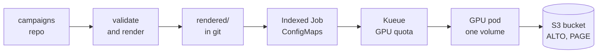
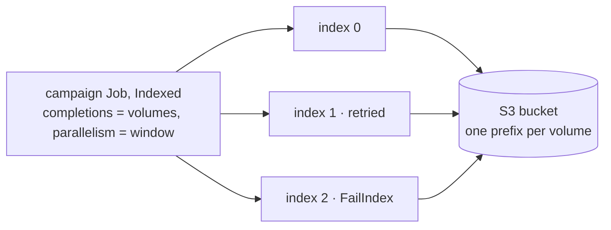
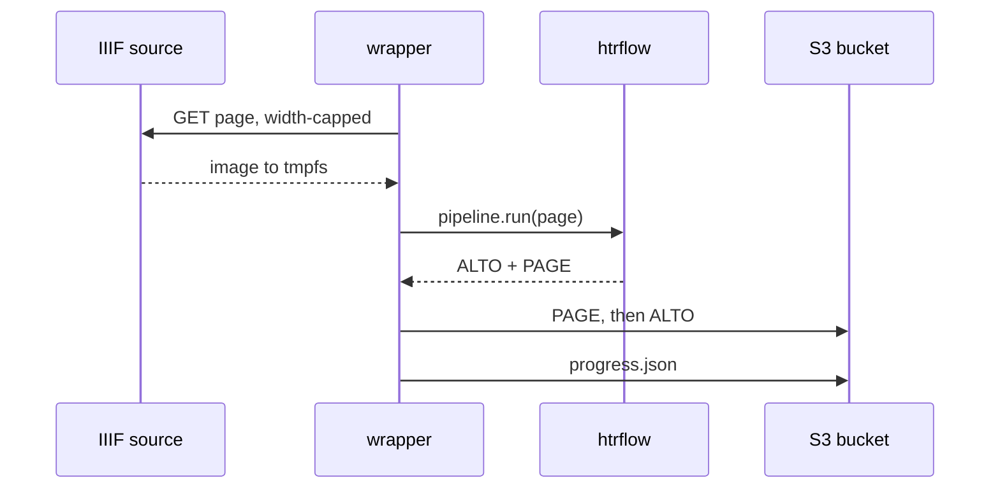

<!-- _class: lead cover -->
<!-- _footer: "Enheten för AI-labb och datatjänster,  2026-09-15" -->

# GitOps and Kueued HTRflow

## Pipelines you already write, campaigns you commit — how htrflow-batch runs them at archive scale

<!--
This is about the layer above htrflow, not a change to htrflow. Everything
here assumes you know what a pipeline YAML does; nothing here assumes you
know Kubernetes.
-->

---

# What you already know, and what changes

<div class="cols">
<div>

## You already know this

- A pipeline is a YAML file: segment regions, segment lines inside them, recognise text on the lines.
- Every `Inference` step runs on the document's leaves, so step order is the whole recipe.
- htrflow exports ALTO and PAGE when it is done.

</div>
<div>

## This is what changes

- Thousands of volumes, not one folder. Pages arrive from IIIF, not from disk.
- GPUs are a shared, counted pool. A campaign is admitted when the GPUs its `window` needs fit the free quota, and waits when they do not.
- Results stream into an S3 bucket page by page, while the run is still going.
- Interrupted work resumes: a page already in the bucket is never fetched again.

</div>
</div>

**The `steps:` document you write today *is* the pipeline file.** It is passed through verbatim. The wrapper appends the two `Export` steps itself, and rejects a pipeline file that already has one.

<!--
The single most important sentence on this slide is the last one: nobody has
to learn a new pipeline format. The steps go in unchanged.
-->

---

# Your interface is git

<p class="filename">the campaigns repo — a repository of its own, separate from htrflow-batch</p>

```
converter.yaml              cluster defaults: namespace, queue, window, S3 secret, model-cache PVC
campaigns/<name>.yaml       what to run: one pipeline id and a list of volumes
pipelines/<id>.yaml         how to run it: one image digest and the htrflow steps
rendered/                   Kubernetes objects, written by CI on main — never hand-edited
```

<div class="cols">
<div>
<p class="filename">campaigns/demo.yaml</p>

```yaml
pipeline: demo-v1
volumes:
  - R0001203
  - id: loc-mal2459400
    manifest: https://www.loc.gov/item/mal2459400/manifest.json
```

</div>
<div>
<p class="filename">pipelines/demo-v1.yaml</p>

```yaml
image: docker.io/riksarkivet/htrflow-batch@sha256:cb30d0…
steps:
  - step: Segmentation
    settings:
      model: yolo
      model_settings:
        model: Riksarkivet/yolov9-regions-1
```

</div>
</div>

<div class="cols">
<div>

```
uvx --from "git+https://github.com/AI-Riksarkivet/\
htrflow-batch@<ref>#subdirectory=packages/converter" \
  htrflow-campaigns validate .
```

</div>
<div>

<p class="note">One program, three verbs — <code>validate</code>, <code>render</code>, <code>apply</code>. Validating needs no cluster, so the same program runs on your laptop and in the pull request, one sentence per problem, naming the file.</p>

</div>
</div>

<!--
A campaign names exactly one pipeline. A volume is a reference code the
converter expands through source_template, or an explicit IIIF manifest, or
a bare list of image URLs. Opening a pull request is how work is submitted.
-->

---

# `converter.yaml`: what the cluster already is

<div class="dense">

```
namespace: htr-batch                 # where campaigns are applied — and pruned
queue: htr-batch                     # the Kueue LocalQueue a Job labels itself with
s3_secret: htr-batch-s3              # Secret holding the results-bucket credentials
data_pvc: htr-test-data              # the model cache, mounted read-only into every pod
runtime_class: nvidia                # RuntimeClass for GPU pods — and for the warm-up Job
hf_token_secret: ""                  # optional, and yours to create: a private or gated Hub model

window: 20                           # default parallelism, and the cap a campaign's own window is clamped to

max_seconds: 21600                   # each pod's activeDeadlineSeconds; a pipeline may override it
warmup_wait_seconds: 900             # how long a pod waits for its pipeline's warm-up marker
ttl_seconds_after_finished: 604800   # a week the finished Job stays; a pipeline may override it
manifest_max_bytes: 16777216         # 16 MiB
fetch_max_bytes: 67108864            # 64 MiB
source_template: "https://<iiif-host>/<path>/{ref}/manifest"   # {ref} is a bare volume id
public_results_base: ""              # the URL results are served from — the read API needs it
```

</div>

<div class="cols">
<div>

<p class="note"><strong>The first block must agree with the chart.</strong> These are names of objects the release already made; the token Secret is the exception — no chart makes that one, you do.</p>

</div>
<div>

<p class="note"><strong><code>window</code> is the number to get right.</strong> Set it to what the ClusterQueue's GPU quota can admit. Partial admission is not used, so a window the quota cannot cover never starts — and a live window Kueue had shrunk would make the rendered file un-appliable afterwards.</p>

</div>
</div>

<p class="note"><strong>Deliberately not here:</strong> the image allow-list and the model-revision rule. Both are Kyverno policies the chart ships, re-run over <code>rendered/</code> in CI.</p>

<!--
Every value on this slide is the shipped default. The file itself is
required: a repo without one is refused rather than defaulted, because the
namespace a campaign is applied to — and pruned in — is exactly the setting
you do not want guessed.

Unknown keys are rejected too, which is how allowed_image_repos or
require_model_revision in this file becomes a validation error naming the
chart value instead of a setting that silently does nothing.
-->

---

# What `apply` does



A pull request validates and renders; CI commits `rendered/` on main. One `apply` then does five things in order:

1. Render the repo again, and check `rendered/` is exactly that render.
2. Write how each campaign stands to the campaign's record, before anything is sent.
3. Apply the pipelines — a campaign's Job references its pipeline's ConfigMap.
4. Apply the campaigns, skipping any the record says is finished and unchanged.
5. Put each campaign's pause state on its Kueue Workload.

<!--
The converter is a plain Python package. It never runs inside the cluster,
and nothing in the cluster holds a credential for the campaigns repo, so
step 1 is also the whole of what the cluster is ever told.
-->

---

# Kubernetes, in htrflow terms

<table class="plain">
<tr><td>Pod</td><td>One process running your pipeline on one volume. It holds a GPU for as long as it runs.</td></tr>
<tr><td>Indexed Job</td><td>One pod per line of <code>volumes.txt</code>. Kubernetes hands each pod its index, and the index picks the line.</td></tr>
<tr><td>ConfigMap</td><td>The files: your <code>steps:</code> document, and the volume list. Two per campaign, plus one per pipeline.</td></tr>
<tr><td>Secret</td><td>The S3 keys. Mounted into campaign pods only — warm-up pods get none.</td></tr>
<tr><td>PVC</td><td>The model cache, mounted read-only. A disk that outlives every pod.</td></tr>
</table>

A campaign is *one* Job with `completions` set to the number of volumes. That number is fixed the moment the Job is created, which is why a campaign is append-only.

<!--
No CRD, no controller, no database. The only durable state in the whole
system is the results bucket.
-->

---

# One Job, one index per volume



<div class="cols">
<div>

- **`completions` is the number of volumes,** fixed when the Job is created — the whole reason a campaign file is append-only.
- **`parallelism` is the window:** how many indexes run at once, so how many GPUs. Kueue admits the Job as **one** Workload of that size.

</div>
<div>

- **Each pod reads its own line.** `JOB_COMPLETION_INDEX` picks line *index + 1* of `volumes.txt`, split on the **first tab** into `VOLUME_REF` and either `IIIF_MANIFEST_URL` or `IMAGES`.
- **Retries are per index.** Exit 1 retries it, up to `backoffLimitPerIndex: 3`, resuming from the bucket; exit 13 fails it at once.

</div>
</div>

<!--
The prologue then execs the wrapper. A volumes.txt line is `<id>` TAB
`<manifest url>`, or `<id>` TAB
`images:<url> <url> …` for a volume given as bare image URLs. Whitespace is
the separator because a URL cannot contain it, while a comma is legal in one.

The other indexes carry on regardless: maxFailedIndexes is set to the number
of volumes, so one bad volume never stops the rest. The Job ends Complete when every index is done, or Failed
with failedIndexes naming exactly which ones were not — and the campaign page
reads PartiallyFailed when some did finish.

The first podFailurePolicy rule is Ignore on DisruptionTarget: a preempted or
drained pod is not this index's failure.
-->

---

# Kueue: why your campaign is waiting

- **Kueue decides when, the scheduler decides where.** It is an admission controller with a GPU quota, and it knows nothing about HTR, IIIF or S3.
- **One campaign is one Workload,** not one per volume. It is admitted as a whole, and it holds the GPUs it was admitted for until its last volume is done.
- **`window:`** is the Job's parallelism — how many volumes run at once, so how many GPUs it takes. It is clamped to the cluster-wide cap in `converter.yaml`, and the whole window must fit the free quota or nothing starts.
- **Priority orders the line; nothing jumps it.** Three classes (`htr-interactive`, `htr-bulk`, `htr-idle`) decide who is admitted next, and preemption is off, so a running campaign is never evicted; a workload that does not fit is skipped rather than blocking the rest.
- **Pausing is a git change.** `suspend: true` in the campaign file; the apply puts the same intent on the Workload, and running pods are evicted with every finished volume kept.

<!--
"Queued" on the status page means the Job is suspended and nothing has
finished yet. A campaign whose window the quota can never cover reads Queued
forever — that is the usual cause of a campaign that never starts.
-->

---

# Inside one pod

<div class="cols wide-left">
<div>



</div>
<div>

- **setup** — read the IIIF manifest
- **resume** — list what is already in the bucket
- **load** — build the pipeline while page one downloads
- **stream** — the loop on the left, page after page
- **verify** — every page uploaded, skipped, or recorded as failed
- **publish** — `iiif.json`, `pipeline.yaml`, then `manifest.json` last

<p class="note">The wrapper imports htrflow as a library and runs each page itself, so no page can fail unnoticed in a thread pool. Downloads run ahead of the GPU; each page's files are deleted as soon as it is done.</p>

</div>
</div>

<!--
The ordering matters: PAGE before ALTO, so an ALTO's presence always means
the page is complete; manifest.json last, so its presence means the volume
is complete.
-->

---

# Models never travel in the image

- **A warm-up Job fills the cache once per pipeline.** It runs the same image on CPU, outside the queue, and simply builds the pipeline — building it *is* the download.
- **Campaign pods run offline.** The cache PVC is mounted read-only with `HF_HUB_OFFLINE=1`, and the network policy gives them no route to the Hub at all. A pod waits in an init container until the warm-up's marker file exists.
- **Pin every revision.** A digest pins the code, not the weights. A cluster policy can require a 40-character commit hash on every model — top-level for YOLO, under `model_kwargs` for TrOCR and other Hub models.
- **A private or gated model needs a token Secret,** named in `converter.yaml`. It reaches the warm-up container and nothing else.
- **Two transformers lines.** A model saved by one major line will not load correctly under the other, so the line is a build argument of the image — and a pipeline pins its image digest. One campaigns repo can carry pipelines on both.

<!--
This is why a pipeline that works on your laptop can still fail here: the
weights have to be in the cache, at the revision you pinned.
-->

---

# What comes out

<div class="cols wide-left">
<div>

```
<namespace>/<pipeline>/<volume>/
  page/0001.xml     PAGE XML, uploaded first
  alto/0001.xml     ALTO — "this page is done"
  iiif.json         viewer manifest, rewritten
                    every ten pages
  progress.json     pages done and failed, live
  pipeline.yaml     the steps this run used
  manifest.json     written LAST — the only
                    thing that means "done"

status/logs/<pipeline>/<volume>.txt
                    the run's own log, shipped
                    while the run goes
```

</div>
<div>

- **The pipeline id is part of the key,** so a better recipe writes beside the old results and never over them.
- **The status page** reads progress off the live Job and `progress.json`, and links each volume to the viewer and to its run log.
- **A long volume opens in the viewer before it finishes** — `iiif.json` is republished every ten pages.
- **Every ALTO carries provenance:** htrflow's own block, then a second one naming the image digest, the htrflow base revision and the wrapper.

</div>
</div>

<!--
manifest.json also records per-page timings, the pipeline sha256, and the
source URL of every page, which is what resume compares against.
-->

---

# When a page fails

- **A failed page is recorded, not hidden, and the volume still completes.** It is named in `manifest.json`, counted in `pages_failed`, and shown on the campaign page. A page that fails deterministically would fail the same way on every retry; failing the whole volume would leave the bucket with good pages and no marker to open them.
- **A *missing* page fails the volume instead** — that is an upload that never landed. Kubernetes retries the index, resume redoes only that page, and the message names it.
- **A dead htrflow worker thread is caught.** Every step's threads are checked before and during each page; a dead one fails that page, the pipeline is rebuilt, and the rest of the volume runs.
- **Exit codes:** `0` done, `13` permanent — the index is failed at once and never retried, `1` transient — retried up to three times, resuming from the published pages.

<!--
Exit 13 is for things a retry cannot fix: a bad manifest URL, a 404, an
unknown step or model class, a missing environment variable. Exit 1 is for a
5xx, a network error, a model missing from the cache.
-->

---

# The rules that bite

- **A pipeline file is immutable while a campaign references it.** A new recipe is a new file with a new id. `validate` refuses the edit by name, rather than letting the API server refuse it halfway through an apply.
- **A campaign file is append-only.** `completions` cannot change after the Job exists, so more volumes means a new campaign file.
- **A finished campaign is left alone.** `apply` reads the record it wrote before it decides anything, and skips a finished campaign whose volume list has not moved. There is deliberately no `--force`: a rerun is a new campaign file.
- **Source URLs are not secrets.** Every `manifest:` and `images:` URL is stored verbatim in git, in `rendered/`, in a ConfigMap and in `manifest.json`. A presigned URL publishes its signature.
- **Prove a new recipe on a throwaway campaign first** — an `images:` volume of a handful of URLs runs the whole path end to end for the cost of a few pages.

<!--
The first two rules are enforced by the converter and will stop a pull
request. The last two are conventions the review has to hold.
-->

---

# Removing, archiving, re-running

<div class="cols">
<div>

- **Deleting `campaigns/<name>.yaml` changes nothing yet.** The next render drops it from `rendered/` — and that is only half of cancelling.
- **The next *pruning* apply removes three objects:** the Job, the `campaign-<name>` ConfigMap and its status ConfigMap. A running Job is killed and Kueue takes its GPUs back; a finished one was probably reaped by its TTL a week after it ended.
- **Pruning is opt-in on both sides.** By hand, `make campaigns-apply … PRUNE=1`; through Argo CD, `syncPolicy.automated.prune: true`. Neither defaults to on.

</div>
<div>

- **The results are never touched.** `alto/`, `page/`, `manifest.json`, `iiif.json` and the run log stay under their pipeline and volume prefix. Removing those is a separate, deliberate step.
- **"Archive" means leaving the file alone.** It costs two small ConfigMaps, keeps the campaign on the status page with its finish date and its failed volumes, and `apply` leaves a finished campaign alone anyway.
- **Re-running is a new campaign name.** Same volumes and same pipeline id: resume finds the pages already in the bucket and does not transcribe them again. The *same* name with a changed volume list is refused — append-only.

</div>
</div>

<p class="note"><strong>Two rails on prune.</strong> An empty render is refused unless you pass <code>--allow-empty</code>, and prune only ever considers objects the converter labelled as its own.</p>

<!--
The distinction worth landing: git decides what SHOULD exist; prune is what
makes the cluster agree. Deleting a file and never pruning leaves a finished
campaign's ConfigMaps in the namespace for ever — harmless, and invisible in
the repo, which is exactly why it surprises people.

The two rails matter because an empty `campaigns/`, a mistyped directory and
a checkout that never happened all look exactly alike from inside the
converter — hence `--allow-empty` when retiring the last campaign really is
what you mean. The label is `managed-by=converter`, on every object the
converter renders. `--dry-run` prints what a prune would delete, and says
outright that the real run will refuse an empty render.

Re-running the same volumes under a new campaign name is cheap, not free:
each volume still takes a slot and a model load, and rewrites its viewer
manifest and manifest.json.
-->

---

# Bringing a new model

- **Pin the revision** — the commit hash, not a branch name. Without it an upstream re-upload silently changes what a pipeline id means.
- **Choose the batch size.** `generation_settings` goes through verbatim, and the pod's requests are what the queue's quota is counted in.
- **Say which transformers line the model was saved by.** It decides which image the pipeline pins, and the failure mode of getting it wrong is text that is subtly wrong rather than an error.
- **Ask for a token Secret** if the model is private or gated on the Hub; the warm-up is the only pod that can use one.
- **Run the throwaway campaign,** read the run log and one ALTO, then point a real campaign at the same pipeline id.

<!--
The order matters: everything except the last step is a pull request against
the campaigns repo, so all of it is reviewable before any GPU time is spent.
-->

---

# Where to read more

<table class="plain">
<tr><td>Run a Campaign</td><td>Start here: create the campaigns repo, pin a digest, render, apply, watch.</td></tr>
<tr><td>Campaign &amp; Pipeline YAML</td><td>Every field, and every rule <code>validate</code> enforces with the sentence it prints.</td></tr>
<tr><td>Campaigns</td><td>What the converter renders, immutability, and the record a campaign leaves.</td></tr>
<tr><td>Queueing</td><td>Admission, quota, the window, pause — and why a campaign reads Queued.</td></tr>
<tr><td>The Wrapper</td><td>The streaming driver, the model cache, provenance, the output contract.</td></tr>
<tr><td>From Image to Transcription</td><td>One page, end to end, inside a single pod.</td></tr>
<tr><td>Failure Handling</td><td>Exit codes, retries, and the sentence each failure turns into.</td></tr>
</table>

**ai-riksarkivet.github.io/htrflow-batch**

<!--
Run a Campaign is the one to read first; Campaign & Pipeline YAML is the
reference you will come back to. Both link out to the rest.
-->
