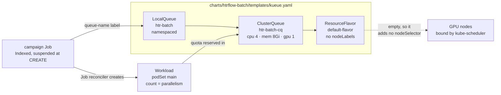
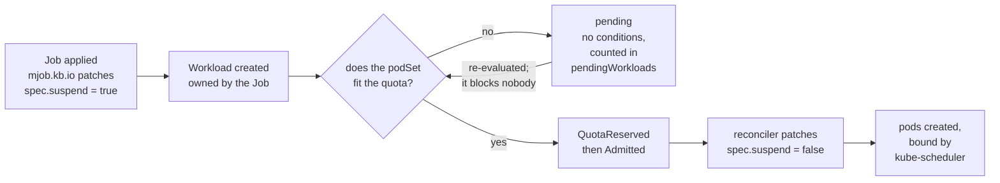
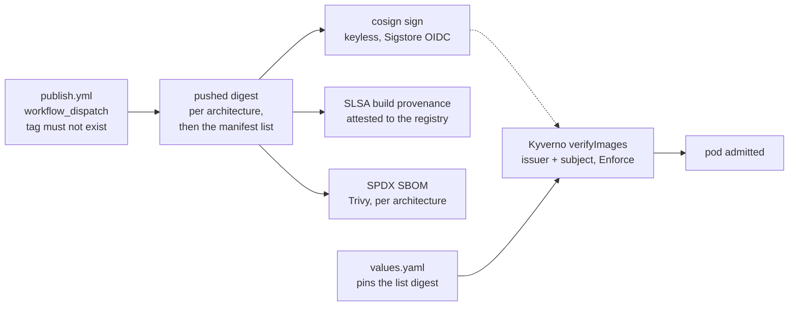

<!-- _class: lead cover -->
<!-- _footer: "Enheten för AI-labb och datatjänster,  2026-09-15" -->

# htrflow-batch under the hood

## Two platform pieces, in detail: how Kueue divides one GPU, and how an artifact gets a signature

<!--
The companion deck is "htrflow-batch: HTRflow at archive scale", and it stops
at "Kueue decides when your campaign runs". This one opens that box, and then
opens the other one: models and images as signed artifacts. Audience is the
same htrflow developers, plus anyone curious about the platform layer.

Every Kueue claim on the next eleven slides comes from kueue.sigs.k8s.io's own
concept pages; every claim about this repo names the file it came from.
Anything the multi-tenant design plans but nothing runs is marked PLANNED.
-->

---

<!-- _class: lead section -->

# Part A — Kueue, concept by concept

<!--
Nine Kueue concepts. For each: what the official docs say it is, what
htrflow-batch does with it today, and what the multi-tenant design would do
with it. Three of the nine we do not use at all, and that is said plainly
rather than skipped.
-->

---

# Kueue decides when. The scheduler decides where.

<div class="cols wide-left">
<div>

- **It is a job-level admission controller and quota manager, not a pod scheduler.** It never picks a node and never binds a pod; campaign pods keep `schedulerName: default-scheduler`.
- **A campaign is one Indexed Job, so one Workload** — not one per volume. It is admitted as a whole and holds its GPU until the last index finishes.
- **The whole of Kueue's view of HTR is a label.** `kueue.x-k8s.io/queue-name` on the Job, and the pod template's resource *requests*. It knows nothing about IIIF, S3 or models.
- **`make install-kueue` installs `KUEUE_VERSION`, today `v0.18.1`** (`Makefile`). The chart writes `kueue.x-k8s.io/v1beta2`; the converter's pause patch still asks for `v1beta1`.

</div>
<div>

<p class="filename">the nine concepts, and where we stand</p>

<table class="plain">
<tr><td>ResourceFlavor</td><td>rendered, empty</td></tr>
<tr><td>ClusterQueue</td><td>rendered, one</td></tr>
<tr><td>LocalQueue</td><td>rendered, one</td></tr>
<tr><td>Workload</td><td>Kueue's, we patch it</td></tr>
<tr><td>Cohort</td><td>planned</td></tr>
<tr><td>WorkloadPriorityClass</td><td>planned</td></tr>
<tr><td>AdmissionCheck</td><td>not used</td></tr>
<tr><td>Topology / TAS</td><td>not used</td></tr>
<tr><td>DRA</td><td>not used</td></tr>
</table>

</div>
</div>

<!--
The v1beta1/v1beta2 split is a real known limit, written down in
docs/how-it-works/queueing.md: cluster.py's _KUEUE tuple asks for the older
version when it patches a Workload, while templates/kueue.yaml is written
against the newer one. Kueue serves both today. The day it drops the older
one, pause silently stops working, and the symptom is a campaign git says is
paused that keeps on running.
-->

---

# The object graph



<p class="note">The converter renders the Job. The chart renders the three queue objects. Kueue renders the Workload — nothing else ever writes one.</p>

<!--
Read it as two chains that meet at the ClusterQueue. The left-to-right chain
is configuration: a Job names a LocalQueue by label, the LocalQueue names one
ClusterQueue, the ClusterQueue names flavors. The lower chain is runtime: the
Job gets a Workload, and the Workload is what holds quota.

The dotted edge is the honest one. Our ResourceFlavor is empty, so it
contributes nothing to placement; the pod lands on a GPU node because it
requests nvidia.com/gpu, not because Kueue said so.
-->

---

# ResourceFlavor and ClusterQueue

<div class="cols">
<div>

## ResourceFlavor

> "An object that you can define to describe what resources are available in a cluster."
> <span class="note">— Concepts</span>

**Today.** One, named by `queue.flavor`, default `default-flavor`, with no `nodeLabels` and no `nodeTaints`. The docs call that an *empty ResourceFlavor*, and it is the right shape for one homogeneous GPU node: Kueue injects no `nodeSelector` at admission.

**Planned.** One flavor per GPU generation in the platform release, so a campaign can be told which hardware it may have.

</div>
<div>

## ClusterQueue

> "A cluster-scoped resource that governs a pool of resources, defining usage limits and Fair Sharing rules."
> <span class="note">— Concepts</span>

**Today.** One, `htr-batch-cq`. One resource group covering cpu, memory and `nvidia.com/gpu`, `nominalQuota` 4 / 8Gi / 1 — **exactly one wrapper pod**. A `namespaceSelector` on `kubernetes.io/metadata.name` keeps another namespace from pointing a LocalQueue at our GPU.

**Planned.** One per tenant, each with its own `nominalQuota` and a `borrowingLimit`.

</div>
</div>

<!--
The rule that bites: Kueue marks a Workload inadmissible unless the
ClusterQueue covers EVERY resource the pod requests. So coveredResources and
the pod's requests have to change together — add a resource to the pod
template without adding it to values.queue.resources and the campaign reads
"Queued" for ever.

Quota counts requests, not limits. The wrapper requests 8Gi with a 16Gi
limit, and 8Gi is what the quota sees.
-->

---

# LocalQueue, and the Cohort we do not have

<div class="cols">
<div>

## LocalQueue

> "A namespaced resource that groups closely related workloads belonging to a single tenant."
> <span class="note">— Concepts</span>

**Today.** One, `htr-batch`, in the release namespace, with `spec.clusterQueue` pointing at `htr-batch-cq`. The tenant is the whole installation.

**Planned.** A LocalQueue named `htr` in *every* tenant namespace — the same name everywhere, so the tenant is the namespace and `converter.yaml`'s `queue:` is boilerplate.

</div>
<div>

## Cohort

> "ClusterQueues within the same Cohort … can share resources with each other."
> <span class="note">— Cohort</span>

**Today: none.** The ClusterQueue has no cohort field, so there is no quota to borrow and none to lend. An idle GPU stays idle.

**Planned.** Every ClusterQueue sets `cohortName: htr`. Nominal quota becomes a floor rather than a ceiling: you get yours, you may borrow what nobody is using, and reclaim takes it back.

<p class="note">The docs are strict about one thing: to borrow a resource a queue "<strong>must</strong> define nominal quota for the desired Resource and Flavor - even if this value is 0."</p>

</div>
</div>

<!--
The multi-tenant design's shape, taken as a premise by the product owner on
2026-09-08: two tiers. Team tenants — a namespace, a repo, a queue, a quota
each — for the few heavy users. One shared pool namespace for everyone else,
where a submitter is a label value and a bucket prefix, not a Kubernetes
object. Between the tiers Kueue does the dividing; inside the pool it
deliberately does not, because its finest dimension is the LocalQueue and the
pool has exactly one.
-->

---

# Workload: the unit of admission

<div class="cols wide-left">
<div>

> "An application that will run to completion. It is the unit of admission in Kueue."
> <span class="note">— Concepts</span>

- **We never write one.** Kueue's Job reconciler creates it, owned by the Job and labelled `kueue.x-k8s.io/job-uid` — the one link that survives a delete and recreate.
- **`podSets[0].count` is the Job's `parallelism`, not its `completions`.** A podSet describes the pods that exist at once, not the work items.
- **So `window:` *is* the quota question.** `parallelism = min(campaign window, converter.yaml window)`, and the whole podSet must fit, because we do not use partial admission.
- **Pause is a Workload patch.** Kueue owns `spec.suspend` on a Job it manages and sets it back within seconds, so `apply` patches the Workload instead.

</div>
<div>

<p class="filename">the pause lever, docs/concepts/workload</p>

> "Changing `.spec.Active` from true to false will cause a running workload to be evicted and not be requeued."

<p class="filename">cluster.py, sync_pause — last in every apply</p>

```
find the Workload by job-uid
if spec.active != intent:
    patch {"spec":{"active": want}}
```

<p class="note">Eviction keeps every completed index; the Job then reads <code>suspend: true</code> and reactivating continues from the next index. This is Kueue behaviour Kueue does not promise to keep — a known limit, not a feature.</p>

</div>
</div>

<!--
Worth saying out loud: the shipped defaults are inadmissible. converter.yaml's
window is 20 against a one-GPU quota, so parallelism renders as 20, the podSet
never fits, and the campaign reads "Queued" for ever. That is the single most
common reason a campaign never starts, and it is written down as a known limit
in queueing.md rather than quietly fixed, because the fix is a per-cluster
value.
-->

---

# The admission cycle



**Admission is per Job, once.** Kubernetes then replaces each finished pod with the next index without asking Kueue again — which is why a campaign at the front of the queue owns the GPU until its last volume is done, minutes or weeks later.

<!--
Six steps, four controllers. The mutating webhook suspends the Job at CREATE
so it cannot run before Kueue has seen it. The Kueue controller creates the
Workload, orders the queue, reserves quota and unsuspends. The Job controller
makes pods. kube-scheduler binds them.

Quota reservation is the scheduling decision; admission is the authorisation
that follows it. On our ClusterQueue there is nothing between the two, and the
next slide says what could go there.
-->

---

# Order, priority, preemption — and what sits between

<div class="cols">
<div>

**Queue order.** `queueingStrategy` is unset, so it is Kueue's default `BestEffortFIFO`:

> "Older Workloads that can't be admitted will not block newer Workloads that fit."
> <span class="note">— ClusterQueue</span>

With one GPU and a podSet of one, nothing smaller can slip through, so it behaves as a plain queue.

**Preemption is off.** `withinClusterQueue: Never`, `reclaimWithinCohort: Never`. Nothing jumps the line, and nothing is ever evicted to make room.

</div>
<div>

**Priority is a dangling reference.** A campaign's `priority:` renders the label `kueue.x-k8s.io/priority-class`, but the chart renders no

> "priority class whose value is utilized by Kueue controller and is independent from Pod's priority"
> <span class="note">— WorkloadPriorityClass</span>

— so Kueue's validating webhook rejects the Job. **PLANNED:** three classes, `htr-interactive` 1000, `htr-bulk` 100 (the default), `htr-idle` 10, with `reclaimWithinCohort: Any`.

**AdmissionCheck**, "a mechanism that allows Kueue to consider additional criteria before admitting a Workload", runs between quota reservation and admission. We configure none — not today, not in the design.

</div>
</div>

<!--
The priority gap is audit item X17 and story B18: the converter already writes
the label, no class exists, so setting priority: in a campaign file turns a
working campaign into one the API server refuses. Until B18 lands, leave it
out.

AdmissionCheck is where a cluster-autoscaler hook (ProvisioningRequest) or a
multi-cluster dispatch (MultiKueue) would go. Neither is on our road; a check
that never returns Ready is a campaign that never starts, so an unused one is
better than a half-wired one.
-->

---

# Two we do not use: topology, and DRA

<div class="cols">
<div>

## Topology-Aware Scheduling

> "A mechanism allowing to schedule Workloads optimizing Pod placement for network throughput."
> <span class="note">— Concepts</span>

A `Topology` is "a cluster-scoped resource that represents the hierarchical topology of nodes in a data center" — block, rack, node — named from a ResourceFlavor's `topologyName`, with a podSet annotation asking for one domain. Beta and on by default since Kueue **v0.14**.

**We do not use it, and it would not help.** It pays off when the pods of *one* Workload talk to each other. Ours do not: each index is one volume, one GPU, one bucket.

</div>
<div>

## Dynamic Resource Allocation

> "Quota management for workloads using Kubernetes Dynamic Resource Allocation (DRA)."
> <span class="note">— Concepts</span>

Pods claim devices through a `ResourceClaimTemplate` against a `DeviceClass`; Kueue maps each DeviceClass to a quota resource name in its own Configuration. Beta and on by default since Kueue **v0.18** — which is the version we install.

**We do not use it.** We count whole `nvidia.com/gpu` units. DRA is how you would one day give half a card to a small volume, or a specific MIG partition to a big one.

</div>
</div>

<!--
Both of these are worth knowing because they are the two axes we would grow
along. Topology matters the day a Workload is multi-node — which for us would
mean a single volume split across GPUs, and nothing in the design proposes
that. DRA matters much sooner: an A2-sized segmentation model and a large
TrOCR model do not want the same slice of a card, and today they each take a
whole one.

Version numbers checked against the concept pages, not from memory.
-->

---

<!-- _class: lead section -->

# Part B — models as artifacts, and signatures

<!--
The same question twice. For container images we have an answer we trust: a
digest, a signature, a provenance attestation, an SBOM, and an admission
webhook that checks the lot. For models we have half an answer. This part says
which half, and what the spikes found when the AI lab went looking for the
other one.
-->

---

# Where models live today

<div class="cols wide-left">
<div>

- **A warm-up Job fills a cache PVC, once per pipeline id.** It runs the wrapper image on CPU, outside the queue — no `queue-name` label, no GPU request — and simply builds the pipeline. Building it *is* the download.
- **The marker, not the weights, is the contract.** Warm-up writes `/data/warmup/<pipeline-id>.done`; a campaign pod's `warmup-wait` init container polls for that file and never looks at what is in `hub/`.
- **Campaign pods run offline and read-only.** `HF_HUB_OFFLINE=1`, the PVC mounted `readOnly: true`, and the `htr-batch-job` NetworkPolicy gives them DNS, S3 and the IIIF CIDRs — no route to the Hub at all.
- **The pin is a revision, checked by Kyverno.** `security.requireModelRevision` refuses a pipeline ConfigMap whose steps name a model without a 40-hex commit hash.
- **A private or gated model needs `hf_token_secret`,** rendered as `HF_TOKEN` on the warm-up container alone.

</div>
<div>

<p class="filename">what the cache holds</p>

```
/data/hf/hub/
  models--<org>--<name>/
    snapshots/<revision>/…
/data/warmup/
  <pipeline-id>.done
```

<p class="note">One <code>ReadWriteOnce</code> 30 GiB PVC today, which pins every Job to the node holding the volume. The multi-tenant design makes it <code>ReadWriteMany</code> on a shared filesystem, warmed once for the whole cluster — which is what makes a pipeline id have to be unique cluster-wide.</p>

<p class="note">Standing ruling: <strong>models are never baked into the image.</strong></p>

</div>
</div>

<!--
The honest gap on this slide: the warm-up pod is the one pod in the namespace
with egress to the whole internet, because Hugging Face is a CDN with no fixed
address to allow-list. And Hub weights are pickled Python objects — loading
one executes code. The revision pin says "the same pickle as last time". It
does not say who wrote it, and nothing we run verifies a signature over it.
That gap is the whole of story B35.
-->

---

# A model as an OCI artifact

<div class="cols">
<div>

**ModelPack** is the CNCF specification for this. In its own words it is "a vendor-neutral, open source specification standard to package, distribute and run AI models in a cloud native environment", built "based on the current OCI image specification and the artifacts guidelines".

A model becomes a manifest of type `application/vnd.cncf.model.manifest.v1+json`, with weight files as layers — `…model.weight.v1.raw`, `.tar`, `.tar+gzip`, `.tar+zstd` — and a config blob describing name, format, licence and origin.

</div>
<div>

**What that would buy us,** all of it things container images already have:

<table class="plain">
<tr><td>A digest</td><td>content-addressed weights</td></tr>
<tr><td>A cosign signature</td><td>who packaged them</td></tr>
<tr><td>Provenance</td><td>which job, from where</td></tr>
<tr><td>Registry RBAC</td><td>who may push</td></tr>
<tr><td>Retention</td><td>and replication</td></tr>
<tr><td>No egress</td><td>pull from our registry, not a CDN</td></tr>
</table>

<p class="note">Not scanning: Trivy refuses the model media type, so a registry gives signing and pinning for weights, never CVE reports on them.</p>

</div>
</div>

<!--
The tooling is modctl, and there is a media-type wrinkle worth carrying in
your head: modctl 0.2.2 emits the vnd.CNAI.model.* namespace, while the
current spec text shows vnd.CNCF.model.*. Harbor classifies both as models.
It matters because anything that matches on media type — a scanner, a
mounter, a policy — is matching on a string that two versions of the same
ecosystem disagree about.
-->

---

# What the spikes found

<div class="cols wide-left">
<div>

- **A plain OCI image works as a Kubernetes image volume.** `FROM scratch` plus the model files, mounted read-only at `/models`: file checksums equal the Hub files, and htrflow loads and predicts offline. On containerd, today, with no extra component.
- **A ModelPack artifact mounts EMPTY.** Same cluster, same image-volume mechanism: the kubelet reports the pull as successful, the directory is empty, and there is no event and no error. containerd unpacks standard image layers only. Silent, which is the bad kind of broken.
- **So ModelPack needs extraction, not mounting.** An init container running `modctl pull --extract-from-remote` as a non-root user, authenticated by a pull-only registry robot, extracted the model and the wrapper loaded it offline. A tag that does not exist fails the init container before the transcription container starts.
- **Harbor serves them and can enforce the pin.** A `models` project with a tag-immutability rule answers 412 to moving or deleting a tag.

</div>
<div>

<p class="filename">two findings to distrust tooling over</p>

<p class="note"><strong>modctl cannot pull by digest.</strong> <code>repo@sha256:…</code> fails outright; <code>repo:tag@sha256:…</code> <em>succeeds with the wrong digest</em> — it is silently ignored. False pinning.</p>

<p class="note"><strong>modctl push can report success when the registry refused the tag.</strong> Pushing different content to an immutable tag exits 0, leaving an untagged manifest behind. So any packaging job must resolve the tag afterwards and fail unless it equals the digest it built.</p>

<p class="note">Spikes, 2026-06 and 2026-09-14, on a dev cluster. Nothing here ships.</p>

</div>
</div>

<!--
Sequence of the second spike: Kubernetes 1.35, containerd 2.2.3, ImageVolume
beta on. The Model CSI Driver does mount ModelPack correctly on containerd,
and was ruled out on its own terms rather than because it failed — it resolves
tags only, re-downloads the whole model per pod with no node cache, hard-codes
TLS verification off, verifies no signatures, and runs as a privileged
DaemonSet with bidirectional mounts.

The takeaway the AI lab wrote down: for multi-node distribution, prefer plain
OCI images and image volumes, and extend the Kyverno digest rules to
volumes[].image.reference.
-->

---

# What B35 would change here

<div class="cols">
<div>

**The pipeline file stops naming a Hub repo.** It names `<registry>/models/<name>:<source revision>` — an **immutable tag**, validated against the allowed-registry prefix like any image.

**The tag is the pin, because the registry enforces it.** Product-owner ruling, 2026-09-14: modctl cannot pull by digest, so Harbor's immutability rule carries the guarantee instead. The digest is *recorded* at pull time for provenance, not compared.

**The warm-up changes job.** Resolve the tag, `cosign verify` that digest against the packaging identity, pull, extract into the layout htrflow already reads. htrflow itself is untouched and campaign pods stay `HF_HUB_OFFLINE=1`.

</div>
<div>

**Then the last hole in the network policy closes.** The warm-up's internet egress is removed; it reaches the registry and nothing else.

**And a transcription can name its weights.** `manifest.json` already records the image digest and the pipeline hash; it would record the model digests too.

<p class="note">Status: <strong>a story, not a shipped feature.</strong> B35 depends on B36, one registry with a pull-through cache, which the multi-tenant design lists as a prerequisite. B102 is the neighbouring model-side story — re-saving the base models under the newer transformers line so one wrapper image is enough — and is work in the model repos and in htrflow, not here.</p>

</div>
</div>

<!--
Why this is a security story rather than a convenience one: whoever can write
the campaigns repo chooses the image AND the models that run with the results
bucket's write credentials, and Hub weights are pickles. Today three things
hold that line — the allowed-repository policy, the digest pin, the revision
pin — and only the first two are signatures. B35 puts the models on the same
footing as the images. For NIS2 it closes the supplier gap the images alone
leave open.
-->

---

# The signing chain we already have



<p class="note">One composite action, <code>.github/actions/sign-attest</code>, shared by all three publish jobs so they cannot drift. A manifest list gets no SBOM of its own — its members carry the package lists.</p>

<!--
Four separate guarantees, often confused. The signature says who built it. The
provenance says which workflow run, from which commit. The SBOM says what is
inside. The digest pin says that what runs is what was reviewed.

Two details that catch people. verifyImages sets mutateDigest: false on
purpose — digest pinning is the chart's job, and we do not want the webhook
rewriting pod specs on the way in. And the subject must name the BRANCH the
workflow ran from: publish is workflow_dispatch, so its identity never carries
a tag ref, and a @refs/tags/* subject matches nothing this release has ever
signed as.

All of this is off by default — security.verifyImages.enabled is false —
because a policy nothing reconciles is worse than none.
-->

---

# Signing models: what is real, what is proposed

<div class="cols">
<div>

## Real

- **cosign signs any OCI artifact,** a model pushed as an OCI artifact included. Nothing about the signing side is new or missing.
- **Today's equivalent guarantee** for weights is a pinned Hub revision, enforced at admission by the `model-revision` policy, plus a cache no campaign pod can write to and no campaign pod can refill.
- **The pickle problem is unchanged by any of it.** Prefer safetensors where the author offers it.

</div>
<div>

## Proposed

- **Kyverno verifies *images* at pod admission.** A model artifact is not a pod image, so its signature would be checked by the warm-up job — a job we wrote — not by the admission webhook. That is a weaker place to stand, and B35 records it as a known limit rather than glossing it.
- **Unless the model is a plain OCI image in a volume.** Then it *is* an image reference, and the existing Kyverno rules extend to `volumes[].image.reference`. That is the spike's own recommendation.

</div>
</div>

<!--
This is the slide to be most careful on. It is easy to say "we sign our
models" because the tooling exists and the spike worked. Nothing signs a model
in production today. What exists is: a revision pin, a policy that enforces
it, an offline cache, and a proven path. The difference between an artifact
signature checked by an admission controller and one checked by a job you
wrote yourself is the difference between a control and a convention.
-->

---

# Two roads, and where to read more

<div class="cols wide-left">
<div>

**For htrflow developers, the road is git.** A pipeline file, a campaign file, a pull request. Nothing on these eighteen slides changes what you write, and none of it is something you have to hold in your head to run a campaign.

**Underneath, the platform road is quotas and artifacts.** One cohort instead of one queue; priority classes that exist; models pulled from a registry we sign into, instead of a CDN we allow-list wholesale. Every one of those is a story with a number, and several of them are prerequisites for each other.

</div>
<div>

<table class="plain">
<tr><td>Queueing</td><td>Every Kueue claim in Part A, with the field names</td></tr>
<tr><td>The Wrapper</td><td>The model cache, the warm-up, provenance</td></tr>
<tr><td>Security</td><td>The trust boundary, the policies, the network</td></tr>
<tr><td>Releasing</td><td>The publish workflow, signing, SBOM, verification commands</td></tr>
<tr><td>kueue.sigs.k8s.io</td><td>The concept pages quoted throughout</td></tr>
</table>

**ai-riksarkivet.github.io/htrflow-batch**

</div>
</div>

<!--
If one thing survives this deck: the queue and the registry are the two places
where "what ran" is decided, and both are meant to be answerable from git plus
a digest. Everything labelled PLANNED is in
docs/superpowers/specs/2026-09-08-multi-tenant-design.md and in the story
files under docs/features/, and both are open to argument.
-->
