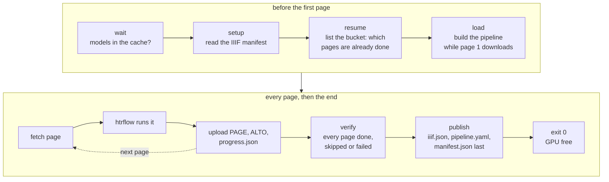
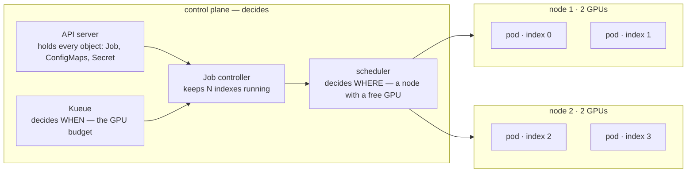
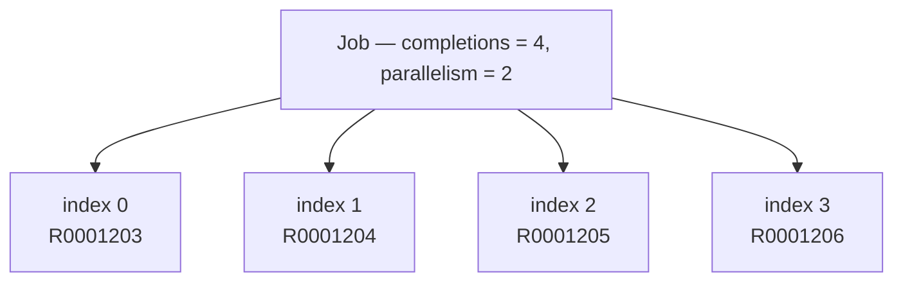
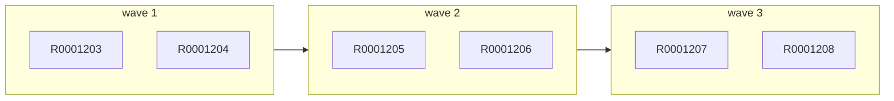
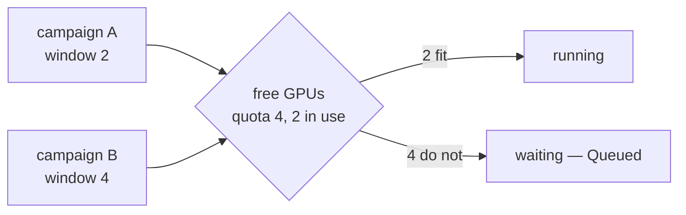
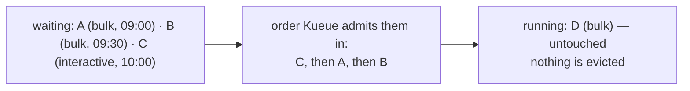
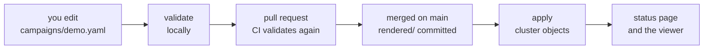
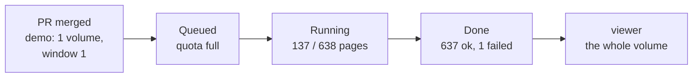

<!-- _class: lead cover -->
<!-- _footer: "Enheten för AI-labb och datatjänster" -->

# From one folder to the archive

## Part 1 of 5 — what changes when your pipeline has to run on ten thousand volumes

<!--
This is the first of five short lessons. It has no YAML in it beyond one
campaign file, and no Kubernetes vocabulary that is not introduced on the
slide where it is needed. If you know what an htrflow pipeline file does,
you have everything this deck assumes.

The other four: Part 2 is the hands-on lesson, git as the interface. Part 3
is inside one run. Part 4 is the queue. Part 5 is models and signatures.
-->

---

# Start from what you already do

<div class="cols">
<div>

<p class="filename">pipeline.yaml — an htrflow pipeline, unchanged</p>

```yaml
steps:
  - step: Segmentation
    settings:
      model: yolo
      model_settings:
        model: Riksarkivet/yolov9-regions-1
  - step: Segmentation
    settings:
      model: yolo
      model_settings:
        model: Riksarkivet/yolov9-lines-within-regions-1
  - step: TextRecognition
    settings:
      model: TrOCR
      model_settings:
        model: Riksarkivet/trocr-base-handwritten-hist-swe-2
```

</div>
<div>

```
htrflow pipeline pipeline.yaml images/
```

One folder of page images in, one folder of ALTO and PAGE out. One GPU, one process, one afternoon.

<p class="note">Everything in this series keeps this file exactly as it is. The <code>steps:</code> document is passed through verbatim; nothing appends to it except the two export steps, which the platform adds itself. The one thing it gains is a line above it naming the image to run it in.</p>

</div>
</div>

<!--
The point to land before anything else: nobody has to learn a new pipeline
format. The rest of the deck is about the folder and the GPU, not about the
steps.
-->

---

# One volume on your machine, ten thousand in the archive

<table class="plain">
<tr><td></td><td><strong>One volume, your machine</strong></td><td><strong>The archive</strong></td></tr>
<tr><td>Where the pages are</td><td>a folder on disk</td><td>behind a IIIF server, one manifest per volume, fetched page by page</td></tr>
<tr><td>What runs it</td><td>your GPU, one process</td><td>a pool of GPUs shared with everyone, one process per volume</td></tr>
<tr><td>When something crashes</td><td>you run it again</td><td>the run resumes from the last page that reached the bucket</td></tr>
<tr><td>Where the results go</td><td>a folder next to the images</td><td>a bucket, page by page while the run is going, readable in the viewer</td></tr>
<tr><td>Who made this line, with what</td><td>you remember</td><td>every ALTO says: image digest, model revisions, wrapper version</td></tr>
<tr><td>How you ask for a run</td><td>a command</td><td>a file in git, and a pull request</td></tr>
</table>

<p class="note"><strong>"Volume" here is an archival volume</strong> — a bound unit of pages with a reference code such as R0001203, the batch one run works through — never a Kubernetes volume, which is a disk.</p>

<!--
Read the right-hand column as the requirements the rest of the deck meets,
row by row: pages from a server, a shared GPU pool, resumable work,
streaming results, provenance, and git as the way to ask. Say the volume
sentence out loud, because the word collides with Kubernetes storage.
-->

---

# A run is one volume in one pod



<div class="cols">
<div>

**A pod is born for one volume and dies with it.** It starts only when the models are in the cache, reads the manifest, lists what the bucket already holds, and builds the pipeline while page one downloads.

**Then it streams.** The next page downloads while this one is on the GPU; each page's results go to the bucket the moment they exist, and its files are deleted.

</div>
<div>

**Then it verifies and publishes.** Every page must be uploaded, skipped or recorded as failed; only then are the viewer manifest and `manifest.json` written, and the pod exits. The GPU is free the same second.

**One rule to remember:** a pod is one volume, holding its GPU from *wait* to *exit*. What does all this inside it is *the wrapper* — htrflow as a library, run page by page. Part 3 opens it up.

</div>
</div>

<!--
Why one volume per pod and not one page per pod: the model load. Building
the pipeline takes tens of seconds and a lot of GPU memory; you want to pay
that once per volume, not once per page. And why not ten volumes per pod:
because then a crash costs ten volumes, and the queue cannot count what it
is handing out.

The three exits: 0 means done (with any failed pages recorded); 13 means
"a retry cannot fix this" (bad manifest URL, unknown model) and the index
is failed at once; 1 means transient (a 5xx, a network error) and
Kubernetes restarts the pod, which then resumes from the bucket -- the
resume stage is why a restart costs one page, not a volume.
-->

---

# Where a pod runs — the cluster, in one picture



<div class="cols">
<div>

**The control plane never runs your pipeline.** It holds the objects you asked for and keeps the world matching them: the Job controller makes one pod per index, Kueue says when it may, the scheduler picks a node with a free GPU.

</div>
<div>

**The nodes are where the GPUs are, and there are many.** One campaign's pods land on whichever nodes have a card free — index 0 on one machine, index 3 on another. Nothing in the pipeline knows which; pages come from IIIF and results go to the bucket either way.

</div>
</div>

**One rule to remember:** a campaign is spread across the cluster by the scheduler, one volume per pod, one pod per GPU. You never name a machine.

<!--
This is the slide for anyone who has run htrflow on one box with one card.
The mental shift is that "the computer" is now a pool: a control plane that
only decides, and nodes that only run. The pod is the unit that moves
between them, and the GPU it needs is what decides where it can go. Part 4
returns to the two deciders — Kueue for when, the scheduler for where.
-->

---

# A campaign is a list of volumes, and one Job

<div class="cols wide-left">
<div>



</div>
<div>

<p class="filename">campaigns/demo.yaml</p>

```yaml
pipeline: demo-v1
window: 2          # parallelism
volumes:           # completions = 4
  - R0001203
  - R0001204
  - R0001205
  - R0001206
```

</div>
</div>

* **A Job** is Kubernetes' word for "run this to completion". An *Indexed* Job runs it N times, and hands each pod its number.
* **Pod number 2 reads line 2 of the volume list.** That is the whole trick. No database, no controller of ours, nothing to keep in sync.
* **`parallelism`** is how many run at once. **`completions`** is how many there are — and it is fixed the moment the Job is created.

**One rule to remember:** more volumes means a *new* campaign file. The list a Job was born with is the list it dies with.

<!--
This is the single design decision the rest follows from: a campaign is one
Indexed Job, not one Job per volume and not a custom resource with a
controller. The append-only rule falls straight out of completions being
immutable. Part 2 shows what the validator says when someone tries anyway.
-->

---

# What a volume can be

<div class="cols wide-left">
<div>

<p class="filename">campaigns/demo.yaml — the same list, three ways of naming a volume</p>

```yaml
pipeline: demo-v1
volumes:
  - R0001203                                  # 1. a reference code
  - id: loc-mal2459400                        # 2. a IIIF manifest
    manifest: https://www.loc.gov/item/mal2459400/manifest.json
  - id: six-pages                             # 3. bare image URLs
    images:
      - https://example.org/scan-0001.jpg
      - https://example.org/scan-0002.jpg
```

</div>
<div>

* **A reference code** is expanded to a manifest URL by a template the cluster owns. Most volumes are this.
* **A manifest URL** is fetched as it is — v2 or v3, any server.
* **A list of image URLs has no manifest, so the wrapper writes one.** It publishes a *synthetic* IIIF manifest to the bucket first, then runs exactly as for the other two.

</div>
</div>

**Why the third form matters:** six images are a whole campaign that runs the entire path — queue, pod, bucket, viewer — in about a minute. That is how you prove a new pipeline before spending a GPU-week on it, and how a page from anywhere on the web gets transcribed without a IIIF server in front of it.

<!--
The synthetic manifest lands under sources/ in the bucket and is what the
viewer opens; the wrapper treats it like any other manifest afterwards, so
resume and verify work the same way. One caveat worth saying aloud: every
URL a campaign names is stored verbatim in git, in the cluster and in the
results; a presigned URL publishes its signature.
-->

---

# `window`: how many volumes at once



<div class="cols">
<div>

<p class="filename">campaigns/demo.yaml — you set it here, per campaign</p>

```yaml
pipeline: demo-v1
window: 2            # optional; the cluster caps it
volumes:
  - R0001203
  - R0001204
  # … six in all
```

**Six volumes, `window: 2`.** Two pods at once, each on its own GPU; when one finishes, the next volume takes its place. Nobody plans the waves — the Job keeps two indexes busy.

</div>
<div>

**So `window` is the campaign's GPU count** — not the number of volumes, not a speed setting. `window: 1` is fine, and takes six times as long.

**Asked for as a whole, capped by the cluster.** Two GPUs free means it starts; one free means it waits. Above the cap it is clamped; left out, it gets the cap.

**One rule to remember:** `window` changes how *fast* a campaign finishes, never *what* it produces.

</div>
</div>

<!--
Under the hood window is the Job's `parallelism`, and the wave picture is
literal: Kubernetes keeps `parallelism` indexes running and starts the next
index the moment one exits. `completions` (the number of volumes) and
`parallelism` are the two numbers on the Job; only the second is yours to
choose. Partial admission is deliberately off, which is what "asked for as a
whole" means.
-->

---

# GPUs are a budget, so campaigns queue



<div class="cols">
<div>

**The doorman is Kueue.** It knows one thing about your campaign: its `window`. If that many GPUs are free, the campaign starts. If not, it waits — and a smaller campaign behind it may go first.

**Once in, you stay in.** A campaign keeps its GPUs until its last volume is done. Nothing jumps the line, and nothing is evicted to make room.

</div>
<div>

**"Queued" means exactly this.** The Job exists, no pod has started, and the reason is the number on the left against the number in the middle.

**One rule to remember:** a `window` bigger than the cluster's whole quota reads *Queued* for ever. That is the most common reason a campaign "does not start".

</div>
</div>

<!--
Kueue decides WHEN, Kubernetes decides WHERE. Kueue never picks a node and
never sees a page. It is an admission controller with a counted quota, and
campaigns are Workloads to it. Part 4 is entirely about this slide: the
objects behind the quota, and what "Queued" can mean.

Pausing is also here: suspend: true in the campaign file, and the running
pods are evicted with every finished volume kept.
-->

---

# `priority`: who goes first in the line



<div class="cols">
<div>

<p class="filename">campaigns/demo.yaml</p>

```yaml
pipeline: demo-v1
priority: htr-interactive   # optional; default is htr-bulk
volumes:
  - R0001203
```

**Three classes ship with the cluster.** `htr-interactive` for a handful of volumes someone is waiting for, `htr-bulk` for the normal campaign, `htr-idle` for work that may wait for the gaps.

</div>
<div>

**Priority orders the queue.** Among the campaigns waiting, the higher class goes first; within a class, the older one. That is all it does.

**It never evicts.** A running campaign keeps its GPUs until its last volume is done, whatever arrives behind it. Preemption is deliberately off.

**One rule to remember:** `priority` decides who is *next*, never who is *stopped*. `validate` refuses a name the cluster does not offer — the cluster itself would leave such a campaign *Queued* for ever, silently.

</div>
</div>

<!--
The three names live in the platform's chart values and, mirrored, in the
campaigns repo's converter.yaml, so validate can refuse a name the cluster
does not have; a name that reached the cluster anyway would never get a
Workload and never start, with no event saying why. The reason preemption is
off: a campaign admitted as a whole holds a window of GPUs for hours or
weeks, and evicting it to make room throws away partly-done volumes'
slots -- resume would recover the pages, but the queue would thrash.
-->

---

# Results stream into a bucket, and the bucket is the truth

<div class="cols wide-left">
<div>

```
htr-batch/demo-v1/R0001203/
  page/0001.xml       PAGE XML, written first
  alto/0001.xml       ALTO — "this page is done"
  page/0002.xml
  alto/0002.xml
  …
  iiif.json           open it in the viewer, republished every ten pages
  progress.json       pages done and failed, live
  pipeline.yaml       the steps this run used
  manifest.json       written LAST — the only thing that means "done"
```

</div>
<div>

* **Resume is a list operation.** A pod starts by listing its folder. Every page with an ALTO is skipped; the rest are fetched.
* **So a crash costs one page.** Kubernetes restarts the pod, it lists, it carries on.
* **Provenance is in the files.** Every ALTO names the image digest and the model revisions; `manifest.json` names every source URL.
* **The pipeline id is in the path.** A better recipe writes beside the old results, never over them.

</div>
</div>

**One rule to remember:** `manifest.json` present means the volume is complete. Everything else is progress.

<!--
The order of writes is the contract: PAGE before ALTO, so an ALTO's presence
means the page is whole; manifest.json last, so its presence means the volume
is whole. The status page reads exactly these files, plus the live Job.

A page that fails deterministically is recorded in manifest.json and the
volume still completes; a page that is MISSING fails the volume, and the
retry redoes only that page. Part 3.
-->

---

# Your interface is git



<div class="cols">
<div>

<p class="filename">pipelines/demo-v1.yaml — the htrflow pipeline, plus the image that runs it</p>

```yaml
image: docker.io/riksarkivet/htrflow-batch@sha256:cb30d0…
steps:
  - step: Segmentation
    settings:
      model: yolo
      model_settings:
        model: Riksarkivet/yolov9-regions-1
  # … the rest of the htrflow steps, unchanged
```

**Two files are yours:** the campaign, and the pipeline it names. The pipeline file is the `steps:` document with one line above it: **which image** runs those steps — htrflow plus the wrapper, pinned by digest so the same id always means the same code.

</div>
<div>

**Validate needs no cluster.** The same program runs locally and in the pull request, and says one sentence per problem, naming the file.

**Nothing in the cluster reads git.** An `apply` renders the repo into Kubernetes objects and sends them. Delete the file, apply with prune, and the Job is gone; the results in the bucket are not.

**One rule to remember:** a pull request is how work is submitted. If it merged, it will run; the status page tells you when.

</div>
</div>

<!--
This is the slide the data scientist actually needs, and it is Part 2 in
full: the two files, converter.yaml, validate, render, apply, the status
page, and the rules the validator enforces. The reason to put it fifth here
is that the four ideas before it are what the two files are asking for.
-->

---

# The whole picture

```
 IN GIT                        IN THE CLUSTER                                    OUTSIDE IT

 campaigns repo                Kyverno       checks every object at the door
   converter.yaml                 │
   pipelines/  campaigns/         ▼
   rendered/   ──── apply ───► Kueue         holds each campaign until its GPUs are free
                                  │
 its CI                           ▼
   converter:                  campaign Job  one pod per volume:
   validate, render              wrapper + htrflow  ─── pages in ──────────────  IIIF servers
                                    │        ─── ALTO, PAGE, progress out ──────  S3 bucket
                                    ▲ models, read-only
                               warm-up Job   fills the model cache once  ◄────  Hugging Face Hub

                               web front     read API · status page · viewer ◄── your browser
```

**Two rules hold it together:** nothing in the cluster reads git — `apply` is all it is told; and the bucket is the only thing that remembers.

<!--
Read it left to right as the life of a campaign: written in git, checked by
Kyverno, queued by Kueue, run as one pod per volume, results in the bucket,
watched through the web front. The warm-up is the one pod that talks to the
Hub, and the web front is the one pod a browser talks to.
-->

---

# What it is made of

<div class="cols">
<div>

<p class="filename">ours — in the htrflow-batch repository</p>

<table class="plain">
<tr><td><strong>wrapper</strong></td><td>runs in every campaign pod: fetch, htrflow, upload, verify</td></tr>
<tr><td><strong>converter</strong></td><td>the <code>htrflow-campaigns</code> tool: init, validate, render, apply — runs locally and in CI, never in the cluster</td></tr>
<tr><td><strong>web</strong></td><td>one process: the read API, the status page and the Universal Viewer</td></tr>
<tr><td><strong>status page</strong></td><td>the browser app the web front serves</td></tr>
<tr><td><strong>charts</strong></td><td>install the platform — queue, model cache, web front, policies, network rules — and, for development only, an S3 store and a registry</td></tr>
</table>

</div>
<div>

<p class="filename">what it stands on</p>

<table class="plain">
<tr><td><strong>Kubernetes</strong></td><td>runs the pods; its Indexed Jobs are the campaigns</td></tr>
<tr><td><strong>Kueue</strong></td><td>the queue and the GPU quota — part 4</td></tr>
<tr><td><strong>Kyverno</strong></td><td>admission policies: allowed image registries, digests, model revisions, signatures</td></tr>
<tr><td><strong>NVIDIA GPU stack</strong></td><td>driver, container runtime and device plugin, so a pod can have a GPU</td></tr>
<tr><td><strong>an S3 store</strong></td><td>the results bucket — the only durable state</td></tr>
<tr><td><strong>a registry</strong></td><td>where the two images live, signed</td></tr>
<tr><td><strong>Argo CD</strong></td><td>optional: applies <code>rendered/</code> from git instead of a person</td></tr>
</table>

</div>
</div>

<!--
Two images: htrflow-batch (the wrapper on top of htrflow's own image) and
htrflow-web (the read API, status page and viewer). No database, no
controller or custom resource of our own: the campaign is a plain Job.
-->

---

# The status page


**One card per campaign**, running first, then anything wrong, then finished. The header says how it ended and when; the totals show volumes and pages with failures under the bar; each volume's name opens the viewer, its icons open the run log and manifest; the footer names the pipeline and its models.

<!--
The page reads the live Jobs and each volume's progress.json, so counts
move while a pod runs. A campaign whose Job has been deleted a week after
it ended is rebuilt from its record and shows "job removed"; its results
and viewer links keep working.
-->

---

# Follow one campaign



* **Queued.** Another campaign holds the GPUs. The status page shows the campaign with no pod, and says so.
* **Running.** One pod, one GPU. The page count moves every few seconds, and the volume opens in the viewer at page ten.
* **Done, with one failed page.** Page 44 broke a model worker thread; the wrapper caught it, marked the page failed, rebuilt the pipeline and finished the other 637. The card turns amber, not green, and names the page.
* **What you do about page 44:** nothing, or a new campaign later with a fixed image. Its failure is in `manifest.json` and on the card, and the 637 good pages are in the viewer now.

<!--
This is a real run: 638 pages of one volume, about an hour on one GPU with a
large TrOCR model, one page lost to a dead segmentation thread. The two
things to notice: the failure did not cost the volume, and nobody had to
look at a log to learn about it.
-->

---

# What would happen if…

<div class="cols">
<div>

**1.** The demo campaign is running, and you add a fifth volume to `campaigns/demo.yaml` and open a pull request.

**2.** You improve `pipelines/demo-v1.yaml` — a better line model — while three campaigns name it.

**3.** The cluster has four GPUs and you set `window: 20`.

**4.** Page 44 fails the same way on every retry.

</div>
<div>

<p class="note">Think before the next slide. Each of these is something a real user did in the first week, and each has a one-sentence answer that follows from one of the slides before.</p>

</div>
</div>

<!--
Give the room a minute. The answers are on the next slide.
-->

---

# … and what does

<table class="plain">
<tr><td>1</td><td><strong>Validate refuses the pull request</strong> with "campaign demo is append-only" — the Job's <code>completions</code> cannot grow. You write <code>campaigns/demo-2.yaml</code> with the fifth volume.</td></tr>
<tr><td>2</td><td><strong>Validate refuses that too:</strong> a pipeline file is immutable while a campaign names it. You write <code>pipelines/demo-v2.yaml</code>; its results land in a new folder beside the old ones, and both stay readable.</td></tr>
<tr><td>3</td><td><strong>The campaign reads Queued for ever.</strong> A window of 20 never fits a quota of 4, and Kueue does not admit part of a campaign. Set the window to what the cluster can give.</td></tr>
<tr><td>4</td><td><strong>The volume still completes.</strong> The page is named in <code>manifest.json</code>, counted on the card, and the other pages are in the viewer. A page that never <em>uploaded</em> would have failed the volume instead — that one is retried.</td></tr>
</table>

<!--
If the room got three of four, the deck has done its job. The fourth is the
subtle one and worth dwelling on: "failed" and "missing" are different
things, and the platform treats a deterministic failure as a fact to record
and a missing upload as a bug to retry.
-->

---

# Next

<p class="note"><strong>Part 2, <em>Your interface is git</em>:</strong> the two files field by field, validate locally, and a throwaway campaign of six images that runs the whole path in a minute.</p>

**ai-riksarkivet.github.io/htrflow-batch** — start with *Run a Campaign*.

<!--
The docs page "Run a Campaign" is the written form of Part 2. "From Image to
Transcription" is Part 3. "Queueing" is Part 4.
-->
