<!-- _class: lead cover -->
<!-- _footer: "Enheten för AI-labb och datatjänster" -->

# Distributed htrflow

## What changes when your pipeline runs on many nodes

<!--
This is the first part of the series. It uses no Kubernetes vocabulary
that is not introduced on the slide where it is needed. If you know what an
htrflow pipeline file does, you have everything this deck assumes.
-->

---

# Start from how htrflow works

<div class="cols">
<div>

<p class="filename">pipeline.yaml — an htrflow pipeline, unchanged</p>

```yaml
steps:
  - step: Segmentation
    settings:
      model: yolo
      model_settings:
        model: Riksarkivet/yolov9-regions-1
  - step: Segmentation
    settings:
      model: yolo
      model_settings:
        model: Riksarkivet/yolov9-lines-within-regions-1
  - step: TextRecognition
    settings:
      model: TrOCR
      model_settings:
        model: Riksarkivet/trocr-base-handwritten-hist-swe-2
```

</div>
<div>

```
htrflow pipeline pipeline.yaml images/
```

One folder of page images in, one folder of ALTO and PAGE out, on one GPU.

</div>
</div>

<!--
The point to land before anything else: nobody has to learn a new pipeline
format. The rest of the deck is about the folder and the GPU, not about the
steps.
-->

---

# From one machine to many

<table class="plain">
<tr><td></td><td><strong>one machine</strong></td><td><strong>many nodes</strong></td></tr>
<tr><td>where it runs</td><td>your machine, its GPU</td><td>whichever node has a GPU free — chosen for you</td></tr>
<tr><td>the pages</td><td>a folder on its disk</td><td>fetched over the web — from a IIIF manifest or plain image URLs — by whichever node runs the volume</td></tr>
<tr><td>the models</td><td>downloaded to that disk</td><td>a shared cache every node mounts</td></tr>
<tr><td>the results</td><td>a folder next to the pages</td><td>a bucket every node writes to and every browser reads from</td></tr>
<tr><td>when a machine fails</td><td>you start again</td><td>the volume restarts on another node and resumes from the bucket</td></tr>
<tr><td>how you start it</td><td>a command on that machine</td><td>a file in git — you never name a machine</td></tr>
</table>

<p class="note"><strong>"Volume" here is an archival volume</strong> — a bound unit of pages with a reference code such as R0001203, the batch one run works through — never a Kubernetes volume, which is a disk.</p>

<!--
Read the right-hand column as the requirements the rest of the deck meets:
nothing may live on one node's disk, because the next attempt may run on
another. So pages come from a server, models from a shared cache, results
go to a shared bucket, and the request is a file, not a command. Say the volume
sentence out loud, because the word collides with Kubernetes storage.
-->

---

# The campaign file

<div class="cols three">
<div>

<p class="filename">by reference code</p>

```yaml
pipeline: demo-v1
volumes:
  - R0001203
  - R0001204
```

</div>
<div>

<p class="filename">by IIIF manifest</p>

```yaml
pipeline: demo-v1
volumes:
  - id: loc-mal2459400
    manifest: https://…/manifest.json
```

</div>
<div>

<p class="filename">by image URLs</p>

```yaml
pipeline: demo-v1
volumes:
  - id: loose-scans
    images:
      - https://…/scan-0001.jpg
      - https://…/scan-0002.jpg
```

</div>
</div>

**This is how you ask for a run:** one file per campaign, in git — a **pipeline** to run, and the archival **volumes** to run it on. A reference code alone is enough: the platform turns it into the archive's IIIF manifest.

<!--
The reference code is expanded through source_template in converter.yaml,
which the platform sets once for the archive's IIIF server.
-->

---

# Rough architecture

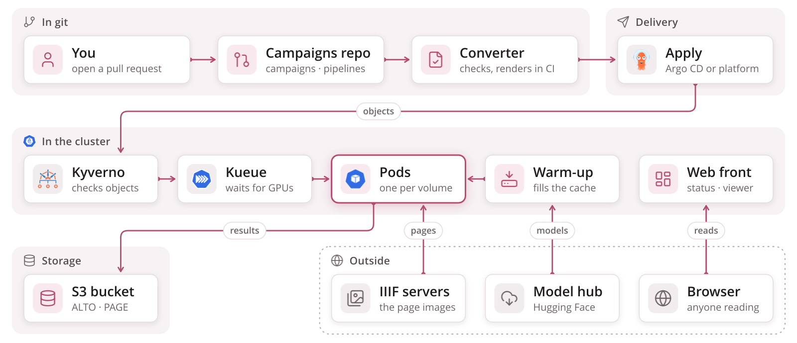

**You only open a pull request.** The converter checks and renders it in CI; apply — run by Argo CD or the platform team, never by you — sends it to the cluster.

<!--
Read it left to right as the life of a campaign: written in git, checked by
Kyverno, queued by Kueue, run as one pod per volume, results in the bucket,
watched through the web front. The warm-up is the one pod that talks to the
Hub, and the web front is the one pod a browser talks to.
-->

---

# What it is made of

<p class="layer">built in htrflow-batch</p>

<div class="icons four ours">
<figure><figcaption>wrapper<span>runs htrflow in each pod</span></figcaption></figure>
<figure><figcaption>converter<span>validate · render · apply</span></figcaption></figure>
<figure><figcaption>web front<span>status page · run log</span></figcaption></figure>
<figure><figcaption>Helm charts<span>install the platform</span></figcaption></figure>
</div>

<p class="layer">projects we build on</p>

<div class="icons eight">
<figure><figcaption>htrflow</figcaption></figure>
<figure><figcaption>Kubernetes</figcaption></figure>
<figure><figcaption>Kueue</figcaption></figure>
<figure><figcaption>Kyverno</figcaption></figure>
<figure><figcaption>Universal Viewer</figcaption></figure>
<figure><figcaption>NVIDIA GPU stack</figcaption></figure>
<figure><figcaption>S3 store</figcaption></figure>
<figure><figcaption>Argo CD<span>optional</span></figcaption></figure>
</div>

**We built the four pieces on top.** Everything below is an existing project we use as it is — htrflow included, driven as a library.

---

# What is inside what

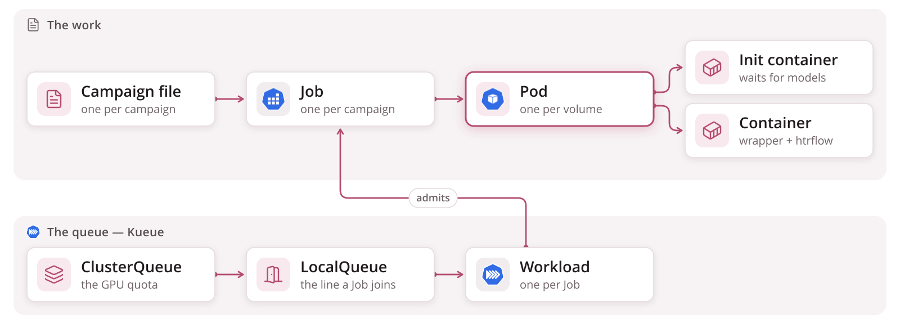

**The two meet at the Workload:** Kueue admits a Job's Workload, and only then does the Job create its pods.

<!--
A container is the running program; a pod is one or more containers that
share a machine, disk and network; a Job makes pods until its work is done.
Kueue never touches pods: it makes one Workload per Job, holds it until the
Job's window fits the ClusterQueue's quota, and lets the Job go. The
LocalQueue is the name a Job carries in its queue label, and converter.yaml
sets it for every campaign.
-->

---

# The Workload

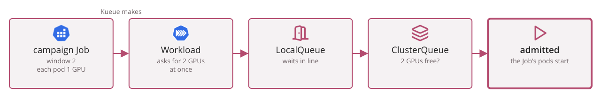

**A Workload is Kueue's copy of what a Job asks for:** how many pods at once, and what each one needs. Kueue makes it — you never write one — and it is what waits in line and gets admitted, not the Job itself.

<!--
The request is the window times one pod's requests: GPUs, CPU and memory
together. Admission is once per campaign; after that the Job starts each
next volume without asking again. The card's Queued and Running follow the
Workload.
-->

---

# LocalQueue and ClusterQueue

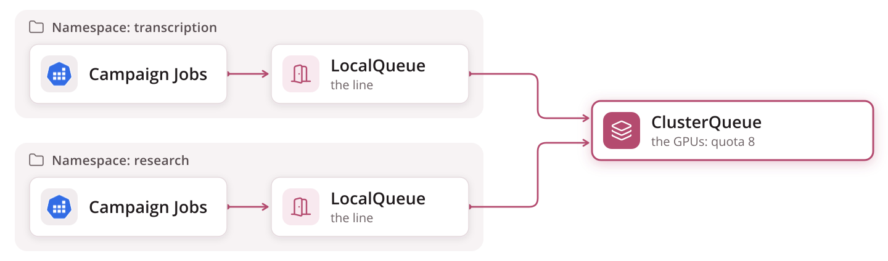

<div class="cols">
<div>

**LocalQueue — the door.** It lives in a team's namespace, and a Job names it to get in line. It holds no GPUs of its own.

</div>
<div>

**ClusterQueue — the pool.** It holds the GPU quota, for the whole cluster. Many LocalQueues can point to one ClusterQueue, and share its GPUs.

</div>
</div>

**Here:** one LocalQueue, `htr-batch`, pointing to one ClusterQueue. converter.yaml names the LocalQueue, so a campaign file never has to.

---

# ResourceFlavor

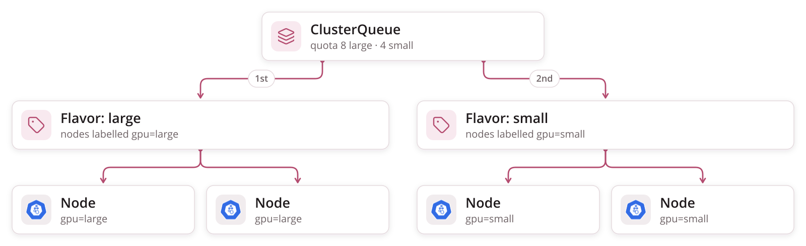

<div class="cols">
<div>

**A kind of GPU.** A flavor names nodes by their label — the GPU model NVIDIA's feature discovery writes on each node, A100 or L4 — and Kueue adds that label to the pods it admits, so they land on the right machines.

</div>
<div>

**A quota per flavor.** A ClusterQueue promises so many of each and tries its flavors in order: a campaign takes an A100 if one is free, an L4 if not.

**Here:** one flavor — every GPU is alike.

</div>
</div>

---

# What a volume asks for

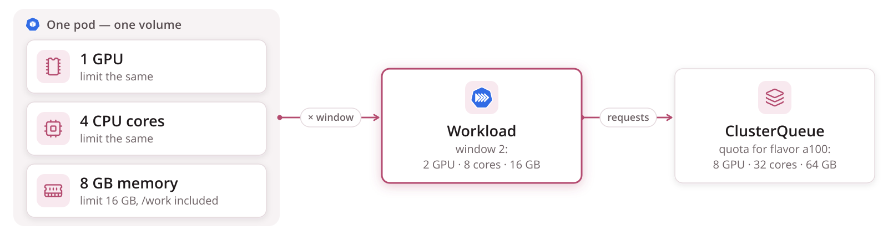

<div class="cols">
<div>

**Per pod, the same every time.** A volume's pod asks for one GPU, four CPU cores and 8 GB of memory, and may grow to 16 GB — the pages waiting in `/work` live in that memory. The numbers are in the Job the converter renders, not in the campaign file.

</div>
<div>

**Per campaign, times the window.** Kueue adds a campaign's pods up and admits it when the ClusterQueue has all of it left, GPU, cores and memory, in one flavor. It counts requests, never limits.

**Here:** the chart's `queue.resources` sets the quota for all three.

</div>
</div>

---

# Cohort

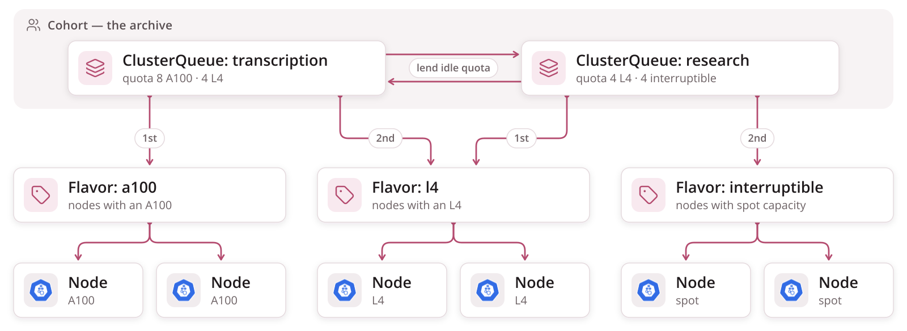

**Pools that lend.** ClusterQueues in one cohort borrow each other's idle quota, within limits each pool sets — a busy team runs on a quiet team's GPUs, and the owner can take them back.

**Here:** one pool, no cohort.

---

# Why Kyverno

<table class="plain">
<tr><td></td><td></td><td><strong>without a rule on the cluster</strong></td><td><strong>with Kyverno</strong></td></tr>
<tr><td class="icon"></td><td>an image by tag</td><td>someone pushes a new build under the same tag, and every later run silently uses other code</td><td>refused unless pinned by digest — the image an ALTO names is the image that ran</td></tr>
<tr><td class="icon"></td><td>a model without a revision</td><td>the author re-uploads it, and the same pipeline gives different text</td><td>refused unless pinned to a commit — a pipeline id keeps meaning one set of weights</td></tr>
<tr><td class="icon"></td><td>an image from anywhere</td><td>a merged file can run any code on our GPUs, with the bucket's credentials</td><td>refused unless it comes from a registry we allow — optionally, signed by our own build</td></tr>
<tr><td class="icon"></td><td>a Job sent by hand</td><td>anything that skips the converter skips its checks</td><td>checked anyway — every object sent to the cluster passes through</td></tr>
</table>

**It enforces good provenance.** When every image is pinned and every model has a revision, what each ALTO says produced it is true — and the cluster enforces that, not every campaigns repository on its own.

---

# Kyverno — how admission works

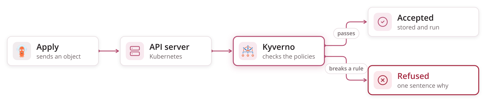

**Every object is checked before it exists** — once the platform turns the rules on, since they ship switched off — and the same rules run in the pull request, so a bad pipeline usually fails there first:

```
models not pinned to a revision: Riksarkivet/yolov9-regions-1
— add revision: <40-character commit hash> under model_settings
(YOLO) or model_settings.model_kwargs (TrOCR and other Hugging Face models)
```

<!--
Kyverno is a dynamic admission controller: the API server calls it for
every create and update it is registered for, and it answers allow or deny.
The campaigns repository's CI runs the Kyverno command-line tool over the
rendered objects, which is why a policy failure normally shows up as a
failed check on the pull request, not at apply.
-->

---

# Kueue

A job queue for Kubernetes. It decides **when** a Job may start, from a counted budget of GPUs.

<div class="cols">
<div>

**Here it:**

* holds a campaign until its GPUs are free
* lets higher priority go first
* pauses and resumes campaigns

</div>
<div>

**It can also:**

* **preemption** — stop lower-priority work to make room
* **fair sharing** — divide idle GPUs by weight between teams

</div>
</div>

**Why:** without it, Kubernetes starts every pod it can, whoever asks first takes every GPU, and the rest pile up half-started.

---

# Kueue — how a campaign gets its GPUs

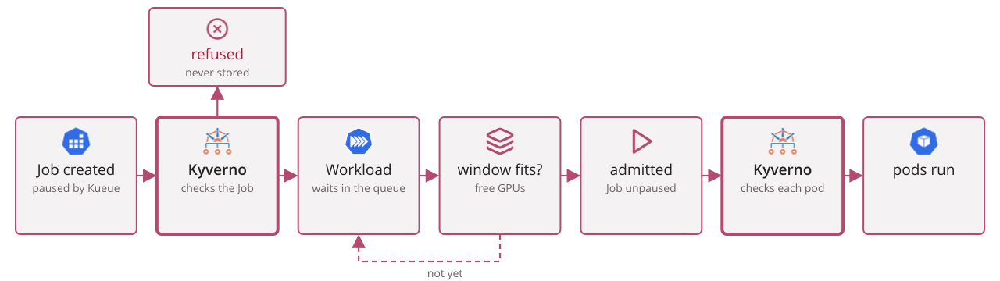

**Kyverno checks twice:** the Job before it is stored, so a bad one never reaches the queue — and each pod after admission, where image signatures can be checked.

<!--
Kubernetes runs mutating webhooks before validating ones: Kueue's webhook
pauses the Job first, then Kyverno validates it. Only a stored Job gets a
Workload. After admission the Job controller creates pods and each pod
goes through Kyverno again. The pods carry the images already checked on
the Job, so this second check rarely refuses anything; when it does, the
campaign is admitted and holds its quota while no pod can start, and the
card shows Running with no pages. The card itself reads Queued while the
Workload waits and Running once it is admitted.
-->

---

# htrflow in a pod

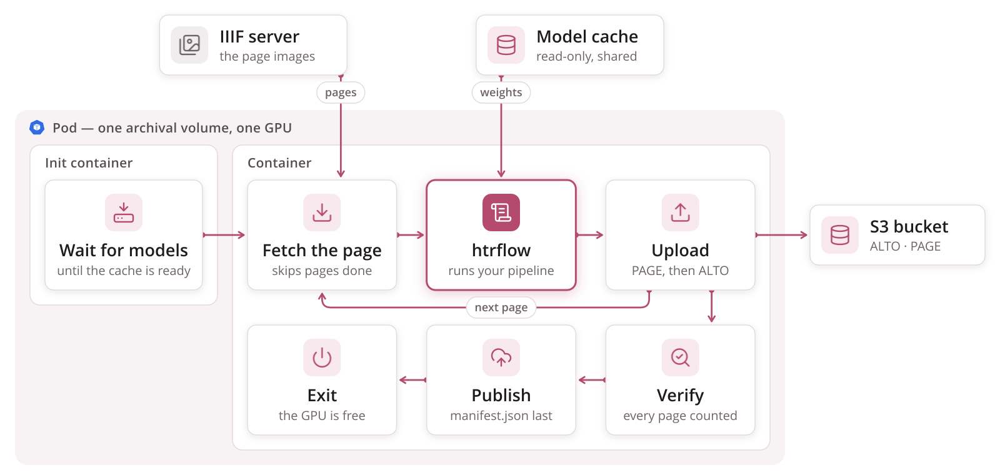

**Every pod runs htrflow** — your pipeline, unchanged — on one archival volume, page by page.

<!--
Why one volume per pod and not one page per pod: the model load. Building
the pipeline takes tens of seconds and a lot of GPU memory; you want to pay
that once per volume, not once per page. And why not ten volumes per pod:
because then a crash costs ten volumes, and the queue cannot count what it
is handing out.
-->

---

# Where a pod runs — the cluster, in one picture

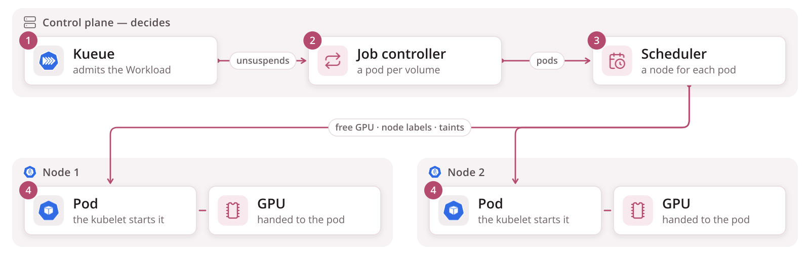

**The control plane decides, the nodes run.** Each pod lands on whichever node has a GPU free — you never name a machine.

<!--
This is the slide for anyone who has run htrflow on one box with one card.
The mental shift is that "the computer" is now a pool: a control plane that
only decides, and nodes that only run. The pod is the unit that moves
between them, and the GPU it needs is what decides where it can go.
-->

---

# A campaign is a list of volumes, and one Job

<div class="cols wide-left">
<div>

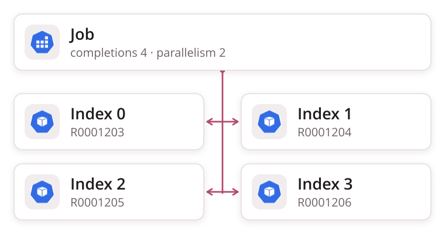

</div>
<div>

<p class="filename">campaigns/demo.yaml</p>

```yaml
pipeline: demo-v1
window: 2          # parallelism
volumes:           # completions = 4
  - R0001203
  - R0001204
  - R0001205
  - R0001206
```

</div>
</div>

* **A Job** is Kubernetes' word for "run this to completion". An *Indexed* Job runs it N times, and hands each pod its number.
* **Pod number 2 reads line 2 of the volume list.** That is the whole trick. No database, no controller of ours, nothing to keep in sync.
* **`parallelism`** is how many run at once. **`completions`** is how many there are — and it is fixed the moment the Job is created.

**One rule to remember:** more volumes means a *new* campaign file. The list a Job was born with is the list it dies with.

<!--
This is the single design decision the rest follows from: a campaign is one
Indexed Job, not one Job per volume and not a custom resource with a
controller. The append-only rule falls straight out of completions being
immutable. Part 2 lists the rule.
-->

---

# `window`: how many volumes at once

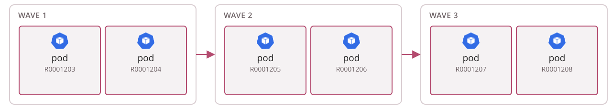

<div class="cols">
<div>

<p class="filename">campaigns/demo.yaml — you set it here, per campaign</p>

```yaml
pipeline: demo-v1
window: 2            # optional; the cluster caps it
volumes:
  - R0001203
  - R0001204
  # … six in all
```

**Six volumes, `window: 2`.** Two pods at once, each on its own GPU; when one finishes, the next volume takes its place. Nobody plans the waves — the Job keeps two indexes busy.

</div>
<div>

**So `window` is the campaign's GPU count** — not the number of volumes, not a speed setting. `window: 1` is fine, and takes six times as long.

**Asked for as a whole, capped by the cluster.** Two GPUs free means it starts; one free means it waits. Above the cap it is clamped; left out, it gets the cap.

**One rule to remember:** `window` changes how *fast* a campaign finishes, never *what* it produces.

</div>
</div>

<!--
Under the hood window is the Job's `parallelism`, and the wave picture is
literal: Kubernetes keeps `parallelism` indexes running and starts the next
index the moment one exits. `completions` (the number of volumes) and
`parallelism` are the two numbers on the Job; only the second is yours to
choose. Partial admission is deliberately off, which is what "asked for as a
whole" means.
-->

---

# When there are not enough GPUs

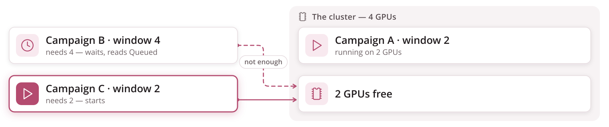

A campaign starts only when **all** the GPUs its window asks for are free. Until then its card reads *Queued* — and a smaller campaign that fits may start before it.

**One rule to remember:** a window larger than the queue's whole GPU quota never starts — the cap in converter.yaml should not be larger than that quota.

<!--
A campaign keeps its GPUs until its last volume is done; nothing already
running is stopped to make room. Part 4 covers the objects behind the quota
and what else the queue can do.

Pausing is also here: suspend: true in the campaign file, and the running
pods are evicted with every finished volume kept.
-->

---

# `priority`: who goes first in the line

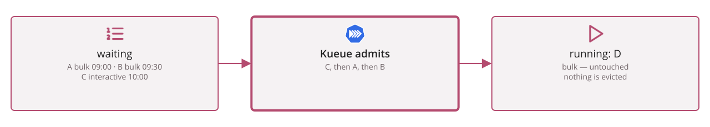

<div class="cols">
<div>

<p class="filename">campaigns/demo.yaml</p>

```yaml
pipeline: demo-v1
priority: htr-interactive   # optional; default is htr-bulk
volumes:
  - R0001203
```

**Three classes ship with the cluster.** `htr-interactive` for a handful of volumes someone is waiting for, `htr-bulk` for the normal campaign, `htr-idle` for work that may wait for the gaps.

</div>
<div>

**Priority orders the queue.** Among the campaigns waiting, the higher class goes first; within a class, the older one. That is all it does.

**It never evicts.** A running campaign keeps its GPUs until its last volume is done, whatever arrives behind it. Preemption is deliberately off.

**One rule to remember:** `priority` decides who is *next*, never who is *stopped*.

</div>
</div>

<!--
The three names live in the platform's chart values and, mirrored, in the
campaigns repo's converter.yaml, so validate can refuse a name the cluster
does not have; a name that reached the cluster anyway would never get a
Workload and never start, with no event saying why. The reason preemption is
off: a campaign admitted as a whole holds a window of GPUs for hours or
weeks, and evicting it to make room throws away partly-done volumes'
slots -- resume would recover the pages, but the queue would thrash.
-->

---

# Results stream into a bucket, and the bucket is the truth

<div class="cols wide-left">
<div>

```
htr-batch/demo-v1/R0001203/
  page/0001.xml       PAGE XML, written first
  alto/0001.xml       ALTO — "this page is done"
  page/0002.xml
  alto/0002.xml
  …
  iiif.json           open it in the viewer, republished every ten pages
  progress.json       pages done and failed, live
  pipeline.yaml       the steps this run used
  manifest.json       written LAST — the only thing that means "done"
```

</div>
<div>

* **Resume is a list operation.** A pod starts by listing its folder. Every page already done is skipped; the rest are fetched.
* **So a crash costs one page.** Kubernetes restarts the pod, it lists, it carries on.
* **Provenance is in the files.** Every ALTO names the image digest and the model revisions; `manifest.json` names every source URL.
* **The pipeline id is in the path.** A better recipe writes beside the old results, never over them.

</div>
</div>

**One rule to remember:** `manifest.json` present means the volume is complete. Everything else is progress.

<!--
The order of writes is the contract: PAGE before ALTO, so an ALTO's presence
means the page is whole; manifest.json last, so its presence means the volume
is whole. The status page reads exactly these files, plus the live Job.

A page that fails deterministically is recorded in manifest.json and the
volume still completes; a page that is MISSING fails the volume, and the
retry redoes only that page. Part 3.
-->

---

# Where the state lives

<table class="plain">
<tr><td></td><td><strong>holds</strong></td><td><strong>if it is lost</strong></td></tr>
<tr><td><strong>git</strong></td><td>what <em>should</em> run: campaign files and pipelines — and an audit trail of who changed what, who approved it, and when</td><td>nothing running stops, nothing new can be asked for — and every clone is a full copy</td></tr>
<tr><td>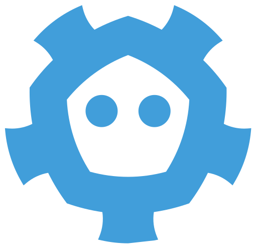<strong>etcd</strong><br/>the cluster's database</td><td>what <em>is</em> running: Jobs, Workloads, the campaign records the status page reads</td><td>rebuilt from git: apply again — campaigns run again, but no page already in the bucket is transcribed again</td></tr>
<tr><td><strong>S3 bucket</strong></td><td>the results: ALTO, PAGE, manifest.json, the run logs</td><td>the transcriptions are gone — only running every campaign again brings them back</td></tr>
</table>

**Only the bucket cannot be rebuilt from the others.** That is where replication and backups matter most.

**Jobs do not stay in etcd.** A finished Job is deleted a week after it ends — its TTL. The campaign's record stays, so the status page still shows it and its results.

<!--
Git is redundant by nature: the hosted repository and every clone hold the
whole history. etcd is the cluster's own datastore; its snapshots are the
cluster's business, but nothing in it is irreplaceable, because git says
what should exist and the bucket says what is already done. The bucket's
durability is entirely its own replication, versioning and backups --
nothing in htrflow-batch copies results anywhere else.
-->

---

# Your interface is git

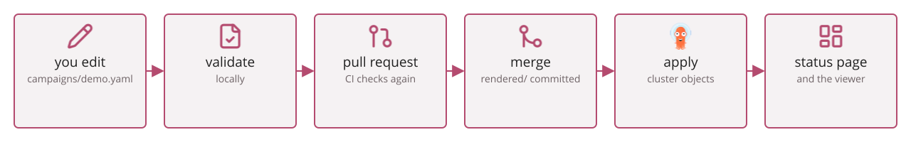

<div class="cols">
<div>

<p class="filename">pipelines/demo-v1.yaml — the htrflow pipeline, plus the image that runs it</p>

```yaml
image: docker.io/riksarkivet/htrflow-batch@sha256:cb30d0…
steps:
  - step: Segmentation
    settings:
      model: yolo
      model_settings:
        model: Riksarkivet/yolov9-regions-1
  # … the rest of the htrflow steps, unchanged
```

**Two files are yours:** the campaign, and the pipeline it names — htrflow's `steps:` plus **which image** runs them, pinned by digest.

</div>
<div>

**Validate needs no cluster.** The same program runs locally and in the pull request, and says one sentence per problem, naming the file.

**Nothing in the cluster reads git.** An `apply` renders the repo into Kubernetes objects and sends them. Delete the file, apply with prune, and the Job is gone; the results in the bucket are not.

**One rule to remember:** a pull request is how work is submitted. If it merged, it will run; the status page tells you when.

</div>
</div>

<!--
This is the slide the data scientist actually needs, and Part 2 is it in
full: the two files, converter.yaml, validate, render, apply, and the rules.
-->

---

# Stop, remove, restart — all in git

<div class="cols three">
<div>

<p class="filename">stop</p>

```yaml
pipeline: demo-v1
suspend: true
volumes:
  - …
```

Running volumes stop, finished ones are kept, the GPUs go back. Delete the line to go on from where it stopped.

</div>
<div>

<p class="filename">remove</p>

```
git rm campaigns/demo.yaml
```

The Job is removed from the cluster. The results in the bucket stay — nothing cleans up S3 for now, so removing results is a manual step.

</div>
<div>

<p class="filename">restart</p>

```
git mv campaigns/demo.yaml \
       campaigns/demo-2.yaml
```

A new name runs the campaign again, and skips every page already in the bucket.

</div>
</div>

**Every one is a pull request** — reviewed and merged like any other change.

<!--
Remove only reaches the cluster when the platform's apply is allowed to
prune; part 2 covers the details. A campaign's volume list cannot change
once it has run, which is why a restart is a new name rather than an edit.
-->

---

# The status page

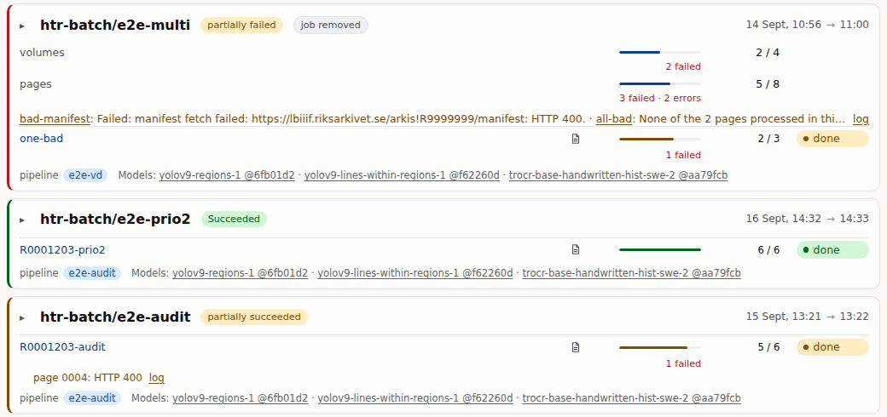

**One card per campaign**, running first, then anything wrong, then finished.

<!--
The page reads the live Jobs and each volume's progress.json, so counts
move while a pod runs. A campaign whose Job has been deleted a week after
it ended is rebuilt from its record and shows "job removed"; its results
and viewer links keep working.
-->

---

# Reading a card

<table class="plain">
<tr><td><strong>header</strong></td><td>the campaign's name, how it stands, and when it was created and finished</td></tr>
<tr><td><strong>state</strong></td><td><em>Queued</em> waiting for GPUs · <em>Running</em> · <em>Paused</em> · <em>Succeeded</em> · <em>partially succeeded</em> some pages lost · <em>partially failed</em> some volumes lost · <em>Failed</em></td></tr>
<tr><td><strong>extra chips</strong></td><td><em>warm-up</em> the models are not ready yet, or failed to load · <em>job removed</em> finished long ago, results still there</td></tr>
<tr><td><strong>totals</strong></td><td>volumes and pages done, with a bar; failures in red under the bar</td></tr>
<tr><td><strong>problems</strong></td><td>one sentence per failed volume, saying why</td></tr>
<tr><td><strong>a volume</strong></td><td>its name opens the viewer · the page icon opens its run log · the braces open its source manifest · its own bar, count and state · a failed page's reason under the row</td></tr>
<tr><td><strong>footer</strong></td><td>the pipeline id and each model with its revision</td></tr>
</table>

---

# The run log

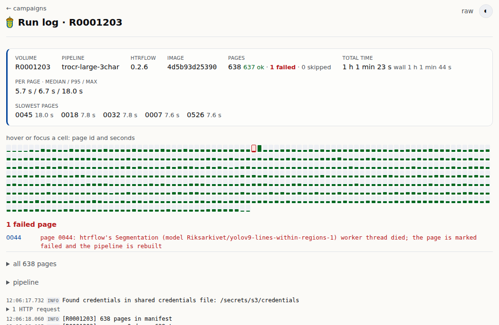

Each volume's log: a summary, one cell per page, the failed pages with their reason, and the log itself — updated while the volume runs, and stored in the S3 bucket beside the results for now.

<!--
Opened from the page icon on a volume's row. The summary names the
pipeline, the htrflow version and the image, the page counts, and per-page
timings with the slowest pages; each cell is a page, green by time or red
for a failure; the log lines below group the HTTP requests so the model
loading and the pages stand out.
-->

---

# The viewer

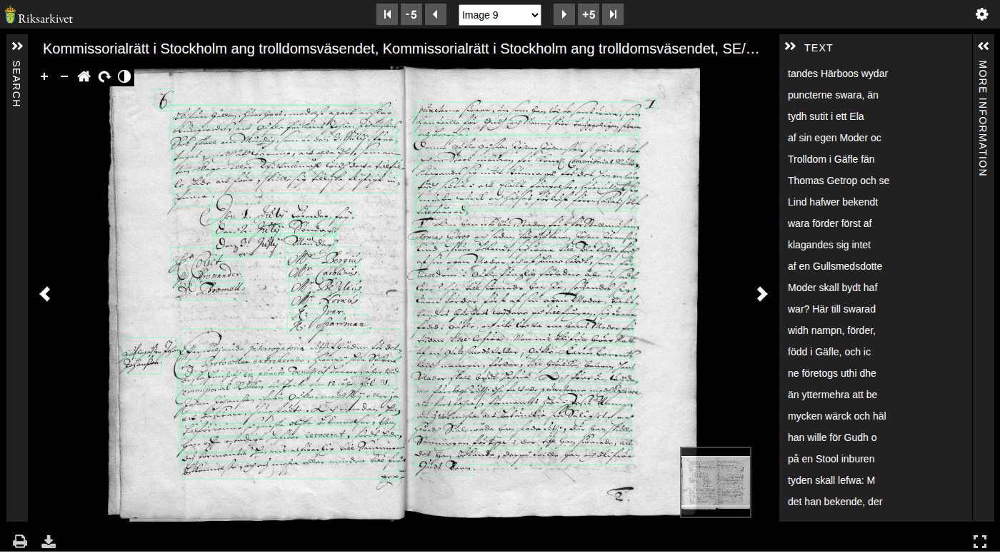

**Riksarkivet's Universal Viewer 4:** the page with every transcribed line outlined, and the text beside it — even while the volume is still running. It ships with the platform's Helm chart, so there is no separate viewer to install.

<!--
The viewer is Riksarkivet's fork of Universal Viewer 4, built into the web
front. It reads the volume's iiif.json, which the wrapper republishes every
ten pages, and each page's ALTO as its text layer, with a clickable
outline for every line on the page image.
-->

---

# Follow one campaign

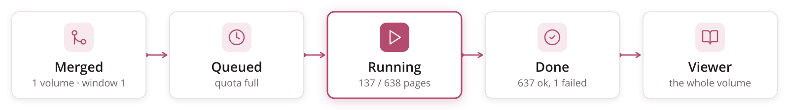

* **Queued.** Another campaign holds the GPUs. The status page shows the campaign with no pod, and says so.
* **Running.** One pod, one GPU. The page count moves every few seconds, and the volume opens in the viewer at page ten.
* **Done, with one failed page.** Page 44 failed and is recorded; the other 637 pages are in the viewer. The card turns amber, not green, and names the page.
* **What you do about page 44:** nothing, or a new campaign later with a fixed image. Its failure is in `manifest.json` and on the card, and the 637 good pages are in the viewer now.

<!--
This is a real run: 638 pages of one volume, about an hour on one GPU with a
large TrOCR model, one page lost to a dead segmentation thread. The two
things to notice: the failure did not cost the volume, and nobody had to
look at a log to learn about it.
-->

---

<!-- _class: lead -->

# Any questions?
