<!-- _class: lead cover -->
<!-- _footer: "Enheten för AI-labb och datatjänster" -->

# Distributed htrflow

## Part 1 of 5 — what changes when your pipeline runs on many nodes

<!--
This is the first of five short lessons. It has no YAML in it beyond one
campaign file, and no Kubernetes vocabulary that is not introduced on the
slide where it is needed. If you know what an htrflow pipeline file does,
you have everything this deck assumes.

The other four: Part 2 is the hands-on lesson, git as the interface. Part 3
is inside one run. Part 4 is the queue. Part 5 is models and signatures.
-->

---

# Start from how htrflow works

<div class="cols">
<div>

<p class="filename">pipeline.yaml — an htrflow pipeline, unchanged</p>

```yaml
steps:
  - step: Segmentation
    settings:
      model: yolo
      model_settings:
        model: Riksarkivet/yolov9-regions-1
  - step: Segmentation
    settings:
      model: yolo
      model_settings:
        model: Riksarkivet/yolov9-lines-within-regions-1
  - step: TextRecognition
    settings:
      model: TrOCR
      model_settings:
        model: Riksarkivet/trocr-base-handwritten-hist-swe-2
```

</div>
<div>

```
htrflow pipeline pipeline.yaml images/
```

One folder of page images in, one folder of ALTO and PAGE out, on one GPU.

</div>
</div>

<!--
The point to land before anything else: nobody has to learn a new pipeline
format. The rest of the deck is about the folder and the GPU, not about the
steps.
-->

---

# From one machine to many

<table class="plain">
<tr><td></td><td><strong>one machine</strong></td><td><strong>many nodes</strong></td></tr>
<tr><td>where it runs</td><td>your machine, its GPU</td><td>whichever node has a GPU free — chosen for you</td></tr>
<tr><td>the pages</td><td>a folder on its disk</td><td>fetched over the web — from a IIIF manifest or plain image URLs — by whichever node runs the volume</td></tr>
<tr><td>the models</td><td>downloaded to that disk</td><td>a shared cache every node mounts</td></tr>
<tr><td>the results</td><td>a folder next to the pages</td><td>a bucket every node writes to and every browser reads from</td></tr>
<tr><td>when a machine fails</td><td>you start again</td><td>the volume restarts on another node and resumes from the bucket</td></tr>
<tr><td>how you start it</td><td>a command on that machine</td><td>a file in git — you never name a machine</td></tr>
</table>

<p class="note"><strong>"Volume" here is an archival volume</strong> — a bound unit of pages with a reference code such as R0001203, the batch one run works through — never a Kubernetes volume, which is a disk.</p>

<!--
Read the right-hand column as the requirements the rest of the deck meets:
nothing may live on one node's disk, because the next attempt may run on
another. So pages come from a server, models from a shared cache, results
go to a shared bucket, and the request is a file, not a command. Say the volume
sentence out loud, because the word collides with Kubernetes storage.
-->

---

# The campaign file

<div class="cols">
<div>

<p class="filename">campaigns/kyrkobocker-1.yaml</p>

```yaml
pipeline: demo-v1
window: 2
priority: htr-bulk
volumes:
  - R0001203
  - R0001204
  - R0001205
```

</div>
<div>

**This is how you ask for a run.** One file per campaign, in git.

* **pipeline** — which htrflow pipeline to run
* **volumes** — the archival volumes to run it on
* **window** — how many volumes at once, so how many GPUs
* **priority** — who goes first when campaigns wait

</div>
</div>

<!--
The next slides take this file apart: the pipeline file it names, what a
volume can be, the window, and priority. Only pipeline and volumes are
required.
-->

---

# Rough architecture

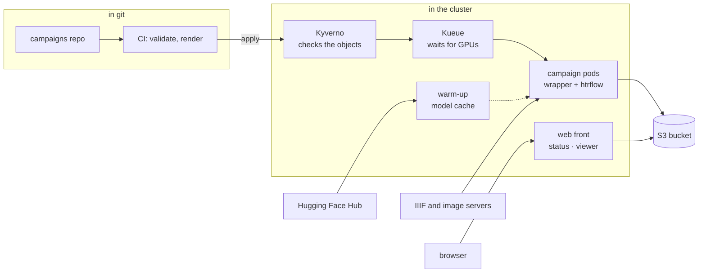

You change files in git; `apply` sends the change to the cluster; the pods write results to the bucket, where the status page and the viewer read them.

<!--
Read it left to right as the life of a campaign: written in git, checked by
Kyverno, queued by Kueue, run as one pod per volume, results in the bucket,
watched through the web front. The warm-up is the one pod that talks to the
Hub, and the web front is the one pod a browser talks to.
-->

---

# Kyverno and Kueue

<div class="cols">
<div>

## Kyverno — admission

A policy engine for Kubernetes. Every object sent to the cluster is checked against rules before it is accepted.

**Here it refuses:**

* an image from a registry we do not allow
* an image not pinned by digest
* a model not pinned to a revision
* optionally, an image not signed by our build

</div>
<div>

## Kueue — the queue

A job queue for Kubernetes. It decides *when* a Job may start, from a counted budget of GPUs.

**Here it:**

* holds a campaign until its GPUs are free
* lets higher priority go first
* pauses and resumes campaigns

Part 4 is all about what else it can do.

</div>
</div>

<!--
Both are open-source Kubernetes projects installed once on the cluster by
whoever runs the platform. Neither knows anything about HTR: Kyverno sees
Kubernetes objects and their fields, Kueue sees resource requests and a
queue name.
-->

---

# Kyverno — how admission works

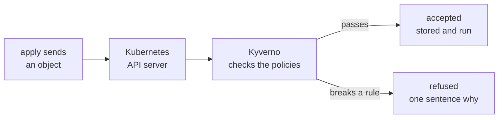

**Every object is checked before it exists.** A Job, a pod or a pipeline's ConfigMap that breaks a rule is never stored, so it never runs. The same policies run in the pull request, so a bad pipeline usually fails there first.

<!--
Kyverno is a dynamic admission controller: the API server calls it for
every create and update it is registered for, and it answers allow or deny.
The campaigns repository's CI runs the Kyverno command-line tool over the
rendered objects, which is why a policy failure normally shows up as a
failed check on the pull request, not at apply.
-->

---

# Kyverno — the rules here

<table class="plain">
<tr><td><strong>allowed images</strong></td><td>Jobs and pods may only run images from the registries the platform names</td></tr>
<tr><td><strong>pinned images</strong></td><td>every image must be pinned by digest, never by a tag that can move</td></tr>
<tr><td><strong>pinned models</strong></td><td>every model in a pipeline must name a commit revision</td></tr>
<tr><td><strong>signed images</strong></td><td>optional: a pod's image must be signed by our own build</td></tr>
<tr><td><strong>platform identities</strong></td><td>the status page may only write status records; apply may only delete what it created</td></tr>
</table>

<p class="filename">what a refusal looks like</p>

```
models not pinned to a revision: Riksarkivet/yolov9-regions-1
— add revision: <40-character commit hash> under model_settings
```

<!--
All rules are in Enforce mode. They ship with the platform's chart and are
off by default, turned on per cluster once Kyverno is installed: a policy
nothing reconciles is worse than none.
-->

---

# Kyverno — what else it can do

<table class="plain">
<tr><td><strong>validate</strong></td><td>refuse objects that break a rule</td><td>in use</td></tr>
<tr><td><strong>verify images</strong></td><td>refuse images without a valid signature, or without a signed SBOM or provenance record</td><td>available</td></tr>
<tr><td><strong>mutate</strong></td><td>change objects on the way in — add a label, a default, a security setting</td><td>not used</td></tr>
<tr><td><strong>generate</strong></td><td>create objects automatically — a network policy or a quota for every new team namespace</td><td>not used</td></tr>
<tr><td><strong>cleanup</strong></td><td>delete objects that match a rule, on a schedule</td><td>not used</td></tr>
<tr><td><strong>audit and report</strong></td><td>warn instead of refuse, and report what already breaks a rule</td><td>available</td></tr>
</table>

**Generate is the one to watch:** with a namespace per team, it could give every new team its queue, quota and network rules without anyone writing them by hand.

<!--
Rule types from Kyverno's own documentation: validate, mutate, generate,
verify images and cleanup, with policy reports for audit mode and
background scans of objects that already exist.
-->

---

# Kueue — how a campaign gets its GPUs

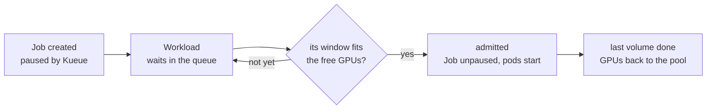

**The card follows it:** *Queued* while the Workload waits, *Running* once it is admitted, and a finished state when the last volume is done.

<!--
Kueue suspends every Job that carries its queue label the moment it is
created, so nothing starts before Kueue has seen it. Admission is once per
campaign; after that Kubernetes starts the next volume as each one ends,
without asking Kueue again.
-->

---

# A run is one archival volume in one pod

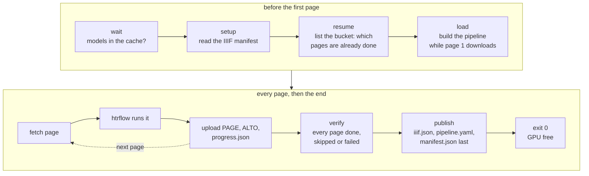

**One pod per archival volume**, holding its GPU from the first page to the last — and freeing it the moment it exits.

<!--
Why one volume per pod and not one page per pod: the model load. Building
the pipeline takes tens of seconds and a lot of GPU memory; you want to pay
that once per volume, not once per page. And why not ten volumes per pod:
because then a crash costs ten volumes, and the queue cannot count what it
is handing out.

The three exits: 0 means done (with any failed pages recorded); 13 means
"a retry cannot fix this" (bad manifest URL, unknown model) and the index
is failed at once; 1 means transient (a 5xx, a network error) and
Kubernetes restarts the pod, which then resumes from the bucket -- the
resume stage is why a restart costs one page, not a volume.
-->

---

# Where a pod runs — the cluster, in one picture

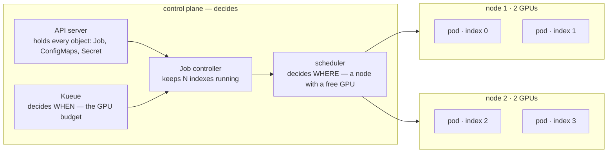

**The control plane decides, the nodes run.** Each pod lands on whichever node has a GPU free — you never name a machine.

<!--
This is the slide for anyone who has run htrflow on one box with one card.
The mental shift is that "the computer" is now a pool: a control plane that
only decides, and nodes that only run. The pod is the unit that moves
between them, and the GPU it needs is what decides where it can go. Part 4
returns to the two deciders — Kueue for when, the scheduler for where.
-->

---

# What is inside what

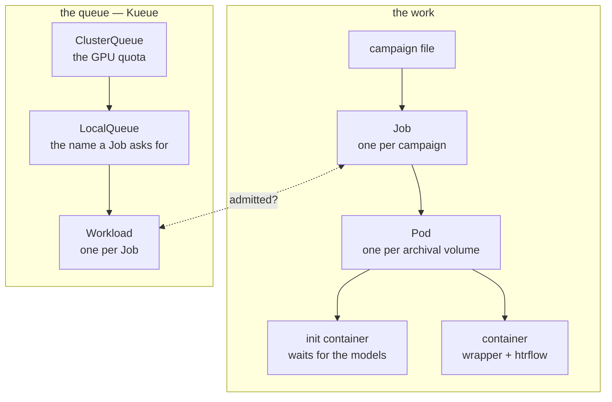

**The two meet at the Workload:** Kueue admits a Job's Workload, and only then does the Job create its pods.

<!--
A container is the running program; a pod is one or more containers that
share a machine, disk and network; a Job makes pods until its work is done.
Kueue never touches pods: it makes one Workload per Job, holds it until the
Job's window fits the ClusterQueue's quota, and lets the Job go. The
LocalQueue is the name a Job carries in its queue label, and converter.yaml
sets it for every campaign.
-->

---

# A campaign is a list of volumes, and one Job

<div class="cols wide-left">
<div>

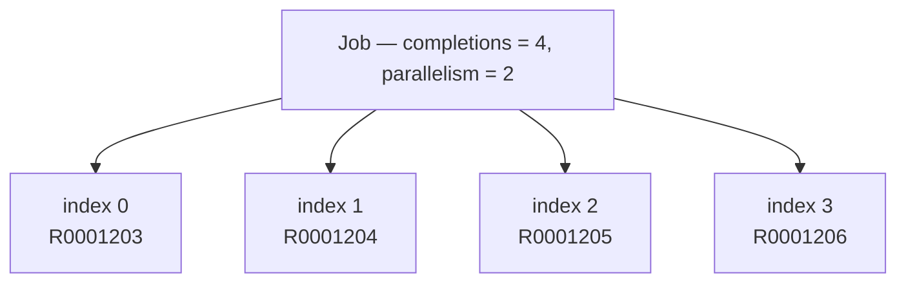

</div>
<div>

<p class="filename">campaigns/demo.yaml</p>

```yaml
pipeline: demo-v1
window: 2          # parallelism
volumes:           # completions = 4
  - R0001203
  - R0001204
  - R0001205
  - R0001206
```

</div>
</div>

* **A Job** is Kubernetes' word for "run this to completion". An *Indexed* Job runs it N times, and hands each pod its number.
* **Pod number 2 reads line 2 of the volume list.** That is the whole trick. No database, no controller of ours, nothing to keep in sync.
* **`parallelism`** is how many run at once. **`completions`** is how many there are — and it is fixed the moment the Job is created.

**One rule to remember:** more volumes means a *new* campaign file. The list a Job was born with is the list it dies with.

<!--
This is the single design decision the rest follows from: a campaign is one
Indexed Job, not one Job per volume and not a custom resource with a
controller. The append-only rule falls straight out of completions being
immutable. Part 2 shows what the validator says when someone tries anyway.
-->

---

# What a volume can be

<div class="cols wide-left">
<div>

<p class="filename">campaigns/demo.yaml — the same list, three ways of naming a volume</p>

```yaml
pipeline: demo-v1
volumes:
  - R0001203                                  # 1. a reference code
  - id: loc-mal2459400                        # 2. a IIIF manifest
    manifest: https://www.loc.gov/item/mal2459400/manifest.json
  - id: six-pages                             # 3. bare image URLs
    images:
      - https://example.org/scan-0001.jpg
      - https://example.org/scan-0002.jpg
```

</div>
<div>

* **A reference code** is expanded to a manifest URL by a template the cluster owns. Most volumes are this.
* **A manifest URL** is fetched as it is — v2 or v3, any server.
* **A list of image URLs has no manifest, so the wrapper writes one.** It publishes a *synthetic* IIIF manifest to the bucket first, then runs exactly as for the other two.

</div>
</div>

**Why the third form matters:** six images are a whole campaign that runs the entire path — queue, pod, bucket, viewer — in about a minute. That is how you prove a new pipeline before running it on real volumes, and how a page from anywhere on the web gets transcribed without a IIIF server in front of it.

<!--
The synthetic manifest lands under sources/ in the bucket and is what the
viewer opens; the wrapper treats it like any other manifest afterwards, so
resume and verify work the same way. One caveat worth saying aloud: every
URL a campaign names is stored verbatim in git, in the cluster and in the
results; a presigned URL publishes its signature.
-->

---

# `window`: how many volumes at once

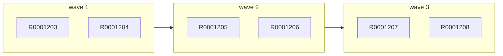

<div class="cols">
<div>

<p class="filename">campaigns/demo.yaml — you set it here, per campaign</p>

```yaml
pipeline: demo-v1
window: 2            # optional; the cluster caps it
volumes:
  - R0001203
  - R0001204
  # … six in all
```

**Six volumes, `window: 2`.** Two pods at once, each on its own GPU; when one finishes, the next volume takes its place. Nobody plans the waves — the Job keeps two indexes busy.

</div>
<div>

**So `window` is the campaign's GPU count** — not the number of volumes, not a speed setting. `window: 1` is fine, and takes six times as long.

**Asked for as a whole, capped by the cluster.** Two GPUs free means it starts; one free means it waits. Above the cap it is clamped; left out, it gets the cap.

**One rule to remember:** `window` changes how *fast* a campaign finishes, never *what* it produces.

</div>
</div>

<!--
Under the hood window is the Job's `parallelism`, and the wave picture is
literal: Kubernetes keeps `parallelism` indexes running and starts the next
index the moment one exits. `completions` (the number of volumes) and
`parallelism` are the two numbers on the Job; only the second is yours to
choose. Partial admission is deliberately off, which is what "asked for as a
whole" means.
-->

---

# GPUs are a budget, so campaigns queue

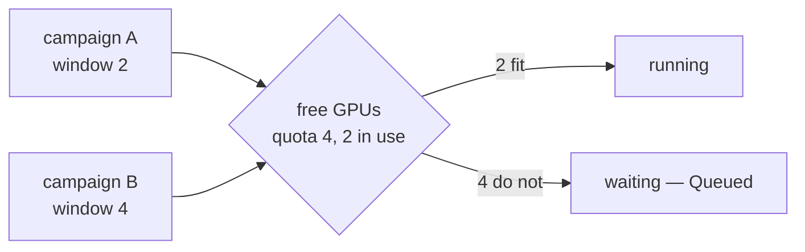

<div class="cols">
<div>

**The doorman is Kueue.** It knows one thing about your campaign: its `window`. If that many GPUs are free, the campaign starts. If not, it waits — and a smaller campaign behind it may go first.

**Once in, you stay in.** A campaign keeps its GPUs until its last volume is done. Nothing jumps the line, and nothing is evicted to make room.

</div>
<div>

**"Queued" means exactly this.** The Job exists, no pod has started, and the reason is the number on the left against the number in the middle.

**One rule to remember:** a `window` bigger than the cluster's whole quota reads *Queued* for ever. That is the most common reason a campaign "does not start".

</div>
</div>

<!--
Kueue decides WHEN, Kubernetes decides WHERE. Kueue never picks a node and
never sees a page. It is an admission controller with a counted quota, and
campaigns are Workloads to it. Part 4 is entirely about this slide: the
objects behind the quota, and what "Queued" can mean.

Pausing is also here: suspend: true in the campaign file, and the running
pods are evicted with every finished volume kept.
-->

---

# `priority`: who goes first in the line

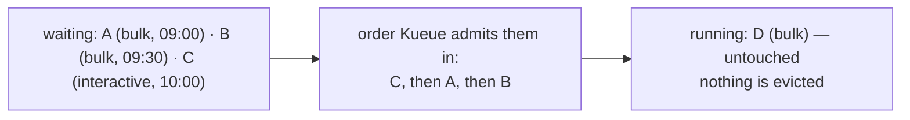

<div class="cols">
<div>

<p class="filename">campaigns/demo.yaml</p>

```yaml
pipeline: demo-v1
priority: htr-interactive   # optional; default is htr-bulk
volumes:
  - R0001203
```

**Three classes ship with the cluster.** `htr-interactive` for a handful of volumes someone is waiting for, `htr-bulk` for the normal campaign, `htr-idle` for work that may wait for the gaps.

</div>
<div>

**Priority orders the queue.** Among the campaigns waiting, the higher class goes first; within a class, the older one. That is all it does.

**It never evicts.** A running campaign keeps its GPUs until its last volume is done, whatever arrives behind it. Preemption is deliberately off.

**One rule to remember:** `priority` decides who is *next*, never who is *stopped*. `validate` refuses a name the cluster does not offer — the cluster itself would leave such a campaign *Queued* for ever, silently.

</div>
</div>

<!--
The three names live in the platform's chart values and, mirrored, in the
campaigns repo's converter.yaml, so validate can refuse a name the cluster
does not have; a name that reached the cluster anyway would never get a
Workload and never start, with no event saying why. The reason preemption is
off: a campaign admitted as a whole holds a window of GPUs for hours or
weeks, and evicting it to make room throws away partly-done volumes'
slots -- resume would recover the pages, but the queue would thrash.
-->

---

# Results stream into a bucket, and the bucket is the truth

<div class="cols wide-left">
<div>

```
htr-batch/demo-v1/R0001203/
  page/0001.xml       PAGE XML, written first
  alto/0001.xml       ALTO — "this page is done"
  page/0002.xml
  alto/0002.xml
  …
  iiif.json           open it in the viewer, republished every ten pages
  progress.json       pages done and failed, live
  pipeline.yaml       the steps this run used
  manifest.json       written LAST — the only thing that means "done"
```

</div>
<div>

* **Resume is a list operation.** A pod starts by listing its folder. Every page with an ALTO is skipped; the rest are fetched.
* **So a crash costs one page.** Kubernetes restarts the pod, it lists, it carries on.
* **Provenance is in the files.** Every ALTO names the image digest and the model revisions; `manifest.json` names every source URL.
* **The pipeline id is in the path.** A better recipe writes beside the old results, never over them.

</div>
</div>

**One rule to remember:** `manifest.json` present means the volume is complete. Everything else is progress.

<!--
The order of writes is the contract: PAGE before ALTO, so an ALTO's presence
means the page is whole; manifest.json last, so its presence means the volume
is whole. The status page reads exactly these files, plus the live Job.

A page that fails deterministically is recorded in manifest.json and the
volume still completes; a page that is MISSING fails the volume, and the
retry redoes only that page. Part 3.
-->

---

# Your interface is git

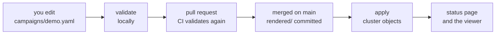

<div class="cols">
<div>

<p class="filename">pipelines/demo-v1.yaml — the htrflow pipeline, plus the image that runs it</p>

```yaml
image: docker.io/riksarkivet/htrflow-batch@sha256:cb30d0…
steps:
  - step: Segmentation
    settings:
      model: yolo
      model_settings:
        model: Riksarkivet/yolov9-regions-1
  # … the rest of the htrflow steps, unchanged
```

**Two files are yours:** the campaign, and the pipeline it names. The pipeline file is the `steps:` document with one line above it: **which image** runs those steps — htrflow plus the wrapper, pinned by digest so the same id always means the same code.

</div>
<div>

**Validate needs no cluster.** The same program runs locally and in the pull request, and says one sentence per problem, naming the file.

**Nothing in the cluster reads git.** An `apply` renders the repo into Kubernetes objects and sends them. Delete the file, apply with prune, and the Job is gone; the results in the bucket are not.

**One rule to remember:** a pull request is how work is submitted. If it merged, it will run; the status page tells you when.

</div>
</div>

<!--
This is the slide the data scientist actually needs, and Part 2 is it in
full: the two files, converter.yaml, validate, render, apply, the status
page, and the rules the validator enforces.
-->

---

# What it is made of

<div class="cols">
<div>

<p class="filename">ours — in the htrflow-batch repository</p>

<table class="plain">
<tr><td><strong>wrapper</strong></td><td>runs in every campaign pod: fetch, htrflow, upload, verify</td></tr>
<tr><td><strong>converter</strong></td><td>the <code>htrflow-campaigns</code> tool: init, validate, render, apply — runs locally and in CI, never in the cluster</td></tr>
<tr><td><strong>web</strong></td><td>one process: the read API, the status page and the Universal Viewer</td></tr>
<tr><td><strong>status page</strong></td><td>the browser app the web front serves</td></tr>
<tr><td><strong>charts</strong></td><td>install the platform — queue, model cache, web front, policies, network rules — and, for development only, an S3 store and a registry</td></tr>
</table>

</div>
<div>

<p class="filename">what it stands on</p>

<table class="plain">
<tr><td><strong>Kubernetes</strong></td><td>runs the pods; its Indexed Jobs are the campaigns</td></tr>
<tr><td><strong>Kueue</strong></td><td>the queue and the GPU quota — part 4</td></tr>
<tr><td><strong>Kyverno</strong></td><td>admission policies: allowed image registries, digests, model revisions, signatures</td></tr>
<tr><td><strong>NVIDIA GPU stack</strong></td><td>driver, container runtime and device plugin, so a pod can have a GPU</td></tr>
<tr><td><strong>an S3 store</strong></td><td>the results bucket — the only durable state</td></tr>
<tr><td><strong>a registry</strong></td><td>where the two images live, signed</td></tr>
<tr><td><strong>Argo CD</strong></td><td>optional: applies <code>rendered/</code> from git instead of a person</td></tr>
</table>

</div>
</div>

<!--
Two images: htrflow-batch (the wrapper on top of htrflow's own image) and
htrflow-web (the read API, status page and viewer). No database, no
controller or custom resource of our own: the campaign is a plain Job.
-->

---

# The status page


**One card per campaign**, running first, then anything wrong, then finished.

<!--
The page reads the live Jobs and each volume's progress.json, so counts
move while a pod runs. A campaign whose Job has been deleted a week after
it ended is rebuilt from its record and shows "job removed"; its results
and viewer links keep working.
-->

---

# Reading a card

<table class="plain">
<tr><td><strong>header</strong></td><td>the campaign's name, how it stands, and when it was created and finished</td></tr>
<tr><td><strong>state</strong></td><td><em>Queued</em> waiting for GPUs · <em>Running</em> · <em>Paused</em> · <em>Succeeded</em> · <em>partially succeeded</em> some pages lost · <em>partially failed</em> some volumes lost · <em>Failed</em></td></tr>
<tr><td><strong>extra chips</strong></td><td><em>warm-up</em> the models are not ready yet, or failed to load · <em>job removed</em> finished long ago, results still there</td></tr>
<tr><td><strong>totals</strong></td><td>volumes and pages done, with a bar; failures in red under the bar</td></tr>
<tr><td><strong>problems</strong></td><td>one sentence per failed volume, saying why</td></tr>
<tr><td><strong>a volume</strong></td><td>its name opens the viewer · the page icon opens its run log · the braces open its IIIF manifest · its own bar, count and state · a failed page's reason under the row</td></tr>
<tr><td><strong>footer</strong></td><td>the pipeline id and each model with its revision</td></tr>
</table>

---

# The run log


Each volume's log: a summary, one cell per page, the failed pages with their reason, and the log itself — updated while the volume runs.

<!--
Opened from the page icon on a volume's row. The summary names the
pipeline, the htrflow version and the image, the page counts, and per-page
timings with the slowest pages; each cell is a page, green by time or red
for a failure; the log lines below group the HTTP requests so the model
loading and the pages stand out.
-->

---

# The viewer


**Riksarkivet's Universal Viewer 4:** the page with every transcribed line outlined, and the text beside it — even while the volume is still running.

<!--
The viewer is Riksarkivet's fork of Universal Viewer 4, built into the web
front. It reads the volume's iiif.json, which the wrapper republishes every
ten pages, and each page's ALTO as its text layer, with a clickable
outline for every line on the page image.
-->

---

# Follow one campaign

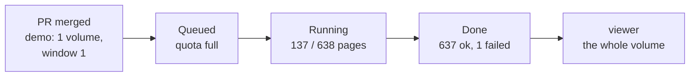

* **Queued.** Another campaign holds the GPUs. The status page shows the campaign with no pod, and says so.
* **Running.** One pod, one GPU. The page count moves every few seconds, and the volume opens in the viewer at page ten.
* **Done, with one failed page.** Page 44 broke a model worker thread; the wrapper caught it, marked the page failed, rebuilt the pipeline and finished the other 637. The card turns amber, not green, and names the page.
* **What you do about page 44:** nothing, or a new campaign later with a fixed image. Its failure is in `manifest.json` and on the card, and the 637 good pages are in the viewer now.

<!--
This is a real run: 638 pages of one volume, about an hour on one GPU with a
large TrOCR model, one page lost to a dead segmentation thread. The two
things to notice: the failure did not cost the volume, and nobody had to
look at a log to learn about it.
-->

---

# Next

<p class="note"><strong>Part 2, <em>Your interface is git</em>:</strong> the two files field by field, validate locally, and a throwaway campaign of six images that runs the whole path in a minute.</p>

**ai-riksarkivet.github.io/htrflow-batch** — start with *Run a Campaign*.

<!--
The docs page "Run a Campaign" is the written form of Part 2. "From Image to
Transcription" is Part 3. "Queueing" is Part 4.
-->

---

<!-- _class: lead -->

# Any questions?
