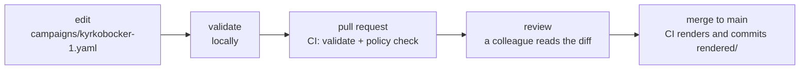
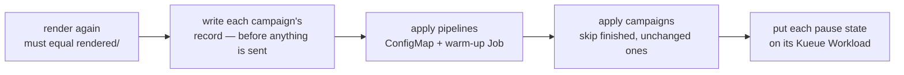
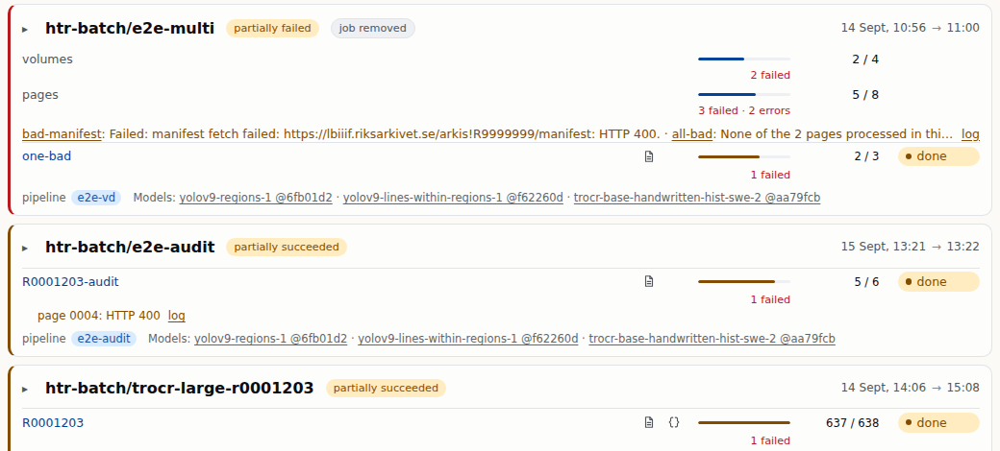

<!-- _class: lead cover -->
<!-- _footer: "Enheten för AI-labb och datatjänster" -->

# Your interface is git

## Part 2 of 5 — two files, a validator that runs locally, and a pull request that becomes a running campaign

<!--
Part 1 gave the picture: a pod per volume, one Job per campaign, the queue,
the bucket, git. This part is the hands-on lesson: what you actually type,
what the validator says back, and what happens after you press merge.

Bring a terminal. Everything up to "apply" runs locally with no cluster.
-->

---

# The repository you get

<div class="cols wide-left">
<div>

```
uvx --from "git+https://github.com/AI-Riksarkivet/\
htrflow-batch@<ref>#subdirectory=packages/converter" \
  htrflow-campaigns init my-campaigns
```

```
my-campaigns/
  converter.yaml                 the cluster's facts — set once, by whoever runs it
  pipelines/<id>.yaml            a recipe: one image digest + the htrflow steps
  campaigns/<name>.yaml          work: one pipeline id + a list of volumes
  rendered/                      Kubernetes objects, written by CI on main
  .github/workflows/render.yml   validate on a pull request, render on main
  README.md                      the two rules: append-only, pause and cancel in git
```

</div>
<div>

**Three owners.** `converter.yaml` belongs to the cluster. `pipelines/` and `campaigns/` belong to you. `rendered/` belongs to CI — nobody edits it by hand.

**One program, three verbs.** `validate`, `render`, `apply`. The first two need no cluster at all; the third is the only one that talks to Kubernetes.

<p class="note">Write access here decides which image and which models run with the bucket's credentials — it is reviewed like code because it is the deployment.</p>

</div>
</div>

<!--
`<ref>` is a release tag, a commit SHA or a branch. If uvx cannot resolve
the subdirectory URL, clone the repo and `uv tool install
./htrflow-batch/packages/converter` once.

The converter is a plain Python package. It never runs inside the cluster,
and nothing in the cluster holds a credential for this repository.
-->

---

# `converter.yaml` — what the cluster already is

<div class="dense">

```
namespace: htr-batch                 # where campaigns are applied — and pruned
queue: htr-batch                     # the Kueue LocalQueue every Job labels itself with
s3_secret: htr-batch-s3              # the Secret with the results bucket's credentials
data_pvc: htr-test-data              # the model cache, read-only in every pod
runtime_class: nvidia                # how a pod gets a GPU
hf_token_secret: ""                  # optional: a Secret for a private or gated Hub model

window: 20                           # the cap a campaign's own window is clamped to
priority_classes: [htr-interactive, htr-bulk, htr-idle]   # the names a campaign may ask for
source_template: "https://<iiif-host>/<path>/{ref}/manifest"   # what a bare volume id expands to
public_results_base: ""              # where results are served from — the status page needs it
ttl_seconds_after_finished: 604800   # a week the finished Job stays readable
```

</div>

<div class="cols">
<div>

**You read it, you rarely write it.** The first block names objects the platform release already created; every value must agree with the chart, and `validate` refuses a repo without the file rather than guessing a namespace to prune in.

</div>
<div>

**The two lines that matter to you:** `window`, the most GPUs any campaign here may hold, and `source_template`, which is why a campaign can say `R0001203` instead of a URL.

</div>
</div>

<!--
Every value shown is the shipped default. Unknown keys are rejected, so a
typo becomes a validation error naming the key, not a setting that silently
does nothing. The image allow-list and the model-revision rule are
deliberately NOT here: both are cluster policies, re-run over rendered/ in
CI.
-->

---

# A pipeline file — a recipe with a permanent name

<div class="cols wide-left">
<div>

<p class="filename">pipelines/demo-v1.yaml</p>

```yaml
image: docker.io/riksarkivet/htrflow-batch@sha256:cb30d0…
steps:
  - step: Segmentation
    settings:
      model: yolo
      model_settings:
        model: Riksarkivet/yolov9-regions-1
        revision: 6fb01d2…                  # a commit hash, not a branch
  - step: Segmentation
    settings:
      model: yolo
      model_settings:
        model: Riksarkivet/yolov9-lines-within-regions-1
        revision: f62260d…
  - step: TextRecognition
    settings:
      model: TrOCR
      model_settings:
        model: Riksarkivet/trocr-base-handwritten-hist-swe-2
        model_kwargs:
          revision: aa79fcb…
```

</div>
<div>

* **The steps are htrflow's, verbatim.** No export step — the platform appends ALTO and PAGE itself.
* **The image is pinned by digest, every model by revision** — top-level for YOLO, under `model_kwargs` for Hub models.
* **Two layers check it.** `validate` checks the shape: digest format, steps, no export step, no unknown keys. The cluster's policies check the rules — allowed repository, digest, a revision on every model — at admission and in the pull request.
* **The id is the recipe's name for ever.** A better recipe is a new file: `demo-v2`.

</div>
</div>

<!--
Where the digest comes from: the release notes, or `docker buildx
imagetools inspect docker.io/riksarkivet/htrflow-batch:<tag>`. Where the
revision comes from: the model's commit list on the Hub.

The "new file for a new recipe" rule is enforced only while a campaign
still names the old one -- next slides. The rest is discipline.
-->

---

# A campaign file — what to run, on what

<div class="cols">
<div>

<p class="filename">campaigns/kyrkobocker-1.yaml</p>

```yaml
pipeline: demo-v1
window: 4                # at most 4 volumes at once — 4 GPUs
priority: htr-bulk       # who goes first in the queue; never evicts
volumes:
  - R0001203             # a reference code: source_template expands it
  - R0001204
  - id: loc-mal2459400   # any IIIF manifest, v2 or v3
    manifest: https://www.loc.gov/item/mal2459400/manifest.json
  - id: loose-scans      # bare image URLs: the wrapper writes the manifest
    images:
      - https://example.org/scan-0001.jpg
      - https://example.org/scan-0002.jpg
# suspend: true          # pause — a git change, like everything else
```

</div>
<div>

* **One pipeline id.** A campaign runs one recipe. Two recipes are two campaigns.
* **Volumes, three ways.** A reference code, a manifest URL, or image URLs. Ids are label-safe and unique.
* **`window` and `priority` are optional.** The window is clamped to the cluster's cap; the priority names one of the classes listed in converter.yaml.
* **The file's name is the campaign's name** everywhere.
* **Every URL is stored verbatim** in four places; a presigned URL publishes its signature.

</div>
</div>

<!--
"kyrkobocker-1": the "-1" is a habit worth teaching now, because the next
batch of volumes for the same series will be "kyrkobocker-2" -- campaigns
are append-only, so the number is how a series grows.
-->

---

# Validate locally

```
uvx --from "git+https://github.com/AI-Riksarkivet/htrflow-batch@<ref>#subdirectory=packages/converter" \
  htrflow-campaigns validate .
```

<div class="cols">
<div>

**No cluster, no credentials, a second or two.** It parses every file, checks every rule, and prints one sentence per problem, naming the file — the same program CI runs on the pull request, so what passes here passes there.

**What it says when something is wrong:**

```
campaigns/kyrkobocker-1.yaml: "window" must be a whole number
  of 1 or more (got "5" — quotes make it text)
campaigns/kyrkobocker-1.yaml: volume loose-scans: image 2
  must be an http(s) URL
campaigns/kyrkobocker-1.yaml: duplicate volume id R0001203
```

</div>
<div>

**The rules it enforces:**

* `pipeline:` names a file in `pipelines/`; at least one volume
* every `manifest:` and `images:` entry is an absolute `http(s)` URL with no whitespace
* volume ids are label-safe and unique
* `window` is a positive whole number; `priority` is one of converter.yaml's classes
* **a campaign already rendered cannot change its volume list** — append-only
* **a pipeline a rendered campaign names cannot change** — immutable while referenced
* over 10 000 volumes, or a huge list, is split into `-part1`, `-part2`, … for you

</div>
</div>

<!--
The last two rules are the ones people meet in week one, and both come from
Kubernetes facts: a Job's completions cannot change after creation, and a
Job's pod template cannot change. The validator refuses the edit by name so
the API server never gets to refuse it halfway through an apply.
-->

---

# The pull request



<div class="cols">
<div>

**CI does two things on the pull request.** It runs the same `validate`, and it runs the cluster's policies over the render: is the image from an allowed registry, is every model pinned to a revision. A refusal is a sentence in the check, not a surprise at apply time.

**The review is the security model.** The diff says which image and which models will run with the bucket's credentials. That is what the reviewer is approving.

</div>
<div>

**On main, CI renders.** `rendered/` gets the Kubernetes objects for every campaign and pipeline, committed by the bot. That commit is the record: the previous render is what the next `validate` compares against to know what is append-only and what is immutable.

**One rule to remember:** nobody edits `rendered/`. If it looks wrong, the input file is wrong.

</div>
</div>

<!--
Why render on main and not at apply time: so the exact objects that will be
applied are reviewable and diffable in git, and so validate has a record to
compare the next change against. Argo CD, when used, watches rendered/.
-->

---

# Apply — the one step that touches the cluster



<div class="cols wide-left">
<div>

**Who runs it.** Argo CD watching `rendered/`, or an operator with a kubeconfig:

```
make campaigns-apply DIR=~/my-campaigns            # apply
make campaigns-apply DIR=~/my-campaigns PRUNE=1    # …and delete what git no longer has
htrflow-campaigns apply . --dry-run                # say what would happen, send nothing
```

</div>
<div>

**Afterwards.** A new pipeline id gets a warm-up Job first, a CPU pod that fills the model cache once. The campaign's Job waits for that, then for the queue, then runs.

**Nothing in the cluster reads git.** Apply is all it is ever told; a refused object is reported by name, the rest applied anyway.

</div>
</div>

<!--
Step 1 is why hand-edits to rendered/ are pointless: apply renders the repo
again and refuses to continue if the committed render differs. Step 2 is
what gives a campaign its record -- the status page reads it long after the
Job itself has been reaped.
-->

---

# Prove a recipe with six images first

<div class="cols">
<div>

<p class="filename">campaigns/try-demo-v1.yaml</p>

```yaml
pipeline: demo-v1
volumes:
  - id: six-pages
    images:
      - https://…/R0001203/0001/full/2500,/0/default.jpg
      - https://…/R0001203/0002/full/2500,/0/default.jpg
      - https://…/R0001203/0003/full/2500,/0/default.jpg
      - https://…/R0001203/0004/full/2500,/0/default.jpg
      - https://…/R0001203/0005/full/2500,/0/default.jpg
      - https://…/R0001203/0006/full/2500,/0/default.jpg
```

</div>
<div>

**One minute, the whole path.** Warm-up, queue, pod, bucket, viewer, status page — for six pages of GPU time. Nothing about the platform behaves differently for six pages than for six thousand.

**Then read three things:** the run log, one ALTO, and the volume in the viewer. If those are right, point a real campaign at the same pipeline id. If not, the recipe changes — and that is a new id, because the six-page results are already published under this one.

**One rule to remember:** never spend a GPU-week on an id you have not seen produce one good page.

<!--
Where the six URLs come from: any IIIF image server's size URL, or plain
JPEGs on any web server. The comma in `2500,` is why volume lists are
whitespace-separated inside the platform.
-->

</div>
</div>

---

# Watch it — the status page

<div class="cols wide-left">
<div>



</div>
<div>

**One card per campaign, sorted by what wants a person:** running, wrong, finished.

* **Header:** name, state — *Succeeded*, *partially succeeded* (pages lost), *partially failed* (volumes lost), *Failed* — created → finished.
* **Totals:** volumes and pages, a bar each, losses under the bar.
* **Problems:** the warm-up, each failed volume's reason.
* **Volumes:** id opens the viewer; icons for log and manifest; bar, fraction, state; a page error under its row.
* **Footer:** pipeline and models.

</div>
</div>

<!--
The page reads the live Job and each volume's progress.json, so the counts
move while a pod runs. A campaign whose Job has been reaped (a week after it
finished) is rebuilt from its record and shows "job removed"; its results
and its viewer links keep working.
-->

---

# Pause, cancel, re-run — all of it is git

<div class="cols">
<div>

**Pause:** `suspend: true` in the campaign file, merge, apply. Running pods are evicted, every finished volume is kept, the GPUs go back to the pool. Remove the line to resume from the next volume.

**Cancel:** delete the campaign file. The next render drops it from `rendered/` — and *only* an apply asked to prune removes the Job and the two ConfigMaps. `PRUNE=1` by hand, or Argo CD's automated prune. Neither is on by default.

**Re-run:** a new campaign name, same volumes, same pipeline id. Resume finds the pages already in the bucket and does not transcribe them again.

</div>
<div>

**The results are never touched.** ALTO, PAGE, the viewer manifest and the run log stay under their pipeline and volume prefix through every pause, cancel and prune. Removing results is a separate, deliberate act on the bucket.

**"Archive" means leaving the file alone.** A finished campaign costs two small ConfigMaps and stays on the status page with its dates and its failed volumes; apply skips it.

<p class="note"><strong>Two rails on prune.</strong> A render that produced no campaigns is refused unless you say <code>ALLOW_EMPTY=1</code>, and prune only ever considers objects the converter itself labelled.</p>

</div>
</div>

<!--
The distinction worth landing: git decides what SHOULD exist; prune is what
makes the cluster agree. Deleting a file and never pruning leaves a finished
campaign's ConfigMaps in the namespace for ever -- harmless, invisible in
the repo, and exactly why it surprises people.

Never run PRUNE=1 against a partial checkout: prune deletes every
converter-labelled object that is not in THIS apply.
-->

---

# The rules that bite

<table class="plain">
<tr><td>Append-only</td><td>A rendered campaign's volume list cannot change. More volumes is a new file: <code>kyrkobocker-2.yaml</code>. <em>Enforced by validate.</em></td></tr>
<tr><td>Immutable while referenced</td><td>A pipeline named by a rendered campaign cannot change its image or steps. A better recipe is a new id. <em>Enforced by validate.</em></td></tr>
<tr><td>Finished is finished</td><td>Apply skips a finished campaign whose list has not moved. There is no <code>--force</code>; a rerun is a new name. <em>Enforced by apply.</em></td></tr>
<tr><td>Prune is opt-in</td><td>Deleting a file changes nothing until an apply is asked to prune — and then it prunes everything git no longer has. <em>Convention.</em></td></tr>
<tr><td>URLs are public</td><td>Every manifest and image URL is stored verbatim in four places. Never a presigned URL. <em>Convention.</em></td></tr>
<tr><td>Prove it small</td><td>Six images before six thousand volumes. <em>Convention.</em></td></tr>
</table>

<!--
Three are enforced and will stop a pull request or an apply; three are
conventions the review has to hold. Say which is which -- people trust the
tool to catch everything, and it deliberately does not.
-->

---

# What would happen if…

<div class="cols">
<div>

**1.** You put a presigned S3 URL, signature and all, in an `images:` list, because that is the only way to reach the scans.

**2.** Working from a checkout with only your new campaign file, you run `make campaigns-apply … PRUNE=1`.

**3.** Two campaigns, months apart, both list `R0001203` under `demo-v1`.

**4.** You rename `kyrkobocker-1.yaml` to `church-books-1.yaml` while it is running.

</div>
<div>

<p class="note">Same drill as Part 1: think first. Each has a one-sentence answer, and each follows from one of the slides before.</p>

</div>
</div>

<!--
Give the room a minute. The answers are on the next slide.
-->

---

# … and what does

<table class="plain">
<tr><td>1</td><td><strong>It runs, and the signature is published</strong> — in git, in <code>rendered/</code>, in a ConfigMap and in <code>manifest.json</code>, to everyone who can read any of them. Validate blanks it in its <em>messages</em>, never in the stored file. Put the scans somewhere with a plain URL.</td></tr>
<tr><td>2</td><td><strong>Every other campaign on the cluster is cancelled.</strong> Prune removes every converter-labelled object not in <em>this</em> apply, and this apply has one campaign. The only rail is the empty-render refusal, and one campaign is not empty.</td></tr>
<tr><td>3</td><td><strong>The second one is cheap, not free.</strong> Its pod lists the bucket, finds every page's ALTO already there, transcribes nothing, and rewrites the viewer manifest and <code>manifest.json</code>. It still takes a slot in the queue and a model load.</td></tr>
<tr><td>4</td><td><strong>Git sees a delete and a create.</strong> The old name is pruned on the next pruning apply — a running Job killed, its finished volumes kept — and the new name starts as a new campaign, which resumes from those volumes. Cheaper than it sounds, but it was still a cancel.</td></tr>
</table>

<!--
Number 2 is the one to dwell on. It is documented, it is in the Makefile's
own comment, and it will happen to someone. The habit that prevents it:
prune only from a full checkout of main, or let Argo CD do it.
-->

---

# Next

<p class="note"><strong>Part 3, <em>Inside one run</em>:</strong> what the wrapper does with a page, why a restart costs one page and not a volume, what "failed" and "missing" mean, and what every file in the bucket is for.</p>

**ai-riksarkivet.github.io/htrflow-batch** — *Run a Campaign* is this deck in writing; *Campaign & Pipeline YAML* is every field and every sentence validate can print.

<!--
"Run a Campaign" under Getting Started is the written form of this part;
the YAML reference is what people come back to.
-->
