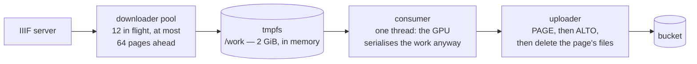
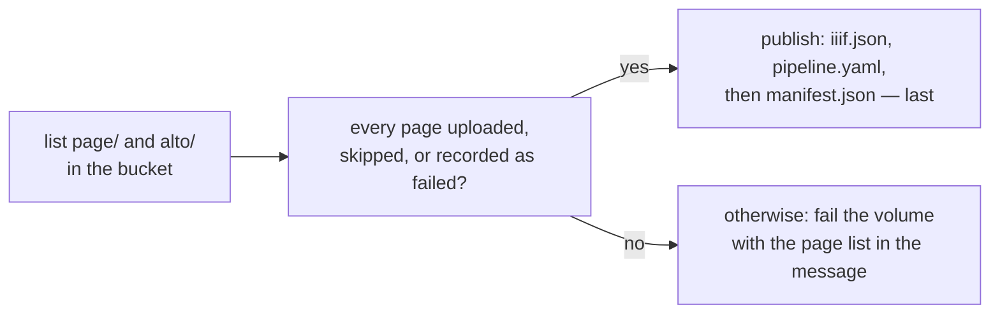
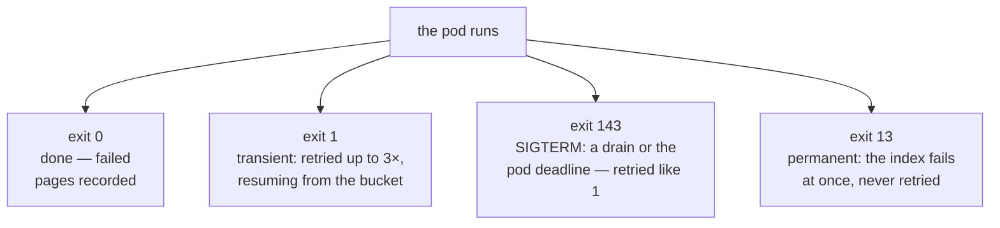

<!-- _class: lead cover -->
<!-- _footer: "Enheten för AI-labb och datatjänster" -->

# Inside one run

## Part 3 of 5 — what the wrapper does with a page, why a restart costs one page and not a volume, and what "failed" means

<!--
Part 1 drew the pod's lifecycle in one picture. This part opens it: the
loop, the fetch, the two files, the bucket contract, resume, verify, the
exit codes, and the one bug that taught us most. This is the deck for the
people who develop htrflow, because every design choice here is a reaction
to something htrflow does.
-->

---

# Why there is a wrapper at all

<div class="cols">
<div>

**What the htrflow CLI does with a folder.** It submits every page to a thread pool and never collects the futures. A page whose thread throws simply vanishes; the process still exits 0.

**So exit 0 proves nothing.** On one folder you would notice a missing file. On ten thousand volumes, nobody would.

</div>
<div>

**What the wrapper does instead.** It imports htrflow as a library, builds the pipeline once, and runs each page itself, in order, keeping every page's outcome. After the loop it lists the bucket and checks the outcome again.

**One rule to remember:** *done* means *verified* means `manifest.json` exists. An exit code is never trusted on its own.

</div>
</div>

<p class="note">The library API is not a stability contract the way the CLI is, so the wrapper is tested against the exact htrflow in the image, and the image is pinned by digest. That pin is load-bearing.</p>

<!--
This slide is the whole justification for the layer. If htrflow's CLI
collected its futures and failed on a lost page, half of this deck would be
unnecessary -- and that is a legitimate thing to fix upstream one day.
-->

---

# Three roles, one loop



<div class="cols">
<div>

**The downloader runs ahead** of the GPU, but never more than the lookahead window, so tmpfs holds a window of pages and never the volume.

**The consumer is one thread**, because the GPU would serialise the work anyway. It runs `pipeline.run(document)` on each page the moment that page is on disk.

</div>
<div>

**The uploader ships each page's two files** the moment htrflow writes them, then deletes the image and both files from tmpfs.

**The effect:** the GPU idles for about one page's download; results appear in the bucket while the run goes; a 600-page volume never needs 600 pages of disk.

</div>
</div>

<!--
The two knobs that shape the loop are DOWNLOAD_CONCURRENCY (12) and
LOOKAHEAD_PAGES (64). One slow or retrying fetch at the head of the window
stalls the consumer -- the window is ordered, because the GPU processes in
order. That is a known limit, not a bug.
-->

---

# Fetching one page — campaign data is untrusted

<div class="cols">
<div>

**The URL is width-capped:** `<service>/full/<width>,/0/default.jpg`. The width form, not best-fit, because every compliant server supports it; `max` when the canvas is already narrower, because level-1 servers refuse upscaling; a 400 anyway retries once with `max` before the page fails.

**A canvas with no image service** is fetched at native size, bounded only by the byte cap.

</div>
<div>

**The body is checked before it is kept.** A textual content type is refused. The first chunk must start with a known raster signature. An empty or oversized body is refused — 64 MiB per image, 16 MiB per manifest.

**Why:** a login page served with a 200 would otherwise be saved as the image and waste a whole attempt inside htrflow. Every URL came from a file someone edited in git.

</div>
</div>

**One rule to remember:** the width cap is part of the fetched URL, so the stored results always match the configuration that made them.

<!--
The image lands in /work/input on the memory-backed emptyDir. Under a
read-only root filesystem, that same tmpfs is also HOME, TMPDIR and where
YOLO writes its config -- there is nowhere else to write.
-->

---

# What htrflow does to it, and the two files

<div class="cols">
<div>

**Your steps, then two exports.** The wrapper appends `Export` steps for PAGE XML and ALTO to the `steps:` you wrote, and refuses a pipeline that already has one. Region, line, text: the recipe is yours, unchanged.

**Both files are parsed as XML before anything is uploaded.** A malformed file is a page failure, not a corrupt object in the bucket.

</div>
<div>

**A second provenance block in every ALTO.** htrflow writes its own `<Processing>` block: its version, the steps, each model's commit hash. It cannot know about the layer above it, so the wrapper appends `<Processing ID="htrflow-batch">` with the image digest, the htrflow base revision and the wrapper's own version.

**PAGE XML is not stamped.** The same facts are in the volume's `manifest.json`.

</div>
</div>

**One rule to remember:** a year from now, an ALTO answers "which model, which image, which wrapper" by itself.

<!--
ALTO allows any number of Processing blocks in that position, so the file
stays schema-valid and htrflow's own block stays as written. If the stamp
cannot parse an ALTO, the page fails -- the same as a page missing a format.
-->

---

# Upload, then delete — the bucket's contract

```
<namespace>/<pipeline>/<volume>/
  page/0001.xml        uploaded FIRST
  alto/0001.xml        uploaded second — its presence means "page 0001 is complete"
  progress.json        rewritten after every page: done, failed, last error, stage
  iiif.json            the viewer manifest, republished every ten pages
  pipeline.yaml        the steps this run used
  manifest.json        written LAST — its presence means "the volume is complete"
status/logs/<pipeline>/<volume>.txt     the run's own log, shipped every 15 s
```

<div class="cols">
<div>

**PAGE before ALTO, always.** A crash between the two leaves a PAGE without its ALTO, which resume redoes — never the reverse. So an ALTO is proof the page is whole.

**Keys are deterministic and overwritten blindly.** A retry writes the same keys again; nothing needs cleaning up first.

</div>
<div>

**The pipeline id is in the key.** A better recipe writes beside the old results, never over them.

**Timeouts are short.** Ten seconds to connect, sixty to read, three retries — so a dead bucket cannot pin a GPU for hours.

</div>
</div>

<!--
The bucket is the only durable state in the whole system. How durable the
results are is the bucket's own replication and backup story.
-->

---

# Resume — why a restart costs one page

<div class="cols">
<div>

**Before the first fetch, the pod lists the bucket.** `page/` and `alto/`, and the previous run's `manifest.json` if there is one.

**A page is skipped when** both its files exist *and* its source image URL has not changed since the earlier run recorded it. Everything else is fetched and run.

**So a retry of a long volume costs minutes, not hours.** Kubernetes restarts the pod, the pod lists, it carries on at the first page without an ALTO.

</div>
<div>

**Resumed on a newer image?** Pages already done stay as they are: their ALTOs name the image that made them, `manifest.json` names the image that finished the volume. Each file is right about itself.

**Same volumes under a new campaign name?** Same rule: resume finds the ALTOs and transcribes nothing — it still takes a queue slot and a model load, and rewrites `manifest.json`.

</div>
</div>

**One rule to remember:** resume compares the bucket to the manifest, never the other way round. The bucket is the truth.

<!--
The source-URL check is what makes resume safe when a campaign's images:
list is corrected: a page whose URL changed is redone even though an ALTO
exists for its number.
-->

---

# Verify, then publish



<div class="cols">
<div>

**`manifest.json` is the marker and the record:** each page's source URL and outcome, `pages_ok` and `pages_failed`, the pipeline and its hash, the image digest, timings, and the viewer URL.

</div>
<div>

**A failed page is recorded, not hidden.** It is named in `manifest.json`, counted, and shown on the card — and the volume still completes, because failing it would leave the good pages in the bucket with no marker to open them.

</div>
</div>

<!--
Two cases fail the volume, and both are things a retry can converge on or
that need a person: a page that never landed, and a run where nothing at all
came out. The termination message lists the pages in each case.
-->

---

# Failed is not missing

<table class="plain">
<tr><td><strong>failed page</strong></td><td>Fetched or transcribed and it went wrong: a 404, a refused body, a dead model thread. <strong>Recorded</strong> in <code>manifest.json</code>, counted in <code>pages_failed</code>, named on the card. <strong>The volume completes.</strong> The same page would fail the same way on every retry, so retrying the volume for it would only cost GPU time.</td></tr>
<tr><td><strong>missing page</strong></td><td>Neither uploaded nor recorded — an upload that never landed. An inconsistency a retry converges on. <strong>The volume fails</strong> with a transient error naming the pages; Kubernetes retries the index, resume redoes only those pages.</td></tr>
<tr><td><strong>nothing came out</strong></td><td>Every page the run processed failed and nothing was resumed. That is a broken model or a dead GPU, not the pages. <strong>The volume fails</strong> and says so — "check the model and the GPU".</td></tr>
</table>

**One rule to remember:** *failed* is a fact about a page; *missing* is a bug to retry.

<!--
This distinction is the one people get wrong first. "Partially succeeded"
on the campaign card is the failed-page case: every volume finished, some
pages are recorded as failed. A missing page never reaches the card as
"missing" -- it becomes a retry, and then either an ALTO or a failed page.
-->

---

# Exit codes, and what each one costs



<div class="cols">
<div>

**13 is for what a retry cannot fix:** a bad manifest URL, a 404 on the manifest, an unknown step or model class, a missing setting. The wrapper writes `{stage, permanent: true, error}` as its last words and the Job marks the index failed.

**1 is for what might pass next time:** a 5xx, a network error, a model not yet in the cache, a missing page.

</div>
<div>

**A drain is nobody's fault.** A pod evicted by a node drain or preemption carries a `DisruptionTarget` condition, and the Job's failure policy ignores it: not counted, just restarted.

**The other indexes carry on regardless.** One bad volume never stops the rest; the Job ends *Complete*, or *Failed* with the exact indexes named.

</div>
</div>

<!--
Every exit path ends with the same three things: a structured termination
message (stage, permanent, error) that the campaign card turns into one
sentence, the last log ship, and a last progress.json.
-->

---

# The bug that taught us most — page 44

<div class="cols">
<div>

**What happened.** On a 638-page volume, page 44's segmentation produced a mask too small to become a polygon. htrflow put `None` in its polygon list, the `Inference` step's worker thread died on it — and `pipeline.run` waited on a future nobody would ever complete. A GPU reserved, a pod standing still until its deadline, then a retry onto the same page.

**Why htrflow did not notice.** Its steps hand each batch to a daemon thread. A thread that dies takes its exception with it.

</div>
<div>

**What the wrapper does now.** It runs each page's `pipeline.run` in a helper thread and checks every step's worker threads once a second. A step whose thread is gone raises `PipelineDead` — a *page* failure like any other.

**Then it rebuilds.** The dead pipeline's models are dropped, the CUDA cache emptied, a fresh pipeline built from the cache PVC. Page 45 runs. The volume completes: 637 ok, 1 failed, named.

</div>
</div>

**One rule to remember:** a page can kill a thread; it may not kill a volume.

<!--
This is the wrapper's clearest argument. It is not exit 1: the cause is in
the image, so the page would die the same way on every attempt, and the
volume would end as a failed index with no marker at all. The upstream bug
is filed against htrflow; the guard stays regardless, because a thread pool
that swallows exceptions is a class of bug, not one bug.
-->

---

# What a person is told

<div class="cols">
<div>

**On the campaign card,** one sentence built from the termination message: *"The IIIF manifest could not be read: manifest is not JSON. Fix the manifest URL in the campaign file — this volume will not be retried."* Stage, permanence and cause, in words.

**In the run log,** the same facts with their prefix:

```
ERROR permanent failure in setup: manifest is not JSON
      — a retry changes nothing — fix the campaign or pipeline file
ERROR transient failure in verify: verify failed: 1 missing, 0 failed
      missing=['0002'] — some pages produced no result; the retry redoes only those
WARNING page 0044 failed: PipelineDead("… worker thread died; the page
      is marked failed and the pipeline is rebuilt")
```

</div>
<div>

**What survives the Job.** The Job is reaped a week after it ends. Three things do not expire: `manifest.json` with every page's outcome, `progress.json` with the last count and sentence, and the run log under `status/logs/`. The card is rebuilt from those, and the viewer link keeps working.

**One rule to remember:** every failure the platform can name ends as a sentence a person can act on — never a stack trace on a card.

</div>
</div>

<!--
The run log is shipped every fifteen seconds while the run goes, and once
more as the last thing before exit, so a pod that died still leaves its
last minutes readable.
-->

---

# What would happen if…

<div class="cols">
<div>

**1.** The image server, behind a proxy that expired, answers an image URL with its login page and a 200.

**2.** A node is drained at page 300 of a 600-page volume.

**3.** A campaign's `images:` list had a wrong URL for page 7; you fix the URL and re-run the volume under a new campaign name.

**4.** A model's revision on the Hub is deleted after the warm-up filled the cache.

</div>
<div>

<p class="note">Think first. Each has a one-sentence answer, and each follows from one of the slides before.</p>

</div>
</div>

<!--
Give the room a minute. The answers are on the next slide.
-->

---

# … and what does

<table class="plain">
<tr><td>1</td><td><strong>The page fails, the volume completes.</strong> The body check refuses a textual content type and a body with no raster signature; that page is recorded as failed with the reason, and the other pages run. Nothing goes into the bucket as an "image".</td></tr>
<tr><td>2</td><td><strong>Nothing is lost and nothing is counted.</strong> The pod carries a disruption condition, the failure policy ignores it, Kubernetes restarts the index; the new pod lists the bucket and starts at the first page without an ALTO — 300 pages, not 600.</td></tr>
<tr><td>3</td><td><strong>Only page 7 is transcribed.</strong> Resume skips every page whose two files exist and whose source URL is unchanged; page 7's URL changed, so it alone is fetched and run, and <code>manifest.json</code> is written again with all 600.</td></tr>
<tr><td>4</td><td><strong>Nothing happens to running campaigns.</strong> Pods run offline from the cache PVC, with no route to the Hub at all; the revision pin says which snapshot, and the cache holds it. A <em>new</em> pipeline id naming that revision would fail at warm-up — with a permanent error naming the model.</td></tr>
</table>

<!--
Number 4 is the reason the cache exists and the reason pods have no Hub
route: reproducibility survives the outside world changing. Part 5 is about
making that guarantee stronger than a pin -- a signature.
-->

---

# Next

<p class="note"><strong>Part 4, <em>Why your campaign is waiting</em>:</strong> the queue taught backwards from the symptom — what "Queued" can mean, the objects behind the GPU budget, the window and the cap, priority, and what a Workload is.</p>

**ai-riksarkivet.github.io/htrflow-batch** — *From Image to Transcription* is this deck page by page; *Failure Handling* is every exit code and every sentence a failure turns into; *The Wrapper* is the rest.

<!--
Three pages carry this part in writing: page-flow, failure-handling and
wrapper under "How it works".
-->
