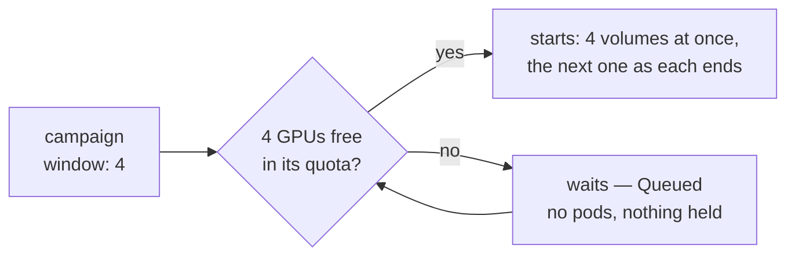
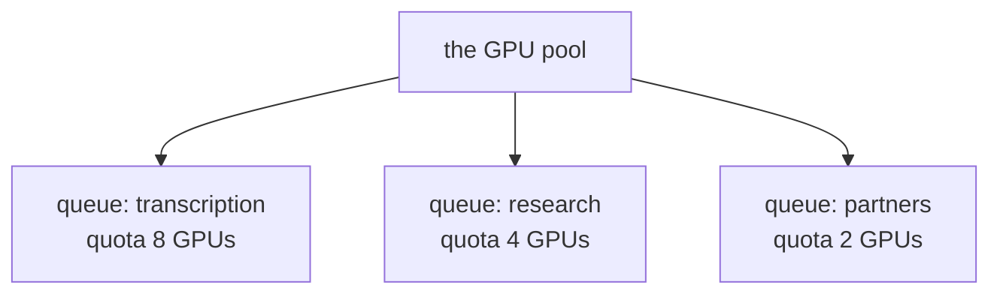

<!-- _class: lead cover -->
<!-- _footer: "Enheten för AI-labb och datatjänster" -->

# What the queue can do

## Part 4 of 5 — Kueue: sharing many GPUs between many people and many campaigns

<!--
Parts 1 to 3 treated the queue as a doorman with a count. This part is not
about how it is wired; it is about what a queue in front of the cluster
makes possible -- what we use today, what is one setting away, and what the
multi-tenant plan builds on. Each capability gets one slide: what it is,
what it would mean for you, and whether it is on here.
-->

---

# Without a queue

<div class="cols">
<div>

**Kubernetes alone schedules pods, not work.** Submit a campaign of 600 volumes and it creates as many pods as it is allowed; whoever submits first takes every free GPU, and everyone after gets pods stuck *Pending* — holding memory, CPU, node slots — with no order and no end in sight.

**Nothing is fair, nothing is ordered.** A small urgent job waits behind a week of bulk work. A team that paid for eight GPUs cannot get them while another team's jobs sit on them.

</div>
<div>

**A queue in front of the cluster changes the question.** Not "is there a node for this pod?" but "may this *campaign* start now, given everyone else's?" — decided once, for the whole campaign, before a single pod exists.

**Kueue is that queue.** It never places a pod and never sees a page: it decides *when* a campaign may start, and the ordinary scheduler still decides *where*.

</div>
</div>

<!--
Kueue is a Kubernetes SIG project; it adds queueing, quotas and admission
on top of normal Jobs, so the Job that renders from a campaign file is an
ordinary batch Job with one label on it.
-->

---

# What Kueue offers, and where we stand

<table class="plain">
<tr><td><strong>Wait instead of fail</strong></td><td>a campaign starts whole when its GPUs are free, and waits otherwise</td><td>in use</td></tr>
<tr><td><strong>Quotas</strong></td><td>a counted share of the pool that nobody can exceed</td><td>in use — one shared queue</td></tr>
<tr><td><strong>Priority</strong></td><td>urgent work goes first among the waiting</td><td>in use — three classes</td></tr>
<tr><td><strong>Pause and resume</strong></td><td>hand GPUs back without losing finished work</td><td>in use</td></tr>
<tr><td><strong>Borrowing</strong></td><td>use another team's idle GPUs until they want them back</td><td>planned</td></tr>
<tr><td><strong>Preemption</strong></td><td>urgent work may stop running work to take its place</td><td>available, off</td></tr>
<tr><td><strong>Hardware kinds</strong></td><td>ask for a kind of GPU, or fall back to another kind</td><td>planned</td></tr>
<tr><td><strong>Fair sharing</strong></td><td>share idle capacity by weight, not first come</td><td>available</td></tr>
<tr><td><strong>More</strong></td><td>partial starts, fractional GPUs, autoscaling, many clusters</td><td>available</td></tr>
</table>

<!--
The rest of the deck goes row by row. "Available" means Kueue can do it and
it is a policy decision for the platform to turn on; "planned" means it is
part of the multi-tenant design.
-->

---

# Wait instead of fail — all or nothing



<div class="cols">
<div>

**What you get.** A campaign never half-starts and never sits as a pile of *Pending* pods. It is either running with everything it asked for, or waiting with nothing held, and a smaller campaign that fits may go ahead of it.

</div>
<div>

**What you control.** `window` in the campaign file: how many volumes at once, so how many GPUs. Bigger finishes sooner — but waits for a bigger gap, and a window larger than the whole quota never starts.

</div>
</div>

<!--
All-or-nothing is exactly what a GPU batch job wants: a campaign that got
one GPU out of four would hold that one while waiting for the rest.
-->

---

# Quotas — a share of the pool



<div class="cols">
<div>

**What it is.** A queue with a counted budget — GPUs, and the CPU and memory that come with them. Everything admitted through it together can never exceed it, however much is submitted.

**What you get.** A predictable share: your campaigns cannot be starved by someone else's week of bulk work, and theirs cannot be by yours.

</div>
<div>

**Here today:** one queue for everyone, with the platform's quota. A campaign names it through converter.yaml; you never type it.

**Planned:** one queue per team, each with its own quota — the multi-tenant design. Your campaigns repository would point at your team's queue, and the quota is what your team is promised.

</div>
</div>

<!--
The quota counts what pods request, and all resources at once: a campaign
fits when its GPUs, CPU and memory all fit. That is the platform's
arithmetic; the user-facing idea is simply "a share".
-->

---

# Priority — who goes next

<div class="cols">
<div>

<p class="filename">campaigns/thesis-deadline.yaml</p>

```yaml
pipeline: demo-v1
priority: htr-interactive
volumes:
  - R0001203
  - R0001204
```

<table class="plain">
<tr><td><code>htr-interactive</code></td><td>a handful of volumes someone is waiting for</td></tr>
<tr><td><code>htr-bulk</code></td><td>the normal campaign — the same as leaving it out</td></tr>
<tr><td><code>htr-idle</code></td><td>work that can wait for the gaps</td></tr>
</table>

</div>
<div>

**What you get.** Among the campaigns *waiting*, the higher class starts first; within a class, the older one.

**What you do not get, here.** Priority does not stop a running campaign. If a long bulk campaign holds the GPUs, the urgent one waits for it to finish — that would take preemption, two slides on.

**`validate` checks the name** against the classes the cluster offers, because a name the cluster does not have would wait for ever without a word.

</div>
</div>

<!--
The practical advice that follows: keep bulk campaigns small enough that
the line moves, and mark genuinely overnight work htr-idle so the day's
urgent campaigns go first.
-->

---

# Pause and resume

<div class="cols">
<div>

<p class="filename">campaigns/kyrkobocker-1.yaml</p>

```yaml
pipeline: demo-v1
suspend: true        # merge, apply — paused
volumes:
  - R0001203
  # …
```

</div>
<div>

**What you get.** The running volumes stop, every finished volume is kept, and the GPUs go back to the pool for everyone else. Remove the line and the campaign waits for GPUs again, then continues from the next volume — a volume that was mid-run resumes from its pages in the bucket.

**When to use it.** Make room for something urgent while priority alone cannot; stop a campaign whose output looks wrong without losing what is right; hold a big campaign over a busy week.

</div>
</div>

**One rule to remember:** pausing is a git change like any other — reviewable, and undone by deleting a line.

<!--
Under the hood the apply marks the campaign's Kueue Workload inactive; the
card reads Paused once a volume has finished and Queued before that.
-->

---

# Borrowing — idle GPUs do not stay idle

```
one cohort — two teams' queues that may lend each other idle GPUs

  transcription   quota 8   running on 8 + 4 borrowed    10 more campaigns waiting
  research        quota 4   running on 0                 its 4 GPUs lent while idle

  research submits a campaign  →  its 4 GPUs are reclaimed, and it starts
```

<div class="cols">
<div>

**What it is.** Queues in a *cohort* may lend each other quota they are not using. The quota becomes a floor instead of a ceiling: you always get yours, and you may use what nobody else is using right now.

</div>
<div>

**What you get.** Night-time and holiday GPUs work instead of idling, without anyone giving up their promised share. When the owner submits work, the borrowed capacity is reclaimed.

**Here:** planned, with per-team queues. With one shared queue there is nobody to borrow from.

</div>
</div>

<!--
Borrowing can be capped per queue (a borrowing limit), and reclaiming can
either wait for borrowed work to finish or preempt it -- which is the next
slide's trade-off again.
-->

---

# Preemption — stopping work to make room

<div class="cols">
<div>

**What it is.** When higher-priority work cannot fit, Kueue may evict lower-priority work that is running — within a queue, or to reclaim quota that was lent out.

**What you would get.** An urgent campaign starts in minutes instead of waiting for a week of bulk work to end.

</div>
<div>

**What it costs.** The evicted campaign's running volumes stop mid-page. They resume from the bucket later, so nothing is lost — but the GPU time since their last page is, and a busy cluster can churn.

**Here:** available, and deliberately off. A higher class goes first among the waiting and never stops anyone. Turning it on is a policy decision about whose GPU time may be thrown away.

</div>
</div>

**One rule to remember:** without preemption, priority reorders the line; with it, priority can empty the counter.

<!--
Resume is what makes preemption affordable at all in this system: a stopped
volume costs its in-flight pages, not its finished ones.
-->

---

# Hardware kinds — asking for the right GPU

<div class="cols">
<div>

**What it is.** A *flavor* names a kind of capacity — say, large-memory GPUs and ordinary ones, or reserved machines and cheaper interruptible ones. A queue has a quota per flavor, and can try one flavor first and fall back to the next.

**Here today:** one flavor, because every GPU is alike.

</div>
<div>

**What you would get.**

* A large recognition model lands on cards with enough memory, without anyone naming a machine.
* Small segmentation work uses the smaller cards and leaves the big ones free.
* When the preferred kind is full, work falls back to another kind instead of waiting.

**Planned:** one flavor per GPU generation, when the pool is no longer uniform.

</div>
</div>

<!--
From a campaign author's point of view this would most likely surface as a
pipeline setting -- the recipe knows what its model needs -- rather than a
per-campaign choice.
-->

---

# Fair sharing — idle capacity by weight

<div class="cols">
<div>

**The problem it solves.** With borrowing, idle GPUs go to whoever asks first. A team that submits a thousand campaigns at midnight takes every spare card; a team that submits one at 00:01 gets none.

**What it is.** Each queue gets a weight. Idle capacity is shared out in proportion to the weights, and the queue furthest below its fair share is served first.

</div>
<div>

**What you would get.** Spare capacity follows need and agreement, not submission speed. A heavy user still gets far more than a light one when both are busy — but never all of it.

**Here:** available, not configured. It matters once there are several queues borrowing from each other.

</div>
</div>

<!--
Fair sharing and priority answer different questions: priority orders work
within a queue, fair sharing divides idle capacity between queues.
-->

---

# And more, one line each

<table class="plain">
<tr><td><strong>Partial start</strong></td><td>a campaign may start with fewer volumes at once than its window when the pool is tight. Off here, so a campaign always runs at the window it asked for.</td></tr>
<tr><td><strong>Fractional GPUs</strong></td><td>a small model takes part of a card instead of a whole one, through dynamic resource allocation. Not used; every pod takes a whole GPU.</td></tr>
<tr><td><strong>Autoscaling first</strong></td><td>an admission check can ask a cloud to add nodes before a campaign starts, so waiting turns into scaling. Not used on a fixed pool.</td></tr>
<tr><td><strong>Placement by topology</strong></td><td>pods of one job placed close together on the network. Not needed: our volumes never talk to each other.</td></tr>
<tr><td><strong>Many clusters</strong></td><td>one queue dispatching campaigns to whichever cluster has room. Not used; one cluster today.</td></tr>
<tr><td><strong>Seeing the line</strong></td><td>a campaign's position among the waiting. Available to the platform; not yet on the status page.</td></tr>
</table>

<!--
Every row is a documented Kueue feature. None needs a change to how a
campaign file looks; they are all decisions on the platform side.
-->

---

# What is yours, what is the platform's

<div class="cols">
<div>

<p class="filename">yours — the campaign file</p>

<table class="plain">
<tr><td><code>window</code></td><td>how many GPUs at once</td></tr>
<tr><td><code>priority</code></td><td>where in the line</td></tr>
<tr><td><code>suspend</code></td><td>pause and resume</td></tr>
</table>

**Three settings, all reviewed in a pull request.** Nothing else about the queue is a user's choice, and nothing else needs to be.

</div>
<div>

<p class="filename">the platform's — the cluster</p>

<table class="plain">
<tr><td>quotas</td><td>who is promised how much</td></tr>
<tr><td>priority classes</td><td>which names exist</td></tr>
<tr><td>cohorts and borrowing</td><td>who may lend to whom</td></tr>
<tr><td>preemption</td><td>whether work may be stopped</td></tr>
<tr><td>flavors and fair sharing</td><td>which hardware, divided how</td></tr>
</table>

</div>
</div>

<!--
The split is deliberate: what a campaign asks for lives in git next to the
campaign; how the pool is divided lives with the people who run the pool.
-->

---

# Which one would you reach for?

<div class="cols">
<div>

**1.** Two volumes for a deadline tomorrow, while a 500-volume bulk campaign has just started on every GPU.

**2.** The research team's GPUs sit idle every night while transcription has a backlog.

**3.** A new large recognition model runs out of memory on half the cards.

**4.** Overnight reprocessing keeps delaying the day's small campaigns.

</div>
<div>

<p class="note">Think first. Some have an answer you can use today; some need a platform decision.</p>

</div>
</div>

<!--
Give the room a minute. The answers are on the next slide.
-->

---

# … and the answers

<table class="plain">
<tr><td>1</td><td><strong>Today: pause the bulk campaign and mark yours <code>htr-interactive</code>.</strong> Priority alone would put you first in the line but still behind all 500 volumes. With preemption on, the platform could make room without a pause.</td></tr>
<tr><td>2</td><td><strong>Borrowing, in a cohort</strong> — a platform decision that needs a queue per team. Today there is one shared queue, so there is nothing to lend.</td></tr>
<tr><td>3</td><td><strong>Hardware kinds</strong> — a flavor for the large-memory cards, so the model's pipeline lands only there. Until then, the platform keeps such a pipeline to a pool where every card fits.</td></tr>
<tr><td>4</td><td><strong>Today: mark the reprocessing <code>htr-idle</code> and split it into smaller campaigns</strong>, so the line moves and the day's work goes first each time a slot frees.</td></tr>
</table>

<!--
The pattern in the answers: window, priority and pause are yours and work
today; borrowing, preemption and flavors are the platform's and come with
the multi-tenant design.
-->

---

# Next

<p class="note"><strong>Part 5, <em>Models and signatures</em>:</strong> the model cache and the warm-up, revision pins, the two transformers lines, bringing a new model to the cluster — and what it would take for a model to be signed the way an image already is.</p>

**ai-riksarkivet.github.io/htrflow-batch** — *Queueing* is how this is wired today; **kueue.sigs.k8s.io** is every capability on these slides, in Kueue's own words.

<!--
The older "under the hood" deck goes concept by concept with Kueue's own
definitions, for anyone who wants the implementation view.
-->
