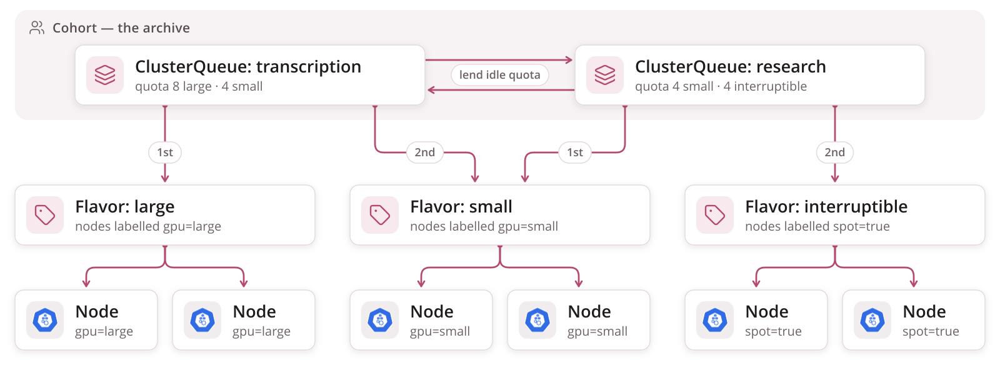

<!-- _class: lead cover -->
<!-- _footer: "Enheten för AI-labb och datatjänster" -->

# What the queue can do

## Kueue's concepts, one by one, as things a team sharing many GPUs can do with them

<!--
Parts 1 and 2 used three things from Kueue: the window, priority and pause.
This part is the rest of the toolbox, taken concept by concept from
kueue.sigs.k8s.io/docs/concepts, each told as a capability: what it lets a
team do, and whether it is in use here, available, or an idea worth
testing.
-->

---

# The toolbox at a glance

<table class="plain">
<tr><td><strong>Workload</strong></td><td>the unit of admission — one per campaign; can be deactivated, time-limited, and give quota back early</td><td>in use</td></tr>
<tr><td><strong>LocalQueue</strong></td><td>a tenant's door into the queue, one per namespace</td><td>in use</td></tr>
<tr><td><strong>ClusterQueue</strong></td><td>a pool of quota, with its own ordering and a stop switch</td><td>in use</td></tr>
<tr><td><strong>ResourceFlavor</strong></td><td>kinds of capacity: GPU model, architecture, reserved or interruptible</td><td>one, empty</td></tr>
<tr><td><strong>Cohort</strong></td><td>pools that lend and borrow, in a weighted tree</td><td>planned</td></tr>
<tr><td><strong>WorkloadPriorityClass</strong></td><td>order, preemption rank, borrowing rank</td><td>in use</td></tr>
<tr><td><strong>Preemption & fair sharing</strong></td><td>make room by evicting; divide idle capacity by weight or by past use</td><td>available</td></tr>
<tr><td><strong>AdmissionCheck</strong></td><td>a gate after quota: autoscale first, or send to another cluster</td><td>available</td></tr>
<tr><td><strong>Topology · elastic</strong></td><td>placement by network, resizing a running job</td><td>available</td></tr>
<tr><td><strong>DRA devices</strong></td><td>ask for a GPU by what it is, share or split one — and the queue counts it</td><td>not installed</td></tr>
</table>

<!--
"Available" means the Kueue we install can do it and turning it on is a
platform decision. The definitions quoted on the next slides are Kueue's
own, from its concepts pages.
-->

---

# Workload — more than a waiting ticket

> "An application that will run to completion. It is the unit of admission in Kueue."

<div class="cols">
<div>

**Give quota back early.** Kueue releases what a Job no longer needs: when fewer volumes remain than the window, the unused GPUs return to the pool before the campaign ends.

**Stop it after a time.** A maximum execution time deactivates a Workload that runs too long, across attempts — a budget per campaign, not per pod.

</div>
<div>

**Retry the start, not only the run.** With "all-or-nothing with ready pods", a Workload whose pods do not all become ready in time is evicted and requeued with growing backoff, instead of holding quota while stuck.

**Not only batch Jobs.** The same queues admit Ray jobs, PyTorch and other training jobs, plain pods, and even Deployments — so serving a model could draw on the same GPU quota as transcription.

</div>
</div>

<!--
Dynamic reclaim is why the tail of a long campaign does not hog its full
window. The pods-ready timeout is worth a test here: a campaign pod waiting
for a warm-up marker holds its GPU, and Kueue could requeue instead of
holding.
-->

---

# LocalQueue and ClusterQueue — the door and the pool

<div class="cols">
<div>

> **LocalQueue:** "A namespaced resource that groups closely related workloads belonging to a single tenant."

> **ClusterQueue:** "A cluster-scoped resource that governs a pool of resources, defining usage limits and Fair Sharing rules."

**Many doors, one pool, or many pools.** Several teams' namespaces can point their LocalQueues at one shared ClusterQueue, or each at its own. A namespace selector decides which namespaces may use a pool at all.

</div>
<div>

**Choose how strict the line is.** *BestEffortFIFO* lets a smaller campaign that fits go past an older one that does not — better use of GPUs. *StrictFIFO* never lets anyone pass — fairer to the big campaign at the front.

**Hold or drain a whole pool.** A stop policy on the queue: *Hold* admits nothing new while running work finishes — a clean maintenance window; *HoldAndDrain* also evicts what is running.

**Here:** one door, one pool, BestEffortFIFO.

</div>
</div>

<!--
The stop policy is the operator's version of a campaign's pause: one switch
for the whole pool before a driver upgrade or a node reboot, with every
finished volume kept and every campaign resuming from the bucket.
-->

---

# ResourceFlavor — kinds of capacity

> "An object that you can define to describe what resources are available in a cluster."

<div class="cols">
<div>

**Tell hardware apart.** A flavor matches nodes by label and taint: this GPU model or that one, x86 or ARM, reserved machines or cheaper interruptible ones. Kueue adds the node selector and tolerations to the pods it admits, so nobody writes them by hand.

**A quota per flavor.** A pool can promise eight of the large cards and sixteen of the small ones separately.

</div>
<div>

**Try one kind, then the next.** A pool lists flavors in order; a campaign lands on the first that has room, and the pool decides whether to keep searching rather than borrow or preempt.

**Here:** one empty flavor, because every GPU is alike — and an empty flavor is exactly what Kueue recommends for a uniform cluster.

**Worth it the day** the pool mixes card generations, or architectures: a large recognition model on large cards, segmentation on the rest.

</div>
</div>

<!--
"Flavor fungibility" is Kueue's name for the fallback rules: whether to stop
at the current flavor when it could borrow, or when it could preempt, or to
try the next flavor first.
-->

---

# Cohort — pools that lend

> "A group of ClusterQueues that can borrow unused quota from each other."

```
the archive — a cohort tree
├─ transcription    quota 8    borrowing limit 8     weight 3
├─ research         quota 4    lending limit 2       weight 1
└─ partners         quota 0    — may run only on what others lend
```

<div class="cols">
<div>

**Borrow and lend, with limits.** A pool may borrow others' unused quota up to its borrowing limit, and keep a lending limit so some of its own is always at hand.

**A pool with no quota of its own** can still run — on borrowed capacity only, and first to give it back.

</div>
<div>

**Trees, not only groups.** Cohorts can nest — a department over its teams — each level with its own weight, so a department's idle share goes to its own teams before anyone else's.

**Here:** planned, with a queue per team. With one pool there is nobody to lend to.

</div>
</div>

<!--
The docs are strict about one detail: to borrow a resource, a ClusterQueue
must list it with a nominal quota, even if that quota is zero.
-->

---

# Pools, flavors and nodes — in one picture



**A pool tries its flavors in order. A flavor is a node label**, so admitted pods land on the right machines.

---

# Preemption — four ways to make room

> "The process of evicting one or more admitted Workloads to accommodate another Workload."

<table class="plain">
<tr><td><strong>within a pool</strong></td><td>a higher-priority campaign evicts a lower one in the same queue</td></tr>
<tr><td><strong>reclaim</strong></td><td>a pool takes back quota it lent, from whoever borrowed it</td></tr>
<tr><td><strong>borrow and preempt</strong></td><td>a pool already over its quota may still evict lower-priority work elsewhere</td></tr>
<tr><td><strong>fair sharing</strong></td><td>evict to move usage back towards each pool's fair share</td></tr>
</table>

<div class="cols">
<div>

**Who goes first.** Candidates are borrowers before owners, then the lowest priority, then the most recently admitted — so the least work is thrown away.

</div>
<div>

**What it costs here.** An evicted campaign's running volumes stop mid-page and resume from the bucket, so a preemption costs minutes of GPU time, not volumes. **Here:** all four off.

</div>
</div>

<!--
The victim carries Evicted and Preempted conditions naming what displaced
it, so the status page could say "stopped to make room for X".
-->

---

# Fair sharing — two different fairnesses

<div class="cols">
<div>

**Fair shares of what is idle.** Each pool gets a weight; its usage is measured as its *dominant* resource share — GPUs, CPU or memory, whichever it uses most of relative to its quota. The pool furthest below its fair share is served first, and preemption can pull a heavy borrower back.

**What it prevents:** a team that submits a thousand campaigns at midnight taking every idle card.

</div>
<div>

**Fair turns in the line.** *Admission fair sharing* orders waiting work by how much its LocalQueue has used recently, decaying over time — so a team that has had the GPUs all week waits behind one that has had none.

**What it prevents:** one busy namespace starving a quiet one that shares its pool, without anyone setting priorities.

**Here:** neither configured; both matter once there are several teams.

</div>
</div>

<!--
Kueue's docs include a proof that preemption-based fair sharing cannot loop:
if A preempts B, B cannot then preempt A.
-->

---

# WorkloadPriorityClass — more than order

<div class="cols">
<div>

**Independent of pod priority.** A Workload's priority decides its place in the queue, whether it may preempt, and its rank when pools borrow — without touching how the scheduler ranks pods on a node.

**Changeable while waiting.** The priority of a campaign that has not started yet can be raised or lowered, and Kueue reorders it.

</div>
<div>

**A missing class stops everything.** Kueue does not fall back to anything; no Workload is made until the class exists, and the card reads *Queued* for ever. That is why `validate` checks the name — and why the platform must create a class before a campaign may use it.

**Here:** three classes, preemption off — so today priority means order only.

</div>
</div>

<!--
Part 1 and part 2 showed the three class names and how a campaign sets one;
this slide is what else the same object does once preemption or cohorts are
turned on.
-->

---

# AdmissionCheck — a gate after the quota

> "A mechanism allowing internal or external components to influence the timing of workloads admission."

<div class="cols">
<div>

**How it works.** Quota is reserved first; then every check on the pool must say *Ready* before pods are created. A check can answer *Retry* with backoff or *Rejected* for good.

**Autoscale first.** The provisioning-request check asks the cluster autoscaler for nodes and admits the campaign only when they exist — waiting turns into scaling, in a cloud.

</div>
<div>

**Your own check.** Any controller can be one. An idea worth testing here: *models warmed* as a check, so a campaign would not hold GPUs while its warm-up downloads.

**Here:** none.

</div>
</div>

<!--
Checks can apply to all flavors of a pool or only some, so a check could
guard only the interruptible capacity, for example.
-->

---

# MultiKueue — one queue, many clusters

<div class="cols">
<div>

**A manager and workers.** Users submit to the manager cluster. When a campaign gets quota there, the manager copies it to worker clusters; the first to admit it runs it, the other copies are deleted, and status flows back.

**How clusters are tried:** all at once for the fastest start, in batches following a preference order, or by a controller of your own.

</div>
<div>

**What it would mean:** a campaigns repo that targets "the archive's GPUs" rather than one cluster — on-premises first, a cloud partner when the queue is long, with no change to the campaign file.

**What it asks:** every worker has the same namespace, the same model cache and a route to the same bucket.

**Here:** one cluster.

</div>
</div>

<!--
Beta and on by default. Batch Jobs are supported, as are most training job
kinds, plain pods and Deployments.
-->

---

# Topology and elastic workloads

<table class="plain">
<tr><td><strong>Topology-aware scheduling</strong></td><td>places a Workload's pods in the same block or rack so they talk faster. <em>Not for us:</em> our volumes never talk to each other.</td></tr>
<tr><td><strong>Elastic workloads</strong></td><td>changes the parallelism of an admitted Job without suspending it: scaling up is admitted as a new slice, scaling down needs no new admission. <em>Would mean</em> changing a running campaign's window without a pause.</td></tr>
</table>

<!--
Both are beta in current Kueue; elastic jobs sit behind a feature gate, so
it would start as a test on the dev cluster, not a setting.
-->

---

# GPUs today: counted, not described

<div class="cols">
<div>

<p class="filename">what every campaign pod asks for now</p>

```yaml
resources:
  limits:
    nvidia.com/gpu: 1
```

**That line says "one of whatever GPU".** Not which model, not how much memory, not a part of one. It is the device-plugin way: a node advertises a number, the scheduler subtracts one.

</div>
<div>

**What it cannot say:**

* *a card with at least 40 GiB* — for a large recognition model
* *this model if free, otherwise that one* — a preference with a fallback
* *half a card* — for a small segmentation model that idles most of a GPU
* *the same card for two containers* — a model server and its client

**Kubernetes' own docs:** device plugins "require per-container device requests, don't support device sharing, and don't support expression-based device filtering."

</div>
</div>

<!--
Source: kubernetes.io, Dynamic Resource Allocation. The whole-card request
is fine while every GPU is alike and every model fits; it stops being fine
in a mixed pool.
-->

---

# DRA — claim a device the way you claim a disk

<div class="cols wide-left">
<div>

<table class="plain">
<tr><td><strong>DeviceClass</strong></td><td>a kind of device the cluster offers — like a storage class</td></tr>
<tr><td><strong>ResourceSlice</strong></td><td>each node's inventory, published by the driver: every device with its attributes and capacity</td></tr>
<tr><td><strong>ResourceClaim</strong></td><td>a request for devices, which can outlive a pod and be shared — like a volume claim</td></tr>
<tr><td><strong>ResourceClaimTemplate</strong></td><td>a claim made fresh for every pod, and deleted with it</td></tr>
<tr><td><strong>DRA driver</strong></td><td>the vendor's part: finds the devices, prepares them for the pod</td></tr>
</table>

</div>
<div>

**Stable in Kubernetes since 1.35.** Our cluster runs 1.35 and serves the API; what is missing is a driver.

**The vendor driver replaces the device plugin.** NVIDIA's operator runs one or the other on a cluster, not both — so moving is a cluster change, not a per-campaign one.

**What NVIDIA's driver supports:** whole GPUs and existing MIG partitions, generally available; time-slicing and MPS sharing, alpha.

</div>
</div>

<!--
Sources: the Kubernetes documentation on dynamic resource allocation; the
NVIDIA GPU Operator documentation for its DRA driver (full GPUs and
existing MIG devices generally available, time-slicing and MPS alpha,
"either a GPUCluster resource for DRA or a ClusterPolicy resource for the
Device Plugin, but not both"); and the CNCF blog post "Understanding
Dynamic Resource Allocation in Kubernetes".
-->

---

# Ask for what the model needs

<div class="cols wide-left">
<div>

<p class="filename">a claim template: a large card if one is free, else any with 20 GiB</p>

<div class="dense">

```yaml
apiVersion: resource.k8s.io/v1
kind: ResourceClaimTemplate
metadata:
  name: trocr-large
spec:
  spec:
    devices:
      requests:
      - name: gpu
        firstAvailable:
        - name: large
          deviceClassName: gpu.nvidia.com
          selectors:
          - cel:
              expression: >-
                device.capacity["gpu.nvidia.com"]
                .memory.isGreaterThan(quantity("40Gi"))
        - name: enough
          deviceClassName: gpu.nvidia.com
          selectors:
          - cel:
              expression: >-
                device.capacity["gpu.nvidia.com"]
                .memory.isGreaterThan(quantity("20Gi"))
```

</div>
</div>
<div>

**The pod names a claim instead of a count.** Its container lists the claim, and the scheduler finds a device that matches before it picks the node.

**Selectors are small expressions** over what the driver published about each device: memory, product name, compute capability.

**`firstAvailable` is an ordered wish list.** The first alternative that can be satisfied wins; the rest are fallbacks.

</div>
</div>

<!--
The pattern follows the CNCF blog's firstAvailable example, which prefers
one card model and falls back to another. For htrflow-batch this is where a
recipe's needs would live: the pipeline file knows its model, so it is the
natural place to say how much GPU memory that model needs.
-->

---

# Share a card, split a card

<div class="cols">
<div>

**Share.** Two containers, or two pods, can name the *same* claim and run on the same GPU — a model server and the batch job that calls it, without two cards.

**Split, in hardware.** A partitionable card — NVIDIA MIG — appears as several smaller devices, each with its own memory and compute, isolated from the others. A pod claims one partition.

</div>
<div>

**Split, in time.** Time-slicing and MPS let several pods take turns on one card, with no memory isolation — alpha in NVIDIA's driver today.

**What it would mean for us:** segmentation on a slice, recognition on a whole card, in the same pool, and the queue still counting every piece.

<p class="note">Not every GPU partitions. The dev cluster's GPU has no MIG, so there the gain is attributes and sharing, not slices.</p>

</div>
</div>

<!--
Partitionable devices in Kubernetes' DRA API are beta since 1.36; the NVIDIA
driver's support covers MIG partitions that already exist on the card.
-->

---

# DRA and the queue

<div class="cols">
<div>

**Kueue counts claims against quota.** A cluster maps each device class to a quota name — say `gpu.nvidia.com` to `nvidia.com/gpu` — so a pool promises GPUs whether pods ask the old way or the new.

**Three ways to count:**

* *devices* — one claim, one GPU, the default
* *counters* — a partition counted by the memory it uses, for MIG
* *capacity* — a time-sliced share counted by what the pod asked for

</div>
<div>

**Maturity in Kueue:** claim templates counted since the version we run; the old `nvidia.com/gpu` request served through DRA, and MIG counters, in the next; time-sliced capacity alpha.

**One limit:** DRA claims and topology-aware placement do not combine yet.

**What it would take here:** the NVIDIA DRA driver in place of the device plugin, the next Kueue, the converter rendering a claim template where it now writes `nvidia.com/gpu`, and a pipeline field for the memory a model needs. **Status:** an idea to test on the dev cluster.

</div>
</div>

<!--
Source: Kueue's Dynamic Resource Allocation concept page, which gives the
feature state of each counting path; the claim-template path is the oldest,
the extended-resource path and counter-based quota came one release later,
and capacity-based quota is still alpha.
-->

---

# Seeing inside the queue

<div class="cols">
<div>

**Where am I in the line?** Kueue answers a campaign's position among the pending work, per LocalQueue and per ClusterQueue, through its visibility endpoint — what the status page could show instead of a bare *Queued*.

**Why am I waiting?** A Workload's conditions say which resource and which flavor did not fit, which check is not ready, or who preempted it.

</div>
<div>

**How is the pool doing?** Prometheus metrics for pending and admitted Workloads, admission wait time, evictions, and quota used against quota promised, per pool.

**Here:** the metrics exist on the cluster; the status page does not use the position or the reason yet — a small story, and the most useful one on this slide for users.

</div>
</div>

<!--
The per-resource usage metrics are off by default in Kueue's configuration
and need to be enabled for the quota dashboards.
-->

---

<!-- _class: lead -->

# Any questions?
