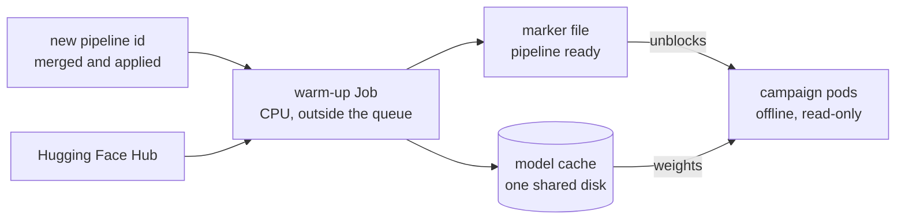

<!-- _class: lead cover -->
<!-- _footer: "Enheten för AI-labb och datatjänster" -->

# Models and signatures

## Part 5 of 5 — getting weights to the GPU, and knowing who made what runs there

<!--
Parts 2 and 3 showed the pins and the read-only cache. This part is about
the model itself: why it is the riskiest thing the cluster runs, how it
reaches a pod today, how to bring a new one, what a signature proves, and
the ways a model could be signed the way the images already are.
-->

---

# Why the model is the risky part

<div class="cols">
<div>

**Weights are code.** Most PyTorch weights are pickle files, and Hugging Face's own documentation is plain about it: "there are dangerous arbitrary code execution attacks that can be perpetrated when you load a pickle file."

**Weights change behaviour silently.** A new upload under the same name gives different text with no error. Nobody reads a checkpoint to review it.

**Weights come from outside.** The Hub is a content-delivery network with no fixed address, so whatever downloads a model needs the open internet.

</div>
<div>

<table class="plain">
<tr><td></td><td><strong>the image</strong></td><td><strong>the model</strong></td></tr>
<tr><td>built by</td><td>our CI</td><td>a model author</td></tr>
<tr><td>pinned by</td><td>digest</td><td>Hub revision</td></tr>
<tr><td>signed</td><td>yes</td><td>no</td></tr>
<tr><td>fetched from</td><td>our registry</td><td>the internet</td></tr>
<tr><td>scanned</td><td>yes</td><td>no</td></tr>
</table>

**The rest of this deck** closes that table's right-hand column, one row at a time.

</div>
</div>

<!--
Hugging Face scans pickles for suspicious imports and shows them on the
model page, and says itself the scan is "not 100% foolproof". Safetensors,
a format that stores tensors and nothing that can run, is the durable
answer where a model author offers it.
-->

---

# How a model reaches the GPU today



<div class="cols">
<div>

**Download once, per recipe.** The warm-up builds the pipeline exactly as a campaign pod would — building it *is* the download — so the cache holds precisely the files the pods will load, and nothing else.

</div>
<div>

**Two costs, paid in different places.** The download happens once, on CPU, off the GPU's clock. Loading from the cache into GPU memory happens in every pod, once per volume, and takes seconds.

</div>
</div>

<!--
A wrong model id or a revision that does not exist fails the warm-up
permanently, and the campaign card shows it as a warm-up chip with the
reason; campaign pods waiting for the marker give up after a bounded wait
instead of holding a GPU for ever.
-->

---

# A model that will not load — the two transformers lines

<div class="cols">
<div>

**A model's files carry the library that saved it.** The two current major lines of the transformers library do not read each other's models:

* saved by the **newer** line → the older one cannot parse the tokenizer, and once that is forced, it decodes text *subtly wrong* rather than failing;
* saved by the **older** line → the newer one fails to load it outright.

</div>
<div>

**So the line is a property of the image.** The image is built for one line or the other, and a pipeline pins the image it needs.

```yaml
# pipelines/trocr-large-v1.yaml
image: …/htrflow-batch@sha256:…   # the newer line
steps: …
```

**One campaigns repo can run both at once**, and no campaign moves when a model is re-saved. The two lines become one when every model in use has been saved by the newer one.

</div>
</div>

**One rule to remember:** a wrong line is not always an error. Read one ALTO from a new model before trusting a volume.

<!--
This is the failure that motivated "prove a recipe on six images": the
wrong line produced plausible text with extra spaces around non-ASCII
letters, which only a reader notices.
-->

---

# Bringing a new model

<table class="plain">
<tr><td><strong>1</strong></td><td><strong>Find the revision.</strong> The commit hash on the model's Hub page — never a branch name, which moves.</td></tr>
<tr><td><strong>2</strong></td><td><strong>Find the line.</strong> Which transformers line saved it decides which image the pipeline pins.</td></tr>
<tr><td><strong>3</strong></td><td><strong>Private or gated?</strong> The platform stores a Hub token as a Secret and names it in converter.yaml; only the warm-up ever sees it.</td></tr>
<tr><td><strong>4</strong></td><td><strong>Write a new pipeline id.</strong> The image, the steps, the revision on every model, and a batch size that fits one GPU.</td></tr>
<tr><td><strong>5</strong></td><td><strong>Run six images.</strong> Watch the warm-up chip turn from pending to gone, read the run log and one ALTO.</td></tr>
<tr><td><strong>6</strong></td><td><strong>Point real campaigns at it.</strong> The cache is already warm; the pods start at once.</td></tr>
</table>

<p class="note">Everything up to step 5 is a pull request: reviewable, and refused by <code>validate</code> or the cluster's policies before a GPU is spent if a pin or a name is wrong.</p>

<!--
The token path: a Hub token with read access to the model, created as a
Secret by whoever runs the platform, named in converter.yaml's
hf_token_secret, and mounted only into the warm-up container -- never into
a campaign pod, which has no route to the Hub anyway.
-->

---

# What a signature proves — and what it does not

<div class="cols">
<div>

**Signing with Sigstore, without keys.** A CI job proves who it is to Sigstore with its own identity token, gets a certificate valid for minutes, signs, and the signing is recorded in a public transparency log. No long-lived key exists to steal.

**Proves:**

* **who** — the artifact was signed by *this* workflow in *this* repository;
* **what** — these exact bytes, unchanged since;
* **when** — and anyone can look it up in the log.

</div>
<div>

**Does not prove:**

* that the signer was *right* to sign it;
* that the artifact is *safe* or *good*;
* that anyone *reviewed* it.

**So a signature is a claim about origin, not quality.** Its value is that nothing unsigned — and nothing signed by anyone else — can slip in, and that every artifact names the build that made it.

</div>
</div>

<!--
Sigstore's own overview lists exactly this split: authenticity, integrity
and auditability proven; trustworthiness of the signer and quality of the
software not.
-->

---

# The images already have all of it

<table class="plain">
<tr><td><strong>signature</strong></td><td>who built this image</td><td>a Sigstore signature from the publish workflow, over the digest</td></tr>
<tr><td><strong>provenance</strong></td><td>which run, from which commit</td><td>a build-provenance attestation, stored beside the image</td></tr>
<tr><td><strong>bill of materials</strong></td><td>what is inside</td><td>the package list, attested for each architecture</td></tr>
<tr><td><strong>digest pin</strong></td><td>that what runs is what was reviewed</td><td>the pipeline file names the digest, a policy refuses anything else</td></tr>
</table>

<div class="cols">
<div>

**Checked at the door.** With image verification on, the cluster's policy engine checks every pod's image against the workflow identity before the pod is admitted: an unsigned image, or one signed by someone else, is refused.

</div>
<div>

**Anyone can check it by hand**, with the signing tool and the repository name — the Releasing page gives the three commands.

**Here:** signed and attested on every release; verification at admission is available and off by default.

</div>
</div>

<!--
Four guarantees that are often confused: the signature says who built it,
the provenance says which run from which commit, the bill of materials
says what is inside, and the digest pin says that what runs is what was
reviewed.
-->

---

# Three ways to make a model an artifact

<table class="plain">
<tr><td></td><td><strong>plain OCI image</strong></td><td><strong>ModelPack artifact</strong></td><td><strong>signed model directory</strong></td></tr>
<tr><td>what it is</td><td>the model files in an image with nothing else</td><td>the CNCF specification: weights as layers, a config naming format, licence and origin</td><td>the OpenSSF model-signing format: a manifest of every file's hash, signed</td></tr>
<tr><td>where it lives</td><td>any registry</td><td>a registry that understands it</td><td>beside the files, wherever they are</td></tr>
<tr><td>how a pod gets it</td><td>mounted directly as a read-only image volume</td><td>pulled and unpacked by a tool before the model loads</td><td>verified by a tool before the model loads</td></tr>
<tr><td>checked at the door</td><td><strong>yes</strong> — it is an image reference the policy engine can see</td><td>no — checked by our own job</td><td>no — checked by our own job</td></tr>
</table>

<p class="note">ModelPack is a vendor-neutral CNCF specification for packaging, distributing and running AI models in cloud-native environments — the same move for models that the OCI image format made for containers.</p>

<!--
Image volumes are a stable Kubernetes feature: a pod mounts content from an
OCI registry read-only. The OpenSSF model-signing project signs a model as
an in-toto statement whose subjects are file paths and digests, with
Sigstore keyless signing by default.
-->

---

# What the spikes found

<div class="cols">
<div>

**A plain image works as a volume.** The model files mounted read-only in a pod, their checksums equal to the Hub's files, and htrflow loaded and predicted offline — with no extra component on the node.

**A ModelPack artifact mounts empty.** Same mechanism: the pull is reported as a success, the directory is empty, and nothing logs an error. The container runtime unpacks image layers only.

</div>
<div>

**So ModelPack needs a tool to unpack it.** An init container pulling from the registry with a read-only robot account extracted the model, and the wrapper loaded it offline.

**Two findings to distrust the tooling over:**

* the packaging tool **could not pull by digest** — and a tag *with* a wrong digest silently succeeded;
* pushing to a protected tag could **report success when the registry refused it**.

So the registry's immutable tags carry the pin, and packaging CI checks the digest after every push.

</div>
</div>

<!--
The throwaway spikes ran on the development cluster. The practical lesson:
for moving models between nodes, a plain OCI image mounted as a volume is
the path with the fewest moving parts and the only one the admission policy
can verify on its own.
-->

---

# What it would change

<table class="plain">
<tr><td></td><td><strong>today</strong></td><td><strong>with models as signed artifacts</strong></td></tr>
<tr><td>the pipeline names</td><td>a Hub repository and a revision</td><td>a model in our registry, by immutable tag or digest</td></tr>
<tr><td>the warm-up reaches</td><td>the whole internet</td><td>only our registry</td></tr>
<tr><td>who made the weights</td><td>trust the revision</td><td>a signature, verified before loading</td></tr>
<tr><td>an ALTO records</td><td>the image digest and model revisions</td><td>the model digests too</td></tr>
<tr><td>a supplier's model</td><td>runs if its revision is pinned</td><td>runs only if we packaged and signed it</td></tr>
</table>

**The last network hole closes:** no pod in the namespace would need the internet at all.

**Status:** designed as a story, depends on a registry with a pull-through cache, and not built. The model cache already makes it a change of where the files come from — the wrapper only ever reads the cache.

<!--
The honest distinction for the room: today's guarantee for weights is a
pinned revision enforced at admission, a cache no campaign pod can write,
and pods with no route to the Hub. That is a strong convention; a verified
signature would make it a control.
-->

---

# The series

<table class="plain">
<tr><td><strong>1</strong></td><td>From one folder to the archive</td><td>what changes at archive scale, and the whole picture</td></tr>
<tr><td><strong>2</strong></td><td>Your interface is git</td><td>the files, validate, the pull request, apply</td></tr>
<tr><td><strong>3</strong></td><td>Inside one run</td><td>the container, the pod, the loop, failure</td></tr>
<tr><td><strong>4</strong></td><td>What the queue can do</td><td>Kueue's concepts as capabilities, and GPUs as devices</td></tr>
<tr><td><strong>5</strong></td><td>Models and signatures</td><td>weights, the warm-up, and who made what runs</td></tr>
</table>

**ai-riksarkivet.github.io/htrflow-batch** — every deck, and the pages that carry the same material in writing: *The Wrapper* for the model cache, *Security* for the trust boundary, *Releasing* for signing.

---

<!-- _class: lead -->

# Any questions?
