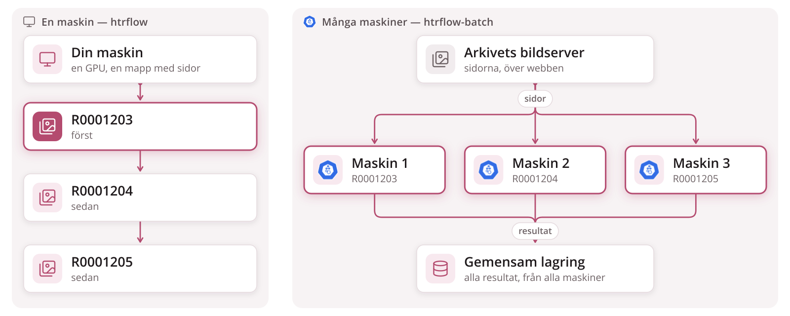
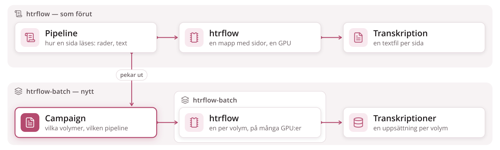
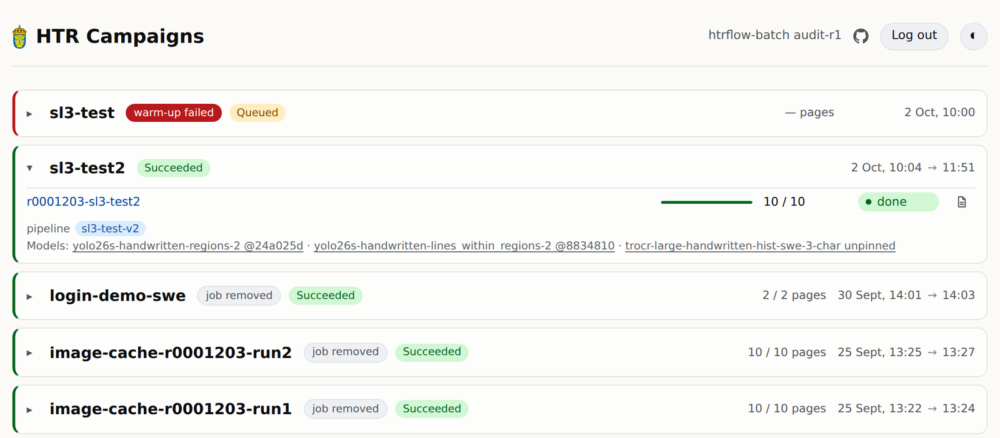
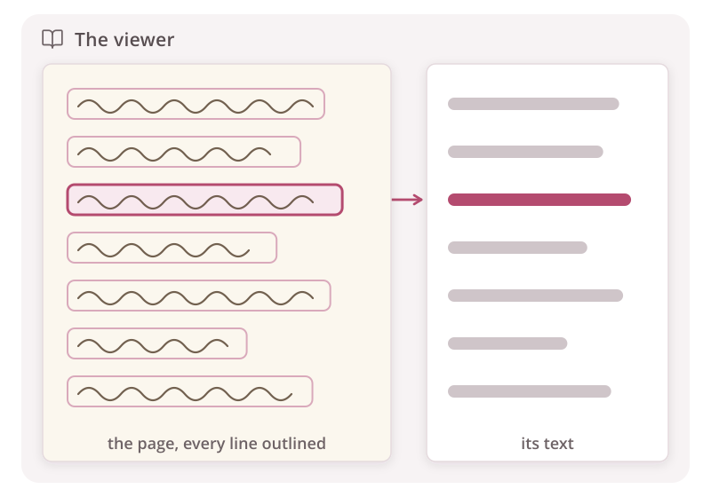

# En maskin, eller många

**Samma pipeline, samma text — på många maskiner i stället för en.**

<!--
Vänster: i dag väntar varje volym på den före, på en GPU, och går maskinen
sönder börjar man om. Höger: volymerna körs sida vid sida, en per maskin;
inget ligger på någon enskild maskins disk, så en volym vars maskin går
sönder fortsätter helt enkelt på en annan, från den sida där den stannade.
-->

---

# Pipeline som förut, campaign är nytt

**Pipelinen är htrflows, oförändrad. Campaign är det nya:** vilka volymer, vilken pipeline.

<!--
Övre raden är htrflow som alla har använt det: en pipeline, en mapp med
sidor på en maskin. Nedre raden är det htrflow-batch lägger till: i stället
för en mapp lämnar man in en campaign, en lista med volymer angivna med
referenskod, och plattformen gör resten. En volym är en arkivvolym, en
inbunden enhet av sidor, aldrig en disk.
-->

---

# Kubernetes kör det, Kueue avgör när

**Kubernetes** kör en volym där en GPU är ledig. **Kueue** avgör vilken campaign som står på tur.

<!--
Kubernetes är det öppna system som de flesta moln kör på; poängen för det
här rummet är bara att ingen väljer maskin för hand och att förlorat arbete
startas om. Kueue är den del som hindrar alla från att ta alla GPU:er på en
gång: campaigns står i kö, kön räknar lediga GPU:er och släpper fram nästa
bara när den får plats i sin helhet. Här är två GPU:er lediga, så C, som
behöver en, startar före B, som behöver fyra.
-->

---

# Statussidan, och viewern

**Ett kort per campaign** — framsteg och fel, medan det körs.

**Varje sida, varje rad, dess text** — redan medan volymen körs.

<!--
Statussidan är det enda en läsare behöver titta på: pågående campaigns
först, sedan det som behöver uppmärksamhet, sedan de färdiga. En volyms namn
öppnar den i viewern, Riksarkivets egen Universal Viewer: sidbilden med varje
transkriberad rad markerad och texten bredvid, sida för sida, så snart de
första sidorna är klara.
-->
