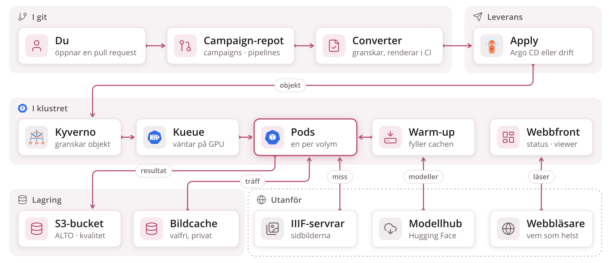
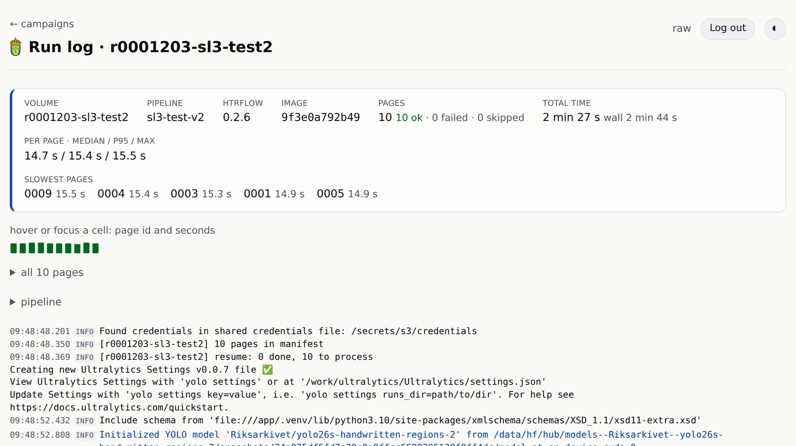

# En maskin, eller många


**Samma pipeline, samma text — på många maskiner i stället för en.**

<!--
Vänster: i dag väntar varje volym på den före, på en GPU, och går maskinen
sönder börjar man om. Höger: volymerna körs sida vid sida, en per maskin;
inget ligger på någon enskild maskins disk, så en volym vars maskin går
sönder fortsätter helt enkelt på en annan, från den sida där den stannade.
-->

---

# Börja med hur htrflow fungerar

<div class="cols">
<div>

<p class="filename">pipeline.yaml — en htrflow-pipeline, oförändrad</p>

```yaml
steps:
  - step: Segmentation
    settings:
      model: yolo
      model_settings:
        model: Riksarkivet/yolov9-regions-1
  - step: Segmentation
    settings:
      model: yolo
      model_settings:
        model: Riksarkivet/yolov9-lines-within-regions-1
  - step: TextRecognition
    settings:
      model: TrOCR
      model_settings:
        model: Riksarkivet/trocr-base-handwritten-hist-swe-2
```

</div>
<div>

```
htrflow pipeline pipeline.yaml images/
```

En mapp med sidbilder in, en mapp med ALTO och PAGE ut, på en GPU.

</div>
</div>

<!--
Det som ska landa först: ingen behöver lära sig ett nytt pipeline-format.
Resten handlar om mappen och GPU:n, inte om stegen.
-->

---

# Pipeline som förut, campaign är nytt


**Pipelinen är htrflows, oförändrad.**

<!--
Övre raden är htrflow som alla har använt det: en pipeline, en mapp med
sidor på en maskin. Nedre raden är det htrflow-batch lägger till: i stället
för en mapp lämnar man in en campaign, en lista med volymer angivna med
referenskod, och plattformen gör resten. En volym är en arkivvolym, en
inbunden enhet av sidor, aldrig en disk.
-->

---

# Campaign-filen

<div class="cols three">
<div>

<p class="filename">med referenskod</p>

```yaml
pipeline: demo-v1
volumes:
  - R0001203
  - R0001204
```

</div>
<div>

<p class="filename">med IIIF-manifest</p>

```yaml
pipeline: demo-v1
volumes:
  - id: loc-mal2459400
    manifest: https://…/manifest.json
```

</div>
<div>

<p class="filename">med bild-URL:er</p>

```yaml
pipeline: demo-v1
volumes:
  - id: loose-scans
    images:
      - https://…/scan-0001.jpg
      - https://…/scan-0002.jpg
```

</div>
</div>

**En fil per campaign:** vilken pipeline, och vilka volymer. En referenskod räcker.

<!--
Så beställer man en körning: en kort fil i ett git-repo, som granskas och
mergas som vilken annan ändring som helst. Referenskoden expanderas av
plattformen till arkivets IIIF-manifest, så den som beställer behöver
bara veta vilka volymer det gäller.
-->

---

# Grov arkitektur



**Du öppnar bara en pull request.** Resten sköter plattformen.

<!--
Läs det från vänster till höger som en campaigns liv: skriven i git,
granskad av Kyverno, köad av Kueue, körd som en pod per volym, resultaten i
bucketen, följd via webbfronten. Warm-up är den enda pod som pratar med
modellhubben, och webbfronten den enda en webbläsare pratar med.
-->

---

# Kubernetes kör det, Kueue avgör när


**Kubernetes** kör en volym där en GPU är ledig. **Kueue** avgör vilken campaign som står på tur.

<!--
Kubernetes är det öppna system som de flesta moln kör på; poängen för det
här rummet är bara att ingen väljer maskin för hand och att förlorat arbete
startas om. Kueue är den del som hindrar alla från att ta alla GPU:er på en
gång: campaigns står i kö, kön räknar lediga GPU:er och släpper fram nästa
bara när den får plats i sin helhet. Här är två GPU:er lediga, så C, som
behöver en, startar före B, som behöver fyra.
-->

---

# Statussidan, och körloggen

<div class="cols">
<div>


**Ett kort per campaign** — framsteg och fel, medan det körs.

</div>
<div>



**En logg per volym** — tid per sida, och vad som gick fel.

</div>
</div>

<!--
Statussidan: pågående campaigns först, sedan det som behöver uppmärksamhet,
sedan de färdiga. Ett uppfällt kort visar varje volym med sin stapel, sitt
tillstånd och vilken pipeline och vilka modeller som kördes. Loggikonen på
raden öppnar körloggen: en sammanfattning med antal sidor, tid per sida och
de långsammaste sidorna, en ruta per sida, och själva loggen under.
-->

---

# Viewern


**Varje sida, varje rad, dess text** — redan medan volymen körs.

<!--
En volyms namn på statussidan öppnar den i viewern, Riksarkivets egen
Universal Viewer: sidbilden med varje transkriberad rad markerad och texten
bredvid, sida för sida, så snart de första sidorna är klara.
-->
