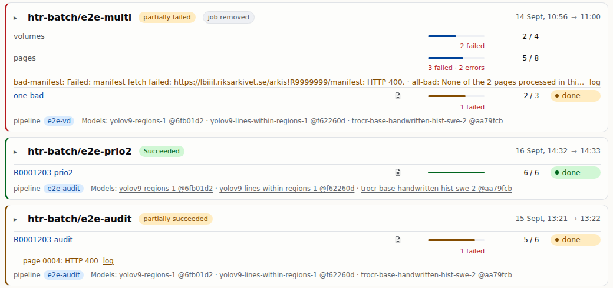

# The pipeline stays, the campaign is new

**Nothing changes in how a page is read.** The pipeline is the same htrflow recipe. What is new is the campaign: a short list of archival volumes, and which recipe to run on them.

<!--
The top row is htrflow as everyone has used it: one recipe, one folder of
pages on one machine. The bottom row is what htrflow-batch adds: instead of
a folder you hand in a list of volumes by reference code, and the platform
does the rest. A volume is an archival volume, a bound unit of pages, never
a disk.
-->

---

# One machine, or many

**The same recipe, the same text — on as many machines as there are GPUs.** Pages come from the archive's image server; every result lands in one shared place.

<!--
Left: today each volume waits for the one before it, on one GPU, and if the
machine fails you start over. Right: the volumes run side by side, one per
machine; nothing lives on any one machine's disk, so a volume whose machine
fails simply continues on another, from the page where it stopped.
-->

---

# Kubernetes runs it, Kueue decides when

**Kubernetes** makes many machines behave as one computer: a volume lands wherever a GPU is free. **Kueue** is the queue in front: a campaign waits until the GPUs it needs are free, the urgent one goes first, and any campaign can be paused and resumed.

<!--
Kubernetes is the open-source system most clouds run on; the point for this
room is only that nobody picks a machine by hand and that lost work is
restarted. Kueue is the piece that stops everybody from grabbing every GPU
at once: campaigns stand in a line, the queue counts free GPUs, and lets
the next one through only when it fits whole. Here two GPUs are free, so
C, which needs one, starts before B, which needs four.
-->

---

# The status page, and the viewer

**One card per campaign**, with every volume's progress counted live, and anything that went wrong named.

**Each page, each line, its text** — open while the volume is still running.

<!--
The status page is the one thing a reader looks at: running campaigns first,
then anything that needs attention, then the finished ones. A volume's name
opens it in the viewer, Riksarkivet's own Universal Viewer: the page image
with every transcribed line outlined, and the text beside it, page by page,
as soon as the first pages are done.
-->
